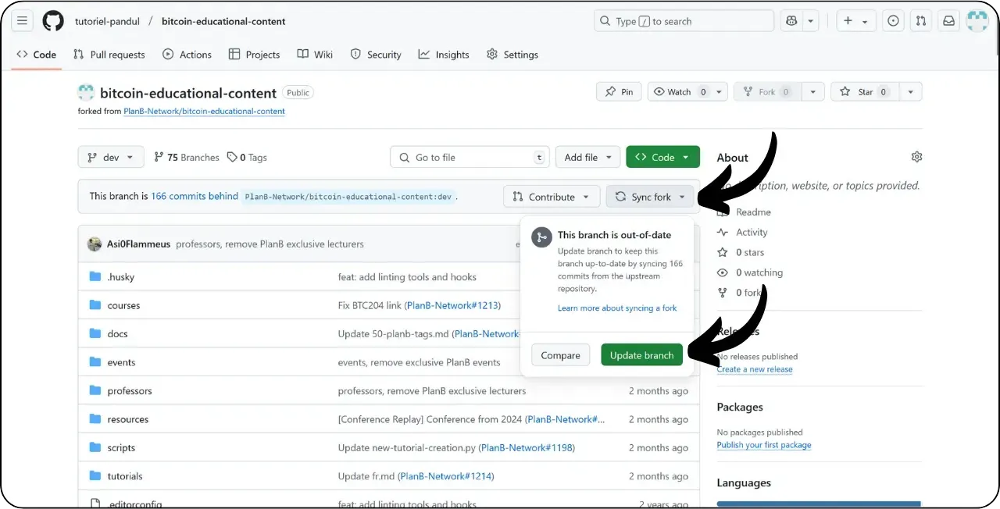

Прежде чем следовать этому руководству по добавлению нового учебника, вам необходимо выполнить несколько предварительных шагов. Если вы еще не сделали этого, ознакомьтесь сначала с этим вводным уроком, а затем вернитесь сюда:

https://planb.network/tutorials/others/contribution/write-tutorials-4d142a6a-9127-4ffb-9e0a-5aba29f169e2
У вас уже есть :


- Выберите тему для своего учебника;
- Свяжитесь с командой Plan ₿ Network через [группу Telegram](https://t.me/PlanBNetwork_ContentBuilder) или paolo@planb.network ;
- Выберите инструменты для внесения средств.

В этом уроке мы рассмотрим, как добавить свой учебник в Plan ₿ Network с помощью веб-версии GitHub. Если вы уже освоили Git, этот очень подробный учебник может вам не понадобиться. Вместо этого я рекомендую вам ознакомиться с двумя другими уроками, в которых подробно описаны рекомендации и шаги по внесению изменений из локальной версии :


- Опытные пользователи** :

https://planb.network/tutorials/others/contribution/write-tutorials-git-expert-0ce1e490-c28f-4c51-b7e0-9a6ac9728410

- Промежуточный уровень (GitHub Desktop)** :

https://planb.network/tutorials/others/contribution/write-tutorials-github-desktop-intermediate-4a36a052-1000-4191-890a-9a1dc65f8957
## Пререквизиты

Необходимые условия перед началом обучения :


- Иметь аккаунт [GitHub](https://github.com/signup);
- Сделайте форк репозитория [Plan ₿ Network source repository](https://github.com/PlanB-Network/bitcoin-educational-content);
- Иметь [профиль учителя в Plan ₿ Network](https://planb.network/professors) (только если вы предлагаете полный учебник).

Если вам нужна помощь в получении этих предварительных условий, вам помогут другие мои руководства:

https://planb.network/tutorials/others/contribution/basics-of-github-471f7f00-8b5a-4b63-abb1-f1528b032bbb
https://planb.network/tutorials/others/contribution/create-github-account-a75fc39d-f0d0-44dc-9cd5-cd94aee0c07c
https://planb.network/tutorials/others/contribution/github-desktop-work-environment-5862003b-9d76-47f5-a9e0-5ec74256a8ba
https://planb.network/tutorials/others/contribution/create-teacher-profile-8ba9ba49-8fac-437a-a435-c38eebc8f8a4
Когда все готово и у вас есть форк репозитория Plan ₿ Network, вы можете начать добавлять учебник.

## 1 - Создайте новую ветку

Откройте браузер и перейдите на страницу вашего форка в репозитории Plan ₿ Network. Это форк, который вы создали на GitHub. URL вашего форка должен выглядеть следующим образом: `https://github.com/[ваше имя пользователя]/bitcoin-educational-content` :


Убедитесь, что вы находитесь в основной ветке `dev`, затем нажмите на кнопку "*Sync fork*". Если ваш форк не обновлен, GitHub попросит вас обновить ветку. Приступайте к обновлению:



Выберите ветку `dev`, а затем назовите свою рабочую ветку так, чтобы ее название четко отражало ее цель, используя тире для разделения слов. Например, если наша цель - написать учебник по использованию Green Wallet, ветка может называться: `tuto-green-wallet-loic`. После ввода подходящего названия нажмите на кнопку "*Создать ветку*", чтобы подтвердить создание новой ветки на основе `dev`:


Теперь вы должны быть на новой ветке работы:


Это означает, что все внесённые вами изменения будут сохранены только в этой ветке.

Для каждой новой статьи, которую вы планируете опубликовать, создавайте новую ветку из `dev`.

Ветка в Git представляет собой параллельную версию проекта, позволяя вам работать над изменениями, не затрагивая основную ветку, пока ваша работа не будет готова к интеграции.

## 2 - Добавьте обучающие файлы

Теперь, когда рабочая ветка создана, пришло время интегрировать ваш новый учебник.

В файлах ветки вам нужно найти соответствующую подпапку для размещения вашего учебника. Организация папок отражает различные разделы сайта Plan ₿ Network. В нашем примере, поскольку мы добавляем учебник по Green Wallet, перейдите по следующему пути: `bitcoin-educational-content\tutorials\wallet`, что соответствует разделу сайта `WALLET`:


В папке `wallet` создайте новую директорию, специально предназначенную для вашего учебника. Имя этой папки должно четко указывать на программное обеспечение, о котором пойдет речь в учебнике, используя дефисы для соединения слов. В моем примере папка будет называться `green-wallet`. Нажмите на кнопку "*Добавить файл*", затем на "*Создать новый файл*":


Введите имя папки, за которым следует косая черта `/`, чтобы подтвердить ее создание в качестве папки.


В эту новую папку, предназначенную для вашего учебника, нужно добавить несколько элементов:


- Создайте папку `assets`, в которой будут храниться все иллюстрации, необходимые для вашего учебника;
- В этой папке `assets` создайте подпапку, названную в соответствии с кодом языка, на котором написан учебник. Например, если учебник написан на английском языке, эта папка должна называться `en`. Поместите в эту папку все визуальные материалы учебника (диаграммы, изображения, скриншоты и т. д.).
- Необходимо создать файл `tutorial.yml` для записи деталей вашего учебника;
- Для записи фактического содержания вашего учебника необходимо создать файл markdown. Этот файл должен быть назван в соответствии с кодом языка, на котором он написан. Например, для учебника, написанного на французском языке, файл должен называться `fr.md`.

Подводя итог, можно сказать, что здесь представлена иерархия файлов (мы продолжим создавать их в следующем разделе):

```plaintext
bitcoin-educational-content/
└── tutorials/
└── wallet/ (à modifier avec la bonne catégorie)
└── green-wallet/ (à modifier avec le nom du tuto)
├── assets/
│   ├── fr/ (à modifier selon le code de langue approprié)
├── tutorial.yml
└── fr.md (à modifier selon le code de langue approprié)
```

## 3 - Заполните файл YAML

Начнем с файла YAML. В поле для создания нового файла введите `tutorial.yml` :


Заполните файл `tutorial.yml`, скопировав следующий шаблон:

```yaml
id:
project_id:
tags:
-
-
-
category:
level:
credits:
professor:
# Proofreading metadata
original_language:
proofreading:
- language:
last_contribution_date:
urgency:
contributors_id:
-
reward:
````
Voici le détail des champs obligatoires :
- **id** : Un UUID (_Universally Unique Identifier_) permettant d’identifier de manière unique le tutoriel. Vous pouvez le générer avec [un outil en ligne](https://www.uuidgenerator.net/version4). La seule contrainte est que cet UUID soit aléatoire pour ne pas avoir de conflit avec un autre UUID sur la plateforme ;
- **project_id** : L'UUID de l’entreprise ou de l’organisation derrière l’outil présenté dans le tutoriel [depuis la liste des projets](https://github.com/PlanB-Network/bitcoin-educational-content/tree/dev/resources/projects). Par exemple, si vous réalisez un tutoriel sur le logiciel Green Wallet, vous pouvez trouver ce `project_id` dans le fichier suivant : `bitcoin-educational-content/resources/projects/blockstream/project.yml`. Cette information est ajoutée dans le fichier YAML de votre tutoriel parce que Plan ₿ Network maintient une base de données de toutes les entreprises et organisations opérant sur Bitcoin ou des projets connexes. En ajoutant le `project_id` de l'entité liée à votre tutoriel, vous créez un lien entre les deux éléments ;
- **tags** : 2 ou 3 mots-clés pertinents liés au contenu du tutoriel, choisis exclusivement [dans la liste des tags de Plan ₿ Network](https://github.com/PlanB-Network/bitcoin-educational-content/blob/dev/docs/50-planb-tags.md) ;
- **category** : La sous-catégorie correspondant au contenu du tutoriel, selon la structure du site Plan ₿ Network (par exemple pour les wallets : `desktop`, `hardware`, `mobile`, `backup`) ;
- **level** : Le niveau de difficulté du tutoriel, parmi :
- `beginner`
- `intermediate`
- `advanced`
- `expert`
- **professor** : Votre `contributor_id` (mots BIP39) tel qu'affiché sur [votre profil professeur](https://github.com/PlanB-Network/bitcoin-educational-content/tree/dev/professors) ;
- **original_language** : La langue d’origine du tutoriel (par exemple `fr`, `en`, etc.) ;
- **proofreading** : Informations sur le processus de relecture. Remplissez la première partie, car la relecture de votre propre tutoriel compte comme une première validation :
- **language** : Code de langue de la relecture (par exemple `fr`, `en`, etc.).
- **last_contribution_date** : Date du jour.
- **urgency** : Laissez vide.
- **contributors_id** : Votre ID GitHub.
- **reward** : Laissez vide.
Pour davantage de détails sur votre identifiant de professeur, reportez-vous au tutoriel correspondant :
https://planb.network/tutorials/others/contribution/create-teacher-profile-8ba9ba49-8fac-437a-a435-c38eebc8f8a4
Voici un exemple de fichier `tutorial.yml` complété pour un tutoriel sur le wallet Blockstream Green :
```

id: e84edaa9-fb65-48c1-a357-8a5f27996143

project_id: 3b2f45e6-d612-412c-95ba-cf65b49aa5b8

теги:


  - кошельки
  - программное обеспечение
  - ключи

категория: мобильные

уровень: начинающий

кредиты:

профессор: pretty-private

# Вычитка метаданных

original_language: fr

корректура:


  - язык: французский

last_contribution_date: 2024-11-20

срочность:

contributors_id:


      - LoicPandul

награда:

```
Une fois la modification de votre fichier `tutorial.yml` achevée, enregistrez votre document en cliquant sur le bouton "*Commit changes...*" :

Ajoutez un titre et une description, et assurez-vous que le commit soit réalisé sur la branche de travail que vous avez créée au début de ce tutoriel. Puis confirmez en cliquant sur "*Commit changes*".

## 4 - Créer les sous-dossiers pour les images
Cliquez de nouveau sur "*Add File*" puis sur "*Create new file*" :

Entrez `assets` suivi d'un slash `/` pour créer le dossier :

Répétez cette étape dans le dossier `/assets` pour créer le sous-dossier de langue, par exemple `fr` si votre tutoriel est en français :

Dans ce dossier, créez un fichier factice pour obliger GitHub à conserver votre dossier (qui sinon serait vide). Nommez ce fichier `.gitkeep`. Ensuite, cliquez sur "*Commit changes...*".

Assurez-vous à nouveau que vous êtes sur la branche de travail correcte, puis cliquez sur "*Commit changes*".

## 5 - Créer le fichier Markdown
Maintenant, nous allons créer le fichier qui accueillera votre tutoriel, nommé selon le code de votre langue, comme par exemple `fr.md` si l'on rédige en français. Accédez au dossier de votre tutoriel :

Cliquez sur "*Add file*", puis sur "*Create new file*".

Nommez le fichier en utilisant le code de votre langue. Dans mon cas, le tutoriel étant rédigé en français, je nomme mon fichier `fr.md`. L'extension `.md` indique que le fichier est au format Markdown.

Nous commençons par remplir la section `Properties` en haut du document. Ajoutez manuellement et remplissez le bloc de code suivant (les clés `name:` et `description:` doivent être conservées en anglais, mais leur valeur doit être rédigée dans la langue utilisée pour votre tutoriel) :
```

---
name: [Название]
description: [Описание]
---
```

Remplissez le nom de votre tutoriel ainsi qu'une courte description de celui-ci :

Ajoutez ensuite le chemin de l'image de couverture au début de votre tutoriel. Pour ce faire, notez :
```


```
Cette syntaxe vous sera utile chaque fois que l'ajout d'une image dans votre tutoriel sera nécessaire. Le point d'exclamation signale qu'il s'agit d'une image, dont le texte alternatif (alt) est spécifié entre les crochets. Le chemin d'accès à l'image est indiqué entre les parenthèses :

Cliquez sur le bouton "*Commit changes...*" pour enregistrer ce fichier.

Vérifiez que vous êtes sur la bonne branche, puis confirmez le commit.

Votre dossier de tutoriel devrait maintenant se présenter de cette manière, selon le code de votre langue :

## 6 - Ajouter le logo et la couverture
Au sein du dossier `assets`, vous devez ajouter un fichier nommé `logo.webp`, qui servira de vignette pour votre article. Cette image doit obligatoirement être au format `.webp` et doit respecter une dimension carrée afin de s'harmoniser avec l'interface utilisateur.
Vous avez la liberté de choisir le logo du logiciel traité dans le tutoriel ou toute autre image pertinente, à condition que celle-ci soit libre de droits. En complément, ajoutez également au même endroit une image intitulée `cover.webp`. Celle-ci sera affichée en haut de votre tutoriel. Veillez à ce que cette image, tout comme le logo, respecte les droits d'utilisation et soit adaptée au contexte de votre tutoriel.
Pour ajouter des images dans le dossier `/assets`, vous pouvez les glisser-déposer depuis vos fichiers locaux. Assurez-vous que vous êtes bien dans le dossier `/assets` et sur la bonne branche de travail, puis cliquez sur "*Commit changes*".

Vous devriez maintenant voir les images apparaître dans le dossier.

## 7 - Rédiger le tutoriel
Poursuivez la rédaction de votre tutoriel en notant votre contenu dans le fichier Markdown avec le code de langue (dans mon exemple, en français, c'est le fichier `fr.md`). Accédez au fichier et cliquez sur l'icône du crayon :

Commencez la rédaction de votre tutoriel. Lorsque vous ajoutez un sous-titre, utilisez le formatage Markdown approprié en préfixant le texte avec `##` :

Alternez entre la vue "*Edit*" et la vue "*Preview*" pour mieux visualiser le rendu.

Pour enregistrer votre travail, cliquez sur "*Commit Changes...*", assurez-vous d'être sur la bonne branche de travail, puis confirmez en cliquant de nouveau sur "*Commit Changes*".

## 8 - Ajouter des visuels
Le sous-dossier de langues dans le dossier `/assets` (dans mon exemple : `/assets/fr`) permet de stocker les schémas et les visuels qui accompagneront votre tutoriel. Autant que possible, évitez d'inclure du texte dans vos images pour rendre votre contenu accessible à un public international. Bien sûr, le logiciel présenté contiendra du texte, mais si vous ajoutez des schémas ou des indications supplémentaires sur les captures d'écran du logiciel, faites-le sans texte ou, si cela s'avère indispensable, utilisez l'anglais.
Pour nommer vos images, utilisez simplement des numéros correspondant à leur ordre d'apparition dans le tutoriel, formatés sur deux chiffres (ou trois chiffres si votre tutoriel contient plus de 99 images). Par exemple, nommez votre première image `01.webp`, votre deuxième `02.webp`, et ainsi de suite.
Le format de vos images doit être en `.webp` exclusivement. Si besoin, vous pouvez utiliser [mon logiciel de conversion d'images](https://github.com/LoicPandul/ImagesConverter).

Maintenant que vous avez ajouté vos images dans le sous-dossier, vous pouvez supprimer le fichier factice `.gitkeep`. Ouvrez ce fichier, cliquez sur les trois petits points en haut à droite, puis sur "*Delete file*".

Enregistrez vos modifications en cliquant sur "*Commit changes...*".

Pour insérer un schéma présent dans votre sous-dossier dans votre document de rédaction, utilisez la commande Markdown suivante, en prenant soin de spécifier le texte alternatif approprié ainsi que le chemin correct de l'image en fonction de votre langue :
```


```