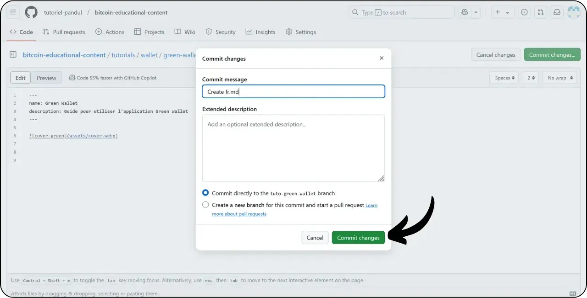
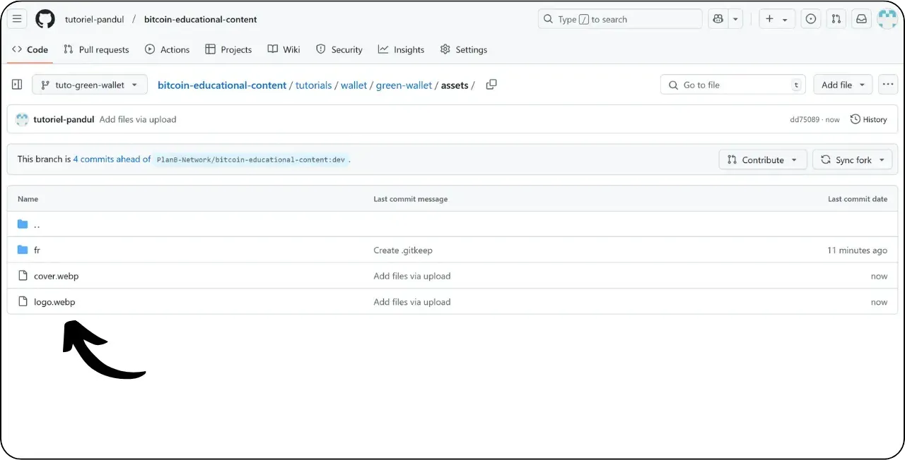

Trước khi làm theo hướng dẫn này để thêm hướng dẫn mới, bạn cần hoàn thành một vài bước sơ bộ. Nếu bạn chưa thực hiện, vui lòng xem hướng dẫn giới thiệu này trước, sau đó quay lại đây:

https://planb.network/tutorials/others/contribution/write-tutorials-4d142a6a-9127-4ffb-9e0a-5aba29f169e2
Bạn đã có:


- Chọn một chủ đề cho bài hướng dẫn của bạn;
- Đã liên hệ với nhóm Plan ₿ Network qua [nhóm Telegram](https://t.me/PlanBNetwork_ContentBuilder) hoặc paolo@planb.network ;
- Chọn công cụ đóng góp của bạn.

Trong hướng dẫn này, chúng ta sẽ xem cách thêm hướng dẫn của bạn vào Plan ₿ Network bằng phiên bản web của GitHub. Nếu bạn đã thành thạo Git, hướng dẫn rất chi tiết này có thể không cần thiết đối với bạn. Thay vào đó, tôi khuyên bạn nên xem một trong 2 hướng dẫn khác này, trong đó tôi trình bày chi tiết các hướng dẫn cần tuân theo và các bước thực hiện thay đổi từ bản địa phương:


- Người dùng có kinh nghiệm**:

https://planb.network/tutorials/others/contribution/write-tutorials-git-expert-0ce1e490-c28f-4c51-b7e0-9a6ac9728410

- Trung cấp (GitHub Desktop)**:

https://planb.network/tutorials/others/contribution/write-tutorials-github-desktop-intermediate-4a36a052-1000-4191-890a-9a1dc65f8957
## Điều kiện tiên quyết

Điều kiện tiên quyết trước khi bắt đầu hướng dẫn:


- Có [tài khoản GitHub](https://github.com/signup);
- Có một nhánh của [Kho lưu trữ nguồn Plan ₿ Network](https://github.com/PlanB-Network/bitcoin-educational-content);
- Có [hồ sơ giáo viên trên Plan₿ Network](https://planb.network/professors) (chỉ khi bạn cung cấp hướng dẫn đầy đủ).

Nếu bạn cần trợ giúp để đáp ứng các điều kiện tiên quyết này, các hướng dẫn khác của tôi sẽ giúp ích:

https://planb.network/tutorials/others/contribution/basics-of-github-471f7f00-8b5a-4b63-abb1-f1528b032bbb
https://planb.network/tutorials/others/contribution/create-github-account-a75fc39d-f0d0-44dc-9cd5-cd94aee0c07c
https://planb.network/tutorials/others/contribution/github-desktop-work-environment-5862003b-9d76-47f5-a9e0-5ec74256a8ba
https://planb.network/tutorials/others/contribution/create-teacher-profile-8ba9ba49-8fac-437a-a435-c38eebc8f8a4
Khi mọi thứ đã sẵn sàng và bạn đã có nhánh của kho lưu trữ Plan ₿ Network, bạn có thể bắt đầu thêm phần hướng dẫn.

## 1 - Tạo một nhánh mới

Mở trình duyệt của bạn và điều hướng đến trang fork của bạn trong kho lưu trữ Plan ₿ Network. Đây là fork bạn đã thiết lập trên GitHub. URL của fork của bạn sẽ trông như thế này: `https://github.com/[your-username]/bitcoin-educational-content` :


Đảm bảo bạn đang ở nhánh `dev` chính, sau đó nhấp vào nút "*Sync fork*". Nếu fork của bạn chưa được cập nhật, GitHub sẽ yêu cầu bạn cập nhật nhánh của mình. Tiến hành cập nhật này:


Nhấp vào nhánh `dev`, sau đó đặt tên cho nhánh đang hoạt động của bạn sao cho tiêu đề phản ánh rõ mục đích của nó, sử dụng dấu gạch ngang để phân tách các từ. Ví dụ, nếu mục đích của chúng ta là viết hướng dẫn về cách sử dụng Green Wallet, nhánh có thể được gọi là: `tuto-green-wallet-loic`. Sau khi nhập tên phù hợp, hãy nhấp vào "*Create branch*" để xác nhận việc tạo nhánh mới của bạn dựa trên `dev`:


Bây giờ bạn sẽ chuyển sang nhánh công việc mới của mình:


Điều này có nghĩa là mọi thay đổi bạn thực hiện sẽ chỉ được lưu trên nhánh cụ thể đó.

Đối với mỗi bài viết mới mà bạn dự định xuất bản, hãy tạo một nhánh mới từ `dev`.

Nhánh trong Git đại diện cho phiên bản song song của dự án, cho phép bạn làm việc trên các sửa đổi mà không ảnh hưởng đến nhánh chính, cho đến khi công việc của bạn sẵn sàng để tích hợp.

## 2 - Thêm tệp hướng dẫn

Bây giờ nhánh làm việc đã được tạo, đã đến lúc tích hợp hướng dẫn mới của bạn.

Trong các tệp nhánh của bạn, bạn sẽ cần tìm thư mục con phù hợp để đặt hướng dẫn của mình. Việc sắp xếp các thư mục phản ánh các phần khác nhau của trang web Plan ₿ Network. Trong ví dụ của chúng tôi, vì chúng tôi đang thêm hướng dẫn về Green Wallet, hãy đi đến đường dẫn sau: `bitcoin-educational-content\tutorials\wallet` tương ứng với phần `WALLET` của trang web:


Trong thư mục `wallet`, tạo một thư mục mới dành riêng cho hướng dẫn của bạn. Tên của thư mục này phải chỉ rõ phần mềm được đề cập trong hướng dẫn, sử dụng dấu gạch nối để kết nối các từ. Đối với ví dụ của tôi, thư mục sẽ có tên là `green-wallet`. Nhấp vào "*Add File*" sau đó vào "*Create new file*":


Nhập tên thư mục theo sau là dấu gạch chéo `/` để xác nhận việc tạo thư mục.


Trong thư mục con mới dành riêng cho hướng dẫn của bạn, bạn cần thêm một số mục:


- Tạo một thư mục `assets` để lưu trữ tất cả các hình ảnh minh họa cần thiết cho bài hướng dẫn của bạn;
- Trong thư mục `assets` này, hãy tạo một thư mục con được đặt tên theo mã ngôn ngữ gốc của hướng dẫn. Ví dụ, nếu hướng dẫn được viết bằng tiếng Anh, thư mục con này phải được đặt tên là `en`. Đặt tất cả các hình ảnh của hướng dẫn (sơ đồ, hình ảnh, ảnh chụp màn hình, v.v.) vào thư mục này.
- Bạn phải tạo một tệp `tutorial.yml` để ghi lại thông tin chi tiết về hướng dẫn của mình;
- Một tệp markdown phải được tạo để viết nội dung thực tế của hướng dẫn của bạn. Tệp này phải được đặt tên theo mã của ngôn ngữ mà nó được viết. Ví dụ, đối với một hướng dẫn được viết bằng tiếng Pháp, tệp phải được gọi là `fr.md`.

Tóm lại, đây là hệ thống phân cấp tệp (chúng ta sẽ tiếp tục tạo chúng ở phần tiếp theo):

```plaintext
bitcoin-educational-content/
└── tutorials/
└── wallet/ (à modifier avec la bonne catégorie)
└── green-wallet/ (à modifier avec le nom du tuto)
├── assets/
│   ├── fr/ (à modifier selon le code de langue approprié)
├── tutorial.yml
└── fr.md (à modifier selon le code de langue approprié)
```

## 3 - Điền vào tệp YAML

Chúng ta hãy bắt đầu với tệp YAML. Trong hộp để tạo tệp mới, nhập `tutorial.yml`:


Điền vào tệp `tutorial.yml` bằng cách sao chép mẫu sau:

```yaml
id:
project_id:
tags:
-
-
-
category:
level:
credits:
professor:
# Proofreading metadata
original_language:
proofreading:
- language:
last_contribution_date:
urgency:
contributors_id:
-
reward:
````
Voici le détail des champs obligatoires :
- **id** : Un UUID (_Universally Unique Identifier_) permettant d’identifier de manière unique le tutoriel. Vous pouvez le générer avec [un outil en ligne](https://www.uuidgenerator.net/version4). La seule contrainte est que cet UUID soit aléatoire pour ne pas avoir de conflit avec un autre UUID sur la plateforme ;
- **project_id** : L'UUID de l’entreprise ou de l’organisation derrière l’outil présenté dans le tutoriel [depuis la liste des projets](https://github.com/PlanB-Network/bitcoin-educational-content/tree/dev/resources/projects). Par exemple, si vous réalisez un tutoriel sur le logiciel Green Wallet, vous pouvez trouver ce `project_id` dans le fichier suivant : `bitcoin-educational-content/resources/projects/blockstream/project.yml`. Cette information est ajoutée dans le fichier YAML de votre tutoriel parce que Plan ₿ Network maintient une base de données de toutes les entreprises et organisations opérant sur Bitcoin ou des projets connexes. En ajoutant le `project_id` de l'entité liée à votre tutoriel, vous créez un lien entre les deux éléments ;
- **tags** : 2 ou 3 mots-clés pertinents liés au contenu du tutoriel, choisis exclusivement [dans la liste des tags de Plan ₿ Network](https://github.com/PlanB-Network/bitcoin-educational-content/blob/dev/docs/50-planb-tags.md) ;
- **category** : La sous-catégorie correspondant au contenu du tutoriel, selon la structure du site Plan ₿ Network (par exemple pour les wallets : `desktop`, `hardware`, `mobile`, `backup`) ;
- **level** : Le niveau de difficulté du tutoriel, parmi :
- `beginner`
- `intermediate`
- `advanced`
- `expert`
- **professor** : Votre `contributor_id` (mots BIP39) tel qu'affiché sur [votre profil professeur](https://github.com/PlanB-Network/bitcoin-educational-content/tree/dev/professors) ;
- **original_language** : La langue d’origine du tutoriel (par exemple `fr`, `en`, etc.) ;
- **proofreading** : Informations sur le processus de relecture. Remplissez la première partie, car la relecture de votre propre tutoriel compte comme une première validation :
- **language** : Code de langue de la relecture (par exemple `fr`, `en`, etc.).
- **last_contribution_date** : Date du jour.
- **urgency** : Laissez vide.
- **contributors_id** : Votre ID GitHub.
- **reward** : Laissez vide.
Pour davantage de détails sur votre identifiant de professeur, reportez-vous au tutoriel correspondant :
https://planb.network/tutorials/others/contribution/create-teacher-profile-8ba9ba49-8fac-437a-a435-c38eebc8f8a4
Voici un exemple de fichier `tutorial.yml` complété pour un tutoriel sur le wallet Blockstream Green :
```

id: e84edaa9-fb65-48c1-a357-8a5f27996143

dự án_id: 3b2f45e6-d612-412c-95ba-cf65b49aa5b8

thẻ:


  - ví
  - phần mềm
  - chìa khóa

thể loại: di động

trình độ: người mới bắt đầu

tín dụng:

giáo sư: khá riêng tư

# Kiểm tra siêu dữ liệu

ngôn ngữ gốc: fr

hiệu đính:


  - ngôn ngữ: fr

ngày đóng góp cuối cùng: 2024-11-20

tính cấp bách:

người đóng góp_id:


      - LoicPandul

phần thưởng:

```
Une fois la modification de votre fichier `tutorial.yml` achevée, enregistrez votre document en cliquant sur le bouton "*Commit changes...*" :

Ajoutez un titre et une description, et assurez-vous que le commit soit réalisé sur la branche de travail que vous avez créée au début de ce tutoriel. Puis confirmez en cliquant sur "*Commit changes*".

## 4 - Créer les sous-dossiers pour les images
Cliquez de nouveau sur "*Add File*" puis sur "*Create new file*" :

Entrez `assets` suivi d'un slash `/` pour créer le dossier :

Répétez cette étape dans le dossier `/assets` pour créer le sous-dossier de langue, par exemple `fr` si votre tutoriel est en français :

Dans ce dossier, créez un fichier factice pour obliger GitHub à conserver votre dossier (qui sinon serait vide). Nommez ce fichier `.gitkeep`. Ensuite, cliquez sur "*Commit changes...*".

Assurez-vous à nouveau que vous êtes sur la branche de travail correcte, puis cliquez sur "*Commit changes*".

## 5 - Créer le fichier Markdown
Maintenant, nous allons créer le fichier qui accueillera votre tutoriel, nommé selon le code de votre langue, comme par exemple `fr.md` si l'on rédige en français. Accédez au dossier de votre tutoriel :

Cliquez sur "*Add file*", puis sur "*Create new file*".

Nommez le fichier en utilisant le code de votre langue. Dans mon cas, le tutoriel étant rédigé en français, je nomme mon fichier `fr.md`. L'extension `.md` indique que le fichier est au format Markdown.

Nous commençons par remplir la section `Properties` en haut du document. Ajoutez manuellement et remplissez le bloc de code suivant (les clés `name:` et `description:` doivent être conservées en anglais, mais leur valeur doit être rédigée dans la langue utilisée pour votre tutoriel) :
```

---
name: [Tiêu đề]
description: [Sự miêu tả]
---
```

Remplissez le nom de votre tutoriel ainsi qu'une courte description de celui-ci :

Ajoutez ensuite le chemin de l'image de couverture au début de votre tutoriel. Pour ce faire, notez :
```


```
Cette syntaxe vous sera utile chaque fois que l'ajout d'une image dans votre tutoriel sera nécessaire. Le point d'exclamation signale qu'il s'agit d'une image, dont le texte alternatif (alt) est spécifié entre les crochets. Le chemin d'accès à l'image est indiqué entre les parenthèses :

Cliquez sur le bouton "*Commit changes...*" pour enregistrer ce fichier.

Vérifiez que vous êtes sur la bonne branche, puis confirmez le commit.

Votre dossier de tutoriel devrait maintenant se présenter de cette manière, selon le code de votre langue :

## 6 - Ajouter le logo et la couverture
Au sein du dossier `assets`, vous devez ajouter un fichier nommé `logo.webp`, qui servira de vignette pour votre article. Cette image doit obligatoirement être au format `.webp` et doit respecter une dimension carrée afin de s'harmoniser avec l'interface utilisateur.
Vous avez la liberté de choisir le logo du logiciel traité dans le tutoriel ou toute autre image pertinente, à condition que celle-ci soit libre de droits. En complément, ajoutez également au même endroit une image intitulée `cover.webp`. Celle-ci sera affichée en haut de votre tutoriel. Veillez à ce que cette image, tout comme le logo, respecte les droits d'utilisation et soit adaptée au contexte de votre tutoriel.
Pour ajouter des images dans le dossier `/assets`, vous pouvez les glisser-déposer depuis vos fichiers locaux. Assurez-vous que vous êtes bien dans le dossier `/assets` et sur la bonne branche de travail, puis cliquez sur "*Commit changes*".

Vous devriez maintenant voir les images apparaître dans le dossier.

## 7 - Rédiger le tutoriel
Poursuivez la rédaction de votre tutoriel en notant votre contenu dans le fichier Markdown avec le code de langue (dans mon exemple, en français, c'est le fichier `fr.md`). Accédez au fichier et cliquez sur l'icône du crayon :

Commencez la rédaction de votre tutoriel. Lorsque vous ajoutez un sous-titre, utilisez le formatage Markdown approprié en préfixant le texte avec `##` :

Alternez entre la vue "*Edit*" et la vue "*Preview*" pour mieux visualiser le rendu.

Pour enregistrer votre travail, cliquez sur "*Commit Changes...*", assurez-vous d'être sur la bonne branche de travail, puis confirmez en cliquant de nouveau sur "*Commit Changes*".

## 8 - Ajouter des visuels
Le sous-dossier de langues dans le dossier `/assets` (dans mon exemple : `/assets/fr`) permet de stocker les schémas et les visuels qui accompagneront votre tutoriel. Autant que possible, évitez d'inclure du texte dans vos images pour rendre votre contenu accessible à un public international. Bien sûr, le logiciel présenté contiendra du texte, mais si vous ajoutez des schémas ou des indications supplémentaires sur les captures d'écran du logiciel, faites-le sans texte ou, si cela s'avère indispensable, utilisez l'anglais.
Pour nommer vos images, utilisez simplement des numéros correspondant à leur ordre d'apparition dans le tutoriel, formatés sur deux chiffres (ou trois chiffres si votre tutoriel contient plus de 99 images). Par exemple, nommez votre première image `01.webp`, votre deuxième `02.webp`, et ainsi de suite.
Le format de vos images doit être en `.webp` exclusivement. Si besoin, vous pouvez utiliser [mon logiciel de conversion d'images](https://github.com/LoicPandul/ImagesConverter).

Maintenant que vous avez ajouté vos images dans le sous-dossier, vous pouvez supprimer le fichier factice `.gitkeep`. Ouvrez ce fichier, cliquez sur les trois petits points en haut à droite, puis sur "*Delete file*".

Enregistrez vos modifications en cliquant sur "*Commit changes...*".

Pour insérer un schéma présent dans votre sous-dossier dans votre document de rédaction, utilisez la commande Markdown suivante, en prenant soin de spécifier le texte alternatif approprié ainsi que le chemin correct de l'image en fonction de votre langue :
```


```