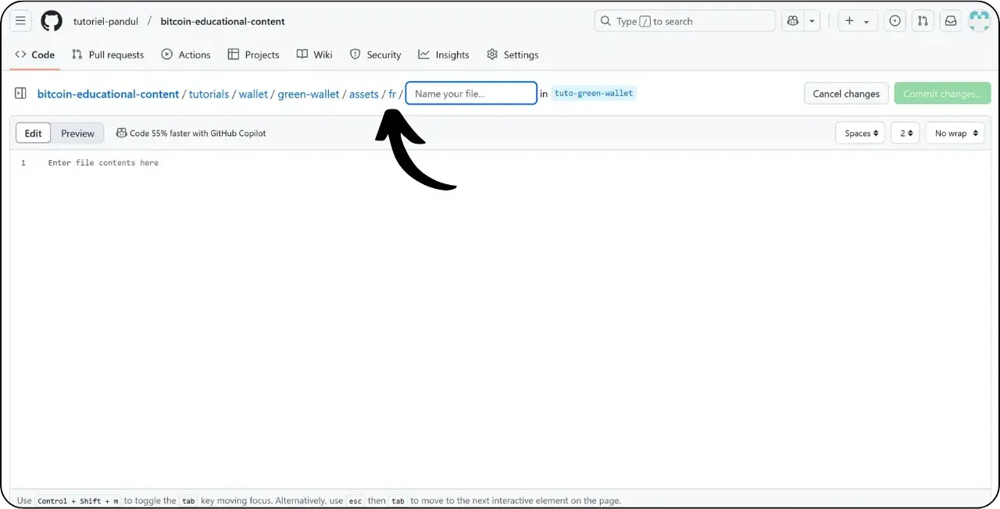
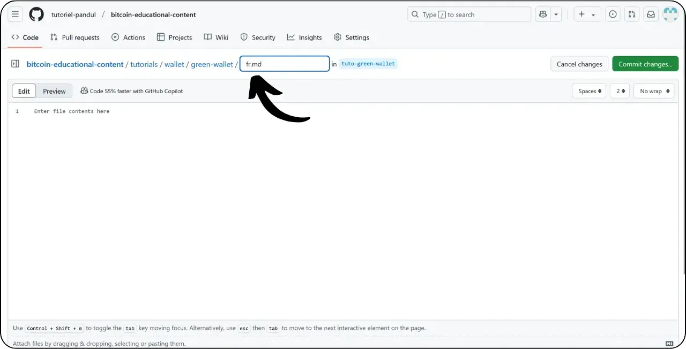
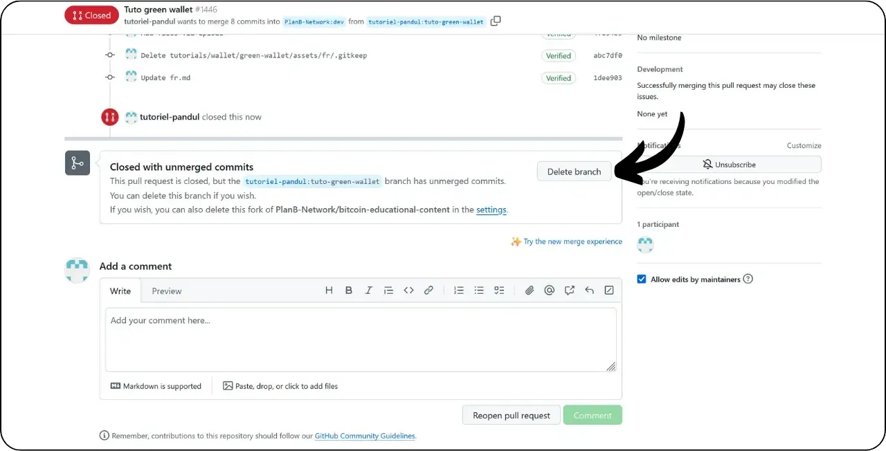

Trước khi làm theo hướng dẫn này để thêm hướng dẫn mới, bạn cần hoàn thành một vài bước sơ bộ. Nếu bạn chưa làm, vui lòng xem hướng dẫn giới thiệu này trước, sau đó quay lại đây:

https://planb.network/tutorials/others/contribution/write-tutorials-4d142a6a-9127-4ffb-9e0a-5aba29f169e2

Bạn đã có:


- Chọn một chủ đề cho bài hướng dẫn của bạn;
- Đã liên hệ với nhóm Plan ₿ Network qua [nhóm Telegram](https://t.me/PlanBNetwork_ContentBuilder) hoặc paolo@planb.network ;
- Chọn công cụ đóng góp của bạn.

Trong hướng dẫn này, chúng ta sẽ xem cách thêm hướng dẫn của bạn vào Plan ₿ Network bằng phiên bản web của GitHub. Nếu bạn đã thành thạo Git, hướng dẫn rất chi tiết này có thể không cần thiết đối với bạn. Thay vào đó, tôi khuyên bạn nên xem một trong 2 hướng dẫn khác này, trong đó tôi trình bày chi tiết các hướng dẫn cần tuân theo và các bước thực hiện thay đổi từ bản địa phương:


- Người dùng có kinh nghiệm**:

https://planb.network/tutorials/others/contribution/write-tutorials-git-expert-0ce1e490-c28f-4c51-b7e0-9a6ac9728410

- Trung cấp (GitHub Desktop)**:

https://planb.network/tutorials/others/contribution/write-tutorials-github-desktop-intermediate-4a36a052-1000-4191-890a-9a1dc65f8957

## Điều kiện tiên quyết

Điều kiện tiên quyết trước khi bắt đầu hướng dẫn:


- Có [tài khoản GitHub](https://github.com/signup);
- Có một nhánh của [Kho lưu trữ nguồn Plan ₿ Network](https://github.com/PlanB-Network/bitcoin-educational-content);
- Có [hồ sơ giáo viên trên Plan₿ Network](https://planb.network/professors) (chỉ khi bạn cung cấp hướng dẫn đầy đủ).

Nếu bạn cần trợ giúp để đáp ứng các điều kiện tiên quyết này, các hướng dẫn khác của tôi sẽ giúp ích:


https://planb.network/tutorials/others/contribution/create-github-account-a75fc39d-f0d0-44dc-9cd5-cd94aee0c07c

https://planb.network/tutorials/others/contribution/github-desktop-work-environment-5862003b-9d76-47f5-a9e0-5ec74256a8ba

https://planb.network/tutorials/others/contribution/create-teacher-profile-8ba9ba49-8fac-437a-a435-c38eebc8f8a4

Khi mọi thứ đã sẵn sàng và bạn đã có nhánh của kho lưu trữ Plan ₿ Network, bạn có thể bắt đầu thêm phần hướng dẫn.

## 1 - Tạo một nhánh mới

Mở trình duyệt của bạn và điều hướng đến trang fork của bạn trong kho lưu trữ Plan ₿ Network. Đây là fork bạn đã thiết lập trên GitHub. URL của fork của bạn sẽ trông như thế này: `https://github.com/[your-username]/bitcoin-educational-content` :


Đảm bảo bạn đang ở nhánh `dev` chính, sau đó nhấp vào nút "*Sync fork*". Nếu fork của bạn chưa được cập nhật, GitHub sẽ yêu cầu bạn cập nhật nhánh của mình. Tiến hành cập nhật này:


Nhấp vào nhánh `dev`, sau đó đặt tên cho nhánh đang hoạt động của bạn sao cho tiêu đề phản ánh rõ mục đích của nó, sử dụng dấu gạch ngang để phân tách các từ. Ví dụ, nếu mục đích của chúng ta là viết hướng dẫn về cách sử dụng Green Wallet, nhánh có thể được gọi là: `tuto-green-wallet-loic`. Sau khi nhập tên phù hợp, hãy nhấp vào "*Create branch*" để xác nhận việc tạo nhánh mới của bạn dựa trên `dev`:


Bây giờ bạn sẽ chuyển sang nhánh công việc mới của mình:


Điều này có nghĩa là mọi thay đổi bạn thực hiện sẽ chỉ được lưu trên nhánh cụ thể đó.

Đối với mỗi bài viết mới mà bạn dự định xuất bản, hãy tạo một nhánh mới từ `dev`.

Nhánh trong Git đại diện cho phiên bản song song của dự án, cho phép bạn làm việc trên các sửa đổi mà không ảnh hưởng đến nhánh chính, cho đến khi công việc của bạn sẵn sàng để tích hợp.

## 2 - Thêm tệp hướng dẫn

Bây giờ nhánh làm việc đã được tạo, đã đến lúc tích hợp hướng dẫn mới của bạn.

Trong các tệp nhánh của bạn, bạn sẽ cần tìm thư mục con phù hợp để đặt hướng dẫn của mình. Việc sắp xếp các thư mục phản ánh các phần khác nhau của trang web Plan ₿ Network. Trong ví dụ của chúng tôi, vì chúng tôi đang thêm hướng dẫn về Green Wallet, hãy đi đến đường dẫn sau: `bitcoin-educational-content\tutorials\wallet` tương ứng với phần `WALLET` của trang web:


Trong thư mục `wallet`, tạo một thư mục mới dành riêng cho hướng dẫn của bạn. Tên của thư mục này phải chỉ rõ phần mềm được đề cập trong hướng dẫn, sử dụng dấu gạch nối để kết nối các từ. Đối với ví dụ của tôi, thư mục sẽ có tên là `green-wallet`. Nhấp vào "*Add File*" sau đó vào "*Create new file*":


Nhập tên thư mục theo sau là dấu gạch chéo `/` để xác nhận việc tạo thư mục.


Trong thư mục con mới dành riêng cho hướng dẫn của bạn, bạn cần thêm một số mục:


- Tạo một thư mục `assets` để lưu trữ tất cả các hình ảnh minh họa cần thiết cho bài hướng dẫn của bạn;
- Trong thư mục `assets` này, hãy tạo một thư mục con được đặt tên theo mã ngôn ngữ gốc của hướng dẫn. Ví dụ, nếu hướng dẫn được viết bằng tiếng Anh, thư mục con này phải được đặt tên là `en`. Đặt tất cả các hình ảnh của hướng dẫn (sơ đồ, hình ảnh, ảnh chụp màn hình, v.v.) vào thư mục này.
- Bạn phải tạo một tệp `tutorial.yml` để ghi lại thông tin chi tiết về hướng dẫn của mình;
- Một tệp markdown phải được tạo để viết nội dung thực tế của hướng dẫn của bạn. Tệp này phải được đặt tên theo mã của ngôn ngữ mà nó được viết. Ví dụ, đối với một hướng dẫn được viết bằng tiếng Pháp, tệp phải được gọi là `fr.md`.

Tóm lại, đây là hệ thống phân cấp tệp (chúng ta sẽ tiếp tục tạo chúng ở phần tiếp theo):

```
bitcoin-educational-content/
└── tutorials/
└── wallet/ (à modifier avec la bonne catégorie)
└── green-wallet/ (à modifier avec le nom du tuto)
├── assets/
│   ├── fr/ (à modifier selon le code de langue approprié)
├── tutorial.yml
└── fr.md (à modifier selon le code de langue approprié)
```

## 3 - Điền vào tệp YAML

Chúng ta hãy bắt đầu với tệp YAML. Trong hộp để tạo tệp mới, nhập `tutorial.yml`:


Điền vào tệp `tutorial.yml` bằng cách sao chép mẫu sau:

```
id:
project_id:
tags:
-
-
-
category:
level:
credits:
professor:
# Proofreading metadata
original_language:
proofreading:
- language:
last_contribution_date:
urgency:
contributors_id:
-
reward:
```

Sau đây là các trường bắt buộc:


- id**: UUID (_Universally Unique Identifier_) để nhận dạng duy nhất hướng dẫn. Bạn có thể tạo nó bằng [một công cụ trực tuyến](https://www.uuidgenerator.net/version4). Hạn chế duy nhất là UUID này phải ngẫu nhiên, để không xung đột với UUID khác trên nền tảng;
- project_id**: UUID của công ty hoặc tổ chức đứng sau công cụ được trình bày trong hướng dẫn [từ danh sách các dự án](https://github.com/PlanB-Network/bitcoin-educational-content/tree/dev/resources/projects). Ví dụ: nếu bạn đang thực hiện hướng dẫn về phần mềm Green Wallet, bạn có thể tìm thấy `project_id` này trong tệp sau: `bitcoin-educational-content/resources/projects/blockstream/project.yml`. Thông tin này được thêm vào tệp YAML của hướng dẫn của bạn vì Plan ₿ Network duy trì cơ sở dữ liệu của tất cả các công ty và tổ chức hoạt động trên Bitcoin hoặc các dự án liên quan. Bằng cách thêm `project_id` của thực thể được liên kết vào hướng dẫn của bạn, bạn tạo liên kết giữa hai phần tử;
- thẻ**: 2 hoặc 3 từ khóa có liên quan đến nội dung hướng dẫn, được chọn độc quyền [từ danh sách thẻ Plan ₿ Network](https://github.com/PlanB-Network/bitcoin-educational-content/blob/dev/docs/50-planb-tags.md);
- category**: Tiểu thể loại tương ứng với nội dung hướng dẫn, theo cấu trúc Plan ₿ Network (ví dụ: đối với ví: `desktop`, `hardware`, `mobile`, `backup`);
- level** : Mức độ khó của hướng dẫn, từ :
    - người mới bắt đầu`
    - `trung gian`
    - `nâng cao`
    - `chuyên gia`
- giáo sư**: `contributor_id` của bạn (BIP39 từ) như được hiển thị trên [hồ sơ giáo viên của bạn](https://github.com/PlanB-Network/bitcoin-educational-content/tree/dev/professors);
- original_language**: Ngôn ngữ gốc của hướng dẫn (ví dụ: `fr`, `en`, v.v.);
- soát lỗi**: Thông tin về quá trình soát lỗi. Điền vào phần đầu tiên, vì việc soát lỗi hướng dẫn của riêng bạn được tính là xác thực đầu tiên:
    - ngôn ngữ**: Kiểm tra mã ngôn ngữ (ví dụ: `fr`, `en`, v.v.).
    - last_contribution_date**: Ngày hôm nay.
    - mức độ khẩn cấp**: Để trống.
    - contributors_id**: ID GitHub của bạn.
    - phần thưởng**: Để trống.

Để biết thêm chi tiết về ID giáo viên của bạn, vui lòng tham khảo hướng dẫn tương ứng:

https://planb.network/tutorials/others/contribution/create-teacher-profile-8ba9ba49-8fac-437a-a435-c38eebc8f8a4

Sau đây là ví dụ về tệp `tutorial.yml` được hoàn thành cho hướng dẫn về ví Blockstream Green:

```
id: e84edaa9-fb65-48c1-a357-8a5f27996143
project_id: 3b2f45e6-d612-412c-95ba-cf65b49aa5b8
tags:
- wallets
- software
- keys
category: mobile
level: beginner
credits:
professor: pretty-private
# Proofreading metadata
original_language: fr
proofreading:
- language: fr
last_contribution_date: 2024-11-20
urgency:
contributors_id:
- LoicPandul
reward:
```

Sau khi hoàn tất việc sửa đổi tệp `tutorial.yml`, hãy lưu tài liệu bằng cách nhấp vào nút "*Cam kết thay đổi...*":


Thêm tiêu đề và mô tả, và đảm bảo rằng cam kết được thực hiện với nhánh bạn đã tạo khi bắt đầu hướng dẫn này. Sau đó xác nhận bằng cách nhấp vào "*Cam kết thay đổi*".


## 4 - Tạo thư mục con cho hình ảnh

Nhấp vào "*Thêm tệp*" một lần nữa rồi nhấp vào "*Tạo tệp mới*":


Nhập `assets` theo sau là dấu gạch chéo `/` để tạo thư mục:


Lặp lại bước này trong thư mục `/assets` để tạo thư mục con ngôn ngữ, ví dụ `fr` nếu hướng dẫn của bạn bằng tiếng Pháp:



Trong thư mục này, hãy tạo một tệp giả để buộc GitHub giữ thư mục của bạn (nếu không thì thư mục này sẽ trống). Đặt tên cho tệp này là `.gitkeep`. Sau đó nhấp vào "*Commit changes...*".


Kiểm tra lại xem bạn đã vào đúng nhánh chưa, sau đó nhấp vào "*Xác nhận thay đổi*".


## 5 - Tạo tệp Markdown

Bây giờ chúng ta sẽ tạo tệp sẽ lưu trữ hướng dẫn của bạn, được đặt tên theo mã ngôn ngữ của bạn, ví dụ `fr.md` nếu chúng ta viết bằng tiếng Pháp. Đi đến thư mục hướng dẫn của bạn:


Nhấp vào "Thêm tệp*", sau đó nhấp vào "Tạo tệp mới*".


Đặt tên tệp bằng mã ngôn ngữ của bạn. Trong trường hợp của tôi, vì hướng dẫn được viết bằng tiếng Pháp, tôi đặt tên tệp của mình là `fr.md`. Phần mở rộng `.md` cho biết tệp ở định dạng Markdown.



Chúng ta bắt đầu bằng cách điền vào phần `Properties` ở đầu tài liệu. Thêm và điền thủ công khối mã sau (các khóa `name:` và `description:` phải được giữ bằng tiếng Anh, nhưng giá trị của chúng phải được viết bằng ngôn ngữ được sử dụng cho hướng dẫn của bạn):

```
---
name: [Titre]
description: [Description]
---
```


Điền tên hướng dẫn của bạn và mô tả ngắn gọn:


Sau đó thêm đường dẫn đến ảnh bìa ở đầu hướng dẫn của bạn. Để thực hiện việc này, hãy lưu ý:

```

```

Cú pháp này sẽ hữu ích bất cứ khi nào bạn cần thêm hình ảnh vào hướng dẫn của mình. Dấu chấm than chỉ ra một hình ảnh, có văn bản thay thế (alt) được chỉ định giữa các dấu ngoặc vuông. Đường dẫn đến hình ảnh được chỉ định giữa các dấu ngoặc vuông:


Nhấp vào nút "*Xác nhận thay đổi...*" để lưu tệp này.


Kiểm tra xem bạn có đang ở đúng nhánh không, sau đó xác nhận cam kết.


Theo mã ngôn ngữ của bạn, thư mục hướng dẫn của bạn bây giờ sẽ trông như thế này:


## 6 - Thêm logo và bìa

Trong thư mục `assets`, bạn cần thêm một tệp có tên `logo.webp`, tệp này sẽ đóng vai trò là hình thu nhỏ cho bài viết của bạn. Hình ảnh này phải ở định dạng `.webp` và phải có kích thước vuông để phù hợp với giao diện người dùng.

Bạn được tự do lựa chọn logo phần mềm được sử dụng trong hướng dẫn hoặc bất kỳ hình ảnh có liên quan nào khác, miễn là không có bản quyền. Ngoài ra, hãy thêm một hình ảnh có tiêu đề `cover.webp` vào cùng một vị trí. Hình ảnh này sẽ được hiển thị ở đầu hướng dẫn của bạn. Hãy đảm bảo rằng hình ảnh này, giống như logo, tôn trọng quyền sử dụng và phù hợp với bối cảnh hướng dẫn của bạn.

Để thêm hình ảnh vào thư mục `/assets`, bạn có thể kéo và thả chúng từ các tệp cục bộ của mình. Đảm bảo rằng bạn đang ở trong thư mục `/assets` và ở nhánh bên phải, sau đó nhấp vào "*Commit changes*".


Bây giờ bạn sẽ thấy hình ảnh xuất hiện trong thư mục.


## 7 - Viết hướng dẫn

Tiếp tục viết hướng dẫn của bạn bằng cách ghi chú nội dung của bạn trong tệp Markdown với mã ngôn ngữ (trong ví dụ của tôi, bằng tiếng Pháp, đó là tệp `fr.md`). Đi đến tệp và nhấp vào biểu tượng bút chì:


Bắt đầu viết hướng dẫn của bạn. Khi thêm phụ đề, hãy sử dụng định dạng Markdown phù hợp bằng cách thêm tiền tố `##` vào văn bản:


Thay đổi giữa chế độ xem "*Chỉnh sửa*" và "*Xem trước*" để hình dung kết xuất tốt hơn.


Để lưu công việc của bạn, hãy nhấp vào "*Commit Changes...*", đảm bảo rằng bạn đang ở đúng nhánh, sau đó xác nhận bằng cách nhấp vào "*Commit Changes*" một lần nữa.


## 8 - Thêm hình ảnh

Thư mục con ngôn ngữ trong thư mục `/assets` (trong ví dụ của tôi: `/assets/en`) được sử dụng để lưu trữ sơ đồ và hình ảnh sẽ đi kèm với hướng dẫn của bạn. Tránh đưa văn bản vào hình ảnh của bạn càng nhiều càng tốt để nội dung của bạn dễ tiếp cận với đối tượng quốc tế. Tất nhiên, phần mềm được trình bày sẽ chứa văn bản, nhưng nếu bạn thêm sơ đồ hoặc chỉ dẫn bổ sung vào ảnh chụp màn hình phần mềm, hãy làm như vậy mà không có văn bản hoặc, nếu cần thiết, hãy sử dụng tiếng Anh.

Để đặt tên cho hình ảnh của bạn, chỉ cần sử dụng các số tương ứng với thứ tự xuất hiện của chúng trong hướng dẫn, được định dạng thành hai chữ số (hoặc ba chữ số nếu hướng dẫn của bạn chứa hơn 99 hình ảnh). Ví dụ, đặt tên cho hình ảnh đầu tiên của bạn là `01.webp`, hình ảnh thứ hai là `02.webp`, v.v.

Hình ảnh của bạn chỉ được phép ở định dạng `.webp`. Nếu cần, bạn có thể sử dụng [phần mềm chuyển đổi hình ảnh của tôi](https://github.com/LoicPandul/ImagesConverter).


Bây giờ bạn đã thêm hình ảnh vào thư mục con, bạn có thể xóa tệp giả `.gitkeep`. Mở tệp này, nhấp vào ba dấu chấm nhỏ ở góc trên bên phải, sau đó nhấp vào "*Xóa tệp*".


Lưu thay đổi của bạn bằng cách nhấp vào "*Xác nhận thay đổi...*".


Để chèn sơ đồ từ thư mục con vào tài liệu biên tập, hãy sử dụng lệnh Markdown sau, chú ý chỉ định văn bản thay thế phù hợp và đường dẫn hình ảnh chính xác cho ngôn ngữ của bạn:

```

```

Dấu chấm than ở đầu chỉ ra một hình ảnh. Văn bản thay thế, giúp truy cập và tham chiếu, được đặt giữa các dấu ngoặc vuông. Cuối cùng, đường dẫn đến hình ảnh được chỉ ra giữa các dấu ngoặc vuông.


Nếu bạn muốn tạo sơ đồ của riêng mình, hãy đảm bảo tuân theo hướng dẫn đồ họa của Plan ₿ Network để đảm bảo tính nhất quán về mặt hình ảnh:


- Phông chữ**: Sử dụng [Rubik](https://fonts.google.com/specimen/Rubik);
- Màu sắc** :
 - Màu cam: #FF5C00
 - Đen: #000000
 - Trắng: #FFFFFF

**Điều bắt buộc là tất cả hình ảnh tích hợp vào hướng dẫn của bạn phải không có bản quyền hoặc tôn trọng giấy phép tệp nguồn**. Do đó, tất cả các sơ đồ được xuất bản trên Plan ₿ Network đều được cung cấp theo giấy phép CC-BY-SA, giống như văn bản.

**-> Mẹo:** Khi chia sẻ tệp ở nơi công cộng, chẳng hạn như hình ảnh, điều quan trọng là phải xóa siêu dữ liệu không cần thiết. Siêu dữ liệu này có thể chứa thông tin nhạy cảm, chẳng hạn như dữ liệu vị trí, ngày tạo và thông tin chi tiết về tác giả. Để bảo vệ quyền riêng tư của bạn, bạn nên xóa siêu dữ liệu này. Để đơn giản hóa thao tác này, bạn có thể sử dụng các công cụ chuyên dụng như [Exif Cleaner](https://exifcleaner.com/), cho phép bạn dọn dẹp siêu dữ liệu của tài liệu chỉ bằng thao tác kéo và thả đơn giản.

## 9 - Đề xuất hướng dẫn

Sau khi bạn hoàn thành việc viết hướng dẫn bằng ngôn ngữ bạn chọn, bước tiếp theo là gửi **Yêu cầu kéo**. Sau đó, quản trị viên sẽ thêm các bản dịch còn thiếu vào hướng dẫn của bạn bằng phương pháp dịch tự động của chúng tôi với sự hiệu đính của con người.

Để tiếp tục Yêu cầu kéo, sau khi lưu tất cả các thay đổi, hãy nhấp vào nút "*Đóng góp*", sau đó nhấp vào "*Mở yêu cầu kéo*":


Yêu cầu kéo là yêu cầu được thực hiện để tích hợp các thay đổi từ nhánh của bạn vào nhánh chính của kho lưu trữ Plan ₿ Network, cho phép xem xét và thảo luận về các thay đổi trước khi chúng được hợp nhất.

Trước khi tiếp tục, hãy kiểm tra cẩn thận ở cuối giao diện để đảm bảo những thay đổi này là những gì bạn mong đợi:


Đảm bảo rằng ở đầu giao diện, nhánh làm việc của bạn đã được hợp nhất vào nhánh `dev` của kho lưu trữ Plan ₿ Network (là nhánh chính).

Nhập tiêu đề tóm tắt ngắn gọn những thay đổi bạn muốn hợp nhất với kho lưu trữ nguồn. Thêm bình luận ngắn gọn mô tả những thay đổi này (nếu bạn có số vấn đề liên quan đến việc tạo hướng dẫn của mình, hãy nhớ ghi chú `Đóng #{số vấn đề}` làm bình luận), sau đó nhấp vào nút "*Tạo yêu cầu kéo*" màu xanh lá cây để xác nhận yêu cầu hợp nhất:


PR của bạn sau đó sẽ hiển thị trong tab "*Pull Request*" của kho lưu trữ Plan ₿ Network chính. Tất cả những gì bạn phải làm bây giờ là đợi cho đến khi quản trị viên liên hệ với bạn để xác nhận rằng đóng góp của bạn đã được hợp nhất hoặc yêu cầu bất kỳ sửa đổi nào khác.


Sau khi hợp nhất PR của bạn với nhánh chính, chúng tôi khuyên bạn nên xóa nhánh đang hoạt động của mình (trong ví dụ của tôi: `tuto-green-wallet`) để duy trì lịch sử fork sạch sẽ. GitHub sẽ tự động cung cấp cho bạn tùy chọn này trên trang PR của bạn:



Nếu bạn muốn thay đổi nội dung đóng góp của mình sau khi đã gửi PR, các bước thực hiện sẽ tùy thuộc vào trạng thái hiện tại của PR của bạn:


- Nếu PR của bạn vẫn mở và chưa được hợp nhất, hãy thực hiện các thay đổi trên cùng một nhánh công việc. Các thay đổi cam kết sẽ được thêm vào PR vẫn mở của bạn;
- Trong trường hợp PR của bạn đã được hợp nhất với nhánh chính, bạn sẽ cần phải thực hiện lại quy trình từ đầu bằng cách tạo nhánh mới, sau đó gửi PR mới. Đảm bảo nhánh của bạn được đồng bộ hóa với kho lưu trữ nguồn Plan ₿ Network trên nhánh `dev` trước khi tiếp tục.

Nếu bạn gặp khó khăn về mặt kỹ thuật khi gửi hướng dẫn, vui lòng đừng ngần ngại yêu cầu trợ giúp trên [nhóm Telegram chuyên dụng của chúng tôi để đóng góp](https://t.me/PlanBNetwork_ContentBuilder). Cảm ơn bạn rất nhiều!
