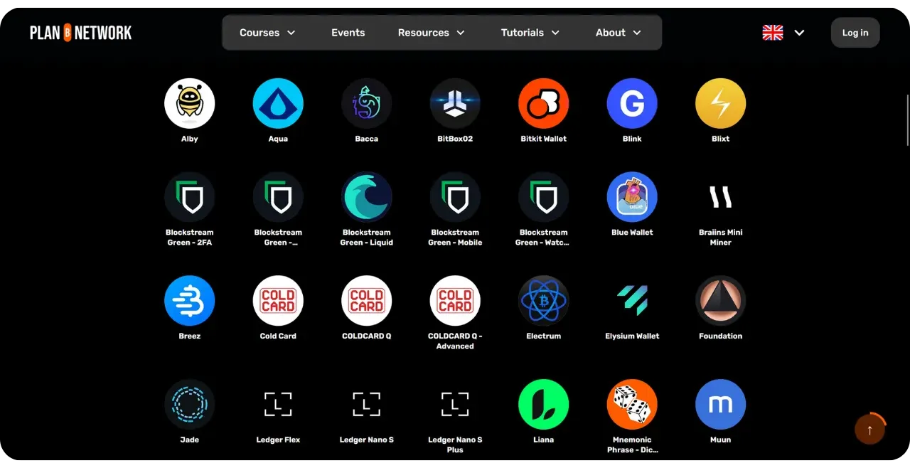
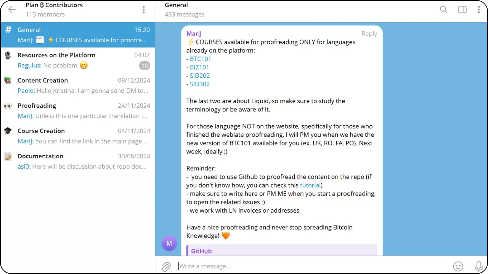

Misi Plan ₿ Network adalah untuk membuat sumber daya edukasi terkemuka mengenai Bitcoin tersedia dalam berbagai bahasa. Semua konten yang dipublikasikan di situs ini bersifat open-source dan di-host di GitHub, memberikan kesempatan kepada siapa saja untuk berpartisipasi dalam memperkaya platform ini. Kontribusi dapat dilakukan dalam berbagai bentuk: koreksi dan pengoreksian teks yang sudah ada, penerjemahan ke dalam bahasa lain, memperbarui informasi atau bahkan membuat tutorial baru yang belum tersedia di situs kami.

Dalam tutorial ini, kita akan melihat cara menambahkan konten baru, seperti tutorial atau kursus, ke platform Plan ₿ Network.

## Apa perbedaan antara tutorial dan kursus?

Dua bagian utama dari platform kami adalah kursus dan tutorial. Kursus menyediakan sumber daya pendidikan teoretis, sementara tutorial menawarkan konten praktis yang menunjukkan cara menggunakan alat tertentu (misalnya, dompet perangkat keras atau perangkat lunak) atau praktik tertentu (seperti mengamankan frasa mnemonik atau memeriksa keaslian perangkat lunak).

Kursus secara alami lebih panjang dan lebih terstruktur daripada tutorial. Kursus ini harus mengeksplorasi topik spesifik yang berkaitan dengan Bitcoin atau ekosistemnya secara mendalam, presisi dan detail.

[Temukan Paket ₿ Kursus Jaringan](https://planb.network/courses)

Tutorial umumnya lebih pendek. Tutorial ini dimaksudkan sebagai panduan langkah demi langkah tentang cara melakukan tugas tertentu yang berhubungan dengan Bitcoin, dengan gambar sebagai pendukung.

[Temukan Paket ₿ Tutorial jaringan](https://planb.network/tutorials)

## Bagaimana cara menyarankan kursus baru?

Jika Anda memiliki ide untuk kursus Bitcoin yang belum ada di platform ini dan ingin menulisnya, Anda dapat menghubungi kami di alamat berikut:

contact@planb.network

Dalam pesan Anda, perkenalkan diri Anda secara singkat dan jelaskan ide kursus Anda. Jika Anda sudah memiliki ide untuk struktur kursus Anda, harap sertakan juga bab-babnya. Kami akan menghubungi Anda sesegera mungkin untuk menjelaskan bagaimana cara melanjutkan dan, jika perlu, mendiskusikan struktur kursus Anda.

## Bagaimana cara mengirimkan tutorial baru?

Untuk menambahkan tutorial baru ke Plan ₿ Network, Anda dapat melakukannya secara langsung di GitHub dengan mengirimkan Pull Request. Dalam tutorial di bawah ini dan tutorial yang menyertainya, saya akan memandu Anda langkah demi langkah melalui proses ini dan memberi tahu Anda tentang panduan yang harus diikuti untuk memastikan kompatibilitas tutorial Anda dengan platform, sambil mempertahankan riwayat kontribusi yang jelas.

## 1 - Pilih tema untuk tutorial Anda

Kami terutama mencari tutorial tentang alat yang terkait dengan Bitcoin atau ekosistemnya. Konten ini dapat dibagi ke dalam enam kategori utama:

- Portofolio ;
- Simpul ;
- Penambangan ;
- Pedagang;
- Pertukaran ;
- Kerahasiaan.

Di luar topik-topik yang secara khusus terkait dengan Bitcoin, Plan ₿ Network juga mencari kontribusi pada topik-topik yang menekankan kedaulatan individu, seperti:

- Alat-alat sumber terbuka ;
- IT;
- Kriptografi ;
- Energi ;
- Matematika;
- Ekonomi;
- DIY;
- Peretasan Kehidupan...

Sebagai contoh, saat ini kami memiliki tutorial tentang Tails, Nostr, dan GrapheneOS. Alat-alat ini tidak secara langsung terkait dengan Bitcoin, tetapi mereka adalah sistem yang mungkin menarik bagi kita sebagai bagian dari langkah menuju kedaulatan di dunia digital. Konten-konten ini dapat diintegrasikan ke dalam sub-kategori di bagian "Lainnya".

Anda dapat merancang tutorial dari awal, atau mengambil tutorial yang telah dipublikasikan sebelumnya di situs web Anda (asalkan Anda memiliki hak cipta) dan membagikannya di Plan ₿ Network juga, dengan menambahkan tautan ke artikel aslinya.

Apa pun yang Anda pilih, harap diingat bahwa semua konten yang dipublikasikan di Plan ₿ Network dilisensikan di bawah lisensi [CC-BY-SA] (https://creativecommons.org/licenses/by-sa/4.0/). Lisensi ini mengizinkan siapa pun untuk menyalin dan, mungkin, memodifikasi konten Anda, dengan syarat bahwa sumber aslinya dicantumkan.

## 2 - Hubungi tim Plan ₿ Jaringan

Setelah Anda memilih tema untuk tutorial Anda, langkah selanjutnya adalah memberi tahu kami tentang niat Anda untuk menambahkan konten ini ke platform. Cara termudah, jika Anda memiliki akun Telegram, adalah dengan [bergabung dengan grup kami] (https://t.me/PlanBNetwork_ContentBuilder).

Perkenalkan diri Anda secara singkat dan tentukan konten spesifik yang ingin Anda tulis, serta bahasa yang ingin Anda gunakan, dengan mengirim pesan di saluran "Umum". Seorang anggota tim kemudian akan membuat sebuah isu di GitHub yang sesuai dengan kontribusi Anda di masa mendatang.

Jika Anda tidak memiliki akun Telegram dan memilih untuk tidak membuatnya, Anda juga dapat menghubungi kami melalui email di alamat berikut

paolo@planb.network

## 3 - Memilih alat yang tepat untuk berkontribusi

Untuk berkontribusi ke Plan ₿ Network, Anda memiliki 3 opsi, tergantung pada tingkat pengalaman Anda dengan GitHub:

- Pengguna berpengalaman**: Lanjutkan dengan metode yang biasa Anda gunakan dan cukup baca tutorial singkat di bawah ini yang merangkum struktur file repositori jaringan Plan ₿ Network, persyaratan khusus, dan cara kerja:

https://planb.network/tutorials/others/contribution/write-tutorials-git-expert-0ce1e490-c28f-4c51-b7e0-9a6ac9728410

- Tingkat Menengah (GitHub Desktop)** : Jika Anda tidak terbiasa menggunakan Git, opsi pertama adalah dengan mudah mengatur lingkungan lokal Anda sendiri untuk berkontribusi ke Plan ₿ Network. Pendekatan ini direkomendasikan untuk kontribusi yang signifikan, seperti menulis tutorial lengkap. Untuk melakukannya, ikuti tutorial langkah demi langkah di bawah ini:

https://planb.network/tutorials/others/contribution/write-tutorials-github-desktop-intermediate-4a36a052-1000-4191-890a-9a1dc65f8957

- Pemula (antarmuka web)** : Anda juga dapat memilih untuk menggunakan antarmuka web GitHub secara langsung, tanpa harus menyiapkan lingkungan lokal yang lengkap. Metode ini dapat dipertimbangkan untuk kontribusi kecil. Namun, untuk kontribusi besar, seperti menambahkan tutorial baru yang lengkap, opsi ini mungkin terbukti lebih kompleks daripada menyiapkan lingkungan lokal. Saya akan menjelaskan cara melakukannya dalam tutorial ini:

https://planb.network/tutorials/others/contribution/write-tutorials-github-web-beginner-e64f8fed-4c0b-4225-9ebb-7fc5f1c01a79
Pilih salah satu dari tiga opsi ini sesuai dengan tingkat pengetahuan Anda, lalu mulailah menulis tutorial Plan ₿ Network Anda yang pertama!