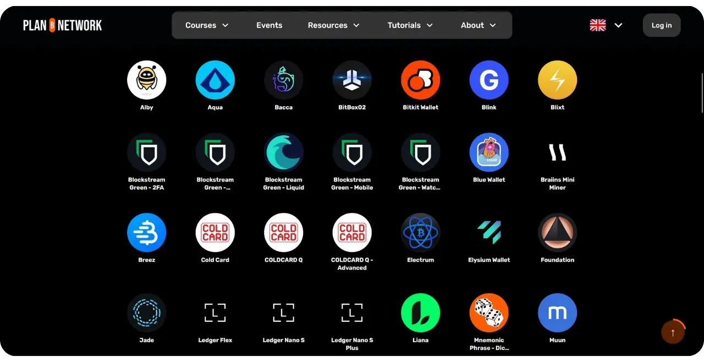

Plan ₿ Networkの使命は、ビットコインに関する主要な教育リソースをできるだけ多くの言語で利用できるようにすることです。このサイトで公開されているコンテンツはすべてオープンソースで、GitHub上でホストされているため、誰でもプラットフォームの充実に参加することができます。既存のテキストの修正や校正、他の言語への翻訳、情報の更新、あるいは私たちのサイトではまだ利用できない新しいチュートリアルの作成など、さまざまな形で貢献することができます。

このチュートリアルでは、チュートリアルやコースなどの新しいコンテンツを Plan ₿ Network プラットフォームに追加する方法について説明します。

## チュートリアルとコースの違いは何ですか？

私たちのプラットフォームの2つの主要なセクションは、コースとチュートリアルです。コースは理論的な教育リソースを提供し、チュートリアルは特定のツール（例えばハードウェアウォレットやソフトウェア）や特定の実践方法（例えばニーモニックフレーズの確保やソフトウェアの真正性のチェックなど）の使用方法を示す実践的なコンテンツを提供します。

コースは当然、チュートリアルよりも長く、より構造化されています。ビットコインまたはそのエコシステムに関連する特定のトピックを、深く、正確に、詳細に探求する必要があります。

[ディスカバープラン₿ネットワークコース](https://planb.network/courses)

チュートリアルは一般的に短い。それらは、特定のビットコイン関連のタスクを実行する方法に関するステップバイステップのガイドとして意図されており、サポートとして画像があります。

[発見プラン₿ネットワークチュートリアル](https://planb.network/tutorials)

## 新しいコースを提案するには？

プラットフォーム上にまだ存在しないビットコイン・コースのアイデアがあり、それを書きたい場合は、以下のアドレスまでご連絡ください：

contact@planb.network

メッセージの中で、簡単な自己紹介とコースのアイデアを説明してください。コースの構成がすでにお決まりの場合は、各章の内容もご記入ください。コースの進め方についてご説明し、必要であればコースの構成についてご相談させていただきます。

## 新しいチュートリアルを投稿するにはどうすればよいですか？

Plan ₿ Network に新しいチュートリアルを追加するには、GitHub で直接 Pull Request を提出します。以下のチュートリアルと付随するチュートリアルでは、このプロセスをステップバイステップで説明し、チュートリアルがプラットフォームと互換性を保ち、明確な貢献履歴を維持するために従うべきガイドラインをお知らせします。

## 1 - チュートリアルのテーマを選ぶ

主にビットコインやそのエコシステムに関連するツールのチュートリアルを募集しています。このコンテンツは主に6つのカテゴリーに分けられます：

- ポートフォリオ；
- ノード；
- 鉱業；
- マーチャント
- 交換；
- 守秘義務。

Plan ₿ Networkでは、ビットコインに特化したこれらのトピック以外にも、以下のような個人主権を重視したトピックに関する投稿を募集している：

- オープンソースツール；
- IT ；
- 暗号；
- エネルギー；
- 数学だ；
- 経済；
- DIYだ；
- ライフハック...

例えば、現在Tails、Nostr、GrapheneOSのチュートリアルがあります。これらのツールはビットコインとは直接関係ありませんが、デジタル世界の主権を目指す動きの一環として、私たちが関心を持ちそうなシステムです。これらのコンテンツは「その他」のサブカテゴリーに統合することができます。

チュートリアルをゼロからデザインすることもできますし、ご自身のウェブサイトで過去に公開したチュートリアル（著作権をお持ちの場合に限ります）をプラン ȏ ネットワークでも共有し、元の記事へのリンクを追加することもできます。

いずれを選択するにしても、Plan ₊ Networkで公開されるすべてのコンテンツは、フリー[CC-BY-SA](https://creativecommons.org/licenses/by-sa/4.0/)ライセンスの下でライセンスされていることに留意してください。このライセンスは、原著作者のクレジットを明記することを唯一の条件として、誰でもあなたのコンテンツを複製し、潜在的に改変することを許可するものです。

## 2 - プランに連絡 ȏ ネットワーク・チーム

チュートリアルのテーマを選んだら、次のステップは、このコンテンツをプラットフォームに追加する意思を私たちに知らせることです。最も簡単な方法は、Telegramアカウントを持っている場合、[私たちのグループに参加](https://t.me/PlanBNetwork_ContentBuilder)することです。

General" チャンネルにメッセージを送って、簡単な自己紹介と書きたい内容、言語を指定してください。チームメンバーが GitHub に課題を作成します。

Telegramのアカウントをお持ちでない場合、またアカウントを作成したくない場合は、以下のアドレスまでEメールでご連絡ください。

paolo@planb.network

## 3 - 貢献するための適切なツールの選択

Plan ₿ Networkに貢献するには、GitHubの経験レベルに応じて3つの選択肢があります：

- 経験豊富なユーザーPlan ȏ Network リポジトリのファイル構造、特定の要件、および作業方法をまとめた以下のチュートリアルを参照してください：

https://planb.network/tutorials/others/contribution/write-tutorials-git-expert-0ce1e490-c28f-4c51-b7e0-9a6ac9728410

- 中級 (GitHub Desktop)** ：Gitの使い方に慣れていない場合、最初の選択肢は、Plan ₿ Networkに貢献するために自分のローカル環境を簡単にセットアップすることです。この方法は、完全なチュートリアルを書くなど、重要な貢献をする場合に推奨されます。これを行うには、以下のステップバイステップのチュートリアルに従ってください：

https://planb.network/tutorials/others/contribution/write-tutorials-github-desktop-intermediate-4a36a052-1000-4191-890a-9a1dc65f8957

- 初心者向け（ウェブインターフェース）** ：GitHub のウェブインターフェースを直接使うこともできます。この方法は、ちょっとした貢献には使えます。しかし、全く新しいチュートリアルを追加するような大きな貢献の場合、この方法はローカル環境をセットアップするよりも複雑になるかもしれません。このチュートリアルでその方法を説明します：

https://planb.network/tutorials/others/contribution/write-tutorials-github-web-beginner-e64f8fed-4c0b-4225-9ebb-7fc5f1c01a79
あなたの知識レベルに応じて、これら3つのオプションから1つを選択し、最初のPlan ₿ Networkチュートリアルを書き始めてください！