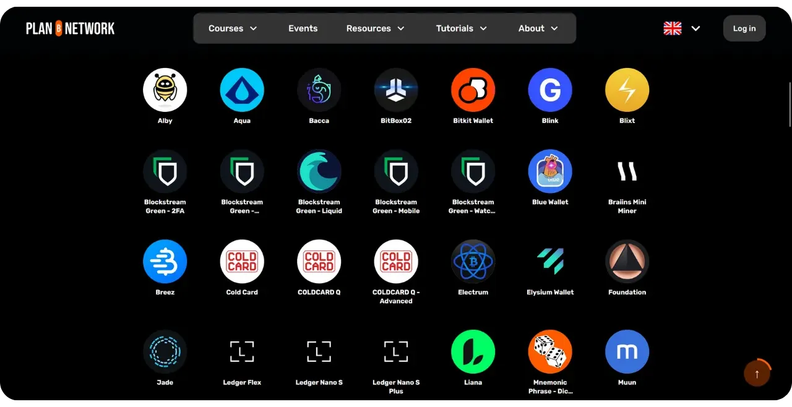

Plan ₿ Network har som mål å gjøre ledende utdanningsressurser om Bitcoin tilgjengelig på så mange språk som mulig. Alt innhold som publiseres på nettstedet er åpen kildekode og ligger på GitHub, noe som gir alle muligheten til å delta i å berike plattformen. Bidrag kan ta mange former: korrigering og korrekturlesing av eksisterende tekster, oversettelse til andre språk, oppdatering av informasjon eller til og med oppretting av nye veiledninger som ennå ikke er tilgjengelige på nettstedet vårt.

I denne veiledningen skal vi se på hvordan du legger til nytt innhold, for eksempel en veiledning eller et kurs, på Plan ₿ Network-plattformen.

## Hva er forskjellen mellom en veiledning og et kurs?

De to hoveddelene av plattformen vår er kurs og veiledninger. Kursene inneholder teoretiske opplæringsressurser, mens opplæringsprogrammene tilbyr praktisk innhold som viser hvordan man bruker et bestemt verktøy (for eksempel en maskinvarelommebok eller programvare) eller en bestemt praksis (for eksempel å sikre en mnemonisk frase eller sjekke ektheten til en programvare).

Kurs er naturlig nok lengre og mer strukturerte enn veiledninger. De bør utforske et spesifikt tema relatert til Bitcoin eller dets økosystem i dybden, med presisjon og detaljer.

[Discover Plan ₿ Nettverkskurs] (https://planb.network/courses)

Veiledninger er vanligvis kortere. De er ment som trinnvise veiledninger i hvordan du utfører en spesifikk Bitcoin-relatert oppgave, med bilder som støtte.

[Discover Plan ₿ Nettverksveiledninger] (https://planb.network/tutorials)

## Hvordan foreslår jeg et nytt kurs?

Hvis du har en idé til et Bitcoin-kurs som ennå ikke finnes på plattformen og ønsker å skrive det, kan du kontakte oss på følgende adresse:

contact@planb.network

I meldingen ber vi deg om å presentere deg selv kort og beskrive kursidéen din. Hvis du allerede har en idé om hvordan kurset skal bygges opp, ber vi deg også ta med de enkelte kapitlene. Vi vil kontakte deg så snart som mulig for å forklare hvordan vi skal gå frem, og om nødvendig diskutere strukturen på kurset ditt.

## Hvordan sender jeg inn en ny veiledning?

Hvis du vil legge til en ny opplæring i Plan ₿ Network, kan du gjøre det direkte på GitHub ved å sende inn en Pull Request. I veiledningen nedenfor og de medfølgende veiledningene tar jeg deg steg for steg gjennom denne prosessen og informerer deg om retningslinjene du må følge for å sikre at opplæringen din er kompatibel med plattformen, samtidig som du opprettholder en tydelig bidragshistorikk.

## 1 - Velg et tema for opplæringen din

Vi er først og fremst på utkikk etter veiledninger om verktøy relatert til Bitcoin eller dets økosystem. Dette innholdet kan deles inn i seks hovedkategorier:

- Portefølje ;
- Knutepunkt ;
- Gruvedrift ;
- Kjøpmann;
- Utveksling ;
- Konfidensialitet.

Utover disse temaene som er spesifikt relatert til Bitcoin, er Plan ₿ Network også på utkikk etter bidrag om temaer som vektlegger individuell suverenitet, som for eksempel

- Verktøy med åpen kildekode ;
- IT ;
- Kryptografi ;
- Energi ;
- Matematikk;
- Økonomi;
- GJØR DET SELV;
- LifeHacking...

For eksempel har vi for tiden opplæringsprogrammer om Tails, Nostr og GrapheneOS. Disse verktøyene er ikke direkte relatert til Bitcoin, men de er systemer som kan være av interesse for oss som en del av en bevegelse mot suverenitet i den digitale verden. Dette innholdet kan integreres i en underkategori av "Annet"-seksjonen.

Du kan enten lage en veiledning fra bunnen av, eller ta en veiledning som tidligere er publisert på nettstedet ditt (forutsatt at du eier opphavsretten) og dele den på Plan ₿ Network, og legge til en lenke til den opprinnelige artikkelen.

Uansett hva du velger, må du huske på at alt innhold som publiseres på Plan ₿ Network er lisensiert under en gratis [CC-BY-SA](https://creativecommons.org/licenses/by-sa/4.0/)-lisens. Denne lisensen gir hvem som helst rett til å kopiere og eventuelt endre innholdet ditt, forutsatt at originalkilden er behørig kreditert.

## 2 - Kontakt Plan ₿ Nettverksteam

Når du har valgt tema for opplæringen din, er neste trinn å informere oss om at du har til hensikt å legge til dette innholdet på plattformen. Den enkleste måten, hvis du har en Telegram-konto, er å [bli med i gruppen vår] (https://t.me/PlanBNetwork_ContentBuilder).

Presenter deg selv kort og spesifiser det spesifikke innholdet du ønsker å skrive, samt språket du ønsker å skrive på, ved å sende en melding i kanalen "General". Et teammedlem vil deretter opprette et problem på GitHub som tilsvarer ditt fremtidige bidrag.

Hvis du ikke har en Telegram-konto og ikke ønsker å opprette en, kan du også kontakte oss via e-post på følgende adresse

paolo@planb.network

## 3 - Velge de riktige verktøyene for å bidra

For å bidra til Plan ₿ Network har du tre alternativer, avhengig av hvor mye erfaring du har med GitHub:

- Erfarne brukere**: Fortsett med de vanlige metodene og se den korte veiledningen nedenfor som oppsummerer Plan ₿ Network repository-filstrukturen, spesifikke krav og arbeidsmetode :

https://planb.network/tutorials/others/contribution/write-tutorials-git-expert-0ce1e490-c28f-4c51-b7e0-9a6ac9728410

- Mellomnivå (GitHub Desktop)** : Hvis du ikke er kjent med å bruke Git, er det første alternativet å enkelt sette opp ditt eget lokale miljø for å bidra til Plan ₿ Network. Denne fremgangsmåten anbefales for viktige bidrag, for eksempel å skrive en fullstendig veiledning. For å gjøre dette, følg trinn-for-trinn-veiledningen nedenfor :

https://planb.network/tutorials/others/contribution/write-tutorials-github-desktop-intermediate-4a36a052-1000-4191-890a-9a1dc65f8957

- Nybegynnere (webgrensesnitt)** : Du kan også velge å bruke GitHubs webgrensesnitt direkte, uten å måtte sette opp et komplett lokalt miljø. Denne metoden kan vurderes for mindre bidrag. For større bidrag, som for eksempel å legge til en helt ny veiledning, kan dette alternativet imidlertid vise seg å være mer komplisert enn å sette opp et lokalt miljø. Jeg skal forklare hvordan du gjør dette i denne veiledningen:

https://planb.network/tutorials/others/contribution/write-tutorials-github-web-beginner-e64f8fed-4c0b-4225-9ebb-7fc5f1c01a79
Velg ett av disse tre alternativene avhengig av kunnskapsnivået ditt, og sett i gang med å skrive din første Plan ₿ Nettverksveiledning!