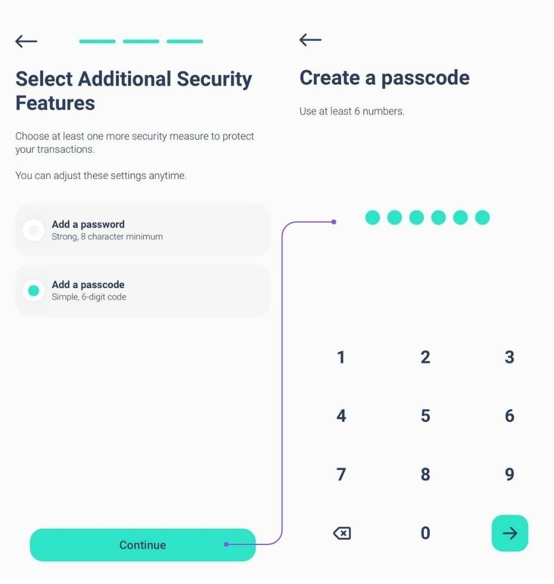
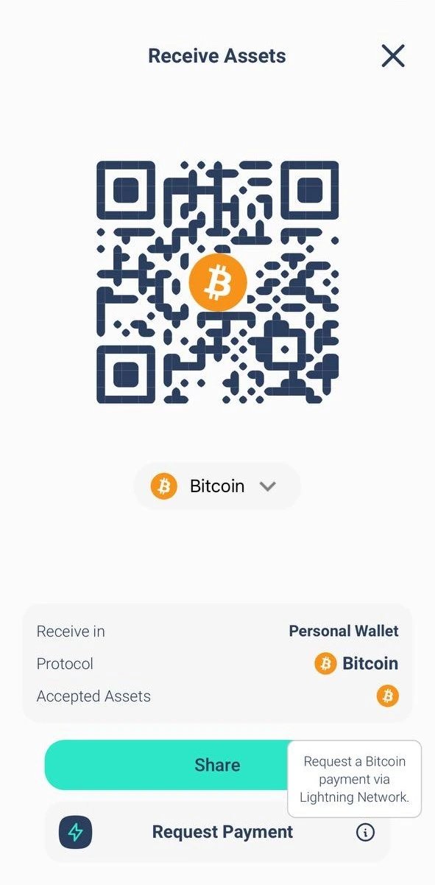

Elysium Wallet je první softwarová peněženka švýcarského startupu Elysium Labs.

Díky inovativnímu systému správy klíčů můžete ke svým digitálním aktivům přistupovat pomocí prvků, které jsou součástí každodenního života: uživatelského jména, přístupového klíče, hesla nebo přístupového kódu. Přesně tak: k opětovnému získání přístupu k vašim digitálním aktivům již není striktně nutné používat klíčovou frázi. Toto zjednodušení by mohlo urychlit rozšíření bitcoinu po celém světě.

## Jak si založit účet?

Stáhněte si aplikaci Elysium Wallet z obchodu Apple Store nebo Google Play a poté otevřete staženou aplikaci Elysium Wallet ve svém zařízení. Klepněte na "Vytvořit novou peněženku", v takovém okamžiku se objeví obrazovka s podmínkami používání. Chcete-li je přijmout a pokračovat ve vytváření účtu, klepněte na "Begin Setup" (Zahájit nastavení) a poté zadejte své uživatelské jméno; upozorňujeme, že profilový obrázek je možné přizpůsobit: vyberte si jeden z nabízených možností, pořízením fotografie nebo nahráním obrázku ze svého zařízení. Po výběru klepněte na "Pokračovat".

Elysium vyniká inovativním vícefaktorovým algoritmem, který kombinuje kódy Passkey, PassCode a PassWord. Klíče PassKey jsou povinné. Umožňují rychlé a bezpečné ověření pomocí vestavěných bezpečnostních funkcí zařízení, jako je Face ID nebo skenování otisků prstů. Jsou hlavní vrstvou ochrany a zajišťují rychlý a bezpečný přístup.

Vyberte si druhou úroveň: Dále je třeba zvolit druhou úroveň zabezpečení:

- PassCode: kód, který je snadno zapamatovatelný. Ideální pro přidání další vrstvy ochrany.
- Heslo: Vytvořte si silné heslo o minimálně 8 znacích, které ještě více zvýší bezpečnost.

Passkeys musíte používat ve spojení s PassCode nebo PassWord.

**Poznámka:** K nastavení účtu potřebujete alespoň 2 faktory, z nichž jeden musí být klíč Passkey.

Chcete-li dále zvýšit zabezpečení, můžete přidat třetí vrstvu ochrany (Passkey + PassCode + PassWord).

Kombinace vrstev pro maximální zabezpečení

Jako primární faktor budete vždy používat klíč Passkey. Pro druhou vrstvu zvolte PassCode nebo PassWord.

Pokud jste jako druhý faktor zvolili PassCode, můžete jako třetí vrstvu přidat PassWord nebo naopak. Tento flexibilní přístup zajistí, že vaše aktiva budou chráněna podle vašich preferencí.

Třetí bezpečnostní faktor můžete přidat během fáze nastavení (viz obrázky) nebo později v Nastavení > Zlepšit zabezpečení.

Pokud však na některý z faktorů zapomenete, vezměte to na vědomí:

Pokud jste nastavili všechny tři faktory, můžete je vždy změnit nebo obnovit v nastavení.

Pokud jste nastavili pouze dva faktory a jeden zapomenete, není bohužel možnost obnovy.

Důrazně doporučujeme nastavit všechny tři faktory od začátku, abyste dosáhli maximální bezpečnosti a flexibility.

## Jak přijmout transakci?

Otevřete aplikaci Elysium, přejděte do hlavní nabídky a klepněte na položku "Přijmout".

Nyní si vyberte řetězec, na kterém chcete platbu obdržet (Bitcoin nebo Polygon), a můžete jednoduše sdílet QR kód své peněženky Elysium s osobou, která vám má zaplatit, a ta se postará o zbytek.

## Jak přijmout transakci v síti Lightning Network?

**Krok 1:** Klepnutím na tlačítko "Request Payment" požádáte o platbu v bitcoinech prostřednictvím sítě Lightning Network.

**Krok 2:** Zadejte požadovanou částku, vyberte měnu, kterou chcete obdržet, a případně přidejte popis.

**Poznámka:** Za první platbu v síti Lightning Network (LN) je účtován malý poplatek za otevření kanálu LN. Poté jsou všechny další platby zdarma.

## Jak odeslat transakci?

**Krok 1:** Přejděte do hlavní nabídky a klepněte na "Odeslat".

**Krok 2:** Naskenujte QR kód příjemce z jeho peněženky Elysium a automaticky uložte jeho kontakt do svého adresáře. Případně ručně zkopírujte jeho adresu a vložte ji do pole příjemce. Po výběru příjemce nebo jeho přidání do adresáře klepněte na "Odeslat platbu".

Už máte kontakt? Vyberte jej přímo z adresáře.

**Krok 3:** Zadejte částku, kterou chcete odeslat, a vyberte aktivum, které chcete převést.

U transakcí BTC si můžete vybrat preferovanou rychlost sítě a poplatky (jak ukazuje třetí obrázek)

Vaše transakce byla odeslána! Aktuální zůstatek a stav transakce v peněžence Elysium můžete snadno zkontrolovat.

## Jak odeslat transakci v síti Lightning Network?

**Krok 1:** Klepnutím na "Scan" otevřete skener.

**Krok 2:** Naskenujte QR kód LN pro platbu.

**Krok 3:** Zkontrolujte platební údaje a potvrďte, že je vše v pořádku.

**Krok 4:** Klepnutím na "Potvrdit" transakci dokončíte.

## Jak zobrazit klíčovou frázi?

Přejděte do hlavní nabídky a klepněte na položku "Hub". Vyberte možnost Nastavení a klepněte na položku "Extrahovat soukromý klíč".

Přihlaste se pomocí přístupového klíče a zadejte heslo a/nebo přístupový kód. Počáteční fráze se zobrazí ve formátu 24 slov.

Nikomu ji nesdělujte!

## Jak kontaktovat podporu?

Potřebujete pomoc s aplikací Elysium Wallet? Jsme tu pro vás!

Stáhněte si aplikaci a zde se dozvíte, jak můžete kontaktovat náš tým zákaznické podpory přímo z aplikace:

1. Přejít na centrum

2. Klepněte na možnost Nastavení

3. Vyberte položku Nápověda

Zobrazí se formulář, ve kterém můžete popsat problém, který se u vás vyskytl.

Po odeslání vám náš tým co nejdříve odpoví a nabídne řešení!

Chcete-li nahlásit chybu nebo nám poskytnout zpětnou vazbu, klikněte na widget na domovské stránce:

