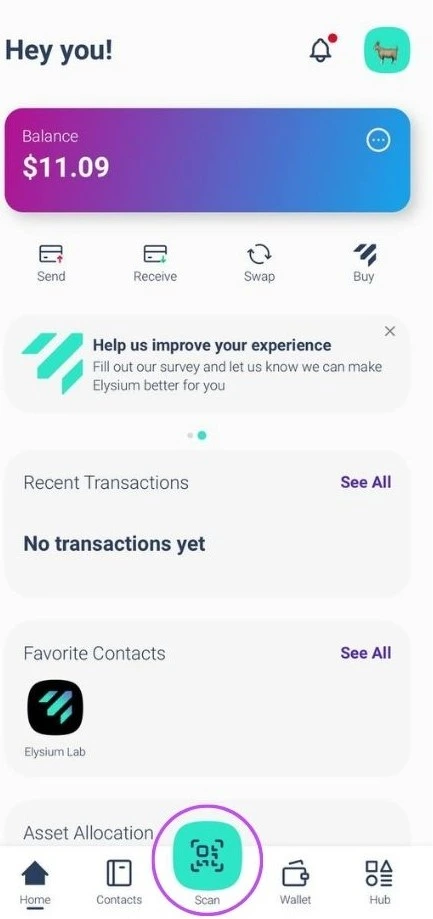

Elysium Wallet ist die erste nicht-pfändbare Software-Wallet des Schweizer Startup-Unternehmens Elysium Labs.

Dank des innovativen Schlüsselverwaltungssystems können Sie auf Ihre digitalen Bestände mit Elementen zugreifen, die für Sie alltäglich sind: Benutzername, Hauptschlüssel, Passwort oder Passcode. Das ist richtig: Es ist nicht mehr unbedingt notwendig, eine Seed Phrase zu verwenden, um wieder Zugang zu Ihren digitalen Vermögenswerten zu erhalten. Diese Vereinfachung könnte die Verbreitung von Bitcoin auf der ganzen Welt beschleunigen.

## Wie eröffne ich ein Konto?

Laden Sie die Elysium Wallet App aus dem Apple Store oder Google Play herunter und öffnen Sie dann die Elysium Wallet App, die Sie auf Ihr Gerät heruntergeladen haben. Tippen Sie auf "Create a new wallet" (Neue Brieftasche erstellen), dann erscheint der Bildschirm mit den Nutzungsbestimmungen. Um die Bedingungen zu akzeptieren und mit der Einrichtung Ihres Kontos fortzufahren, tippen Sie auf "Einrichtung beginnen" und geben Sie dann Ihren Benutzernamen ein; beachten Sie bitte, dass das Profilbild anpassbar ist: Wählen Sie eines aus den angebotenen Optionen, indem Sie ein Foto machen oder ein Bild von Ihrem Gerät hochladen. Wenn Sie Ihre Wahl getroffen haben, tippen Sie auf "Weiter".

Elysium zeichnet sich durch seinen innovativen Multi-Faktor-Algorithmus aus, der Passkey, PassCode und PassWord kombiniert. PassKeys sind obligatorisch. Sie ermöglichen Ihnen eine schnelle und sichere Authentifizierung mit den integrierten Sicherheitsfunktionen Ihres Geräts, wie Face ID oder Fingerabdruckscan. Sie sind Ihr wichtigster Schutz und gewährleisten einen schnellen und sicheren Zugang.

Wählen Sie die zweite Stufe: PassCode oder PassWord; als nächstes müssen Sie eine zweite Sicherheitsstufe wählen:

- PassCode: ein 6-stelliger Code, der leicht zu merken ist. Perfekt, um eine zusätzliche Sicherheitsebene zu schaffen.
- Passwort: Erstellen Sie ein sicheres Passwort mit mindestens 8 Zeichen, um die Sicherheit zu erhöhen.

Sie müssen Passkeys in Verbindung mit einem PassCode oder PassWord verwenden.

**Hinweis:** Um Ihr Konto einzurichten, benötigen Sie mindestens 2 Faktoren, von denen einer der Passkey sein muss.

Um die Sicherheit weiter zu erhöhen, können Sie eine dritte Schutzebene hinzufügen (Passkey + PassCode + PassWord).

Kombination von Schichten für maximale Sicherheit

Sie werden immer Passkey als primären Faktor verwenden. Für die zweite Ebene wählen Sie PassCode oder PassWord.

Wenn Sie PassCode als zweiten Faktor gewählt haben, können Sie PassWord als dritte Ebene hinzufügen oder umgekehrt. Durch diesen flexiblen Ansatz wird sichergestellt, dass Ihre Vermögenswerte entsprechend Ihren Präferenzen geschützt werden.

Sie können den dritten Sicherheitsfaktor während der Einrichtungsphase hinzufügen (siehe Bilder) oder später, indem Sie zu Einstellungen > Verbesserung der Sicherheit gehen.

Sollten Sie jedoch einen der Faktoren vergessen haben, beachten Sie dies bitte:

Wenn Sie alle drei Faktoren eingestellt haben, können Sie sie jederzeit in den Einstellungen ändern oder zurücksetzen.

Wenn Sie nur zwei Faktoren eingerichtet haben und einen vergessen, gibt es leider keine Möglichkeit zur Wiederherstellung.

Wir empfehlen dringend, alle drei Faktoren von Anfang an einzurichten, um maximale Sicherheit und Flexibilität zu gewährleisten.

## Wie kann ich eine Transaktion empfangen?

Öffnen Sie die Elysium-App und gehen Sie zum Hauptmenü, dann tippen Sie auf "Empfangen".

Wählen Sie nun die Kette aus, auf der Sie die Zahlung erhalten möchten (Bitcoin oder Polygon), und Sie können den QR-Code Ihrer Elysium-Brieftasche einfach an die Person weitergeben, die Sie bezahlen muss, und sie wird sich um den Rest kümmern.

## Wie empfängt man eine Transaktion im Lightning Network?

**Schritt 1:** Durch Tippen auf "Zahlung anfordern" fordern Sie eine Bitcoin-Zahlung über das Lightning Network an.

**Schritt 2:** Geben Sie den anzufordernden Betrag ein, wählen Sie die gewünschte Währung und fügen Sie gegebenenfalls eine Beschreibung hinzu.

**Hinweis:** Für die erste Lightning Network (LN)-Zahlung zur Eröffnung des LN-Kanals wird eine geringe Gebühr erhoben. Danach sind alle weiteren Zahlungen kostenlos.

## Wie versendet man eine Transaktion?

**Schritt 1:** Gehen Sie zum Hauptmenü und tippen Sie auf "Senden".

**Schritt 2:** Scannen Sie den QR-Code des Empfängers aus dessen Elysium Wallet, um den Kontakt automatisch in Ihrem Adressbuch zu speichern. Alternativ können Sie die Adresse auch manuell kopieren und in das Empfängerfeld einfügen. Nachdem Sie den Empfänger ausgewählt oder zu Ihrem Adressbuch hinzugefügt haben, tippen Sie auf "Zahlung senden".

Sie haben den Kontakt bereits? Wählen Sie ihn direkt aus dem Adressbuch aus.

**Schritt 3:** Geben Sie den Betrag ein, den Sie senden möchten, und wählen Sie den Vermögenswert aus, den Sie übertragen möchten.

Für BTC-Transaktionen können Sie Ihre bevorzugte Netzwerkgeschwindigkeit und die Gebühren auswählen (wie im dritten Bild gezeigt)

Ihre Transaktion wurde abgeschickt! Sie können den aktuellen Kontostand und den Transaktionsstatus Ihrer Elysium-Wallet ganz einfach überprüfen.

## Wie sende ich eine Transaktion im Lightning Network?

**Schritt 1:** Tippen Sie auf "Scannen", um den Scanner zu öffnen.

**Schritt 2:** Scannen Sie den LN-QR-Code für die Bezahlung.

**Schritt 3:** Überprüfen Sie die Zahlungsangaben und bestätigen Sie, dass alles korrekt ist.

**Schritt 4:** Tippen Sie auf "Bestätigen", um die Transaktion abzuschließen.

## Wie kann man die Seed Phrase sehen?

Gehen Sie zum Hauptmenü und tippen Sie auf "Hub". Wählen Sie Einstellungen und tippen Sie auf "Privaten Schlüssel extrahieren".

Melden Sie sich mit Ihrem Hauptschlüssel an und geben Sie Ihr Passwort und/oder Ihren Passcode ein. Die Seed-Phrase wird im 24-Wort-Format angezeigt.

Teilen Sie es mit niemandem!

## Wie kontaktiere ich den Support?

Benötigen Sie Hilfe mit Elysium Wallet? Wir sind hier, um zu helfen!

Laden Sie die App herunter, und hier erfahren Sie, wie Sie sich direkt von der App aus mit unserem Kundensupport in Verbindung setzen können:

1. Zum Hub gehen

2. Tippen Sie auf Einstellungen

3. Hilfe auswählen

Es wird ein Formular angezeigt, in dem Sie das Problem beschreiben können.

Unser Team wird Ihnen so schnell wie möglich eine Lösung anbieten!

Um einen Fehler zu melden oder uns ein Feedback zu geben, klicken Sie auf das Widget auf der Startseite:

