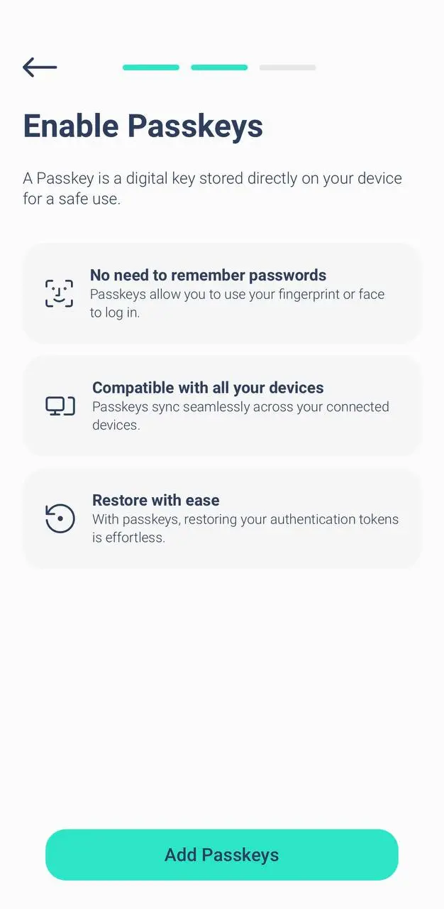
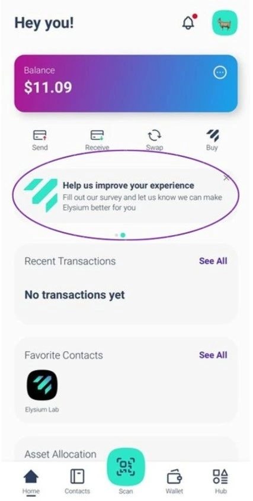

Elysium Wallet adalah dompet perangkat lunak non-kustodian pertama dari perusahaan rintisan Swiss, Elysium Labs.

Berkat sistem manajemen kunci yang inovatif, Anda dapat mengakses aset digital Anda menggunakan elemen-elemen yang merupakan bagian dari kehidupan sehari-hari: nama pengguna, kunci sandi, kata sandi, atau kode sandi. Benar: Anda tidak perlu lagi menggunakan Seed Phrase untuk mendapatkan kembali akses ke aset digital Anda. Penyederhanaan ini dapat mempercepat penyebaran Bitcoin ke seluruh dunia.

## Bagaimana cara membuka akun?

Unduh Aplikasi Elysium Wallet dari Apple Store atau Google Play, lalu buka aplikasi Elysium Wallet yang telah Anda unduh di perangkat Anda. Ketuk "Buat dompet baru", pada saat itu akan muncul layar syarat dan ketentuan penggunaan. Untuk menerima dan melanjutkan pembuatan akun Anda, ketuk "Mulai Pengaturan", lalu masukkan nama pengguna Anda; harap dicatat bahwa gambar profil dapat disesuaikan: pilih salah satu dari opsi yang disediakan, dengan mengambil foto atau mengunggah gambar dari perangkat Anda. Setelah memilih, ketuk "Lanjutkan".

Elysium menonjol karena algoritma multi-faktornya yang inovatif, yang menggabungkan Passkey, PassCode, dan PassWord. PassKeys wajib dimiliki. Kunci ini memungkinkan Anda untuk mengautentikasi dengan cepat dan aman menggunakan fitur keamanan bawaan perangkat Anda, seperti ID Wajah atau pemindaian sidik jari. Ini adalah lapisan perlindungan utama Anda, yang memastikan akses yang cepat dan aman.

Pilih tingkat kedua Anda: PassCode atau PassWord; selanjutnya, Anda harus memilih tingkat keamanan kedua:

- PassCode: kode 6 digit yang mudah diingat. Sempurna untuk menambahkan lapisan perlindungan ekstra.
- Kata Sandi: Buat kata sandi yang kuat, minimal 8 karakter, untuk menambah keamanan.

Anda harus menggunakan Passkey bersama dengan PassCode atau PassWord.

**Catatan:** Untuk mengatur akun Anda, Anda memerlukan setidaknya 2 faktor, salah satunya harus berupa Passkey.

Untuk lebih meningkatkan keamanan, Anda dapat menambahkan lapisan perlindungan ketiga (Passkey + PassCode + PassWord).

Kombinasi lapisan untuk keamanan maksimum

Anda akan selalu menggunakan Passkey sebagai faktor utama. Untuk lapisan kedua, pilih PassCode atau PassWord.

Jika Anda telah memilih PassCode sebagai faktor kedua, Anda bisa menambahkan PassWord sebagai lapisan ketiga atau sebaliknya. Pendekatan yang fleksibel ini memastikan bahwa aset Anda terlindungi sesuai dengan preferensi Anda.

Anda dapat menambahkan faktor keamanan ketiga selama tahap penyiapan (lihat gambar) atau setelahnya dengan membuka Pengaturan > Tingkatkan keamanan.

Namun demikian, jika Anda melupakan salah satu faktor, harap diperhatikan:

Jika Anda sudah menyiapkan ketiga faktor tersebut, Anda selalu dapat mengubah atau mengatur ulang dari pengaturan.

Sayangnya, jika Anda hanya menyiapkan dua faktor dan lupa satu faktor, tidak ada opsi pemulihan.

Kami sangat menyarankan untuk menyiapkan ketiga faktor tersebut dari awal untuk keamanan dan fleksibilitas maksimum.

## Bagaimana cara menerima transaksi?

Buka aplikasi Elysium dan masuk ke menu utama, lalu Ketuk 'Terima'.

Sekarang, pilih rantai yang Anda inginkan untuk menerima pembayaran (Bitcoin atau Polygon) dan Anda cukup membagikan kode QR dompet Elysium Anda kepada orang yang perlu membayar Anda, mereka akan mengurus sisanya.

## Bagaimana Cara Menerima Transaksi di Jaringan Lightning?

**Langkah 1:** Dengan mengetuk "Minta Pembayaran", Anda meminta pembayaran Bitcoin melalui Lightning Network.

**Langkah 2:** Masukkan jumlah yang ingin Anda minta, pilih mata uang yang ingin Anda terima, dan tambahkan deskripsi jika perlu.

**Catatan:** Ada sedikit biaya untuk pembayaran Lightning Network (LN) pertama untuk membuka saluran LN. Setelah itu, semua pembayaran berikutnya gratis.

## Bagaimana cara mengirim transaksi?

**Langkah 1:** Buka menu utama dan ketuk "Kirim".

**Langkah 2:** Pindai kode QR penerima dari Dompet Elysium mereka untuk secara otomatis menyimpan kontak mereka ke buku alamat Anda. Atau, salin alamat mereka secara manual dan tempelkan ke kolom penerima. Setelah memilih penerima atau menambahkannya ke buku alamat Anda, ketuk "Kirim Pembayaran".

Sudah memiliki kontak? Pilih langsung dari buku alamat.

**Langkah 3:** Masukkan jumlah yang ingin Anda kirim dan pilih aset yang ingin Anda transfer.

Untuk transaksi BTC, Anda bisa memilih kecepatan jaringan dan biaya yang Anda inginkan (seperti yang ditunjukkan pada gambar ketiga)

Transaksi Anda telah dikirimkan! Anda dapat dengan mudah memeriksa saldo dan status transaksi Elysium Wallet Anda yang telah diperbarui.

## Bagaimana cara mengirim transaksi di Lightning Network?

**Langkah 1:** Ketuk "Pindai" untuk membuka pemindai.

**Langkah 2:** Pindai kode QR LN untuk pembayaran.

**Langkah 3:** Tinjau kembali detail pembayaran dan pastikan semuanya sudah benar.

**Langkah 4:** Ketuk "Konfirmasi" untuk menyelesaikan transaksi.

## Bagaimana cara melihat Frasa Benih?

Buka menu utama dan ketuk "Hub". Pilih Pengaturan dan ketuk "Ekstrak kunci pribadi".

Masuk dengan kunci sandi dan masukkan kata sandi dan/atau kode sandi Anda. Frasa benih akan ditampilkan dalam format 24 kata.

Jangan bagikan dengan siapa pun!

## Bagaimana cara menghubungi dukungan?

Butuh bantuan dengan Elysium Wallet? Kami siap membantu!

Unduh Aplikasi, dan berikut ini cara Anda dapat menghubungi tim dukungan pelanggan kami secara langsung dari aplikasi:

1. Pergi ke Hub

2. Ketuk Pengaturan

3. Pilih Bantuan

Sebuah formulir akan muncul di mana Anda dapat menjelaskan masalah yang Anda alami.

Setelah diajukan, tim kami akan merespons sesegera mungkin dengan solusi!

Untuk melaporkan bug atau memberikan umpan balik kepada kami, klik widget di halaman beranda:

