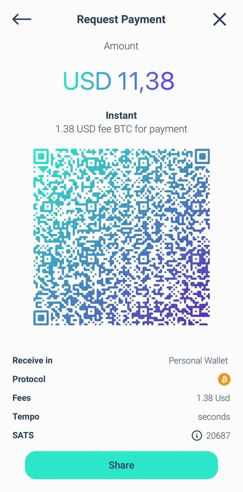

Elysium Wallet er den første programvarelommeboken som ikke er frihetsberøvende, fra det sveitsiske oppstartsselskapet Elysium Labs.

Takket være det innovative nøkkelhåndteringssystemet kan du få tilgang til de digitale eiendelene dine ved hjelp av elementer som er en del av hverdagen: brukernavn, passnøkkel, passord eller passordkode. Det stemmer: Det er ikke lenger strengt tatt nødvendig å bruke en Seed Phrase for å få tilgang til de digitale eiendelene dine. Denne forenklingen kan sette fart på spredningen av Bitcoin over hele verden.

## Hvordan åpne en konto?

Last ned Elysium Wallet-appen fra Apple Store eller Google Play, og åpne deretter Elysium Wallet-appen som du lastet ned på enheten din. Trykk på "Opprett en ny lommebok", og da vises skjermbildet med vilkår og betingelser for bruk. For å godta og fortsette med opprettelsen av kontoen din, trykk på "Start oppsett", og skriv deretter inn brukernavnet ditt; vær oppmerksom på at profilbildet kan tilpasses: velg et fra alternativene som tilbys, ved å ta et bilde eller laste opp et bilde fra enheten din. Når du har valgt, trykker du på "Fortsett".

Elysium skiller seg ut med sin innovative flerfaktoralgoritme, som kombinerer Passkey, PassCode og PassWord. PassKeys er obligatoriske. Med dem kan du autentisere deg raskt og sikkert ved hjelp av enhetens innebygde sikkerhetsfunksjoner, for eksempel Face ID eller fingeravtrykksskanning. De er det viktigste beskyttelseslaget ditt, og sørger for rask og sikker tilgang.

Velg det andre nivået: PassCode eller PassWord; deretter må du velge et andre sikkerhetsnivå:

- PassCode: 6-sifret kode som er lett å huske. Perfekt for å legge til et ekstra lag med beskyttelse.
- Passord: Opprett et sterkt passord på minst 8 tegn for å øke sikkerheten ytterligere.

Du må bruke Passkeys sammen med en PassCode eller PassWord.

**For å opprette kontoen din trenger du minst to faktorer, hvorav den ene må være passordet.

For å øke sikkerheten ytterligere kan du legge til et tredje lag med beskyttelse (Passkey + PassCode + PassWord).

Kombinasjon av lag for maksimal sikkerhet

Du vil alltid bruke Passkey som den primære faktoren. For det andre laget velger du PassCode eller PassWord.

Hvis du har valgt PassCode som den andre faktoren, kan du legge til PassWord som det tredje laget, eller omvendt. Denne fleksible tilnærmingen sikrer at ressursene dine er beskyttet i henhold til dine preferanser.

Du kan legge til den tredje sikkerhetsfaktoren under installasjonsfasen (se bilder) eller senere ved å gå til Innstillinger > Forbedre sikkerhet.

Men hvis du glemmer en av faktorene, må du være oppmerksom på det:

Hvis du har konfigurert alle tre faktorene, kan du alltid endre eller tilbakestille dem fra innstillingene.

Hvis du bare har satt opp to faktorer og glemmer én, er det dessverre ingen mulighet for gjenoppretting.

Vi anbefaler på det sterkeste at du konfigurerer alle tre faktorene fra begynnelsen av for å oppnå maksimal sikkerhet og fleksibilitet.

## Hvordan mottar jeg en transaksjon?

Åpne Elysium-appen og gå til hovedmenyen, og trykk deretter på "Motta".

Nå velger du kjeden du vil motta betaling på (Bitcoin eller Polygon), og du kan ganske enkelt dele QR-koden til Elysium-lommeboken din med personen som trenger å betale deg, så tar de seg av resten.

## Hvordan motta en transaksjon i Lightning Network?

**Trinn 1:** Ved å trykke på "Be om betaling" ber du om en Bitcoin-betaling via Lightning Network.

**Trinn 2:** Angi beløpet du vil be om, velg valutaen du vil motta, og legg til en beskrivelse hvis det er nødvendig.

**Merk:** Det er en liten avgift for den første Lightning Network (LN)-betalingen for å åpne LN-kanalen. Etter det er alle påfølgende betalinger gratis.

## Hvordan sender jeg en transaksjon?

**Trinn 1:** Gå til hovedmenyen og trykk på "Send".

**Trinn 2:** Skann mottakerens QR-kode fra Elysium Wallet for å lagre kontakten automatisk i adresseboken din. Alternativt kan du kopiere adressen manuelt og lime den inn i mottakerfeltet. Når du har valgt mottakeren eller lagt dem til i adresseboken, trykker du på "Send betaling".

Har du allerede kontakten? Velg den direkte fra adresseboken.

**Trinn 3:** Angi beløpet du vil sende, og velg eiendelen du vil overføre.

For BTC-transaksjoner kan du velge ønsket nettverkshastighet og avgifter (som vist i det tredje bildet)

Transaksjonen din har blitt sendt inn! Du kan enkelt sjekke den oppdaterte saldoen og transaksjonsstatusen til Elysium Wallet.

## Hvordan sender jeg en transaksjon i Lightning Network?

**Trinn 1:** Trykk på "Scan" for å åpne skanneren.

**Trinn 2:** Skann LN QR-koden for betaling.

**Trinn 3:** Gå gjennom betalingsopplysningene og bekreft at alt er korrekt.

**Trinn 4:** Trykk på "Bekreft" for å fullføre transaksjonen.

## Hvordan se Seed Phrase?

Gå til hovedmenyen og trykk på "Hub". Velg Innstillinger og trykk på "Pakk ut privat nøkkel".

Logg inn med passordet ditt, og skriv inn passordet og/eller passordet ditt. Seed-frasen vises i 24 ords format.

Ikke del den med noen!

## Hvordan kontakter jeg kundestøtte?

Trenger du hjelp med Elysium Wallet? Vi er her for å hjelpe deg!

Last ned appen, og her kan du se hvordan du kan kontakte kundestøtteteamet vårt direkte fra appen:

1. Gå til Hub

2. Trykk på Innstillinger

3. Velg Hjelp

Du får opp et skjema der du kan beskrive problemet du opplever.

Når du har sendt inn en forespørsel, vil teamet vårt svare så snart som mulig med en løsning!

Hvis du vil rapportere en feil eller gi oss tilbakemeldinger, klikker du på widgeten på startsiden:

