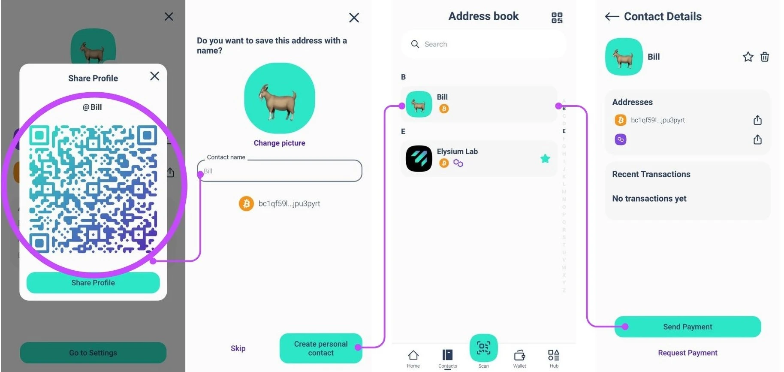

A Elysium Wallet é a primeira carteira de software sem custódia da startup suíça Elysium Labs.

Graças ao inovador sistema de gestão de chaves, pode aceder aos seus bens digitais utilizando elementos que fazem parte da sua vida quotidiana: o seu nome de utilizador, a sua chave de acesso, a sua palavra-passe ou o seu código de acesso. É isso mesmo: já não é estritamente necessário utilizar uma Seed Phrase para voltar a ter acesso aos seus activos digitais. Esta simplificação pode acelerar a difusão da Bitcoin em todo o mundo.

## Como abrir uma conta?

Transfira a aplicação Elysium Wallet da Apple Store ou do Google Play e, em seguida, abra a aplicação Elysium Wallet que transferiu para o seu dispositivo. Toque em "Criar uma nova carteira" e, nessa altura, aparecerá o ecrã dos termos e condições de utilização. Para aceitar e prosseguir com a criação da sua conta, toque em "Iniciar configuração" e, em seguida, introduza o seu nome de utilizador; tenha em atenção que a imagem de perfil é personalizável: escolha uma das opções fornecidas, tirando uma fotografia ou carregando uma imagem do seu dispositivo. Quando tiver escolhido, toque em "Continuar".

O Elysium destaca-se pelo seu algoritmo multifactor inovador, que combina Passkey, PassCode e PassWord. As PassKeys são obrigatórias. Permitem-lhe autenticar-se de forma rápida e segura utilizando as funcionalidades de segurança incorporadas no seu dispositivo, como o Face ID ou a leitura de impressões digitais. São a sua principal camada de proteção, garantindo um acesso rápido e seguro.

Escolha o seu segundo nível: PassCode ou PassWord; de seguida, terá de escolher um segundo nível de segurança:

- PassCode: código de 6 dígitos que é fácil de memorizar. Perfeito para adicionar uma camada extra de proteção.
- Palavra-passe: Crie uma palavra-passe forte com, pelo menos, 8 caracteres, para aumentar ainda mais a segurança.

As chaves de acesso devem ser utilizadas em conjunto com um código de acesso ou uma palavra-passe.

**Nota:** Para criar a sua conta, precisa de pelo menos 2 factores, um dos quais tem de ser a Passkey.

Para aumentar ainda mais a segurança, pode adicionar uma terceira camada de proteção (Passkey + PassCode + PassWord).

Combinação de camadas para máxima segurança

Utilizará sempre a Passkey como fator primário. Para a segunda camada, escolha PassCode ou PassWord.

Se escolheu o PassCode como segundo fator, pode adicionar o PassWord como terceira camada ou vice-versa. Esta abordagem flexível garante que os seus activos são protegidos de acordo com as suas preferências.

Pode adicionar o terceiro fator de segurança durante a fase de configuração (ver imagens) ou mais tarde, indo a Definições > Melhorar a segurança.

No entanto, se se esquecer de um dos factores, tenha isso em atenção:

Se tiver configurado os três factores, pode sempre alterá-los ou redefini-los a partir das definições.

Infelizmente, se tiver configurado apenas dois factores e se esquecer de um, não existe qualquer opção de recuperação.

Recomendamos vivamente a configuração dos três factores desde o início para obter a máxima segurança e flexibilidade.

## Como receber uma transação?

Abra a aplicação Elysium e aceda ao menu principal, depois toque em "Receber".

Agora, selecione a cadeia em que quer receber o pagamento (Bitcoin ou Polygon) e pode simplesmente partilhar o código QR da sua carteira Elysium com a pessoa que precisa de lhe pagar, que ela tratará do resto.

## Como receber uma transação na Lightning Network?

**Passo 1:** Ao tocar em "Request Payment" (Pedir pagamento) está a pedir um pagamento Bitcoin através da Lightning Network.

**Passo 2:** Introduza o montante que pretende solicitar, selecione a moeda que pretende receber e adicione uma descrição, se necessário.

**Nota:** Existe uma pequena taxa para o primeiro pagamento Lightning Network (LN) para abrir o canal LN. Depois disso, todos os pagamentos subsequentes são gratuitos.

## Como enviar uma transação?

**Passo 1:** Aceda ao menu principal e toque em "Enviar".

**Passo 2:** Digitalize o código QR do destinatário a partir da sua carteira Elysium para guardar automaticamente o seu contacto no seu livro de endereços. Em alternativa, copie manualmente o endereço do destinatário e cole-o no campo do destinatário. Depois de selecionar o destinatário ou de o adicionar ao seu livro de endereços, toque em "Enviar pagamento".

Já tem o contacto? Escolha-o diretamente a partir do livro de endereços.

**Passo 3:** Introduza o montante que pretende enviar e selecione o ativo que pretende transferir.

Para transacções BTC, pode selecionar a velocidade e as taxas da sua rede preferida (como mostra a terceira imagem)

A sua transação foi submetida! Pode facilmente verificar o saldo atualizado da sua carteira Elysium e o estado da transação.

## Como enviar uma transação na Lightning Network?

**Passo 1:** Toque em "Digitalizar" para abrir o scanner.

**Passo 2:** Digitalizar o código QR do LN para efetuar o pagamento.

**Passo 3:** Reveja os detalhes do pagamento e confirme se tudo está correto.

**Passo 4:** Toque em "Confirmar" para concluir a transação.

## Como ver a frase-semente?

Aceda ao menu principal e toque em "Hub". Selecione Definições e toque em "Extrair chave privada".

Inicie sessão com a sua chave de acesso e introduza a sua palavra-passe e/ou código de acesso. A frase-semente será apresentada no formato de 24 palavras.

Não o partilhe com ninguém!

## Como contactar o apoio?

Precisa de ajuda com a carteira Elysium? Estamos aqui para o ajudar!

Descarregue a aplicação e veja como pode contactar a nossa equipa de apoio ao cliente diretamente a partir da aplicação:

1. Ir para o Hub

2. Toque em Definições

3. Selecionar Ajuda

Aparecerá um formulário onde pode descrever o problema que está a ter.

Uma vez enviado, a nossa equipa responderá o mais rapidamente possível com uma solução!

Para comunicar um erro ou dar-nos a sua opinião, clique no widget na página inicial:

