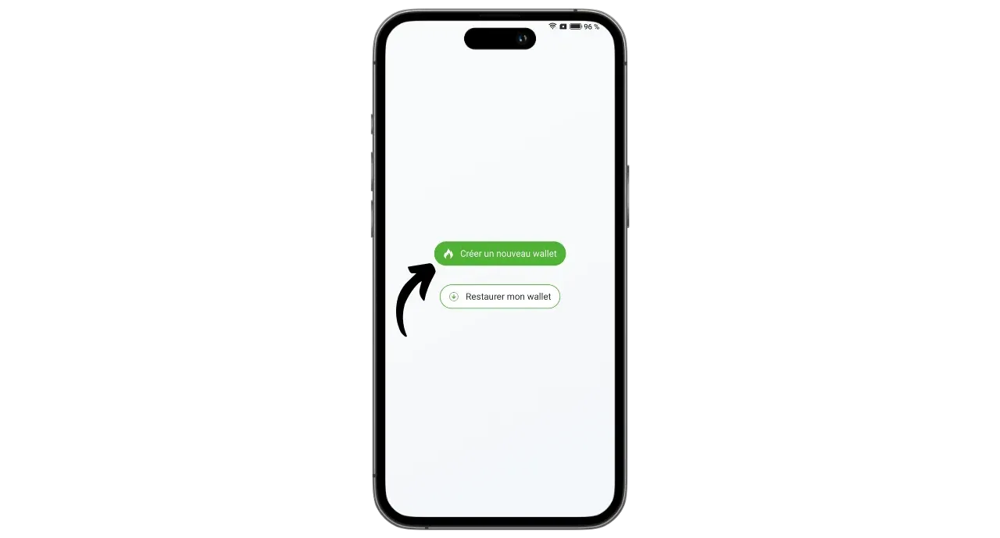
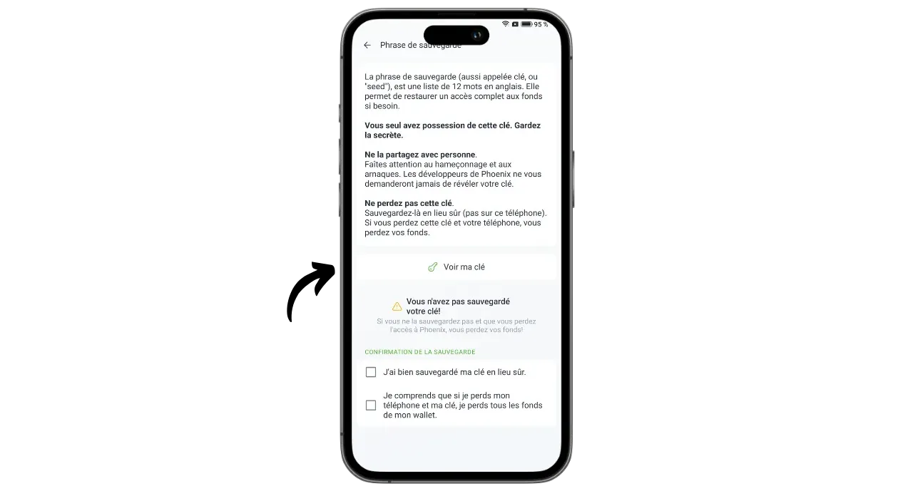
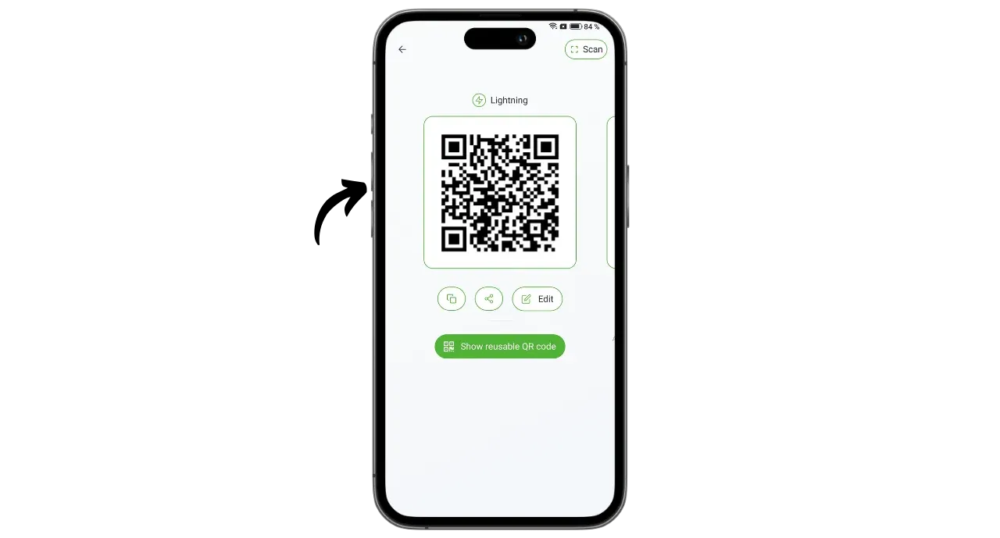

Phoenix je samostatná peněženka a uzel Lightning vyvinutý francouzskou společností ACINQ, která se specializuje na softwarová řešení založená na technologii Lightning. Na rozdíl od custodial Lightning peněženek, jako je například Wallet of Satoshi, kde jsou bitcoiny v držení třetí strany, Phoenix umožňuje uživatelům ponechat si plnou kontrolu nad svými soukromými klíči.

Phoenix funguje jako skutečný Lightning uzel integrovaný do vašeho telefonu, který automaticky otevře kanál s Lightning uzlem ACINQ. Aplikace je založena na Lightning-KMP, multiplatformní implementaci Lightning Network v jazyce Kotlin, optimalizované pro mobilní peněženky. Na rozdíl od jiných Lightning uzlů Phoenix výrazně zjednodušuje správu. Uživatel nemusí spravovat otevírání a zavírání kanálů, provozovat Bitcoin uzel nebo spravovat likviditu v síti Lightning. Phoenix se o všechny tyto technické operace stará na pozadí.

Tato aplikace kombinuje snadné používání a pohodlí mobilních peněženek Lightning s bezpečností a suverenitou skutečného osobního uzlu Lightning. Phoenix umožňuje bezpečně, efektivně a autonomně používat síť Lightning a zároveň využívat plynulé a intuitivní uživatelské prostředí.

Na oplátku jsou účtovány určité poplatky:

- Odeslání přes Lightning stojí 0,4 % z částky plus 4 sats ;
- Pokud je pro příjem prostřednictvím služby Lightning potřeba hotovost, účtuje se 1 % z částky;
- Otevření každého kanálu stojí 1000 satelitů.

Podle mého názoru představuje Phoenix vynikající mezistupeň mezi portfolii Lightning v úschově a ruční správou uzlu Lightning. Tato aplikace je stejně vhodná pro začátečníky i pokročilé uživatele, kteří se raději nechtějí zabývat detaily správy vlastního LND nebo jádra Lightning. Pojďme zjistit, jak ji používat!

## Instalace aplikace

Přejděte do obchodu s aplikacemi a nainstalujte si aplikaci Phoenix :

- V [Obchodě Google Play](https://play.google.com/store/apps/details?id=fr.acinq.phoenix.mainnet);
- V [App Store](https://apps.apple.com/fr/app/phoenix-wallet/id1544097028?l=en-GB).

Aplikaci můžete také nainstalovat [pomocí souboru apk v jejich úložišti GitHub](https://github.com/ACINQ/phoenix/releases).

## Vytvoření portfolia

Po spuštění aplikace klikněte na tlačítko "*Další*" pro přeskočení prezentace a poté na "*Spustit*".

Vyberte možnost "*Vytvořit novou peněženku*".

A to je vše, vaše peněženka Lightning a uzel jsou nyní vytvořeny.

## Uložit mnemotechnickou frázi

Než začneme, musíme si uložit naši mnemotechnickou frázi o 12 slovech. Tato fráze vám umožní úplný a neomezený přístup ke všem vašim bitcoinům. Kdokoli, kdo tuto frázi vlastní, může vaše prostředky ukrást, a to i bez fyzického přístupu k vašemu telefonu.

Fráze o 12 slovech obnoví přístup k bitcoinům v případě ztráty, krádeže nebo rozbití telefonu. Je proto velmi důležité ji pečlivě uložit a uložit na bezpečném místě.

Můžete ho napsat na papír nebo pro větší bezpečnost vyrýt na nerezovou ocel, která ho ochrání před požárem, povodní nebo zřícením. Volba média pro mnemotechnickou pomůcku bude záviset na vaší bezpečnostní strategii, ale pokud používáte Fénix jako výdajové portfolio obsahující mírné částky, měl by papír stačit.

Pro více informací o správném způsobu ukládání a správy mnemotechnických frází vřele doporučuji sledovat tento další návod, zejména pokud jste začátečníci:

https://planb.network/tutorials/wallet/backup/backup-mnemonic-22c0ddfa-fb9f-4e3a-96f9-46e2a7954270

Klikněte na zprávu zobrazenou v horní části rozhraní "*Uložit peněženku...*".

Poté klikněte na "*Uložit mou peněženku*".

Poté klikněte na "*Zobrazit můj klíč*" a uložte svou mnemotechnickou frázi na fyzické médium.

Zaškrtnutím dvou políček v dolní části rozhraní potvrďte, že zálohování bylo úspěšně dokončeno.

## Nastavení aplikace

Před provedením prvních transakcí můžete upravit nastavení kliknutím na ikonu ozubeného kolečka v levém dolním rohu rozhraní.

V nabídce "*Zobrazení*" můžete zvolit téma aplikace, nominální hodnotu bitcoinu a místní fiat měnu.

V části "*Možnosti platby*" najdete různá pokročilá nastavení pro platby Lightning. Výchozí nastavení můžete ponechat.

V části "*Správa kanálů*" nastavte maximální poplatek, který jste ochotni zaplatit při otevření kanálu Lightning.

V nabídce "*Řízení přístupu*" důrazně doporučuji aktivovat systém ověřování pro zabezpečení přístupu k aplikaci v telefonu. Tím zabráníte tomu, aby kdokoli s přístupem k vašemu odemčenému telefonu získal přístup k aplikaci Phoenix a ukradl vaše bitcoiny.

V nabídce "*Electrum server*", pokud máte server Electrs, můžete jej připojit k vysílání transakcí.

Chcete-li zvýšit důvěrnost svých připojení, povolte připojení přes Tor v nabídce "*Tor*". Přestože používání Toru může mírně zpomalit platby a vyžaduje, aby byla aplikace Phoenix při příjmu otevřena v popředí, výrazně zvyšuje vaše soukromí.

## Příjem bitcoinů v řetězci

Při prvním použití máte možnost nabít peněženku Phoenix penězi v řetězci. Tento první vklad můžete provést také přímo z Lightningu (viz další část), ale v obou případech se za otevření prvního kanálu platí další poplatky.

Klikněte na tlačítko "*Přijmout*".

Přejetím QR kódu doprava se zobrazí adresa pro příjem bitcoinů. Pošlete na ni částku, kterou si přejete vložit do Phoenixu.

Částka přijatá v řetězci se nejprve zobrazí jako čekající na vyřízení v rámci zůstatku vašeho portfolia. Potrvá 3 potvrzení, než budou prostředky k dispozici k použití.

Po obdržení prostředků vám společnost Phoenix automaticky otevře kanál Lightning. Nyní můžete posílat a přijímat bitcoiny prostřednictvím sítě Lightning.

## Příjem bitcoinů přes Lightning

Chcete-li přijímat satelity prostřednictvím sítě Lightning, klikněte na tlačítko "*Přijímat*".

Phoenix vygeneruje fakturu Lightning. Můžete ji buď naskenovat, nebo poslat osobě, která si přeje převést saty na vás.

Kliknutím na tlačítko "*Upravit*" můžete přidat popis, který bude plátce na faktuře vidět, a definovat konkrétní částku, kterou musí plátce odeslat.

Výše uvedené klasické faktury lze použít pouze jednou. Pro možnost opakované platby můžete použít svůj opakovaně použitelný QR kód, který je součástí nabídky BOLT12.

Po uhrazení faktury nebo nabídky BOLT12 se transakce objeví ve vaší bleskové peněžence.

## Odesílání bitcoinů přes Lightning

Nyní, když máte sats v systému Phoenix, jste připraveni provádět platby prostřednictvím sítě Lightning Network. Začněte kliknutím na tlačítko "*Odeslat*".

Máte k dispozici několik možností. Kliknutím na "*Scan QR code*" můžete naskenovat fakturu Lightning, nabídku BOLT12 nebo dokonce přijímací adresu pro platbu v řetězci.

Tyto informace můžete také zadat ručně pomocí klávesnice do pole v horní části rozhraní nebo zadat adresu Lightning (BOLT12 nebo LNURL). Informace můžete také vložit přímo pomocí tlačítka "*Vložit*".

V tomto příkladu jsem naskenoval fakturu na 10 000 sátů. Pro provedení platby stačí kliknout na "*Platit*".

Transakce je dokončena.

Gratulujeme, nyní víte, jak konfigurovat a používat aplikaci Phoenix. Pokud pro vás byl tento návod užitečný, budu vám vděčný, když mi níže zanecháte zelený palec. Neváhejte tento článek sdílet na svých sociálních sítích. Děkujeme za sdílení!

Chcete-li se posunout o krok dál, podívejte se na tento návod na Alby Hub, další inovativní a snadno použitelné řešení pro spuštění vlastního uzlu Lightning:

https://planb.network/tutorials/node/lightning-network/alby-hub-62e6356c-6a6d-4134-8f22-c3b6afb9882a

Chcete-li se dozvědět více o technickém fungování sítě Lightning Network, najdete vynikající bezplatné školení Fanise Michalakise na téma Plan ₿ Network :

https://planb.network/courses/34bd43ef-6683-4a5c-b239-7cb1e40a4aeb
