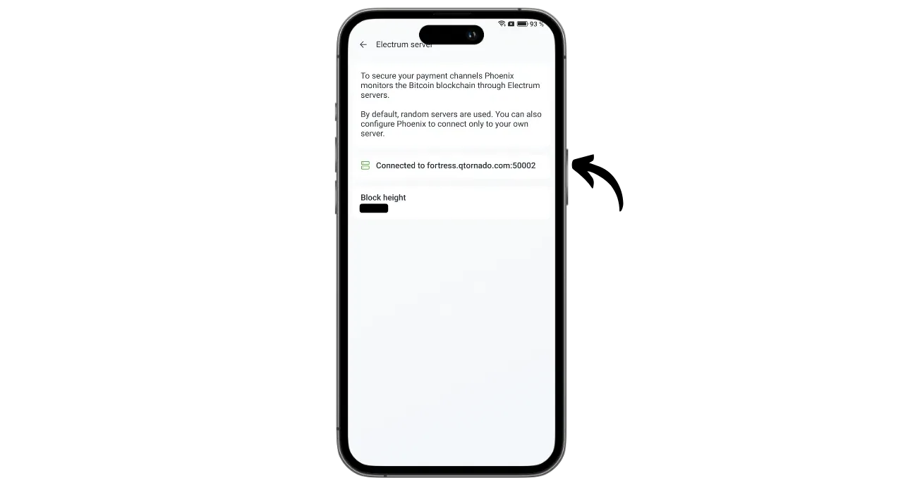

Phoenix ist eine selbstverwahrende Lightning-Wallet und ein Node, entwickelt von ACINQ, einem französischen Unternehmen, das sich auf Lightning-basierte Softwarelösungen spezialisiert hat. Im Gegensatz zu verwahrten Lightning-Wallets wie Wallet of Satoshi, bei denen die Bitcoins von einer dritten Partei gehalten werden, ermöglicht Phoenix den Nutzern, die volle Kontrolle über ihre privaten Schlüssel zu behalten.

Phoenix funktioniert wie ein echter Lightning-Knoten, der auf Ihrem Telefon integriert ist und automatisch einen Kanal mit dem Lightning-Knoten von ACINQ öffnet. Die Anwendung basiert auf Lightning-KMP, einer plattformübergreifenden Implementierung des Lightning Network in Kotlin, die für mobile Wallets optimiert ist. Im Gegensatz zu anderen Lightning-Knoten vereinfacht Phoenix das Management erheblich. Der Benutzer muss sich nicht um das Öffnen und Schließen von Kanälen kümmern, keinen eigenen Bitcoin-Knoten betreiben oder seine Liquidität im Lightning-Netzwerk verwalten. Phoenix übernimmt all diese technischen Prozesse im Hintergrund.

Diese Anwendung kombiniert die Benutzerfreundlichkeit und den Komfort mobiler Lightning-Wallets mit der Sicherheit und Souveränität eines echten persönlichen Lightning-Knotens. Phoenix ermöglicht eine sichere, effiziente und autonome Nutzung des Lightning-Netzwerks mit einem flüssigen, intuitiven Benutzererlebnis.

Im Gegenzug fallen bestimmte Gebühren an:

- Der Blitzversand kostet 0,4% des Betrages plus 4 Sats;
- Wenn Bargeld für den Empfang per Lightning benötigt wird, wird 1 % des Betrags berechnet;
- Jeder Kanal kostet 1000 Sats, um geöffnet zu werden.

Meiner Meinung nach stellt Phoenix eine hervorragende Zwischenlösung zwischen verwahrten Lightning-Portfolios und der manuellen Verwaltung eines Lightning-Knotens dar. Diese Anwendung eignet sich gleichermaßen für Anfänger und fortgeschrittene Nutzer, die sich nicht mit den Details der Verwaltung ihres eigenen LND oder Core Lightning befassen möchten. Lassen Sie uns herausfinden, wie man es benutzt!

## Installieren Sie die Anwendung

Gehen Sie zu Ihrem Anwendungsspeicher und installieren Sie Phoenix :

- Im [Google Play Store] (https://play.google.com/store/apps/details?id=fr.acinq.phoenix.mainnet);
- Im [App Store] (https://apps.apple.com/fr/app/phoenix-wallet/id1544097028?l=en-GB).

Sie können die Anwendung auch [mit der apk-Datei aus dem GitHub-Repository] installieren (https://github.com/ACINQ/phoenix/releases).

## Erstellung eines Portfolios

Sobald die Anwendung gestartet ist, klicken Sie auf die Schaltfläche "*Weiter*", um die Präsentation zu überspringen, und dann auf "*Start*".

Wählen Sie "*Eine neue Brieftasche erstellen*".

Und das war's. Ihre Lightning-Brieftasche und Ihr Knoten sind nun erstellt.

## Mnemonische Phrase speichern

Bevor wir loslegen, müssen wir unsere 12-Wort-Merkhilfe speichern. Diese Phrase gibt Ihnen vollständigen, uneingeschränkten Zugriff auf alle Ihre Bitcoins. Jeder, der im Besitz dieser Phrase ist, kann Ihr Geld stehlen, auch ohne physischen Zugriff auf Ihr Telefon.

Die 12-Wort-Phrase stellt den Zugang zu Ihren Bitcoins im Falle von Verlust, Diebstahl oder Bruch Ihres Telefons wieder her. Es ist daher sehr wichtig, sie sorgfältig zu speichern und an einem sicheren Ort aufzubewahren.

Sie können ihn auf Papier schreiben oder für zusätzliche Sicherheit in Edelstahl eingravieren, um ihn vor Feuer, Überschwemmung oder Einsturz zu schützen. Die Wahl des Mediums für Ihre Eselsbrücke hängt von Ihrer Sicherheitsstrategie ab, aber wenn Sie Phoenix als Ausgabenportfolio mit moderaten Beträgen verwenden, sollte Papier ausreichend sein.

Für weitere Informationen über die richtige Art und Weise, wie Sie Ihre mnemotechnische Phrase speichern und verwalten können, empfehle ich Ihnen, diese andere Anleitung zu lesen, insbesondere wenn Sie Anfänger sind:

https://planb.network/tutorials/wallet/backup/backup-mnemonic-22c0ddfa-fb9f-4e3a-96f9-46e2a7954270

Klicken Sie auf die oben auf der Oberfläche angezeigte Meldung "*Speichern Sie Ihre Brieftasche...*".

Klicken Sie dann auf "*Meine Brieftasche retten*".

Klicken Sie dann auf "*Meinen Schlüssel anzeigen*" und speichern Sie Ihre mnemotechnische Phrase auf einem physischen Medium.

Überprüfen Sie die beiden Kästchen am unteren Rand der Benutzeroberfläche, um zu bestätigen, dass die Sicherung erfolgreich abgeschlossen wurde.

## Einrichtung der Anwendung

Bevor Sie Ihre ersten Transaktionen durchführen, können Sie die Einstellungen anpassen, indem Sie auf das Zahnradsymbol unten links auf der Benutzeroberfläche klicken.

Im Menü "*Anzeige*" können Sie das Thema der Anwendung, den für Bitcoin verwendeten Nennwert und Ihre lokale Fiat-Währung auswählen.

Unter "*Zahlungsoptionen*" finden Sie verschiedene erweiterte Einstellungen für Blitzzahlungen. Sie können die Standardeinstellungen beibehalten.

Legen Sie unter "*Kanalverwaltung*" die maximale Gebühr fest, die Sie für die Eröffnung eines Lightning-Kanals zu zahlen bereit sind.

Im Menü "*Zugriffskontrolle*" empfehle ich Ihnen dringend, ein Authentifizierungssystem zu aktivieren, um den Zugriff auf die Anwendung auf Ihrem Telefon zu sichern. Dadurch wird verhindert, dass jemand, der Zugang zu Ihrem nicht gesperrten Telefon hat, auf Phoenix zugreift und Ihre Bitcoins stiehlt.

Im Menü "*Electrum-Server*" können Sie, wenn Sie einen Electrs-Server haben, diesen verbinden, um Ihre Transaktionen zu übertragen.

Um die Vertraulichkeit Ihrer Verbindungen zu erhöhen, aktivieren Sie Verbindungen über Tor im Menü "*Tor*". Obwohl die Verwendung von Tor Ihre Zahlungen etwas verlangsamen kann und die Phoenix-Anwendung beim Empfang im Vordergrund geöffnet sein muss, wird dadurch Ihre Privatsphäre erheblich verbessert.

## Bitcoins on-chain empfangen

Bei der ersten Nutzung haben Sie die Möglichkeit, Ihre Phoenix-Geldbörse mit On-Chain-Geldern aufzuladen. Sie können diese erste Einzahlung auch direkt von Lightning aus vornehmen (siehe nächster Abschnitt), aber in beiden Fällen fallen zusätzliche Gebühren für die Eröffnung Ihres ersten Kanals an.

Klicken Sie auf die Schaltfläche "*Empfangen*".

Wischen Sie den QR-Code nach rechts, um eine Bitcoin-Empfangsadresse anzuzeigen. Senden Sie ihr den Betrag, den Sie bei Phoenix einzahlen möchten.

Der auf der Kette erhaltene Betrag wird zunächst als ausstehend unter Ihrem Portfoliosaldo angezeigt. Es dauert 3 Bestätigungen, bevor die Mittel zur Verfügung stehen.

Sobald das Geld eingegangen ist, öffnet Phoenix automatisch einen Lightning-Kanal für Sie. Sie können nun Bitcoins über das Lightning-Netzwerk senden und empfangen.

## Bitcoins über Lightning empfangen

Um Sats über das Lightning Network zu empfangen, klicken Sie auf die Schaltfläche "*Empfangen*".

Phoenix erstellt eine Lightning-Rechnung. Sie können sie entweder einscannen oder an die Person senden, die Ihnen Sats überweisen möchte.

Wenn Sie auf die Schaltfläche "*Bearbeiten*" klicken, können Sie eine Beschreibung hinzufügen, die für den Zahlungspflichtigen auf der Rechnung sichtbar ist, und einen bestimmten Betrag festlegen, den der Zahlungspflichtige senden muss.

Die oben genannten klassischen Rechnungen können nur einmal verwendet werden. Für eine wiederverwendbare Zahlungsoption können Sie Ihren wiederverwendbaren QR-Code verwenden, der ein Angebot von BOLT12 ist.

Sobald die Rechnung oder das BOLT12-Angebot beglichen ist, wird die Transaktion in Ihrer Lightning-Geldbörse angezeigt.

## Bitcoins über Lightning versenden

Jetzt, wo Sie sats auf Phoenix haben, sind Sie bereit, Zahlungen über das Lightning Network zu tätigen. Beginnen Sie mit einem Klick auf die Schaltfläche "*Senden*".

Es stehen Ihnen mehrere Optionen zur Verfügung. Wenn Sie auf "*QR-Code scannen*" klicken, können Sie eine Lightning-Rechnung, ein BOLT12-Angebot oder sogar eine Empfangsadresse für eine On-Chain-Zahlung scannen.

Sie können diese Informationen auch manuell über die Tastatur in das Feld am oberen Rand der Schnittstelle eingeben oder eine Lightning-Adresse (BOLT12 oder LNURL) eingeben. Sie können die Informationen auch direkt über die Schaltfläche "*Einfügen*" einfügen.

In diesem Beispiel habe ich eine Rechnung über 10.000 Sats eingescannt. Um die Zahlung vorzunehmen, klicken Sie einfach auf "*Bezahlen*".

Die Transaktion ist abgeschlossen.

Herzlichen Glückwunsch, Sie wissen jetzt, wie Sie Phoenix konfigurieren und verwenden können. Wenn Sie dieses Tutorial nützlich fanden, wäre ich Ihnen dankbar, wenn Sie unten einen grünen Daumen hinterlassen würden. Sie können diesen Artikel auch gerne in Ihren sozialen Netzwerken teilen. Vielen Dank fürs Teilen!

Wenn Sie noch einen Schritt weiter gehen möchten, sehen Sie sich dieses Tutorial zu Alby Hub an, einer weiteren innovativen und benutzerfreundlichen Lösung für den Start Ihres eigenen Lightning-Knotens:

https://planb.network/tutorials/node/lightning-network/alby-hub-62e6356c-6a6d-4134-8f22-c3b6afb9882a

Und wenn Sie mehr über die technische Funktionsweise des Lightning Network erfahren möchten, finden Sie das ausgezeichnete kostenlose Training von Fanis Michalakis zum Plan ₿ Network :

https://planb.network/courses/34bd43ef-6683-4a5c-b239-7cb1e40a4aeb
