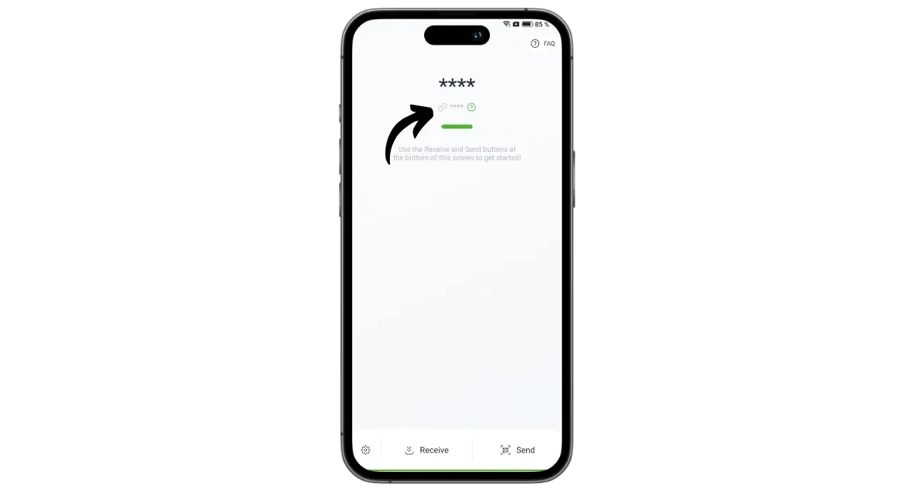
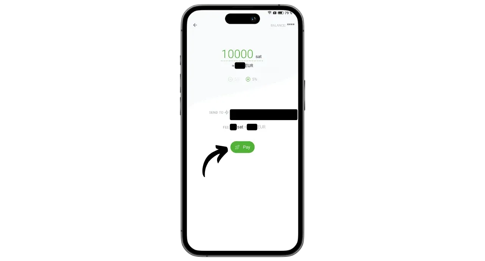

Phoenix is a self-custodial Lightning wallet and node developed by ACINQ, a French company specializing in Lightning-based software solutions. Unlike custodial Lightning wallets such as Wallet of Satoshi, where bitcoins are held by a third party, Phoenix enables users to retain full control of their private keys.

In fact, Phoenix works like a real Lightning node embedded in your phone, which will automatically open a channel with ACINQ's Lightning node. The application is based on Eclair, the Lightning implementation developed by ACINQ. Unlike other Lightning node solutions, Phoenix simplifies management considerably. Users don't have to manage the opening and closing of channels, run a Bitcoin node, or manage their liquidity on the Lightning network. Phoenix takes care of all these technical operations in the background.

This application combines the ease of use and convenience of mobile Lightning wallets with the security and sovereignty of a genuine personal Lightning node. Phoenix makes it possible to use the Lightning Network securely, efficiently and autonomously, while enjoying a fluid, intuitive user experience.

In return, certain fees apply:

- Sending via Lightning costs 0.4% of the amount plus 4 sats ;
- If cash is needed to receive via Lightning, 1% of the amount is charged;
- Each channel costs 1000 sats to open.

In my opinion, Phoenix represents an excellent intermediate solution between custodial Lightning portfolios and the manual management of a Lightning node. This application is equally suited to beginners and advanced users who prefer not to deal with the details of managing their own LND or Core Lightning. Let's find out how to use it!

## Install the application

Go to your application store and install Phoenix :

- On the [Google Play Store](https://play.google.com/store/apps/details?id=fr.acinq.phoenix.mainnet);
- On the [App Store](https://apps.apple.com/fr/app/phoenix-wallet/id1544097028?l=en-GB).

You can also install the application [with the apk file on their GitHub repository](https://github.com/ACINQ/phoenix/releases).

## Portfolio creation

Once the application has started, click on the "*Next*" button to skip the presentation, then on "*Start*".

Select "*Create a new wallet*".

And that's it, your Lightning wallet and node are now created.

## Save mnemonic phrase

Before we get started, we need to save our 12-word mnemonic phrase. This phrase gives complete, unrestricted access to all your bitcoins. Anyone in possession of this phrase can steal your funds, even without physical access to your phone.

The 12-word phrase restores access to your bitcoins in the event of loss, theft or breakage of your phone. It is therefore very important to save it carefully and store it in a safe place.

You can write it on paper or, for added security, engrave it on stainless steel to protect it from fire, flood or collapse. The choice of medium for your mnemonic will depend on your security strategy, but if you're using Phoenix as a spending portfolio containing moderate amounts, paper should be sufficient.

For more information on the proper way to save and manage your mnemonic phrase, I highly recommend following this other tutorial, especially if you're a beginner:

https://planb.network/tutorials/wallet/backup/backup-mnemonic-22c0ddfa-fb9f-4e3a-96f9-46e2a7954270
Click on the message displayed at the top of the interface "*Save your wallet...*".

Then click on "*Save my wallet*".

Then click on "*View my key*" and save your mnemonic phrase on a physical medium.

Check the two boxes at the bottom of the interface to confirm that the backup has been successfully completed.

## Application setup

Before making your first transactions, you can customize the settings by clicking on the cogwheel icon at the bottom left of the interface.

In the "*Display*" menu, you can choose the application theme, the denomination used for bitcoin, and your local fiat currency.

In "*Payment options*", you'll find various advanced settings for Lightning payments. You can keep the default settings.

In "*Channel management*", set the maximum fee you are prepared to pay when opening a Lightning channel.

In the "*Access control*" menu, I strongly recommend that you activate an authentication system to secure access to the application on your phone. This will prevent anyone with access to your unlocked phone from accessing Phoenix and stealing your bitcoins.

In the "*Electrum server*" menu, if you have an Electrs server, you can connect it to broadcast your transactions.

To enhance the confidentiality of your connections, enable connections via Tor in the "*Tor*" menu. Although using Tor may slightly slow down your payments, and requires the Phoenix application to be open in the foreground when receiving, it significantly increases your privacy.

## Receive bitcoins on-chain

On first use, you have the option of loading your Phoenix wallet with on-chain funds. You can also make this first deposit directly from Lightning (see next section), but in either case, additional fees will apply for opening your first channel.

Click on the "*Receive*" button.

Swipe the QR code to the right to reveal a Bitcoin receiving address. Send it the amount you wish to deposit with Phoenix.

The amount received on-chain will first appear as pending under your portfolio balance. It will take 3 confirmations before the funds are available for use.

Once the funds have been received, Phoenix automatically opens a Lightning channel for you. You can now send and receive bitcoins via the Lightning Network.

## Receive bitcoins via Lightning

To receive sats via the Lightning Network, click on the "*Receive*" button.

Phoenix generates a Lightning invoice. You can either scan it or send it to the person who wishes to transfer sats to you.

By clicking on the "*Edit*" button, you can add a description that will be visible to the payer on the invoice, and define a specific amount that the payer must send.

The classic invoices mentioned above can only be used once. For a reusable payment option, you can use your reusable QR code, which is a BOLT12 offer.

Once the invoice or BOLT12 offer has been settled, the transaction will appear on your Lightning wallet.

## Send bitcoins via Lightning

Now that you have sats on Phoenix, you're ready to make payments via the Lightning Network. Start by clicking on the "*Send*" button.

Several options are available to you. By clicking on "*Scan QR code*", you can scan a Lightning invoice, a BOLT12 offer, or even a receiving address for on-chain payment.

You can also enter this information manually via the keyboard in the field at the top of the interface, or enter a Lightning address (BOLT12 or LNURL). You can also paste the information directly using the "*Paste*" button.

For this example, I've scanned an invoice for 10,000 sats. To make the payment, just click on "*Pay*".

The transaction is completed.

Congratulations, you now know how to configure and use Phoenix. If you found this tutorial useful, I'd be grateful if you'd leave a green thumb below. Feel free to share this article on your social networks. Thanks for sharing!

To take things a step further, check out this tutorial on Alby Hub, another innovative and easy-to-use solution for launching your own Lightning node:

https://planb.network/tutorials/node/lightning-network/alby-hub-62e6356c-6a6d-4134-8f22-c3b6afb9882a
And to find out more about the technical operation of the Lightning Network, you can find Fanis Michalakis' excellent free training on Plan ₿ Network :

https://planb.network/courses/34bd43ef-6683-4a5c-b239-7cb1e40a4aeb