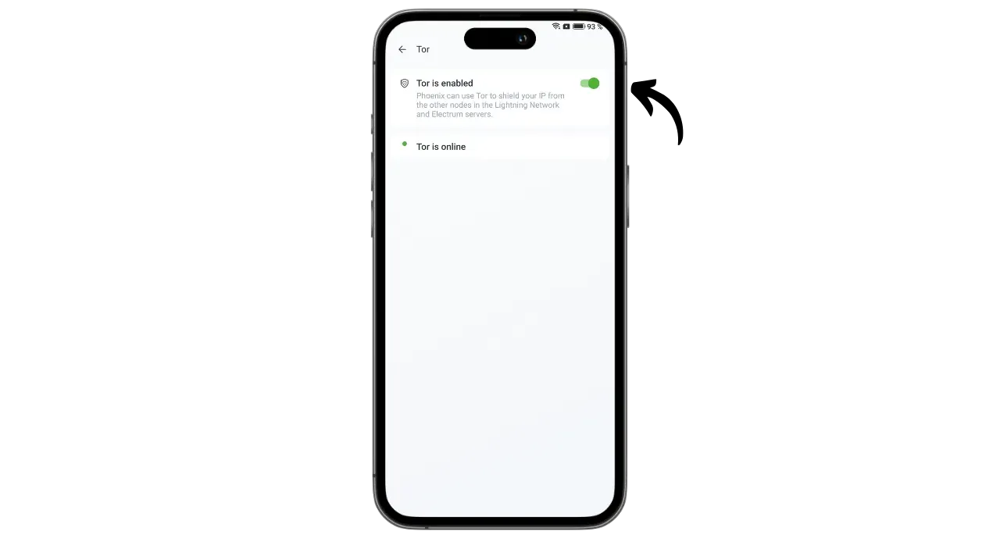
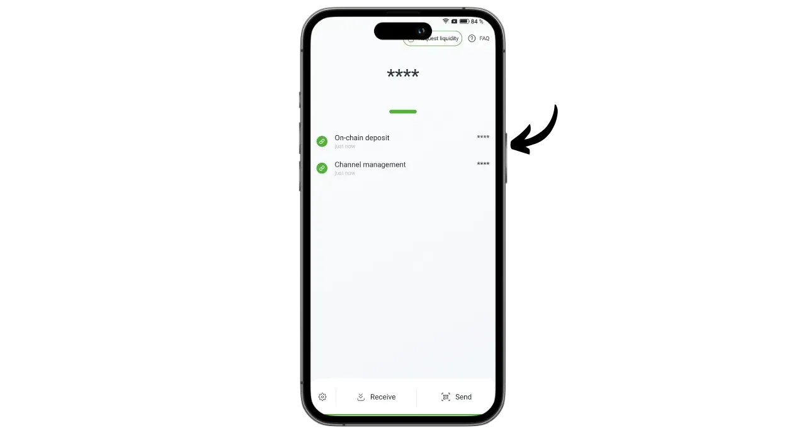
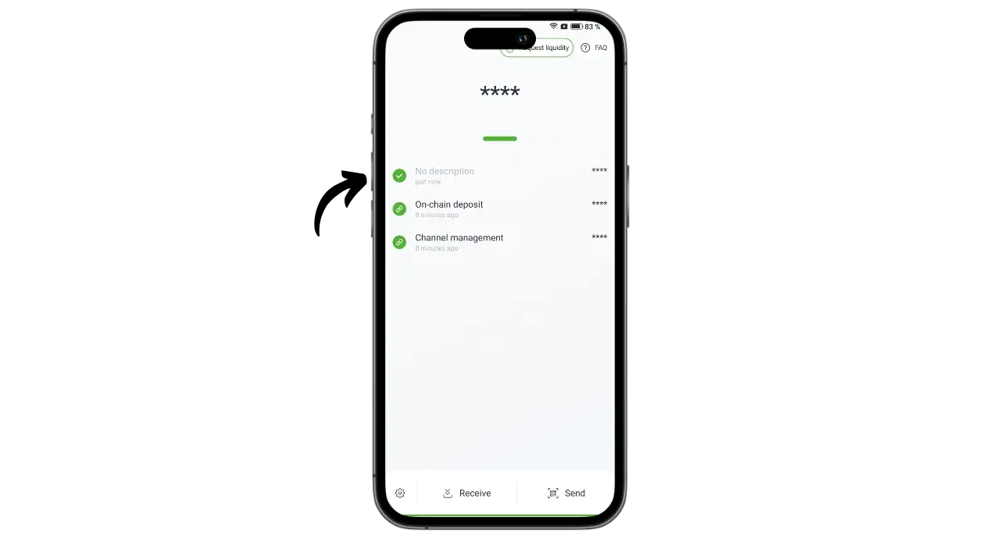

Phoenix es un monedero y nodo Lightning autocustodiado desarrollado por ACINQ, una empresa francesa especializada en soluciones de software basadas en Lightning. A diferencia de los monederos Lightning de custodia, como Wallet of Satoshi, en los que los bitcoins están en manos de un tercero, Phoenix permite a los usuarios mantener el control total de sus claves privadas.

De hecho, Phoenix funciona como un verdadero nodo Lightning incrustado en tu teléfono, que abrirá automáticamente un canal con el nodo Lightning de ACINQ. La aplicación se basa en Eclair, la implementación de Lightning desarrollada por ACINQ. A diferencia de otras soluciones de nodos Lightning, Phoenix simplifica considerablemente la gestión. Los usuarios no tienen que gestionar la apertura y cierre de canales, ejecutar un nodo Bitcoin o gestionar su liquidez en la red Lightning. Phoenix se encarga de todas estas operaciones técnicas en segundo plano.

Esta aplicación combina la facilidad de uso y la comodidad de los monederos Lightning móviles con la seguridad y la soberanía de un auténtico nodo Lightning personal. Phoenix permite utilizar la Red Lightning de forma segura, eficiente y autónoma, disfrutando al mismo tiempo de una experiencia de usuario fluida e intuitiva.

A cambio, se aplican ciertas tasas:

- Enviar por Lightning cuesta el 0,4% del importe más 4 sats ;
- Si se necesita dinero en efectivo para recibir a través de Lightning, se cobra el 1% del importe;
- Abrir cada canal cuesta 1000 sats.

En mi opinión, Phoenix representa una excelente solución intermedia entre la custodia de carteras Lightning y la gestión manual de un nodo Lightning. Esta aplicación es igualmente adecuada para principiantes y usuarios avanzados que prefieren no ocuparse de los detalles de la gestión de su propio LND o Core Lightning. ¡Descubramos cómo utilizarla!

## Instalar la aplicación

Ve a tu tienda de aplicaciones e instala Phoenix :

- En [Google Play Store](https://play.google.com/store/apps/details?id=fr.acinq.phoenix.mainnet);
- En la [App Store](https://apps.apple.com/fr/app/phoenix-wallet/id1544097028?l=en-GB).

También puedes instalar la aplicación [con el archivo apk en su repositorio de GitHub](https://github.com/ACINQ/phoenix/releases).

## Creación de carteras

Una vez iniciada la aplicación, haga clic en el botón "*Siguiente*" para saltarse la presentación y, a continuación, en "*Iniciar*".

Seleccione "*Crear un nuevo monedero*".

Y ya está, tu monedero Lightning y tu nodo ya están creados.

## Guardar frase mnemotécnica

Antes de empezar, tenemos que guardar nuestra frase mnemotécnica de 12 palabras. Esta frase da acceso completo y sin restricciones a todos tus bitcoins. Cualquiera en posesión de esta frase puede robar tus fondos, incluso sin acceso físico a tu teléfono.

La frase de 12 palabras restablece el acceso a tus bitcoins en caso de pérdida, robo o rotura de tu teléfono. Por eso es muy importante guardarla con cuidado y almacenarla en un lugar seguro.

Puedes escribirla en papel o, para mayor seguridad, grabarla en acero inoxidable para protegerla de incendios, inundaciones o derrumbes. La elección del soporte para tu mnemotécnica dependerá de tu estrategia de seguridad, pero si utilizas Phoenix como cartera de gastos que contiene cantidades moderadas, el papel debería ser suficiente.

Para más información sobre la forma correcta de guardar y gestionar tu frase mnemotécnica, te recomiendo encarecidamente que sigas este otro tutorial, especialmente si eres principiante:

https://planb.network/tutorials/wallet/backup/backup-mnemonic-22c0ddfa-fb9f-4e3a-96f9-46e2a7954270
Haga clic en el mensaje que aparece en la parte superior de la interfaz "*Guarde su cartera...*".

A continuación, haz clic en "*Guardar mi cartera*".

A continuación, haz clic en "*Ver mi clave*" y guarda tu frase mnemotécnica en un soporte físico.

Compruebe las dos casillas de la parte inferior de la interfaz para confirmar que la copia de seguridad se ha realizado correctamente.

## Configuración de la aplicación

Antes de realizar tus primeras transacciones, puedes personalizar los ajustes haciendo clic en el icono de la rueda dentada situado en la parte inferior izquierda de la interfaz.

En el menú "*Pantalla*", puedes elegir el tema de la aplicación, la denominación utilizada para el bitcoin y tu moneda fiduciaria local.

En "*Opciones de pago*", encontrarás varios ajustes avanzados para los pagos Lightning. Puedes mantener la configuración predeterminada.

En "*Gestión de canales*", fije la tarifa máxima que está dispuesto a pagar al abrir un canal Rayo.

En el menú "*Control de acceso*", te recomiendo encarecidamente que actives un sistema de autenticación para asegurar el acceso a la aplicación en tu teléfono. Esto evitará que cualquier persona con acceso a tu teléfono desbloqueado pueda acceder a Phoenix y robar tus bitcoins.

En el menú "*Servidor Electrectrum*", si dispone de un servidor Electrs, puede conectarlo para difundir sus transacciones.

Para aumentar la confidencialidad de tus conexiones, habilita las conexiones a través de Tor en el menú "*Tor*". Aunque el uso de Tor puede ralentizar ligeramente tus pagos, y requiere que la aplicación Phoenix esté abierta en primer plano al recibir, aumenta significativamente tu privacidad.

## Recibir bitcoins en cadena

En el primer uso, tienes la opción de cargar tu monedero Phoenix con fondos on-chain. También puedes hacer este primer depósito directamente desde Lightning (ver siguiente sección), pero en cualquier caso, se aplicarán comisiones adicionales por abrir tu primer canal.

Haga clic en el botón "*Recibir*".

Desliza el código QR hacia la derecha para ver una dirección de recepción de Bitcoin. Envíale la cantidad que deseas depositar en Phoenix.

La cantidad recibida en la cadena aparecerá primero como pendiente en el saldo de su cartera. Se necesitarán 3 confirmaciones antes de que los fondos estén disponibles para su uso.

Una vez recibidos los fondos, Phoenix abre automáticamente un canal Lightning para ti. Ya puedes enviar y recibir bitcoins a través de la red Lightning.

## Recibir bitcoins a través de Lightning

Para recibir saturaciones a través de la Red Lightning, pulse el botón "*Recibir*".

Phoenix genera una factura Lightning. Puedes escanearla o enviarla a la persona que desea transferirte saturación.

Haciendo clic en el botón "*Editar*", puede añadir una descripción que será visible para el pagador en la factura, y definir un importe específico que el pagador debe enviar.

Las facturas clásicas mencionadas anteriormente sólo pueden utilizarse una vez. Para una opción de pago reutilizable, puede utilizar su código QR reutilizable, que es una oferta BOLT12.

Una vez liquidada la factura o la oferta BOLT12, la transacción aparecerá en su monedero Lightning.

## Enviar bitcoins a través de Lightning

Ahora que tienes sats en Phoenix, estás listo para realizar pagos a través de la Lightning Network. Empieza haciendo clic en el botón "*Enviar*".

Dispone de varias opciones. Haciendo clic en "*Escanear código QR*", puede escanear una factura Lightning, una oferta BOLT12 o incluso una dirección de recepción para el pago en cadena.

También puedes introducir esta información manualmente mediante el teclado en el campo situado en la parte superior de la interfaz, o introducir una dirección Lightning (BOLT12 o LNURL). También puede pegar la información directamente utilizando el botón "*Pegar*".

Para este ejemplo, he escaneado una factura de 10.000 sats. Para efectuar el pago, basta con hacer clic en "*Pagar*".

La transacción se ha completado.

Enhorabuena, ahora ya sabes cómo configurar y utilizar Phoenix. Si has encontrado útil este tutorial, te agradecería que dejaras un pulgar verde abajo. Siéntete libre de compartir este artículo en tus redes sociales. ¡Gracias por compartir!

Para ir un paso más allá, echa un vistazo a este tutorial sobre Alby Hub, otra solución innovadora y fácil de usar para lanzar tu propio nodo Lightning:

https://planb.network/tutorials/node/lightning-network/alby-hub-62e6356c-6a6d-4134-8f22-c3b6afb9882a
Y para saber más sobre el funcionamiento técnico de la Red Rayo, puedes encontrar la excelente formación gratuita de Fanis Michalakis sobre Plan ₿ Red :

https://planb.network/courses/34bd43ef-6683-4a5c-b239-7cb1e40a4aeb