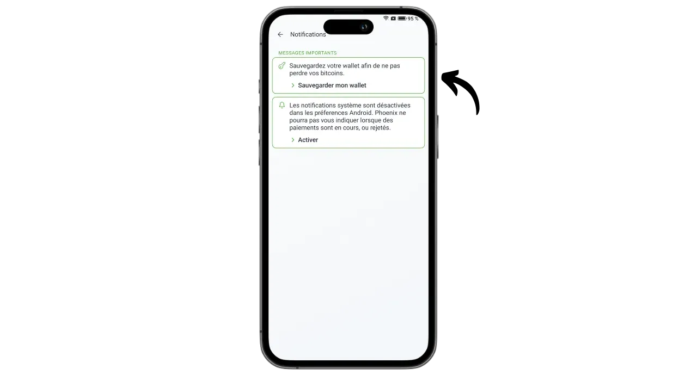
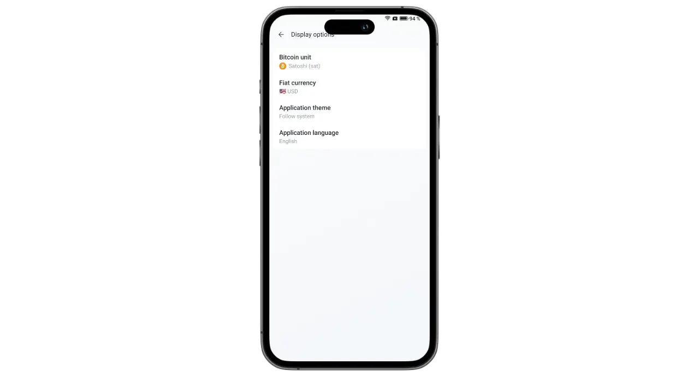
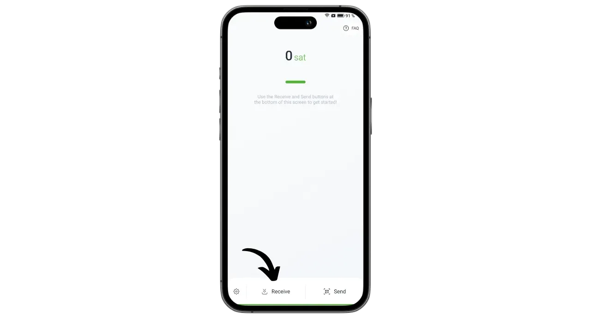
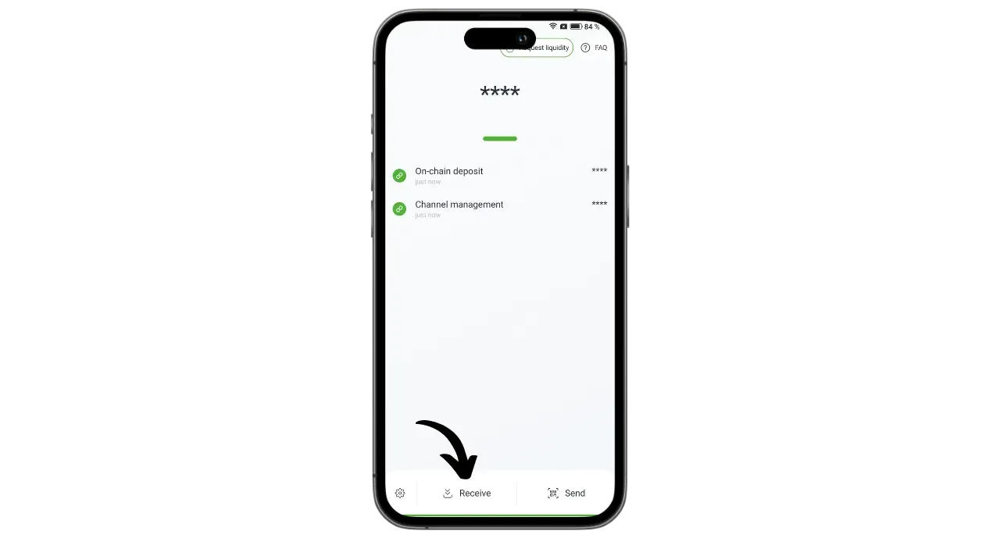

Phoenix on Lightning-põhistele tarkvaralahendustele spetsialiseerunud Prantsuse ettevõtte ACINQ poolt välja töötatud Lightning-põhine rahakott ja sõlmpunkt. Erinevalt hoiustatavatest Lightningi rahakottidest, nagu näiteks Wallet of Satoshi, kus bitcoinid on kolmanda osapoole valduses, võimaldab Phoenix kasutajatel säilitada täieliku kontrolli oma privaatvõtmete üle.

Tegelikult töötab Phoenix nagu teie telefoni sisseehitatud tõeline Lightning-sõlm, mis avab automaatselt kanali ACINQ Lightning-sõlmega. Rakendus põhineb Eclairil, ACINQ poolt välja töötatud Lightningi rakendusel. Erinevalt teistest Lightning-sõlme lahendustest lihtsustab Phoenix oluliselt haldamist. Kasutajad ei pea haldama kanalite avamist ja sulgemist, käivitama Bitcoini sõlme ega haldama oma likviidsust Lightning-võrgus. Phoenix hoolitseb kõigi nende tehniliste toimingute eest taustal.

See rakendus ühendab endas mobiilse Lightning rahakoti kasutusmugavuse ja mugavuse ning tõelise isikliku Lightning-sõlme turvalisuse ja suveräänsuse. Phoenix võimaldab kasutada Lightning-võrku turvaliselt, tõhusalt ja iseseisvalt, nautides samal ajal sujuvat ja intuitiivset kasutajakogemust.

Vastutasuks kohaldatakse teatavaid tasusid:

- Välguga saatmine maksab 0,4% summast pluss 4 sati ;
- Kui Lightning'i kaudu on vaja saada sularaha, tuleb maksta 1% summast;
- Iga kanali avamine maksab 1000 sati.

Minu arvates kujutab Phoenix endast suurepärast vahepealset lahendust Lightning portfellide halduse ja Lightning-sõlme käsitsi haldamise vahel. See rakendus sobib võrdselt nii algajatele kui ka edasijõudnutele, kes ei soovi tegeleda oma LND või Core Lightningi haldamise üksikasjadega. Uurime, kuidas seda kasutada!

## Installige rakendus

Mine oma rakenduste poodi ja paigalda Phoenix :

- [Google Play poes](https://play.google.com/store/apps/details?id=fr.acinq.phoenix.mainnet);
- [App Store](https://apps.apple.com/fr/app/phoenix-wallet/id1544097028?l=en-GB).

Võite installida rakenduse ka [nende GitHubi repositooriumi apk-faili abil](https://github.com/ACINQ/phoenix/releases).

## Portfelli loomine

Kui rakendus on käivitunud, klõpsake esitluse vahelejätmiseks nupule "*Järgmine*" ja seejärel nupule "*Start*".

Valige "*Loo uus rahakott*".

Ja see ongi kõik, teie Lightning rahakott ja sõlme on nüüd loodud.

## Salvesta mnemooniline fraas

Enne kui me alustame, peame salvestama oma 12-sõnalise mälulause. See fraas annab täieliku ja piiramatu juurdepääsu kõigile teie bitcoinidele. Igaüks, kes seda fraasi valdab, võib teie raha varastada, isegi ilma füüsilise juurdepääsuta teie telefonile.

12-sõnaline lause taastab juurdepääsu teie bitcoinidele telefoni kadumise, varguse või purunemise korral. Seetõttu on väga oluline seda hoolikalt salvestada ja turvalises kohas hoida.

Võite selle kirjutada paberile või täiendava turvalisuse tagamiseks graveerida selle roostevabast terasest, et kaitsta seda tulekahju, üleujutuse või kokkuvarisemise eest. Mõttekirja kandja valik sõltub teie turvastrateegiast, kuid kui kasutate Phoenixi kui mõõdukaid summasid sisaldavat kuluportfelli, peaks paberist piisama.

Lisateavet selle kohta, kuidas oma mnemofraasi õigesti salvestada ja hallata, soovitan kindlasti jälgida seda teist õpetust, eriti kui olete algaja:

https://planb.network/tutorials/wallet/backup/backup-mnemonic-22c0ddfa-fb9f-4e3a-96f9-46e2a7954270
Klõpsake kasutajaliidese ülaosas kuvataval sõnumil "*Säästke oma rahakott...*".

Seejärel klõpsake nupule "*Säästke minu rahakott*".

Seejärel klõpsake nupule "*View my key*" ja salvestage oma mälulause füüsilisele andmekandjale.

Kontrollige kaks ruutu kasutajaliidese allosas, et kinnitada, et varundamine on edukalt lõpetatud.

## Rakenduse seadistamine

Enne esimeste tehingute tegemist saate seadistusi kohandada, klõpsates kasutajaliidese vasakus allosas asuval hammasratta ikoonil.

Menüüs "*Display*" saate valida rakenduse teema, bitcoinide jaoks kasutatava nimiväärtuse ja oma kohaliku fiat-valuuta.

"*Maksmise valikud*" alt leiad erinevaid Lightning-maksete täiustatud seadeid. Saate säilitada vaikimisi seaded.

Seadistage jaotises "*Kanalite haldamine*" maksimaalne tasu, mida olete valmis maksma Lightning-kanali avamisel.

Menüüs "*Juurdepääsu kontroll*" soovitan tungivalt aktiveerida autentimissüsteem, et tagada juurdepääs rakendusele teie telefonis. See takistab kellelgi, kellel on juurdepääs teie lukustamata telefonile, juurdepääsu Phoenixile ja teie bitcoinide varastamist.

Kui teil on Electrs server, saate menüüs "*Electrum server*" ühendada selle oma tehingute edastamiseks.

Et suurendada oma ühenduste konfidentsiaalsust, lubage menüüs "*Tor*" ühendused Tori kaudu. Kuigi Tori kasutamine võib maksete sooritamist veidi aeglustada ja nõuab, et Phoenixi rakendus oleks vastuvõtmisel esiplaanil avatud, suurendab see oluliselt teie privaatsust.

## Bitcoinide vastuvõtmine on-chain

Esimesel kasutamisel on teil võimalus laadida oma Phoenixi rahakotti ahelas olevaid vahendeid. Te võite selle esimese sissemakse teha ka otse Lightningist (vt järgmine lõik), kuid mõlemal juhul tuleb esimese kanali avamise eest maksta lisatasusid.

Vajutage nupule "*Vastuvõtmine*".

Bitcoini vastuvõtu aadressi avamiseks pühkige QR-koodi paremale. Saatke sellele summa, mida soovite Phoenixi abil hoiustada.

Kettal saadud summa ilmub esmalt teie portfelli saldo all kui ooteseisund. Kulub 3 kinnitust, enne kui raha on kasutatav.

Kui raha on laekunud, avab Phoenix automaatselt teie jaoks Lightning-kanali. Nüüd saate bitcoin'e saata ja vastu võtta Lightning Networki kaudu.

## Bitcoinide vastuvõtmine Lightning'i kaudu

Satelliitide vastuvõtmiseks Lightning Networki kaudu klõpsake nupul "*Vaata*".

Phoenix genereerib Lightning arve. Seda saate kas skaneerida või saata isikule, kes soovib teile sati üle kanda.

Vajutades nupule "*Muuda*", saate lisada kirjelduse, mis on maksjale arvel nähtav, ja määrata konkreetse summa, mille maksja peab saatma.

Eespool nimetatud klassikalisi arveid saab kasutada ainult üks kord. Korduvkasutatava maksevõimaluse jaoks saate kasutada korduvkasutatavat QR-koodi, mis on BOLT12 pakkumine.

Kui arve või BOLT12 pakkumine on arveldatud, ilmub tehing teie Lightning rahakotti.

## Bitcoinide saatmine Lightning'i kaudu

Nüüd, kui teil on Phoenixis satsid, olete valmis makseid tegema Lightning Networki kaudu. Alustage, klõpsates nupule "*Send*".

Teil on mitu võimalust. Vajutades "*Scan QR-kood*", saate skaneerida Lightning-arve, BOLT12-pakkumise või isegi vastuvõtuaadressi ahelas maksmiseks.

Te võite sisestada selle teabe ka käsitsi klaviatuuri abil kasutajaliidese ülaosas olevasse väljale või sisestada Lightning-aadressi (BOLT12 või LNURL). Te võite sisestada teabe ka otse, kasutades nuppu "*Paste*".

Selles näites olen skaneerinud arve 10 000 sati kohta. Makse tegemiseks vajutage lihtsalt nupule "*Maksma*".

Tehing on lõpule viidud.

Palju õnne, te teate nüüd, kuidas Phoenixi konfigureerida ja kasutada. Kui leidsite selle õpetuse kasulikuks, oleksin tänulik, kui jätaksite allpool rohelise pöidla. Jaga seda artiklit julgelt oma sotsiaalvõrgustikes. Täname jagamise eest!

Kui soovite minna sammu võrra kaugemale, vaadake seda õpetust Alby Hubi kohta, mis on veel üks uuenduslik ja lihtne lahendus oma Lightning-sõlme käivitamiseks:

https://planb.network/tutorials/node/lightning-network/alby-hub-62e6356c-6a6d-4134-8f22-c3b6afb9882a
Ja et rohkem teada saada Lightning Networki tehnilisest toimimisest, leiate Fanis Michalakise suurepärase tasuta koolituse Plan ₿ Networki kohta:

https://planb.network/courses/34bd43ef-6683-4a5c-b239-7cb1e40a4aeb