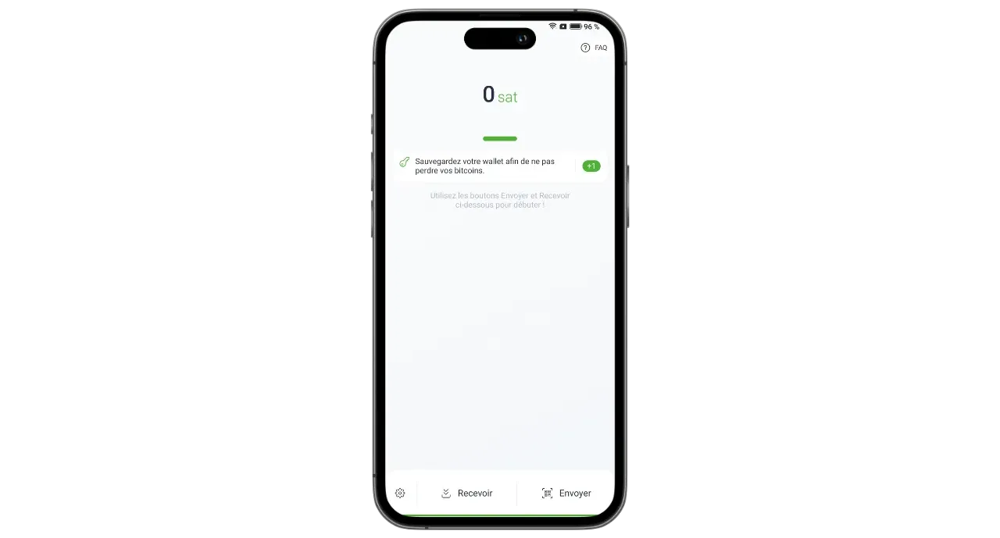
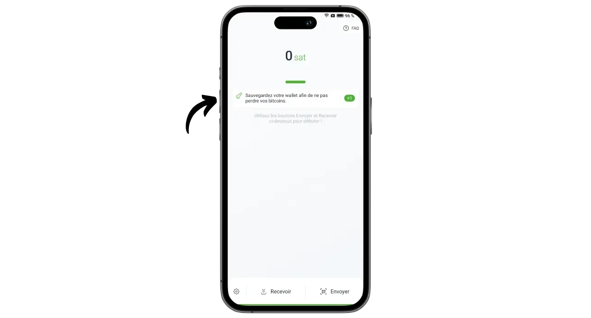
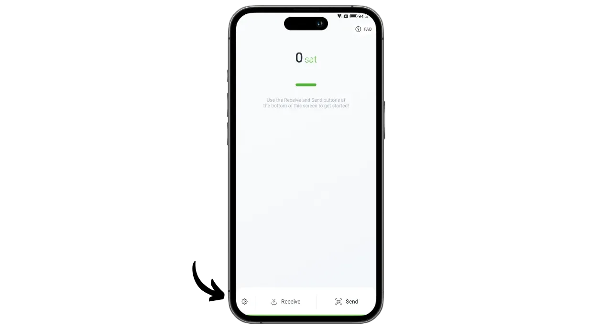
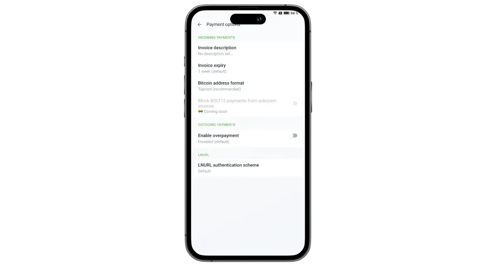

फीनिक्स एक सेल्फ-कस्टोडियल लाइटनिंग Wallet और नोड है, जिसे ACINQ नाम की फ्रेंच कंपनी ने विकसित किया है, जो लाइटनिंग-बेस्ड सॉफ्टवेयर सॉल्यूशंस में विशेषज्ञता रखती है। कस्टोडियल लाइटनिंग वॉलेट्स जैसे Wallet या Satoshi के विपरीत, जहाँ बिटकॉइन किसी तीसरे पक्ष द्वारा रखे जाते हैं, फीनिक्स उपयोगकर्ताओं को उनके प्राइवेट कीज़ पर पूरा नियंत्रण बनाए रखने की सुविधा देता है।

फीनिक्स आपके फोन में एक असली लाइटनिंग नोड के रूप में काम करता है, जो अपने आप ACINQ के लाइटनिंग नोड के साथ एक चैनल खोलता है। यह एप्लिकेशन Lightning-KMP पर आधारित है, जो Kotlin में Lightning Network का क्रॉस-प्लेटफॉर्म इम्प्लीमेंटेशन है, और इसे मोबाइल वॉलेट्स के लिए ऑप्टिमाइज़ किया गया है। अन्य लाइटनिंग नोड समाधानों के विपरीत, फीनिक्स प्रबंधन को बहुत सरल बनाता है। उपयोगकर्ता को चैनल खोलने और बंद करने, Bitcoin नोड चलाने, या Lightning Network पर लिक्विडिटी प्रबंधन की ज़रूरत नहीं होती। फीनिक्स इन सभी तकनीकी कार्यों को बैकग्राउंड में संभाल लेता है।

यह एप्लिकेशन मोबाइल लाइटनिंग वॉलेट्स की सरलता और सुविधा को एक असली व्यक्तिगत लाइटनिंग नोड की सुरक्षा और स्वतंत्रता के साथ जोड़ता है। फीनिक्स आपको Lightning Network को सुरक्षित, कुशलतापूर्वक और स्वतंत्र रूप से उपयोग करने की सुविधा देता है, जबकि आपको एक सहज और सरल उपयोगकर्ता अनुभव का आनंद भी मिलता है।

इसके बदले में, कुछ शुल्क लागू होते हैं:

- लाइटनिंग के माध्यम से भेजने पर राशि का 0.4% और 4 Sats का खर्च होता है।
- अगर लाइटनिंग के जरिए नकद प्राप्त करना है, तो राशि का 1% शुल्क लिया जाता है।
- प्रत्येक चैनल को खोलने में 1000 Sats की लागत आती है।

मेरे विचार में, फीनिक्स एक बेहतरीन मध्यवर्ती समाधान है जो कस्टोडियल लाइटनिंग पोर्टफोलियो और लाइटनिंग नोड के मैनुअल प्रबंधन के बीच आता है। यह एप्लिकेशन उन शुरुआती और अनुभवी उपयोगकर्ताओं के लिए समान रूप से उपयुक्त है जो अपने LND या कोर लाइटनिंग के प्रबंधन के विवरण से निपटना नहीं चाहते। आइए जानें कि इसे कैसे उपयोग करें!

## एप्लिकेशन इंस्टॉल करें।

अपने एप्लिकेशन स्टोर पर जाएं और फीनिक्स इंस्टॉल करें।

- [गूगल प्ले स्टोर](https://play.google.com/store/apps/details?id=fr.acinq.phoenix.Mainnet) पर;
- [ऐप स्टोर](https://apps.apple.com/fr/app/phoenix-Wallet/id1544097028?l=en-GB) पर।

आप इस एप्लिकेशन को उनके GitHub रिपॉजिटरी से [apk फाइल के साथ](https://github.com/ACINQ/phoenix/releases) भी इंस्टॉल कर सकते हैं।

## पोर्टफोलियो निर्माण

जब एप्लिकेशन शुरू हो जाए, तो प्रस्तुति को छोड़ने के लिए "*Next*" बटन पर क्लिक करें, फिर "*Start*" पर क्लिक करें।

"*नया Wallet बनाएं*" का चयन करें।

बस हो गया, आपका लाइटनिंग Wallet और नोड अब बन चुका है।

## Mnemonic वाक्यांश को सहेजें।

शुरू करने से पहले, हमें अपनी 12-शब्दों की Mnemonic वाक्यांश को सुरक्षित रखना होगा। यह वाक्यांश आपके सभी बिटकॉइन्स तक पूरी और बिना किसी रोक-टोक के पहुंच प्रदान करता है। जिसके पास भी यह वाक्यांश होगा, वह आपकी धनराशि चुरा सकता है, भले ही उसके पास आपके फोन की भौतिक पहुंच न हो।

12 शब्दों का यह वाक्यांश आपके बिटकॉइन तक पहुंच को पुनः स्थापित करता है यदि आपका फोन खो जाए, चोरी हो जाए या टूट जाए। इसलिए इसे ध्यान से सुरक्षित रखना और किसी सुरक्षित स्थान पर स्टोर करना बहुत महत्वपूर्ण है।

आप इसे कागज पर लिख सकते हैं या, अतिरिक्त सुरक्षा के लिए, इसे स्टेनलेस स्टील पर उकेर सकते हैं ताकि यह आग, बाढ़ या ढहने से सुरक्षित रहे। आपके Mnemonic के लिए माध्यम का चुनाव आपकी सुरक्षा रणनीति पर निर्भर करेगा, लेकिन अगर आप फीनिक्स का उपयोग एक खर्च पोर्टफोलियो के रूप में कर रहे हैं जिसमें मध्यम मात्रा है, तो कागज पर्याप्त होना चाहिए।

अगर आप Mnemonic वाक्यांश को सही तरीके से सहेजने और प्रबंधित करने के बारे में अधिक जानकारी चाहते हैं, तो मैं विशेष रूप से इस दूसरे ट्यूटोरियल को देखने की सलाह देता हूँ, खासकर अगर आप एक शुरुआत कर रहे हैं।

https://planb.network/tutorials/wallet/backup/backup-mnemonic-22c0ddfa-fb9f-4e3a-96f9-46e2a7954270
Interface के शीर्ष पर प्रदर्शित संदेश "*अपना Wallet सहेजें...*" पर क्लिक करें।

फिर "*मेरा Wallet सहेजें*" पर क्लिक करें।

फिर "*View my key*" पर क्लिक करें और अपनी Mnemonic वाक्यांश को किसी भौतिक माध्यम पर सुरक्षित कर लें।

Interface के नीचे दिए गए दो बॉक्स को चेक करें ताकि यह सुनिश्चित हो सके कि बैकअप सफलतापूर्वक पूरा हो गया है।

## एप्लिकेशन सेटअप

अपना पहला लेन-देन करने से पहले, आप Interface के निचले बाएँ कोने में दिए गए गियर आइकन पर क्लिक करके सेटिंग्स को अपनी पसंद के अनुसार बदल सकते हैं।

"*डिस्प्ले*" मेन्यू में, आप एप्लिकेशन का थीम, Bitcoin के लिए उपयोग की जाने वाली संज्ञा, और अपनी स्थानीय फिएट मुद्रा चुन सकते हैं।

"*भुगतान विकल्प*" में, आपको लाइटनिंग भुगतान के लिए विभिन्न उन्नत सेटिंग्स मिलेंगी। आप डिफ़ॉल्ट सेटिंग्स को वैसे ही रख सकते हैं।

"*चैनल प्रबंधन*" में, उस अधिकतम शुल्क को सेट करें जिसे आप एक लाइटनिंग चैनल खोलते समय देने के लिए तैयार हैं।

"*एक्सेस कंट्रोल*" मेन्यू में, मैं आपको यह सलाह देता हूँ कि आप अपने फोन पर एप्लिकेशन की सुरक्षा के लिए एक ऑथेंटिकेशन सिस्टम को सक्रिय करें। इससे कोई भी व्यक्ति, जिसके पास आपका अनलॉक फोन है, फीनिक्स तक पहुँच नहीं पाएगा और आपके बिटकॉइन चुराने से बचा रहेगा।

"*इलेक्ट्रम सर्वर*" मेन्यू में, अगर आपके पास एक इलेक्ट्रस सर्वर है, तो आप उसे अपनी लेन-देन प्रसारित करने के लिए कनेक्ट कर सकते हैं।

अपने कनेक्शनों की गोपनीयता बढ़ाने के लिए, "*Tor*" मेन्यू में जाकर Tor के माध्यम से कनेक्शन सक्षम करें। हालांकि Tor का उपयोग करने से आपके भुगतान की गति थोड़ी धीमी हो सकती है, और जब आप प्राप्त कर रहे हों तो Phoenix एप्लिकेशन को अग्रभूमि में खुला रखना आवश्यक होता है, लेकिन यह आपकी प्राइवेसी को काफी हद तक बढ़ा देता है।

## आपको बिटकॉइन प्राप्त हुए हैं On-Chain।

पहली बार इस्तेमाल करने पर, आपके पास अपने Phoenix Wallet में On-Chain फंड्स लोड करने का विकल्प होता है। आप यह पहली जमा राशि सीधे लाइटनिंग से भी कर सकते हैं (अगले सेक्शन में देखें), लेकिन दोनों ही मामलों में, आपका पहला चैनल खोलने के लिए अतिरिक्त शुल्क लागू होगा।

"*प्राप्त करें*" बटन पर क्लिक करें।

QR कोड को दाईं ओर स्वाइप करें ताकि Bitcoin को Address प्राप्त होता दिखे। इसके बाद, जितनी राशि आप फीनिक्स के साथ जमा करना चाहते हैं, उसे भेज दें।

On-Chain के तहत प्राप्त राशि सबसे पहले आपके पोर्टफोलियो बैलेंस में लंबित के रूप में दिखाई देगी। फंड्स के उपयोग के लिए उपलब्ध होने से पहले इसे 3 बार पुष्टि की आवश्यकता होगी।

जैसे ही धनराशि प्राप्त होती है, फीनिक्स आपके लिए स्वचालित रूप से एक लाइटनिंग चैनल खोल देता है। अब आप Lightning Network के माध्यम से बिटकॉइन भेज और प्राप्त कर सकते हैं।

## लाइटनिंग के जरिए बिटकॉइन प्राप्त करें।

Lightning Network के माध्यम से Sats प्राप्त करने के लिए, "*प्राप्त करें*" बटन पर क्लिक करें।

फीनिक्स एक लाइटनिंग Invoice उत्पन्न करता है। आप इसे या तो स्कैन कर सकते हैं या उस व्यक्ति को भेज सकते हैं जो आपको Sats ट्रांसफर करना चाहता है।

"*Edit*" बटन पर क्लिक करके, आप एक विवरण जोड़ सकते हैं जो Invoice पर भुगतानकर्ता को दिखाई देगा, और एक विशेष राशि निर्धारित कर सकते हैं जो भुगतानकर्ता को भेजनी होगी।

ऊपर बताए गए क्लासिक इनवॉइस का उपयोग केवल एक बार ही किया जा सकता है। अगर आप बार-बार भुगतान करने का विकल्प चाहते हैं, तो आप अपने पुन: उपयोग योग्य QR कोड का उपयोग कर सकते हैं, जो कि एक BOLT12 ऑफर है।

जब Invoice या BOLT12 ऑफर का निपटारा हो जाएगा, तो लेन-देन आपके लाइटनिंग Wallet पर दिखाई देगा।

## लाइटनिंग के जरिए बिटकॉइन भेजें।

अब जब आपके पास फीनिक्स पर Sats है, तो आप Lightning Network के माध्यम से भुगतान करने के लिए तैयार हैं। शुरू करने के लिए "*Send*" बटन पर क्लिक करें।

आपके पास कई विकल्प उपलब्ध हैं। "*स्कैन क्यूआर कोड*" पर क्लिक करके, आप एक लाइटनिंग Invoice, एक BOLT12 ऑफर, या यहां तक कि On-Chain भुगतान के लिए एक प्राप्त करने वाला Address स्कैन कर सकते हैं।

आप इस जानकारी को मैन्युअली कीबोर्ड के जरिए Interface के शीर्ष पर दिए गए फील्ड में भी दर्ज कर सकते हैं, या फिर एक Lightning Address (BOLT12 या LNURL) दर्ज कर सकते हैं। आप सीधे "*Paste*" बटन का उपयोग करके जानकारी चिपका भी सकते हैं।

इस उदाहरण के लिए, मैंने 10,000 Sats के लिए एक Invoice स्कैन किया है। भुगतान करने के लिए, बस "*Pay*" पर क्लिक करें।

लेन-देन पूरा हो गया है।

बधाई हो, अब आप Phoenix को कॉन्फ़िगर और उपयोग करना सीख गए हैं। अगर आपको यह ट्यूटोरियल उपयोगी लगा, तो कृपया नीचे एक Green अंगूठा छोड़ दें। इस लेख को अपने सोशल नेटवर्क्स पर साझा करने के लिए स्वतंत्र महसूस करें। साझा करने के लिए धन्यवाद!

एक कदम आगे बढ़ने के लिए, इस ट्यूटोरियल को देखें जो अल्बी हब पर है। यह एक और नवीन और उपयोग में आसान समाधान है जो आपको अपना खुद का लाइटनिंग नोड लॉन्च करने में मदद करता है।

https://planb.network/tutorials/node/lightning-network/alby-hub-62e6356c-6a6d-4134-8f22-c3b6afb9882a
और Lightning Network के तकनीकी संचालन के बारे में अधिक जानने के लिए, आप Fanis Michalakis का उत्कृष्ट मुफ्त प्रशिक्षण Plan ₿ Network पर देख सकते हैं।

https://planb.network/courses/34bd43ef-6683-4a5c-b239-7cb1e40a4aeb