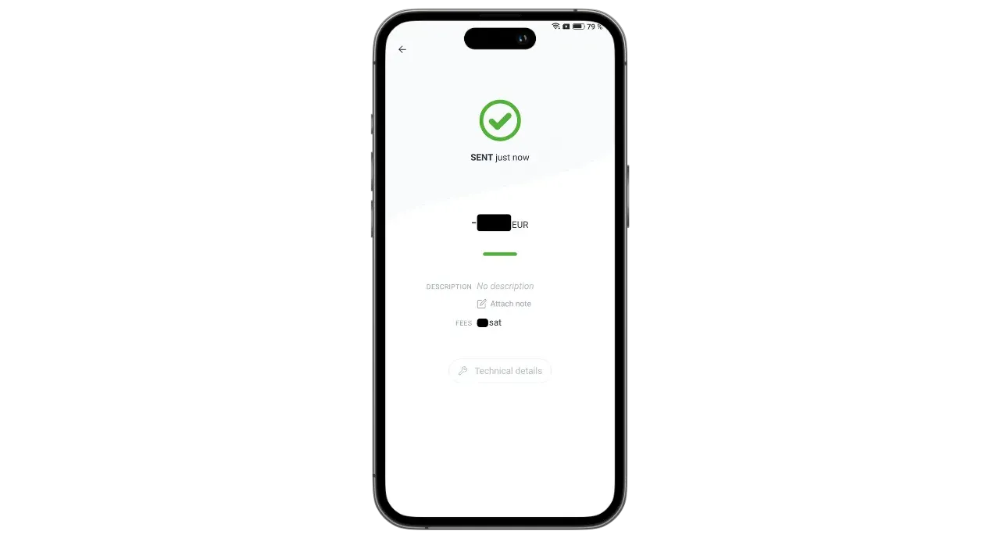

Phoenix adalah dompet dan node Lightning kustodian mandiri yang dikembangkan oleh ACINQ, sebuah perusahaan Prancis yang berspesialisasi dalam solusi perangkat lunak berbasis Lightning. Tidak seperti dompet Lightning kustodian seperti Wallet of Satoshi, di mana bitcoin dipegang oleh pihak ketiga, Phoenix memungkinkan pengguna untuk memegang kendali penuh atas kunci pribadi mereka.

Phoenix berfungsi sebagai node Lightning yang sebenarnya yang tertanam di ponsel Anda, secara otomatis membuka saluran dengan node Lightning ACINQ. Aplikasi ini didasarkan pada Lightning-KMP, sebuah implementasi lintas platform Lightning Network dalam Kotlin yang dioptimalkan untuk dompet seluler. Tidak seperti solusi node Lightning lainnya, Phoenix sangat menyederhanakan pengelolaan. Pengguna tidak perlu menangani pembukaan dan penutupan saluran, menjalankan node Bitcoin, atau mengelola likuiditas di jaringan Lightning. Phoenix menangani semua operasi teknis ini di latar belakang.

Aplikasi ini menggabungkan kemudahan penggunaan dan kenyamanan dompet Lightning seluler dengan keamanan dan kedaulatan simpul Lightning pribadi yang asli. Phoenix memungkinkan untuk menggunakan Lightning Network dengan aman, efisien, dan mandiri, sambil menikmati pengalaman pengguna yang lancar dan intuitif.

Sebagai imbalannya, dikenakan biaya tertentu:

- Mengirim melalui Lightning dikenakan biaya 0,4% dari jumlah tersebut ditambah 4 sats ;
- Jika uang tunai diperlukan untuk menerima melalui Lightning, maka akan dikenakan biaya sebesar 1% dari jumlah tersebut;
- Setiap saluran membutuhkan biaya 1000 sat untuk dibuka.

Menurut pendapat saya, Phoenix merupakan solusi perantara yang sangat baik antara portofolio Lightning kustodian dan manajemen manual dari node Lightning. Aplikasi ini sama-sama cocok untuk pemula dan pengguna tingkat lanjut yang memilih untuk tidak berurusan dengan detail pengelolaan LND atau Core Lightning mereka sendiri. Mari kita cari tahu cara menggunakannya!

## Instal aplikasi

Buka toko aplikasi Anda dan instal Phoenix :

- Di [Google Play Store](https://play.google.com/store/apps/details?id=fr.acinq.phoenix.mainnet);
- Di [App Store](https://apps.apple.com/fr/app/phoenix-wallet/id1544097028?l=en-GB).

Anda juga dapat menginstal aplikasi [dengan file apk di repositori GitHub mereka] (https://github.com/ACINQ/phoenix/releases).

## Pembuatan portofolio

Setelah aplikasi dimulai, klik tombol "*Next*" untuk melewatkan presentasi, kemudian "*Start*".

Pilih "*Buat dompet baru*".

Dan itu saja, dompet dan node Lightning Anda sekarang sudah dibuat.

## Menyimpan frasa mnemonik

Sebelum memulai, kita perlu menyimpan frasa mnemonik 12 kata. Frasa ini memberikan akses penuh dan tidak terbatas ke semua bitcoin Anda. Siapa pun yang memiliki frasa ini bisa mencuri dana Anda, bahkan tanpa akses fisik ke ponsel Anda.

Frasa 12 kata ini akan mengembalikan akses ke bitcoin Anda jika terjadi kehilangan, pencurian, atau kerusakan pada ponsel Anda. Oleh karena itu, sangat penting untuk menyimpannya dengan hati-hati dan menyimpannya di tempat yang aman.

Anda bisa menuliskannya di atas kertas atau, untuk keamanan tambahan, mengukirnya di atas baja tahan karat untuk melindunginya dari kebakaran, banjir, atau keruntuhan. Pilihan media untuk mnemonik Anda akan bergantung pada strategi keamanan Anda, tetapi jika Anda menggunakan Phoenix sebagai portofolio pengeluaran yang berisi jumlah yang tidak terlalu banyak, kertas sudah cukup.

Untuk informasi lebih lanjut mengenai cara yang tepat untuk menyimpan dan mengelola frasa mnemonik Anda, saya sangat merekomendasikan untuk mengikuti tutorial lainnya, khususnya jika Anda seorang pemula:

https://planb.network/tutorials/wallet/backup/backup-mnemonic-22c0ddfa-fb9f-4e3a-96f9-46e2a7954270

Klik pada pesan yang ditampilkan di bagian atas antarmuka "*Save your wallet...*".

Kemudian klik "*Save my wallet*".

Kemudian klik "*Lihat kunci saya*" dan simpan frasa mnemonik Anda pada media fisik.

Centang dua kotak di bagian bawah antarmuka untuk mengonfirmasi bahwa pencadangan telah berhasil diselesaikan.

## Penyiapan aplikasi

Sebelum melakukan transaksi pertama Anda, Anda bisa menyesuaikan pengaturan dengan mengeklik ikon roda gigi di bagian kiri bawah antarmuka.

Pada menu "*Display*", Anda bisa memilih tema aplikasi, denominasi yang digunakan untuk bitcoin, dan mata uang fiat lokal Anda.

Dalam "*Pilihan pembayaran*", Anda akan menemukan berbagai pengaturan lanjutan untuk pembayaran Lightning. Anda dapat mempertahankan pengaturan default.

Di "*Manajemen saluran*", tetapkan biaya maksimum yang siap Anda bayarkan saat membuka saluran Lightning.

Dalam menu "*Access control*", saya sangat menyarankan agar Anda mengaktifkan sistem otentikasi untuk mengamankan akses ke aplikasi di ponsel Anda. Hal ini akan mencegah siapa pun yang memiliki akses ke ponsel Anda yang tidak terkunci untuk mengakses Phoenix dan mencuri bitcoin Anda.

Pada menu "*Electrum server*", jika Anda memiliki server Electrs, Anda dapat menghubungkannya untuk menyiarkan transaksi Anda.

Untuk meningkatkan kerahasiaan koneksi Anda, aktifkan koneksi melalui Tor di menu "*Tor*". Meskipun menggunakan Tor mungkin sedikit memperlambat pembayaran Anda, dan mengharuskan aplikasi Phoenix terbuka di latar depan saat menerima, namun secara signifikan meningkatkan privasi Anda.

## Menerima bitcoin secara on-chain

Saat pertama kali digunakan, Anda memiliki opsi untuk mengisi dompet Phoenix Anda dengan dana on-chain. Anda juga dapat melakukan deposit pertama ini langsung dari Lightning (lihat bagian selanjutnya), tetapi dalam kedua kasus tersebut, biaya tambahan akan dikenakan untuk membuka saluran pertama Anda.

Klik pada tombol "*Terima*".

Geser kode QR ke kanan untuk menampilkan alamat penerima Bitcoin. Kirimkan jumlah yang ingin Anda setorkan ke Phoenix.

Jumlah yang diterima secara on-chain akan muncul pertama kali sebagai tertunda di bawah saldo portofolio Anda. Diperlukan 3 kali konfirmasi sebelum dana dapat digunakan.

Setelah dana diterima, Phoenix secara otomatis membuka saluran Lightning untuk Anda. Sekarang Anda bisa mengirim dan menerima bitcoin melalui Lightning Network.

## Menerima bitcoin melalui Lightning

Untuk menerima satelit melalui Lightning Network, klik tombol "*Receive*".

Phoenix menghasilkan faktur Lightning. Anda dapat memindainya atau mengirimkannya kepada orang yang ingin mentransfer tagihan kepada Anda.

Dengan mengklik tombol "*Edit*", Anda dapat menambahkan deskripsi yang akan terlihat oleh pembayar pada faktur, dan menentukan jumlah tertentu yang harus dikirim oleh pembayar.

Faktur klasik yang disebutkan di atas hanya dapat digunakan satu kali. Untuk opsi pembayaran yang dapat digunakan kembali, Anda dapat menggunakan kode QR yang dapat digunakan kembali, yang merupakan penawaran BOLT12.

Setelah faktur atau penawaran BOLT12 dilunasi, transaksi akan muncul di dompet Lightning Anda.

## Kirim bitcoin melalui Lightning

Sekarang setelah Anda memiliki satelit di Phoenix, Anda siap untuk melakukan pembayaran melalui Lightning Network. Mulailah dengan mengklik tombol "*Kirim*".

Beberapa opsi tersedia untuk Anda. Dengan mengklik "*Pindai kode QR*", Anda dapat memindai faktur Lightning, penawaran BOLT12, atau bahkan alamat penerima untuk pembayaran on-chain.

Anda juga dapat memasukkan informasi ini secara manual melalui keyboard pada bidang di bagian atas antarmuka, atau memasukkan alamat Lightning (BOLT12 atau LNURL). Anda juga dapat menempelkan informasi secara langsung menggunakan tombol "*Paste*".

Dalam contoh ini, saya telah memindai faktur untuk 10.000 sat. Untuk melakukan pembayaran, cukup klik "*Bayar*".

Transaksi selesai.

Selamat, Anda sekarang tahu cara mengkonfigurasi dan menggunakan Phoenix. Jika Anda merasa tutorial ini bermanfaat, saya akan berterima kasih jika Anda memberikan jempol hijau di bawah ini. Jangan ragu untuk membagikan artikel ini di jejaring sosial Anda. Terima kasih telah berbagi!

Untuk melangkah lebih jauh, lihat tutorial tentang Alby Hub ini, solusi inovatif dan mudah digunakan lainnya untuk meluncurkan node Lightning Anda sendiri:

https://planb.network/tutorials/node/lightning-network/alby-hub-62e6356c-6a6d-4134-8f22-c3b6afb9882a

Dan untuk mengetahui lebih lanjut tentang pengoperasian teknis Lightning Network, Anda dapat menemukan pelatihan gratis yang luar biasa dari Fanis Michalakis di Plan ₿ Network :

https://planb.network/courses/34bd43ef-6683-4a5c-b239-7cb1e40a4aeb
