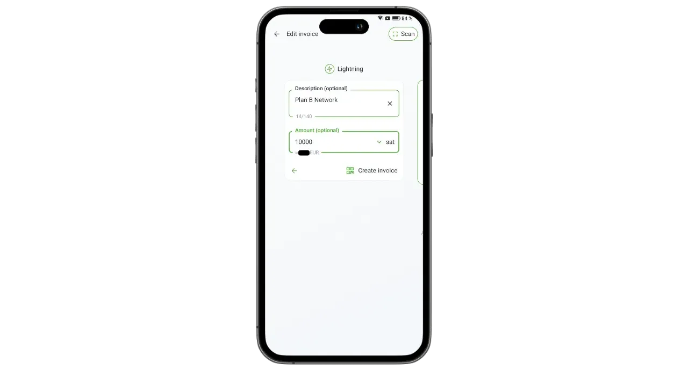

Phoenix è un portafoglio e un nodo Lightning auto-custodiale sviluppato da ACINQ, un'azienda francese specializzata in soluzioni software basate su Lightning. A differenza dei portafogli Lightning con custodia, come Wallet of Satoshi, dove i bitcoin sono detenuti da terzi, Phoenix consente agli utenti di mantenere il pieno controllo delle proprie chiavi private.

Phoenix funziona come un vero nodo Lightning integrato nel tuo telefono, che apre automaticamente un canale con il nodo Lightning di ACINQ. L'applicazione si basa su Lightning-KMP, un'implementazione multipiattaforma della Lightning Network in Kotlin, ottimizzata per i portafogli mobili. A differenza di altre soluzioni di nodi Lightning, Phoenix semplifica notevolmente la gestione. L'utente non deve preoccuparsi di aprire e chiudere canali, eseguire un nodo Bitcoin o gestire la liquidità sulla rete Lightning. Phoenix si occupa automaticamente di tutte queste operazioni tecniche in background.

Questa applicazione combina la facilità d'uso e la convenienza dei portafogli Lightning mobili con la sicurezza e la sovranità di un vero e proprio nodo Lightning personale. Phoenix permette di utilizzare la rete Lightning in modo sicuro, efficiente e autonomo, godendo di un'esperienza utente fluida e intuitiva.

In cambio, si applicano alcune tariffe:

- L'invio tramite Lightning costa lo 0,4% dell'importo più 4 satelliti;
- Se è necessario ricevere contanti tramite Lightning, viene addebitato l'1% dell'importo;
- L'apertura di ogni canale costa 1000 sats.

A mio parere, Phoenix rappresenta un'eccellente soluzione intermedia tra i portafogli Lightning con custodia e la gestione manuale di un nodo Lightning. Questa applicazione è adatta sia ai principianti che agli utenti avanzati che preferiscono non occuparsi dei dettagli della gestione del proprio LND o Core Lightning. Scopriamo come utilizzarla!

## Installare l'applicazione

Andate nel vostro negozio di applicazioni e installate Phoenix :

- Sul [Google Play Store](https://play.google.com/store/apps/details?id=fr.acinq.phoenix.mainnet);
- Su [App Store](https://apps.apple.com/fr/app/phoenix-wallet/id1544097028?l=en-GB).

È anche possibile installare l'applicazione [con il file apk sul loro repository GitHub](https://github.com/ACINQ/phoenix/releases).

## Creazione del portafoglio

Una volta avviata l'applicazione, fare clic sul pulsante "*Next*" per saltare la presentazione, quindi su "*Start*".

Selezionare "*Crea un nuovo portafoglio*".

Ecco fatto: il portafoglio e il nodo Lightning sono stati creati.

## Salvare la frase mnemonica

Prima di iniziare, dobbiamo salvare la nostra frase mnemonica di 12 parole. Questa frase dà accesso completo e illimitato a tutti i vostri bitcoin. Chiunque sia in possesso di questa frase può rubare i vostri fondi, anche senza accedere fisicamente al vostro telefono.

La frase di 12 parole ripristina l'accesso ai bitcoin in caso di perdita, furto o rottura del telefono. È quindi molto importante salvarla con cura e conservarla in un luogo sicuro.

Potete scriverlo su carta o, per maggiore sicurezza, inciderlo su acciaio inossidabile per proteggerlo da incendi, inondazioni o crolli. La scelta del supporto per il vostro mnemonico dipenderà dalla vostra strategia di sicurezza, ma se utilizzate Phoenix come portafoglio di spesa contenente importi moderati, la carta dovrebbe essere sufficiente.

Per ulteriori informazioni sul modo corretto di salvare e gestire la frase mnemonica, vi consiglio di seguire quest'altro tutorial, soprattutto se siete principianti:

https://planb.network/tutorials/wallet/backup/backup-mnemonic-22c0ddfa-fb9f-4e3a-96f9-46e2a7954270

Fare clic sul messaggio visualizzato nella parte superiore dell'interfaccia "*Salva il tuo portafoglio...*".

Poi cliccate su "*Salva il mio portafoglio*".

Poi cliccate su "*Vedi la mia chiave*" e salvate la vostra frase mnemonica su un supporto fisico.

Controllare le due caselle in fondo all'interfaccia per confermare che il backup è stato completato con successo.

## Configurazione dell'applicazione

Prima di effettuare le prime transazioni, è possibile personalizzare le impostazioni facendo clic sull'icona della ruota dentata in basso a sinistra dell'interfaccia.

Nel menu "*Display*" è possibile scegliere il tema dell'applicazione, la denominazione utilizzata per i bitcoin e la valuta locale.

In "*Opzioni di pagamento*" si trovano varie impostazioni avanzate per i pagamenti Lightning. È possibile mantenere le impostazioni predefinite.

In "*Gestione canali*", impostare la tariffa massima che si è disposti a pagare per l'apertura di un canale Lightning.

Nel menu "*Controllo degli accessi*", vi consiglio vivamente di attivare un sistema di autenticazione per proteggere l'accesso all'applicazione sul vostro telefono. Questo impedirà a chiunque abbia accesso al vostro telefono sbloccato di accedere a Phoenix e rubare i vostri bitcoin.

Nel menu "*Server Electrum*", se si dispone di un server Electrs, è possibile collegarlo per trasmettere le transazioni.

Per migliorare la riservatezza delle vostre connessioni, attivate le connessioni via Tor nel menu "*Tor*". Sebbene l'uso di Tor possa rallentare leggermente i pagamenti e richieda che l'applicazione Phoenix sia aperta in primo piano durante la ricezione, aumenta notevolmente la privacy.

## Ricevere bitcoin su catena

Al primo utilizzo, avete la possibilità di caricare il vostro portafoglio Phoenix con i fondi della catena. Potete anche effettuare questo primo deposito direttamente da Lightning (vedi sezione successiva), ma in entrambi i casi verranno applicate delle commissioni aggiuntive per l'apertura del primo canale.

Fare clic sul pulsante "*Ricevi*".

Passate il dito sul codice QR a destra per scoprire un indirizzo di ricezione di Bitcoin. Inviate l'importo che desiderate depositare con Phoenix.

L'importo ricevuto sulla catena apparirà prima come in sospeso nel saldo del portafoglio. Ci vorranno 3 conferme prima che i fondi siano disponibili per l'uso.

Una volta ricevuti i fondi, Phoenix apre automaticamente un canale Lightning per voi. Ora è possibile inviare e ricevere bitcoin tramite la rete Lightning.

## Ricevere bitcoin tramite Lightning

Per ricevere i satelliti tramite la rete Lightning, fare clic sul pulsante "*Ricevi*".

Phoenix genera una fattura Lightning. Potete scannerizzarla o inviarla alla persona che desidera trasferirvi i satelliti.

Facendo clic sul pulsante "*Modifica*", è possibile aggiungere una descrizione che sarà visibile al pagatore sulla fattura e definire un importo specifico che il pagatore deve inviare.

Le fatture classiche di cui sopra possono essere utilizzate una sola volta. Per un'opzione di pagamento riutilizzabile, potete utilizzare il vostro codice QR riutilizzabile, che è un'offerta BOLT12.

Una volta saldata la fattura o l'offerta BOLT12, la transazione apparirà sul vostro portafoglio Lightning.

## Inviare bitcoin tramite Lightning

Ora che avete i sats su Phoenix, siete pronti a effettuare i pagamenti tramite la rete Lightning. Iniziate facendo clic sul pulsante "*Invio*".

Sono disponibili diverse opzioni. Cliccando su "*Scansiona codice QR*", potete scansionare una fattura Lightning, un'offerta BOLT12 o anche un indirizzo di ricezione per il pagamento on-chain.

È possibile inserire queste informazioni anche manualmente tramite la tastiera nel campo in alto nell'interfaccia, oppure inserire un indirizzo Lightning (BOLT12 o LNURL). È anche possibile incollare direttamente le informazioni utilizzando il pulsante "*Incolla*".

In questo esempio, ho scansionato una fattura per 10.000 satelliti. Per effettuare il pagamento, basta cliccare su "*Pagare*".

La transazione è completata.

Congratulazioni, ora sapete come configurare e utilizzare Phoenix. Se avete trovato utile questa guida, vi sarei grato se lasciaste un pollice verde qui sotto. Sentitevi liberi di condividere questo articolo sui vostri social network. Grazie per la condivisione!

Per fare un ulteriore passo avanti, date un'occhiata a questo tutorial su Alby Hub, un'altra soluzione innovativa e facile da usare per lanciare il vostro nodo Lightning:

https://planb.network/tutorials/node/lightning-network/alby-hub-62e6356c-6a6d-4134-8f22-c3b6afb9882a

Per saperne di più sul funzionamento tecnico della rete Lightning, potete trovare l'eccellente formazione gratuita di Fanis Michalakis su Plan ₿ Network :

https://planb.network/courses/34bd43ef-6683-4a5c-b239-7cb1e40a4aeb
