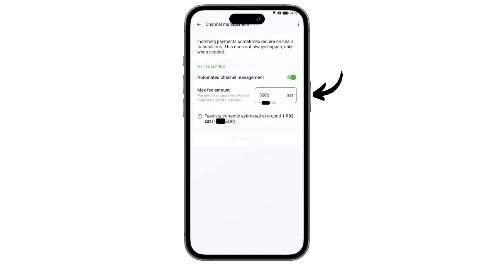
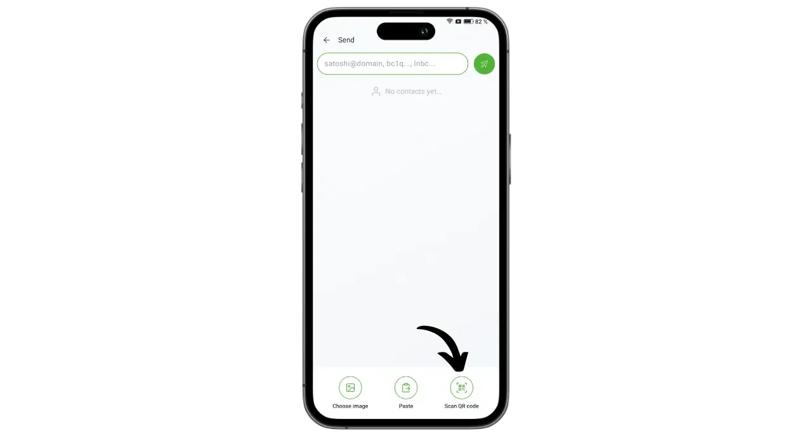

Phoenixは、Lightningベースのソフトウェア・ソリューションを専門とするフランスのACINQ社によって開発された、自己保管型のLightningウォレットおよびノードである。Wallet of Satoshiのようなカストディアル・ライトニング・ウォレットとは異なり、ビットコインは第三者によって保管される。

実際、Phoenixは携帯電話に埋め込まれた本物のLightningノードのように動作し、ACINQのLightningノードとのチャネルを自動的に開きます。このアプリケーションは、ACINQが開発したLightning実装であるEclairに基づいている。他のLightningノード・ソリューションとは異なり、Phoenixは管理を大幅に簡素化する。ユーザーは、チャネルの開設と閉鎖を管理したり、ビットコインノードを実行したり、ライトニングネットワーク上の流動性を管理したりする必要がない。Phoenixはこれらの技術的な操作をすべてバックグラウンドで行います。

このアプリケーションは、モバイル・ライトニング・ウォレットの使いやすさと利便性と、本物のパーソナル・ライトニング・ノードのセキュリティと主権を兼ね備えています。Phoenixは、流動的で直感的なユーザー体験を楽しみながら、ライトニング・ネットワークを安全かつ効率的に、そして自律的に利用することを可能にします。

その代わり、一定の手数料がかかる：

- ライトニングで送金する場合は、送金額の0.4%に加え、4サットの手数料がかかる；
- Lightningで受け取る際に現金が必要な場合は、金額の1％が手数料としてかかる；
- 各チャンネルを開くには1000サットかかる。

私の意見では、PhoenixはカストディアルLightningポートフォリオとLightningノードの手動管理の中間的なソリューションとして優れている。このアプリケーションは、初心者にも、LNDやCore Lightningの詳細な管理をしたくない上級ユーザーにも適しています。では、使い方を説明しよう！

## アプリケーションをインストールする

アプリケーションストアに行き、Phoenix .NETをインストールする：

- Google Playストア](https://play.google.com/store/apps/details?id=fr.acinq.phoenix.mainnet)にて；
- App Store](https://apps.apple.com/fr/app/phoenix-wallet/id1544097028?l=en-GB)で。

GitHubリポジトリにあるapkファイルを使って]アプリケーションをインストールすることもできる(https://github.com/ACINQ/phoenix/releases)。

## ポートフォリオの作成

アプリケーションが起動したら、"*Next*"ボタンをクリックしてプレゼンテーションをスキップし、"*Start*"をクリックします。

新しいウォレットを作成する "を選択します。

これでLightningウォレットとノードの作成は完了です。

## ニモニックフレーズを保存

始める前に、12語のニーモニック・フレーズを保存する必要がある。このフレーズによって、あなたのすべてのビットコインに完全かつ無制限にアクセスできるようになる。このフレーズを持っている人は、あなたの携帯電話に物理的にアクセスできなくても、あなたの資金を盗むことができます。

この12単語のフレーズは、携帯電話の紛失、盗難、破損の際にビットコインへのアクセスを回復します。そのため、慎重に保存し、安全な場所に保管することが非常に重要です。

紙に書いてもいいし、セキュリティを高めるためにステンレス鋼に刻印して、火災、洪水、倒壊から守ることもできる。ニーモニックの媒体の選択は、あなたのセキュリティ戦略次第だが、フェニックスを中程度の金額を含む支出ポートフォリオとして使うのであれば、紙で十分だろう。

ニモニックフレーズの保存と管理の適切な方法については、特に初心者の方には、この他のチュートリアルをご覧になることを強くお勧めします：

https://planb.network/tutorials/wallet/backup/backup-mnemonic-22c0ddfa-fb9f-4e3a-96f9-46e2a7954270
インターフェースの上部に表示されるメッセージ「*Save your wallet...*」をクリックします。

そして「*財布を保存*」をクリックする。

そして「*View my key*」をクリックし、ニーモニック・フレーズを物理的な媒体に保存する。

インターフェイスの下部にある2つのボックスをチェックして、バックアップが正常に完了したことを確認します。

## アプリケーションのセットアップ

最初の取引を行う前に、インターフェースの左下にある歯車のアイコンをクリックして設定をカスタマイズすることができます。

Display*」メニューでは、アプリケーションのテーマ、ビットコインに使用するデノミネーション、ローカルのフィアット通貨を選択することができます。

支払いオプション*」には、ライトニング決済に関する様々な詳細設定があります。デフォルト設定のままでも構いません。

チャンネル管理*」では、ライトニングチャンネル開設時に支払う手数料の上限を設定します。

アクセスコントロール*」メニューで、携帯電話のアプリケーションへのアクセスを保護するために認証システムを有効にすることを強くお勧めします。これにより、ロックされていない携帯電話にアクセスできる人がPhoenixにアクセスし、ビットコインを盗むことを防ぐことができます。

Electrumサーバー*」メニューでは、Electrsサーバーをお持ちの場合、そのサーバーに接続してトランザクションをブロードキャストすることができます。

接続の機密性を高めるには、「*Tor*」メニューでTor経由の接続を有効にしてください。Torを使用すると、支払いの速度が若干遅くなり、受信時にPhoenixアプリケーションをフォアグラウンドで開いておく必要がありますが、プライバシーは大幅に向上します。

## オンチェーンでビットコインを受け取る

初回使用時に、Phoenixウォレットにオンチェーン資金を入金するオプションがあります。この初回入金はLightningから直接行うこともできますが（次項参照）、いずれの場合も最初のチャネル開設には追加手数料がかかります。

受信*」ボタンをクリックする。

QRコードを右にスワイプすると、ビットコインの受け取りアドレスが表示されます。フェニックスに入金したい金額を送金する。

オンチェーンで受け取った金額は、まずポートフォリオ残高の下に保留中として表示されます。資金が使用可能になるまで3回の確認が必要です。

資金を受け取ると、Phoenixは自動的にLightningチャネルを開きます。これでライトニングネットワーク経由でビットコインを送受信できるようになります。

## Lightningでビットコインを受け取る

ライトニング・ネットワーク経由で衛星を受信するには、「*受信*」ボタンをクリックします。

PhoenixはLightningの請求書を作成します。これをスキャンするか、サッツの移籍を希望する相手に送信します。

Edit*」ボタンをクリックすると、請求書に支払者に表示される説明文を追加したり、支払者が送信しなければならない特定の金額を定義したりすることができます。

上記の古典的な請求書は一度しか使用できません。再利用可能な支払いオプションについては、再利用可能なQRコードを使用することができます。

請求書またはBOLT12のオファーが決済されると、取引はLightningウォレットに表示されます。

## ライトニングでビットコインを送る

Phoenixにsatsをインストールしたら、Lightning Network経由で支払いを行う準備が整いました。まずは「*送信*」ボタンをクリックしてください。

いくつかのオプションをご利用いただけます。QRコードをスキャン*」をクリックすると、Lightningの請求書やBOLT12のオファー、あるいはオンチェーン決済用の受取アドレスをスキャンすることができます。

この情報は、インターフェイス上部のフィールドにキーボードから手入力することも、ライトニングアドレス（BOLT12またはLNURL）を入力することもできます。また、「*貼り付け*」ボタンを使って直接情報を貼り付けることもできます。

この例では、10,000サットの請求書をスキャンしました。支払いは「*Pay*」をクリックしてください。

取引は完了した。

これでPhoenixの設定と使い方がわかりました。このチュートリアルが役に立ったなら、以下に緑の親指を残していただけるとありがたいです。この記事をあなたのソーシャルネットワークでシェアしてください。ありがとうございました！

さらに一歩進めるために、独自のLightningノードを立ち上げるためのもう一つの革新的で使いやすいソリューションであるAlby Hubのチュートリアルをご覧ください：

https://planb.network/tutorials/node/lightning-network/alby-hub-62e6356c-6a6d-4134-8f22-c3b6afb9882a
また、ライトニング・ネットワークの技術的な操作については、ファニス・ミハラキスによるプラン₿ネットワークに関する優れた無料トレーニングをご覧ください：

https://planb.network/courses/34bd43ef-6683-4a5c-b239-7cb1e40a4aeb