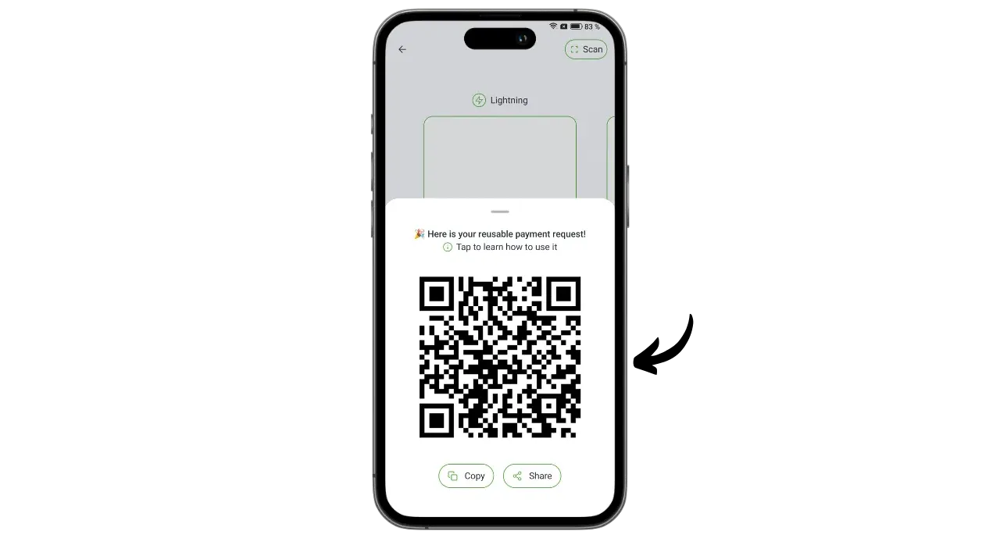

Phoenix er en selvforvaltende Lightning-lommebok og -node utviklet av ACINQ, et fransk selskap som spesialiserer seg på Lightning-baserte programvareløsninger. I motsetning til depotbaserte Lightning-lommebøker som Wallet of Satoshi, der bitcoins oppbevares av en tredjepart, gjør Phoenix det mulig for brukerne å beholde full kontroll over sine private nøkler.

Phoenix fungerer som en ekte Lightning-node integrert på telefonen din, som automatisk åpner en kanal med ACINQs Lightning-node. Applikasjonen er basert på Lightning-KMP, en plattformuavhengig implementering av Lightning Network i Kotlin, optimalisert for mobile lommebøker. I motsetning til andre Lightning-node-løsninger, forenkler Phoenix administrasjonen betydelig. Brukeren trenger ikke å administrere åpning og lukking av kanaler, kjøre en Bitcoin-node eller håndtere likviditeten på Lightning-nettverket. Phoenix tar seg av alle disse tekniske operasjonene i bakgrunnen.

Denne applikasjonen kombinerer brukervennligheten og bekvemmeligheten til mobile Lightning-lommebøker med sikkerheten og suvereniteten til en ekte personlig Lightning-node. Phoenix gjør det mulig å bruke Lightning-nettverket på en sikker, effektiv og selvstendig måte, samtidig som du får en flytende og intuitiv brukeropplevelse.

Til gjengjeld påløper det visse avgifter:

- Å sende via Lightning koster 0,4 % av beløpet pluss 4 sats ;
- Hvis det er behov for kontanter for å motta via Lightning, belastes 1 % av beløpet;
- Hver kanal koster 1000 sats å åpne.

Etter min mening representerer Phoenix en utmerket mellomløsning mellom depotbaserte Lightning-porteføljer og manuell administrasjon av en Lightning-node. Programmet passer like godt for nybegynnere som for avanserte brukere som foretrekker å slippe å håndtere detaljene ved å administrere sin egen LND eller Core Lightning. La oss finne ut hvordan du bruker det!

## Installer applikasjonen

Gå til applikasjonsbutikken din og installer Phoenix :

- På [Google Play Store] (https://play.google.com/store/apps/details?id=fr.acinq.phoenix.mainnet);
- På [App Store] (https://apps.apple.com/fr/app/phoenix-wallet/id1544097028?l=en-GB).

Du kan også installere applikasjonen [med apk-filen på GitHub-depotet] (https://github.com/ACINQ/phoenix/releases).

## Opprettelse av portefølje

Når programmet har startet, klikker du på knappen "*Neste*" for å hoppe over presentasjonen, og deretter på "*Start*".

Velg "*Opprett en ny lommebok*".

Og det var det, Lightning-lommeboken og noden din er nå opprettet.

## Lagre mnemoteknisk setning

Før vi setter i gang, må vi lagre minnefrasen på 12 ord. Denne frasen gir fullstendig, ubegrenset tilgang til alle bitcoinsene dine. Alle som har denne frasen kan stjele pengene dine, selv uten fysisk tilgang til telefonen din.

Frasen på 12 ord gjenoppretter tilgangen til bitcoinsene dine i tilfelle tap, tyveri eller ødeleggelse av telefonen din. Det er derfor veldig viktig å lagre den nøye og oppbevare den på et trygt sted.

Du kan skrive den på papir eller, for ekstra sikkerhet, gravere den på rustfritt stål for å beskytte den mot brann, oversvømmelse eller kollaps. Valget av medium for minnepinnen avhenger av sikkerhetsstrategien din, men hvis du bruker Phoenix som en utgiftsportefølje som inneholder moderate beløp, bør papir være tilstrekkelig.

Hvis du vil ha mer informasjon om hvordan du lagrer og administrerer minnefrasen din, anbefaler jeg at du følger denne andre veiledningen, spesielt hvis du er nybegynner:

https://planb.network/tutorials/wallet/backup/backup-mnemonic-22c0ddfa-fb9f-4e3a-96f9-46e2a7954270

Klikk på meldingen som vises øverst i grensesnittet "*Save your wallet...*".

Klikk deretter på "*Save my wallet*".

Klikk deretter på "*Vis min nøkkel*" og lagre minnefrasen din på et fysisk medium.

Merk av i de to boksene nederst i grensesnittet for å bekrefte at sikkerhetskopieringen er fullført.

## Oppsett av applikasjon

Før du foretar dine første transaksjoner, kan du tilpasse innstillingene ved å klikke på tannhjulikonet nederst til venstre i grensesnittet.

I "*Display*"-menyen kan du velge applikasjonens tema, denominasjonen som brukes for bitcoin, og din lokale fiat-valuta.

I "*Betalingsalternativer*" finner du ulike avanserte innstillinger for lynbetalinger. Du kan beholde standardinnstillingene.

I "*Kanaladministrasjon*" angir du den maksimale avgiften du er villig til å betale når du åpner en Lightning-kanal.

I menyen "*Access control*" anbefaler jeg på det sterkeste at du aktiverer et autentiseringssystem for å sikre tilgangen til applikasjonen på telefonen din. Dette vil forhindre at noen med tilgang til den ulåste telefonen din får tilgang til Phoenix og stjeler bitcoinsene dine.

I menyen "*Electrum-server*" kan du koble til en Electrs-server hvis du har en slik server for å sende transaksjonene dine.

For å forbedre konfidensialiteten til forbindelsene dine kan du aktivere forbindelser via Tor i "*Tor*"-menyen. Selv om Tor kan gjøre betalingene dine litt tregere, og krever at Phoenix-programmet er åpent i forgrunnen når du mottar, øker det personvernet ditt betydelig.

## Motta bitcoins på kjeden

Ved første gangs bruk har du muligheten til å laste Phoenix-lommeboken din med midler fra kjeden. Du kan også gjøre dette første innskuddet direkte fra Lightning (se neste avsnitt), men i begge tilfeller vil det påløpe ekstra gebyrer for å åpne din første kanal.

Klikk på knappen "*Mottak*".

Sveip QR-koden til høyre for å avsløre en Bitcoin-mottakeradresse. Send den beløpet du ønsker å sette inn hos Phoenix.

Beløpet som mottas på kjeden, vises først som ventende under porteføljesaldoen din. Det vil ta tre bekreftelser før midlene er tilgjengelige for bruk.

Når pengene er mottatt, åpner Phoenix automatisk en Lightning-kanal for deg. Du kan nå sende og motta bitcoins via Lightning Network.

## Motta bitcoins via Lightning

For å motta satellitter via Lightning Network klikker du på "*Mottak*"-knappen.

Phoenix genererer en lynfaktura. Du kan enten skanne den eller sende den til personen som ønsker å overføre satsene til deg.

Ved å klikke på "*Rediger*"-knappen kan du legge til en beskrivelse som vil være synlig for betaleren på fakturaen, og definere et spesifikt beløp som betaleren skal sende.

De klassiske fakturaene nevnt ovenfor kan bare brukes én gang. For et gjenbrukbart betalingsalternativ kan du bruke den gjenbrukbare QR-koden din, som er et BOLT12-tilbud.

Når fakturaen eller BOLT12-tilbudet er gjort opp, vises transaksjonen i Lightning-lommeboken din.

## Send bitcoins via Lightning

Nå som du har sats på Phoenix, er du klar til å foreta betalinger via Lightning Network. Begynn med å klikke på "*Send*"-knappen.

Flere alternativer er tilgjengelige for deg. Ved å klikke på "*Skann QR-kode*" kan du skanne en lynfaktura, et BOLT12-tilbud eller til og med en mottaksadresse for betaling i kjeden.

Du kan også skrive inn denne informasjonen manuelt via tastaturet i feltet øverst i grensesnittet, eller du kan skrive inn en Lightning-adresse (BOLT12 eller LNURL). Du kan også lime inn informasjonen direkte ved hjelp av "*Lim inn*"-knappen.

I dette eksempelet har jeg skannet en faktura på 10 000 satser. For å betale, klikker du bare på "*Betal*".

Transaksjonen er fullført.

Gratulerer, du vet nå hvordan du konfigurerer og bruker Phoenix. Hvis du synes denne veiledningen var nyttig, vil jeg være takknemlig hvis du legger igjen en grønn tommel nedenfor. Del gjerne denne artikkelen på dine sosiale nettverk. Takk for at du deler!

Hvis du vil gå et skritt videre, kan du ta en titt på denne veiledningen om Alby Hub, en annen innovativ og brukervennlig løsning for å lansere din egen Lightning-node:

https://planb.network/tutorials/node/lightning-network/alby-hub-62e6356c-6a6d-4134-8f22-c3b6afb9882a

Og for å finne ut mer om den tekniske driften av Lightning Network, kan du finne Fanis Michalakis' utmerkede gratis opplæring på Plan ₿ Network :

https://planb.network/courses/34bd43ef-6683-4a5c-b239-7cb1e40a4aeb
