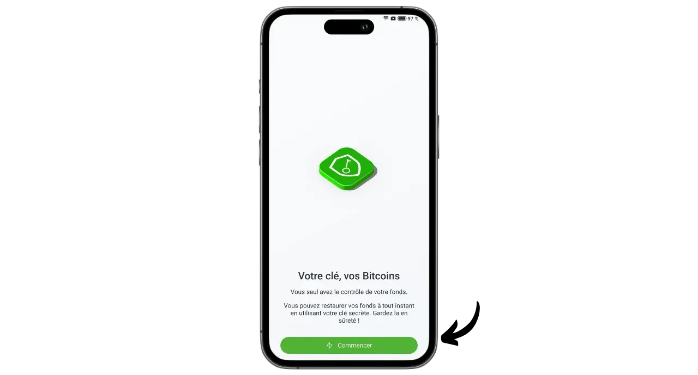
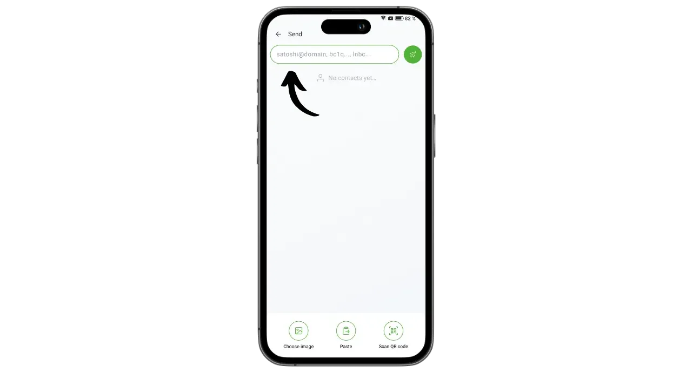

Phoenix - это самоокупаемый кошелек Lightning и узел, разработанный ACINQ, французской компанией, специализирующейся на программных решениях на базе Lightning. В отличие от таких кошельков Lightning, как Wallet of Satoshi, где биткоины хранятся у третьей стороны, Phoenix позволяет пользователям сохранять полный контроль над своими приватными ключами.

Phoenix работает как полноценный узел Lightning, встроенный в ваш телефон, который автоматически открывает канал с узлом Lightning компании ACINQ. Приложение основано на Lightning-KMP, кроссплатформенной реализации сети Lightning на Kotlin, оптимизированной для мобильных кошельков. В отличие от других решений для узлов Lightning, Phoenix значительно упрощает управление. Пользователь не обязан управлять открытием и закрытием каналов, запускать узел Bitcoin или контролировать ликвидность в сети Lightning. Phoenix выполняет все эти технические операции в фоновом режиме.

Это приложение сочетает в себе простоту использования и удобство мобильных кошельков Lightning с безопасностью и суверенитетом настоящего персонального узла Lightning. Phoenix позволяет безопасно, эффективно и автономно использовать сеть Lightning Network, наслаждаясь при этом плавным и интуитивно понятным пользовательским интерфейсом.

За это взимается определенная плата:

- Отправка через Lightning стоит 0,4% от суммы плюс 4 сата;
- Если для получения через Lightning необходимы наличные, взимается 1% от суммы;
- Открытие каждого канала стоит 1000 сат.

На мой взгляд, Phoenix представляет собой отличное промежуточное решение между кастодиальными портфелями Lightning и ручным управлением узлом Lightning. Это приложение одинаково хорошо подходит как для новичков, так и для опытных пользователей, которые предпочитают не вникать в детали управления собственным LND или Core Lightning. Давайте узнаем, как им пользоваться!

## Установите приложение

Зайдите в магазин приложений и установите Phoenix :

- В [Google Play Store](https://play.google.com/store/apps/details?id=fr.acinq.phoenix.mainnet);
- В [App Store] (https://apps.apple.com/fr/app/phoenix-wallet/id1544097028?l=en-GB).

Вы также можете установить приложение [с помощью apk-файла на их репозитории GitHub](https://github.com/ACINQ/phoenix/releases).

## Создание портфолио

После запуска приложения нажмите на кнопку "*Следующее*", чтобы пропустить презентацию, а затем на "*Начать*".

Выберите "*Создать новый кошелек*".

Вот и все, ваш кошелек Lightning и узел теперь созданы.

## Сохраните мнемоническую фразу

Прежде чем приступить к работе, нам нужно сохранить нашу мнемоническую фразу из 12 слов. Эта фраза дает полный, неограниченный доступ ко всем вашим биткоинам. Любой человек, владеющий этой фразой, может украсть ваши средства, даже не имея физического доступа к вашему телефону.

Фраза из 12 слов восстанавливает доступ к вашим биткоинам в случае потери, кражи или поломки телефона. Поэтому очень важно тщательно сохранить ее и хранить в безопасном месте.

Вы можете написать его на бумаге или, для большей надежности, выгравировать на нержавеющей стали, чтобы защитить его от пожара, наводнения или обрушения. Выбор носителя для мнемоники зависит от вашей стратегии безопасности, но если вы используете Phoenix в качестве портфеля для трат, содержащего умеренные суммы, бумаги должно быть достаточно.

Для получения более подробной информации о том, как правильно сохранять и управлять мнемоническими фразами, я настоятельно рекомендую ознакомиться с другими уроками, особенно если вы новичок:

https://planb.network/tutorials/wallet/backup/backup-mnemonic-22c0ddfa-fb9f-4e3a-96f9-46e2a7954270

Нажмите на сообщение, отображаемое в верхней части интерфейса "*Сохраните свой кошелек...*".

Затем нажмите на кнопку "*Сохранить мой кошелек*".

Затем нажмите на кнопку "*Просмотреть мой ключ*" и сохраните свою мнемоническую фразу на физическом носителе.

Установите два флажка в нижней части интерфейса, чтобы подтвердить успешное завершение резервного копирования.

## Настройка приложения

Перед тем как совершить первые транзакции, вы можете настроить параметры, нажав на значок шестеренки в левой нижней части интерфейса.

В меню "*Отображение*" можно выбрать тему приложения, номинал биткоина и местную фиатную валюту.

В разделе "*Параметры оплаты*" вы найдете различные дополнительные настройки для платежей Lightning. Вы можете оставить настройки по умолчанию.

В разделе "*Управление каналом*" установите максимальную плату, которую вы готовы заплатить при открытии канала Lightning.

В меню "*Управление доступом*" я настоятельно рекомендую вам активировать систему аутентификации для защиты доступа к приложению на вашем телефоне. Это не позволит никому, у кого есть доступ к вашему незаблокированному телефону, получить доступ к Phoenix и украсть ваши биткоины.

В меню "*Сервер Electrum*", если у вас есть сервер Electrs, вы можете подключить его для трансляции ваших транзакций.

Чтобы повысить конфиденциальность ваших соединений, включите подключение через Tor в меню "*Tor*". Хотя использование Tor может несколько замедлить проведение платежей и требует, чтобы приложение Phoenix было открыто на переднем плане во время приема, это значительно повышает уровень конфиденциальности.

## Получение биткоинов на цепочке

При первом использовании у вас есть возможность пополнить свой кошелек Phoenix средствами на цепочке. Вы также можете сделать этот первый депозит непосредственно из Lightning (см. следующий раздел), но в любом случае за открытие первого канала будет взиматься дополнительная плата.

Нажмите на кнопку "*Получить*".

Смахните QR-код вправо, чтобы открыть адрес приема биткоинов. Отправьте на него сумму, которую вы хотите внести на счет Phoenix.

Сумма, полученная на цепочке, сначала появится в балансе вашего портфеля как отложенная. Потребуется 3 подтверждения, прежде чем средства станут доступны для использования.

Как только средства будут получены, Phoenix автоматически откроет для вас канал Lightning. Теперь вы можете отправлять и получать биткоины через Lightning Network.

## Получайте биткоины через Lightning

Чтобы получать саты через Lightning Network, нажмите на кнопку "*Принять*".

Phoenix генерирует счет-фактуру Lightning. Вы можете отсканировать его или отправить тому, кто хочет передать вам саты.

Нажав кнопку "*Редактировать*", вы можете добавить описание, которое будет видно плательщику в счете, и определить конкретную сумму, которую плательщик должен отправить.

Классические счета, упомянутые выше, можно использовать только один раз. Для многоразовой оплаты вы можете использовать свой многоразовый QR-код, который является предложением BOLT12.

Как только счет или предложение BOLT12 будут оплачены, транзакция появится в вашем кошельке Lightning.

## Отправляйте биткойны через Lightning

Теперь, когда у вас есть саты на Phoenix, вы готовы совершать платежи через Lightning Network. Начните с нажатия на кнопку "*Отправить*".

Вам доступны несколько вариантов. Нажав на кнопку "*Сканировать QR-код*", вы можете отсканировать счет-фактуру Lightning, предложение BOLT12 или даже адрес получения для оплаты на цепи.

Вы также можете ввести эту информацию вручную с помощью клавиатуры в поле в верхней части интерфейса или ввести адрес Lightning (BOLT12 или LNURL). Вы также можете вставить информацию напрямую с помощью кнопки "*Вставить*".

Для этого примера я отсканировал счет на 10 000 сатов. Чтобы произвести оплату, просто нажмите на кнопку "*Оплатить*".

Транзакция завершена.

Поздравляю, теперь вы знаете, как настроить и использовать Phoenix. Если вы нашли это руководство полезным, я буду благодарен, если вы оставите ниже свой "зеленый палец". Не стесняйтесь поделиться этой статьей в своих социальных сетях. Спасибо, что поделились!

Чтобы сделать еще один шаг вперед, ознакомьтесь с этим руководством по Alby Hub, еще одним инновационным и простым в использовании решением для запуска собственного узла Lightning:

https://planb.network/tutorials/node/lightning-network/alby-hub-62e6356c-6a6d-4134-8f22-c3b6afb9882a

А чтобы узнать больше о технической работе сети Lightning Network, вы можете найти отличный бесплатный тренинг Фаниса Михалакиса по Plan ₿ Network :

https://planb.network/courses/34bd43ef-6683-4a5c-b239-7cb1e40a4aeb
