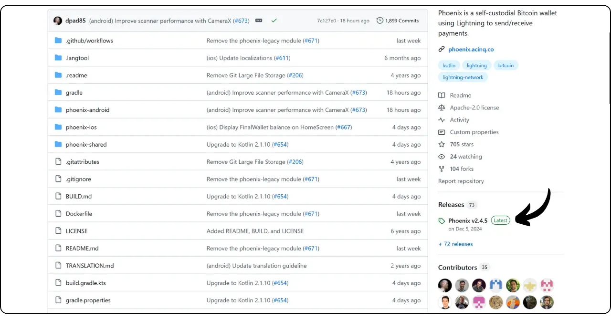
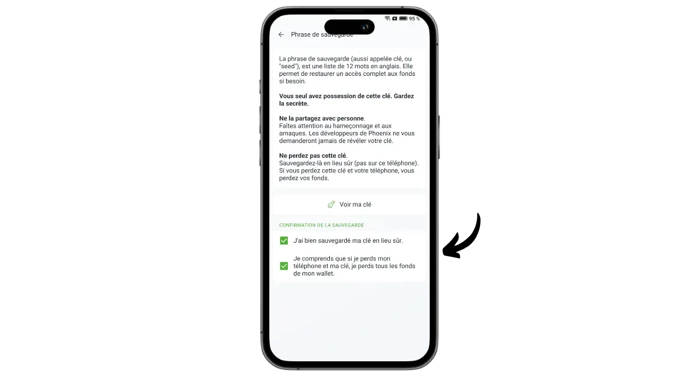

Phoenix là ví và nút Lightning tự lưu giữ do ACINQ, một công ty Pháp chuyên về các giải pháp phần mềm dựa trên Lightning, phát triển. Không giống như các ví Lightning lưu giữ như Wallet of Satoshi, nơi bitcoin được bên thứ ba nắm giữ, Phoenix cho phép người dùng giữ toàn quyền kiểm soát khóa riêng của họ.

Trên thực tế, Phoenix hoạt động như một nút Lightning thực sự được nhúng trong điện thoại của bạn, nút này sẽ tự động mở một kênh bằng nút Lightning của ACINQ. Ứng dụng này dựa trên Eclair, triển khai Lightning do ACINQ phát triển. Không giống như các giải pháp nút Lightning khác, Phoenix đơn giản hóa đáng kể việc quản lý. Người dùng không phải quản lý việc mở và đóng kênh, chạy nút Bitcoin hoặc quản lý tính thanh khoản của họ trên mạng Lightning. Phoenix sẽ xử lý tất cả các hoạt động kỹ thuật này ở chế độ nền.

Ứng dụng này kết hợp tính dễ sử dụng và tiện lợi của ví Lightning di động với tính bảo mật và chủ quyền của một nút Lightning cá nhân thực sự. Phoenix giúp bạn có thể sử dụng Lightning Network một cách an toàn, hiệu quả và tự chủ, đồng thời tận hưởng trải nghiệm người dùng trực quan, trôi chảy.

Đổi lại, một số khoản phí nhất định sẽ được áp dụng:

- Gửi qua Lightning tốn 0,4% số tiền cộng với 4 sats;
- Nếu cần tiền mặt để nhận qua Lightning, bạn sẽ phải trả 1% số tiền;
- Mỗi kênh tốn 1000 sats để mở.

Theo tôi, Phoenix là giải pháp trung gian tuyệt vời giữa danh mục đầu tư Lightning lưu ký và quản lý thủ công một nút Lightning. Ứng dụng này phù hợp với cả người mới bắt đầu và người dùng nâng cao, những người không muốn xử lý các chi tiết về việc quản lý LND hoặc Core Lightning của riêng họ. Hãy cùng tìm hiểu cách sử dụng nó!

## Cài đặt ứng dụng

Vào cửa hàng ứng dụng và cài đặt Phoenix:

- Trên [Cửa hàng Google Play](https://play.google.com/store/apps/details?id=fr.acinq.phoenix.mainnet);
- Trên [App Store](https://apps.apple.com/fr/app/phoenix-wallet/id1544097028?l=en-GB).

Bạn cũng có thể cài đặt ứng dụng [bằng tệp apk trên kho lưu trữ GitHub của họ](https://github.com/ACINQ/phoenix/releases).

## Tạo danh mục đầu tư

Sau khi ứng dụng bắt đầu, hãy nhấp vào nút "*Tiếp theo*" để bỏ qua phần trình bày, sau đó nhấp vào "*Bắt đầu*".

Chọn "*Tạo ví mới*".

Và thế là ví Lightning và nút của bạn đã được tạo.

## Lưu cụm từ ghi nhớ

Trước khi bắt đầu, chúng ta cần lưu cụm từ ghi nhớ 12 từ của mình. Cụm từ này cung cấp quyền truy cập hoàn toàn, không giới hạn vào tất cả bitcoin của bạn. Bất kỳ ai sở hữu cụm từ này đều có thể đánh cắp tiền của bạn, ngay cả khi không có quyền truy cập vật lý vào điện thoại của bạn.

Cụm từ 12 từ này khôi phục quyền truy cập vào bitcoin của bạn trong trường hợp điện thoại bị mất, bị trộm hoặc bị hỏng. Do đó, điều rất quan trọng là phải lưu trữ cẩn thận và cất giữ ở nơi an toàn.

Bạn có thể viết nó trên giấy hoặc, để tăng thêm tính bảo mật, hãy khắc nó trên thép không gỉ để bảo vệ nó khỏi hỏa hoạn, lũ lụt hoặc sụp đổ. Lựa chọn phương tiện cho phương pháp ghi nhớ của bạn sẽ phụ thuộc vào chiến lược bảo mật của bạn, nhưng nếu bạn đang sử dụng Phoenix như một danh mục chi tiêu có số tiền vừa phải, thì giấy sẽ là đủ.

Để biết thêm thông tin về cách lưu và quản lý cụm từ ghi nhớ đúng cách, tôi thực sự khuyên bạn nên làm theo hướng dẫn khác này, đặc biệt nếu bạn là người mới bắt đầu:

https://planb.network/tutorials/wallet/backup/backup-mnemonic-22c0ddfa-fb9f-4e3a-96f9-46e2a7954270

Nhấp vào thông báo hiển thị ở đầu giao diện "*Lưu ví của bạn...*".

Sau đó nhấp vào "*Lưu ví của tôi*".

Sau đó nhấp vào "*Xem khóa của tôi*" và lưu cụm từ ghi nhớ của bạn vào một phương tiện vật lý.

Đánh dấu vào hai hộp ở cuối giao diện để xác nhận rằng quá trình sao lưu đã hoàn tất thành công.

## Thiết lập ứng dụng

Trước khi thực hiện giao dịch đầu tiên, bạn có thể tùy chỉnh cài đặt bằng cách nhấp vào biểu tượng bánh răng ở góc dưới bên trái của giao diện.

Trong menu "*Hiển thị*", bạn có thể chọn chủ đề ứng dụng, mệnh giá sử dụng cho bitcoin và loại tiền pháp định địa phương của bạn.

Trong "*Tùy chọn thanh toán*", bạn sẽ tìm thấy nhiều cài đặt nâng cao cho thanh toán Lightning. Bạn có thể giữ nguyên cài đặt mặc định.

Trong "*Quản lý kênh*", hãy đặt mức phí tối đa bạn sẵn sàng trả khi mở kênh Lightning.

Trong menu "*Kiểm soát truy cập*", tôi thực sự khuyên bạn nên kích hoạt hệ thống xác thực để bảo mật quyền truy cập vào ứng dụng trên điện thoại của bạn. Điều này sẽ ngăn chặn bất kỳ ai có quyền truy cập vào điện thoại đã mở khóa của bạn truy cập vào Phoenix và đánh cắp bitcoin của bạn.

Trong menu "*Máy chủ Electrum*", nếu bạn có máy chủ Electrs, bạn có thể kết nối máy chủ đó để phát các giao dịch của mình.

Để tăng cường tính bảo mật cho các kết nối của bạn, hãy bật kết nối qua Tor trong menu "*Tor*". Mặc dù việc sử dụng Tor có thể làm chậm một chút các khoản thanh toán của bạn và yêu cầu ứng dụng Phoenix phải mở ở chế độ nền trước khi nhận, nhưng nó làm tăng đáng kể tính riêng tư của bạn.

## Nhận bitcoin trên chuỗi

Khi sử dụng lần đầu, bạn có tùy chọn nạp tiền vào ví Phoenix của mình bằng tiền trên chuỗi. Bạn cũng có thể thực hiện khoản tiền gửi đầu tiên này trực tiếp từ Lightning (xem phần tiếp theo), nhưng trong cả hai trường hợp, bạn sẽ phải trả thêm phí để mở kênh đầu tiên.

Nhấp vào nút "*Nhận*".

Vuốt mã QR sang phải để hiển thị địa chỉ nhận Bitcoin. Gửi số tiền bạn muốn gửi vào Phoenix.

Số tiền nhận được trên chuỗi sẽ xuất hiện đầu tiên dưới dạng đang chờ xử lý trong số dư danh mục đầu tư của bạn. Sẽ mất 3 lần xác nhận trước khi số tiền có thể sử dụng.

Sau khi nhận được tiền, Phoenix sẽ tự động mở kênh Lightning cho bạn. Bây giờ bạn có thể gửi và nhận bitcoin qua Lightning Network.

## Nhận bitcoin qua Lightning

Để nhận vệ tinh qua Lightning Network, hãy nhấp vào nút "*Nhận*".

Phoenix tạo hóa đơn Lightning. Bạn có thể quét hoặc gửi cho người muốn chuyển sats cho bạn.

Bằng cách nhấp vào nút "*Chỉnh sửa*", bạn có thể thêm mô tả sẽ hiển thị cho người trả tiền trên hóa đơn và xác định số tiền cụ thể mà người trả tiền phải gửi.

Các hóa đơn cổ điển được đề cập ở trên chỉ có thể sử dụng một lần. Đối với tùy chọn thanh toán có thể tái sử dụng, bạn có thể sử dụng mã QR có thể tái sử dụng của mình, đây là ưu đãi BOLT12.

Sau khi hóa đơn hoặc ưu đãi BOLT12 được thanh toán, giao dịch sẽ hiển thị trên ví Lightning của bạn.

## Gửi bitcoin qua Lightning

Bây giờ bạn đã có sats trên Phoenix, bạn đã sẵn sàng thực hiện thanh toán qua Lightning Network. Bắt đầu bằng cách nhấp vào nút "*Gửi*".

Có một số tùy chọn dành cho bạn. Bằng cách nhấp vào "*Quét mã QR*", bạn có thể quét hóa đơn Lightning, ưu đãi BOLT12 hoặc thậm chí là địa chỉ nhận để thanh toán trên chuỗi.

Bạn cũng có thể nhập thông tin này theo cách thủ công thông qua bàn phím trong trường ở đầu giao diện hoặc nhập địa chỉ Lightning (BOLT12 hoặc LNURL). Bạn cũng có thể dán thông tin trực tiếp bằng nút "*Dán*".

Trong ví dụ này, tôi đã quét một hóa đơn trị giá 10.000 sats. Để thanh toán, chỉ cần nhấp vào "*Thanh toán*".

Giao dịch đã hoàn tất.

Xin chúc mừng, giờ bạn đã biết cách cấu hình và sử dụng Phoenix. Nếu bạn thấy hướng dẫn này hữu ích, tôi sẽ rất biết ơn nếu bạn để lại một ngón tay cái màu xanh lá cây bên dưới. Hãy thoải mái chia sẻ bài viết này trên mạng xã hội của bạn. Cảm ơn vì đã chia sẻ!

Để tìm hiểu sâu hơn, hãy xem hướng dẫn này về Alby Hub, một giải pháp sáng tạo và dễ sử dụng khác để khởi chạy nút Lightning của riêng bạn:

https://planb.network/tutorials/node/lightning-network/alby-hub-62e6356c-6a6d-4134-8f22-c3b6afb9882a

Và để tìm hiểu thêm về hoạt động kỹ thuật của Lightning Network, bạn có thể tìm thấy khóa đào tạo miễn phí tuyệt vời của Fanis Michalakis về Plan ₿ Network:

https://planb.network/courses/34bd43ef-6683-4a5c-b239-7cb1e40a4aeb
