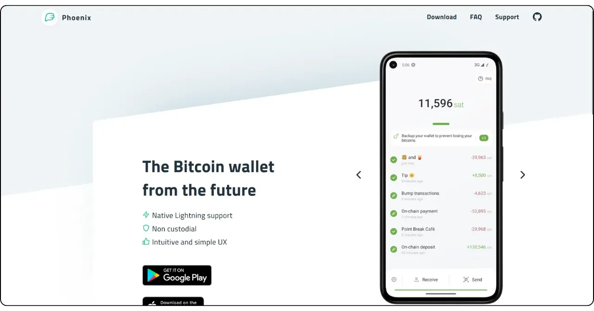
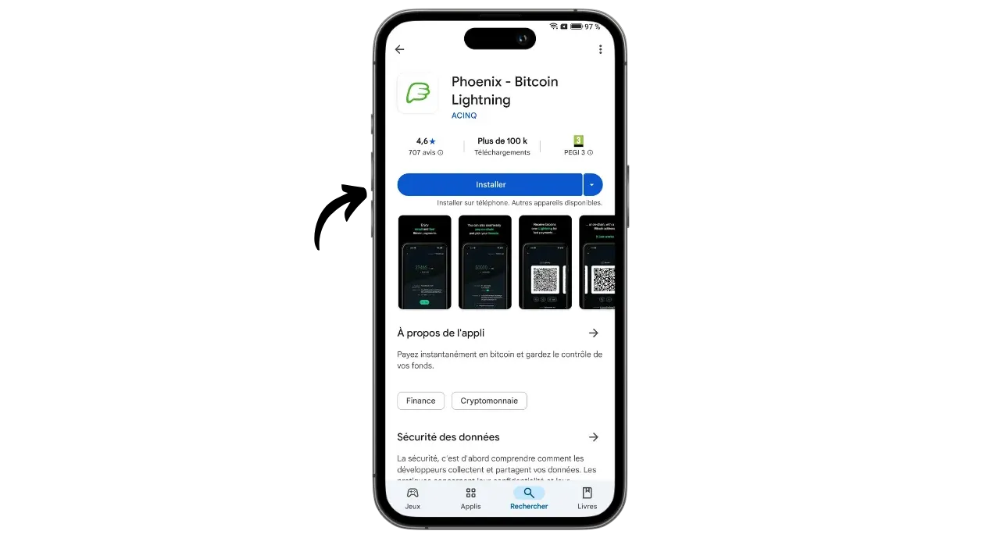
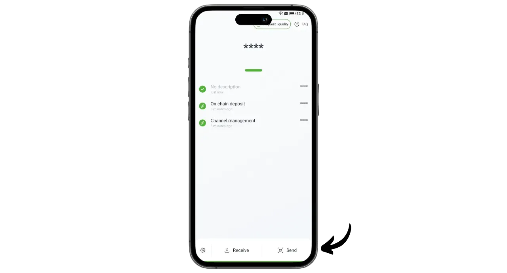

Phoenix 是一个自我托管的闪电钱包和节点，由法国一家专门从事基于闪电的软件解决方案的公司 ACINQ 开发。与中本聪钱包（Wallet of Satoshi）等由第三方托管比特币的闪电钱包不同，Phoenix 使用户能够完全控制自己的私钥。

Phoenix 作为一个真正的 Lightning 节点嵌入到您的手机中，会自动与 ACINQ 的 Lightning 节点打开通道。该应用基于 Lightning-KMP，这是一种使用 Kotlin 编写的跨平台 Lightning Network 实现，并针对移动钱包进行了优化。与其他 Lightning 节点解决方案不同，Phoenix 大大简化了管理。用户无需管理通道的开启和关闭，不需要运行 Bitcoin 节点，也不必管理 Lightning 网络上的流动性。Phoenix 会在后台处理所有这些技术操作。

该应用程序将移动闪电钱包的易用性和便利性与真正的个人闪电节点的安全性和主权性相结合。Phoenix 使安全、高效、自主地使用闪电网络成为可能，同时还能享受流畅、直观的用户体验。

作为回报，需要支付一定的费用：

- 通过 "闪电 "发送的费用为金额的 0.4% 加 4 个字节；
- 如果通过 "闪电 "接收需要现金，则收取金额的 1%；
- 每个通道的开启费用为 1000 萨特。

在我看来，Phoenix 是介于托管闪电投资组合和手动管理闪电节点之间的一种出色的中间解决方案。无论是初学者还是不想处理管理自己的LND或核心闪电的细节的高级用户，这款应用程序都同样适合。让我们来了解一下如何使用它！

## 安装应用程序

前往应用程序商店安装 Phoenix .NET Framework：

- 在 [Google Play 商店](https://play.google.com/store/apps/details?id=fr.acinq.phoenix.mainnet)；
- 在 [App Store](https://apps.apple.com/fr/app/phoenix-wallet/id1544097028?l=en-GB) 上。

您也可以安装应用程序[使用其 GitHub 仓库中的 apk 文件](https://github.com/ACINQ/phoenix/releases)。

## 创建投资组合

应用程序启动后，点击 "*下一步*"按钮跳过演示，然后点击 "*开始*"。

选择 "*创建新钱包*"。

就这样，您的闪电钱包和节点就创建好了。

## 保存记忆短语

在开始之前，我们需要保存 12 个字的记忆短语。这个短语可以完全、不受限制地访问你所有的比特币。任何拥有这个短语的人都可以盗取你的资金，即使无法实际接触到你的手机。

这 12 个字的短语可以在手机丢失、被盗或损坏时恢复对比特币的访问。因此，小心保存并将其存放在安全的地方非常重要。

您可以将其写在纸上，或者为了提高安全性，将其刻在不锈钢上，以防火灾、水灾或倒塌。选择何种媒介来书写您的助记符取决于您的安全策略，但如果您将凤凰城作为一个包含中等金额的消费组合，纸张就足够了。

有关保存和管理记忆短语的正确方法的更多信息，我强烈推荐大家阅读另一篇教程，尤其是初学者：

https://planb.network/tutorials/wallet/backup/backup-mnemonic-22c0ddfa-fb9f-4e3a-96f9-46e2a7954270

点击界面顶部显示的信息 "*保存您的钱包...*"。

然后点击 "*保存我的钱包*"。

然后点击 "*查看我的密钥*"，将您的记忆短语保存在物理介质上。

选中界面底部的两个方框，确认备份已成功完成。

## 应用程序设置

在进行首次交易之前，您可以点击界面左下方的齿轮图标来自定义设置。

在 "*显示*"菜单中，你可以选择应用程序主题、比特币面值和本地法定货币。

在 "*支付选项*"中，你可以找到闪电支付的各种高级设置。您可以保留默认设置。

在 "*通道管理*"中，设置开通 "闪电 "通道时准备支付的最高费用。

在 "*访问控制*"菜单中，我强烈建议您激活一个身份验证系统，以确保您手机上应用程序的访问安全。这将防止任何可以访问您未上锁手机的人访问 Phoenix 并盗取您的比特币。

在 "*Electrum 服务器*"菜单中，如果您有一个 Electrs 服务器，您可以连接它来广播您的交易。

为提高连接的保密性，请在 "*Tor*"菜单中启用通过 Tor 进行连接。虽然使用 Tor 可能会略微减慢您的支付速度，并且在接收时需要在前台打开 Phoenix 应用程序，但它能显著提高您的隐私保护。

## 在链上接收比特币

首次使用时，您可以选择将链上资金存入凤凰钱包。您也可以直接从 "闪电"（Lightning）进行首次存款（见下一节），但无论哪种情况，开通第一个通道都需要支付额外费用。

点击 "*接收*"按钮。

扫一下右边的二维码，就会显示一个比特币接收地址。将您希望存入凤凰城的金额发送给它。

在链上收到的金额将首先显示为您的投资组合余额下的待定金额。资金需要经过 3 次确认后才能使用。

收到资金后，Phoenix 会自动为您打开一个闪电通道。现在，您可以通过闪电网络发送和接收比特币了。

## 通过闪电接收比特币

要通过闪电网络接收卫星，请点击 "*接收*"按钮。

Phoenix 会生成一张 Lightning 发票。您既可以扫描它，也可以将它发送给希望向您转送卫星的人。

点击 "*编辑*"按钮，您可以在发票上添加付款人可以看到的说明，并定义付款人必须发送的具体金额。

上述传统发票只能使用一次。如果要选择可重复使用的付款方式，您可以使用可重复使用的二维码，这是 BOLT12 的优惠。

发票或 BOLT12 报价结算后，交易将显示在您的闪电钱包上。

## 通过闪电发送比特币

现在，您已经在凤凰城安装了 sats，可以通过闪电网络进行支付了。首先点击 "*发送*"按钮。

您可以选择多种方式。点击 "*扫描二维码*"，您可以扫描 Lightning 发票、BOLT12 报盘，甚至是用于链上支付的收货地址。

您也可以通过键盘在界面顶部的字段中手动输入这些信息，或输入闪电地址（BOLT12 或 LNURL）。也可以使用 "*粘贴*"按钮直接粘贴信息。

在这个例子中，我扫描了一张 10,000 萨特的发票。要付款，只需点击 "*Pay*"。

交易完成。

恭喜您，现在您知道如何配置和使用 Phoenix 了。如果您觉得本教程有用，请在下方留下绿色拇指，我将不胜感激。欢迎在您的社交网络上分享本文。感谢您的分享！

要想更进一步，请查看 Alby Hub 的教程，这是另一种创新且易于使用的解决方案，可用于启动自己的闪电节点：

https://planb.network/tutorials/node/lightning-network/alby-hub-62e6356c-6a6d-4134-8f22-c3b6afb9882a

要了解有关闪电网络技术操作的更多信息，您可以在 Plan ₿ Network 上找到 Fanis Michalakis 的精彩免费培训：

https://planb.network/courses/34bd43ef-6683-4a5c-b239-7cb1e40a4aeb
