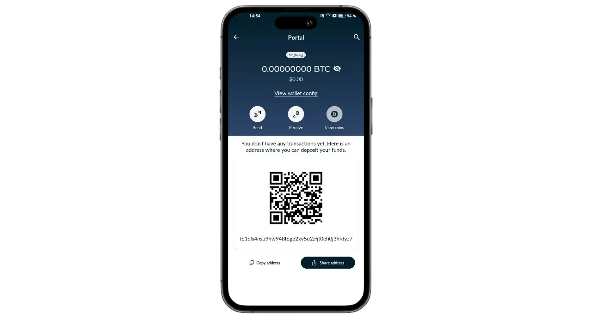
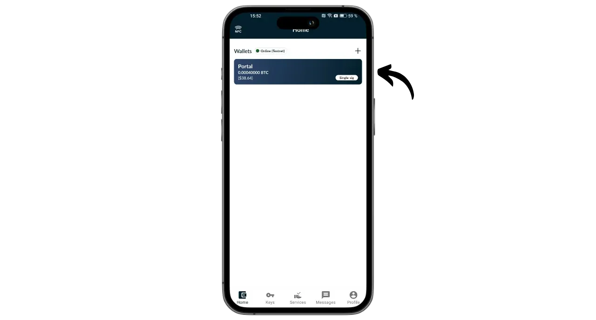

Portal je hardwarová peněženka pro bitcoiny navržená společností TwentyTwo Devices, která se specializuje na tvorbu hardwarových peněženek s otevřeným zdrojovým kódem pro bitcoinery. Společnost TwentyTwo Devices, kterou založil Alekos Filini, tvůrce projektu Magical Bitcoin ([dále jen BDK](https://github.com/bitcoindevkit)) a který pracoval pro společnosti Blockstream a BHB Network, se zaměřuje na autonomii, jednoduchost a bezpečnost uživatelů.

Portál se od ostatních hardwarových peněženek na trhu liší nativní integrací s chytrými telefony. Funguje bez kabelů a baterií. K napájení a komunikaci s jakoukoli kompatibilní mobilní peněženkou využívá technologii NFC. Jeho zajímavý design je koncipován pro ergonomické používání. Kulatá část je umístěna na zadní straně chytrého telefonu a odhaluje obrazovku, na které můžete zkontrolovat podrobnosti o transakcích před jejich podepsáním vyhrazeným tlačítkem.

Portál, který je zcela open-source, je založen na firmwaru napsaném v jazyce Rust a pro správu klíčů a transakcí používá BDK (Bitcoin Dev Kit). Prodává se za 89 eur [na oficiálních stránkách](https://store.twenty-two.xyz/products/portal-hardware-wallet).

V době psaní tohoto článku je portál kompatibilní s aplikacemi Nunchuk a Bitcoin Keeper. V tomto návodu se budeme věnovat konfiguraci s aplikací Nunchuk.

## Rozbalování

Po obdržení portálu zkontrolujte, zda jsou krabice a štítek, který ji uzavírá, v dobrém stavu. Uvnitř najdete svůj portál v zapečetěném sáčku.

Zkontrolujte, zda je pečeť neporušená, abyste se ujistili, že sáček nebyl otevřen. Jedinečné číslo zobrazené velkými písmeny na sáčku by mělo odpovídat číslu napsanému černě pod modrou pečetí, číslu na štítku krabice a číslu, které se zobrazí na obrazovce při prvním spuštění.

## Instalace zařízení Nunchuk

Ke správě peněženky hostované na portálu budeme používat aplikaci Nunchuk. Aplikaci si stáhněte z [Google Play Store](https://play.google.com/store/apps/details?id=io.nunchuk.android), [App Store](https://apps.apple.com/us/app/nunchuk-bitcoin-wallet/id1563190073) nebo přímo prostřednictvím jejího [souboru `.apk`](https://github.com/nunchuk-io/nunchuk-android/releases).

Pokud používáte Nunchuk poprvé, aplikace vás vyzve k vytvoření účtu. Pro účely tohoto návodu není nutné jej vytvářet. Chcete-li pokračovat bez účtu, vyberte možnost "*Pokračovat jako host*".

## Konfigurace portálu

Na domovské obrazovce zařízení Nunchuk klikněte na logo "*NFC*" v horní části obrazovky.

Umístěním portálu na zadní stranu smartphonu jej aktivujte.

Nunchuk rozpozná váš portál. Pak klikněte na "*Pokračovat*".

Chcete-li vytvořit nové portfolio, vyberte možnost "*Vytvořit osivo na portálu*" a poté klikněte na "*Pokračovat*".

Můžete si vybrat mezi mnemotechnickou frází o 12 nebo 24 slovech. Bezpečnost, kterou obě možnosti nabízejí, je podobná, takže se můžete rozhodnout pro tu, která se nejsnáze ukládá, tj. 12 slov.

Poté budete vyzváni k volbě hesla. Heslo odemkne váš portál. Poskytuje tedy ochranu před neoprávněným fyzickým přístupem. Toto heslo se nepodílí na odvození kryptografických klíčů vaší peněženky. Takže i bez přístupu k tomuto heslu vám vlastnictví vaší mnemotechnické fráze o 12 nebo 24 slovech umožní znovu získat přístup k vašim bitcoinům. Doporučujeme zvolit co nejnáhodnější a dostatečně dlouhé heslo. Ujistěte se, že toto heslo máte uloženo na jiném místě, než kde je uložen váš portál (např. ve správci hesel).

Na portálu se zobrazí vaše 12slovná mnemotechnická fráze. Tato mnemotechnická fráze vám umožní plný a neomezený přístup ke všem vašim bitcoinům. Kdokoli, kdo tuto frázi zná, může vaše prostředky ukrást, a to i bez fyzického přístupu k vašemu portálu.

Fráze o 12 slovech obnoví přístup k bitcoinům v případě ztráty, krádeže nebo rozbití portálu. Je proto velmi důležité ji pečlivě uložit a uložit na bezpečném místě.

Můžete jej vyrýt na kus papíru nebo pro větší bezpečnost doporučuji vyrýt jej na nerezový podstavec, který jej ochrání před požárem, povodní nebo zřícením.

Pro více informací o správném způsobu ukládání a správy mnemotechnických frází vřele doporučuji sledovat tento další návod, zejména pokud jste začátečníci:

https://planb.network/tutorials/wallet/backup/backup-mnemonic-22c0ddfa-fb9f-4e3a-96f9-46e2a7954270
samozřejmě nesmíte tato slova nikdy sdílet na internetu, jako to dělám já v tomto návodu. Toto ukázkové portfolio bude použito pouze na Testnetu a na konci tutoriálu bude smazáno.**_

Chcete-li přejít k dalším slovům, stiskněte pevně tlačítko na portálu. Ujistěte se, že jste na tlačítko položili celý prst a několik sekund ho drželi, aby byla interakce správně rozpoznána.

Portál poté potvrdí heslo zadané v aplikaci Nunchuk.

Nyní jste dokončili konfiguraci portálu a vytvořili mnemotechnickou frázi!

## Konfigurace peněženky Bitcoin

Na zařízení Nunchuk klikněte na tlačítko "*Pokračovat*" a stále držte portál na zadní straně telefonu.

V tomto tutoriálu budu nastavovat portfolio s jedním signálem, takže vyberu tuto možnost.

Použijte výchozí účet, tj. první účet v peněžence (číslo 0). Poté vás Nunchuk požádá o potvrzení hesla k portálu, abyste jej mohli odemknout.

Na portálu potvrďte export svého xpubu do Nunchuku. To vám umožní spravovat peněženku ze smartphonu, aniž byste mohli utrácet bitcoiny bez Portálu. Potvrďte stisknutím tlačítka .

Všimněte si, že cesta k odvození uvedená ve vašem případě se bude lišit od té mé, protože tento návod je prováděn v síti Testnet.

Pojmenujte své portfolio, například "*Portál*", a klikněte na "*Pokračovat*".

Poté vám Nunchuk zobrazí váš Deskriptor. Je dobré si vytvořit zálohu. Deskriptor vám sice neumožňuje utrácet bitcoiny, ale v případě obnovy peněženky vám umožní z vaší mnemotechnické fráze vysledovat cesty odvození vašich klíčů. Uchovávejte jej na bezpečném místě, protože i když jeho únik nemusí představovat bezpečnostní problém, představuje problém s důvěrností.

Klikněte na "*Done*".

Nyní je třeba vygenerovat veřejné klíče pro peněženku Bitcoin. To provedete kliknutím na tlačítko "*Vytvořit novou peněženku*".

Znovu klikněte na "*Vytvořit novou peněženku*". Poté vyberte možnost "*Vytvořit novou peněženku pomocí stávajících klíčů*".

Zvolte název svého portfolia a klikněte na "*Pokračovat*".

Vyberte svůj portál jako podepisovací zařízení pro tuto novou sadu klíčů a klikněte na tlačítko "*Pokračovat*".

Pokud je vše k vaší spokojenosti, výtvor potvrďte.

Poté můžete uložit konfigurační soubor peněženky. Tento soubor obsahuje pouze vaše veřejné klíče, což znamená, že i když se k němu někdo dostane, nebude moci ukrást vaše bitcoiny. Bude však moci sledovat všechny vaše transakce. Tento soubor tedy představuje pouze riziko pro vaše soukromí. V některých případech může být nepostradatelný pro obnovení vaší peněženky.

A to je vše!

## Jak mohu přijímat bitcoiny pomocí Portálu?

Chcete-li přijímat bitcoiny, vyberte peněženku.

Před použitím vygenerované adresy ji zkontrolujte na obrazovce portálu. To provedete kliknutím na tlačítko "*Přijmout*".

Klikněte na tři tečky a vyberte možnost "*Ověřit adresu přes PORTÁL*". Poté zadejte své heslo.

Umístěte portál na zadní stranu telefonu a potvrďte stisknutím tlačítka .

Zkontrolujte, zda se adresa zobrazená na portálu shoduje s adresou na zařízení Nunchuk, a poté ji potvrďte opětovným stisknutím tlačítka . Pokud jsou adresy shodné, můžete tuto adresu předat plátci.

Jakmile je transakce plátce odvysílána, zobrazí se ve vaší peněžence.

Klikněte na "*Zobrazit rohy*".

Zvolte nový UTXO.

Kliknutím na "*+*" vedle položky "*Tags*" přidáte značku k UTXO. Je to dobrý postup, protože vám pomůže zapamatovat si, odkud vaše mince pocházejí, a optimalizuje vaše soukromí při budoucím utrácení.

Vyberte existující značku nebo vytvořte novou a klikněte na "*Uložit*". Můžete také vytvořit "*kolekce*" a uspořádat tak své díly strukturovanějším způsobem.

## Jak mohu poslat bitcoiny pomocí portálu?

Když už máte bitcoiny v peněžence, můžete je také posílat. Chcete-li tak učinit, klikněte na vybranou peněženku.

Klikněte na tlačítko "*Odeslat*".

Vyberte částku, kterou chcete odeslat, a klikněte na tlačítko "*Pokračovat*".

K budoucí transakci přidejte "*poznámku*", která vám připomene její účel.

Poté zadejte adresu příjemce do příslušného pole. Adresu zakódovanou jako QR kód můžete také naskenovat kliknutím na ikonu v pravém horním rohu obrazovky. Poté klikněte na tlačítko "*Vytvořit transakci*".

Zkontrolujte údaje o transakci, klikněte na tlačítko "*Podepsat*" vedle svého portálu a zadejte své heslo.

Umístěte portál na zadní stranu telefonu. Zkontrolujte, zda je adresa příjemce a částka správná. Pokud ano, pokračujte stisknutím tlačítka .

Zkontrolujte, zda je poplatek za transakci správný, a poté znovu stiskněte tlačítko pro podepsání transakce.

Vaše transakce byla podepsána. Na Nunchuku můžete naposledy zkontrolovat její detaily a poté ji kliknutím na tlačítko "*Vysílat transakci*" odvysílat v síti Bitcoin.

Vaše transakce nyní čeká na potvrzení.

Gratuluji, nyní jste se naučili používat Portál! Pokud pro vás byl tento návod užitečný, budu vám vděčný, když mi níže zanecháte zelený palec. Neváhejte tento článek sdílet na svých sociálních sítích. Moc vám děkuji!

Chcete-li se dozvědět více, podívejte se na naše kompletní školení o tom, jak fungují portfolia HD:

https://planb.network/courses/46b0ced2-9028-4a61-8fbc-3b005ee8d70f