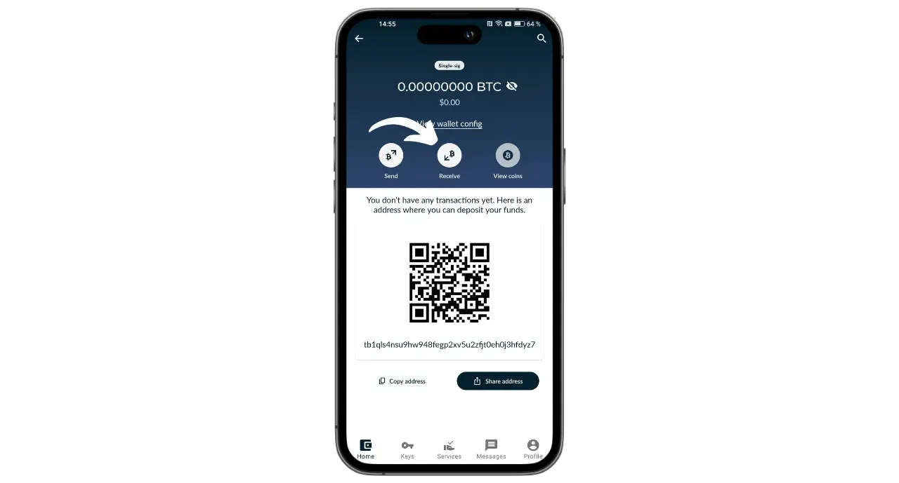

Portal ist eine Bitcoin-Hardware-Wallet, die von TwentyTwo Devices entwickelt wurde, einem Unternehmen, das sich auf die Entwicklung von Open-Source-Hardware-Wallets für Bitcoiner spezialisiert hat. Gegründet von Alekos Filini, dem Schöpfer des Magical Bitcoin Projekts ([fortan BDK](https://github.com/bitcoindevkit)) und Mitarbeiter von Blockstream und BHB Network, zielt TwentyTwo Devices darauf ab, sich auf Benutzerautonomie, Einfachheit und Sicherheit zu konzentrieren.

Was Portal von anderen Hardware-Geldbörsen auf dem Markt unterscheidet, ist seine native Integration in Smartphones. Es funktioniert ohne Kabel oder Batterien. Es nutzt die NFC-Technologie, um sich selbst zu versorgen und mit jeder kompatiblen mobilen Geldbörse zu kommunizieren. Das faszinierende Design ist auf eine ergonomische Nutzung ausgelegt. Der runde Teil wird auf der Rückseite des Smartphones platziert und gibt einen Bildschirm frei, auf dem Sie die Details Ihrer Transaktionen überprüfen können, bevor Sie sie mit der entsprechenden Taste unterschreiben.

Das vollständig quelloffene Portal basiert auf einer in Rust geschriebenen Firmware und verwendet BDK (Bitcoin Dev Kit) für die Schlüssel- und Transaktionsverwaltung. Es wird für 89 € [auf der offiziellen Website] verkauft (https://store.twenty-two.xyz/products/portal-hardware-wallet).

Zum Zeitpunkt der Erstellung dieses Artikels ist das Portal mit den Anwendungen Nunchuk und Bitcoin Keeper kompatibel. In diesem Tutorial werden wir es mit Nunchuk konfigurieren.

## Unboxing

Wenn Sie Ihr Portal erhalten, überprüfen Sie, ob der Karton und das Etikett, das ihn versiegelt, in gutem Zustand sind. Im Inneren finden Sie Ihr Portal in einem versiegelten Beutel.

Vergewissern Sie sich, dass das Siegel intakt ist, um sicherzustellen, dass der Beutel nicht geöffnet wurde. Die einmalige Nummer, die in großen Buchstaben auf dem Beutel angezeigt wird, sollte mit der Nummer übereinstimmen, die in schwarzer Schrift unter dem blauen Siegel steht, mit der Nummer auf dem Etikett der Verpackung und mit der Nummer, die beim ersten Start auf Ihrem Bildschirm erscheint.

## Nunchuk-Installation

Um die auf dem Portal gehostete Geldbörse zu verwalten, werden wir die Nunchuk-Anwendung verwenden. Laden Sie die Anwendung aus dem [Google Play Store](https://play.google.com/store/apps/details?id=io.nunchuk.android), dem [App Store](https://apps.apple.com/us/app/nunchuk-bitcoin-wallet/id1563190073) oder direkt über die [Datei `.apk`](https://github.com/nunchuk-io/nunchuk-android/releases) herunter.

Wenn Sie Nunchuk zum ersten Mal benutzen, wird die Anwendung Sie auffordern, ein Konto zu erstellen. Für die Zwecke dieses Tutorials ist es nicht notwendig, ein Konto zu erstellen. Wählen Sie "*Als Gast fortfahren*", um ohne ein Konto fortzufahren.

## Portal-Konfiguration

Klicken Sie auf dem Nunchuk-Startbildschirm auf das "*NFC*"-Logo am oberen Rand des Bildschirms.

Legen Sie das Portal auf die Rückseite Ihres Smartphones, um es zu aktivieren.

Das Nunchuk wird Ihr Portal erkennen. Klicken Sie dann auf "*Fortfahren*".

Um ein neues Portfolio zu erstellen, wählen Sie "*Saatgut im Portal erstellen*" und klicken dann auf "*Fortfahren*".

Sie können zwischen einer Eselsbrücke mit 12 oder 24 Wörtern wählen. Die Sicherheit beider Optionen ist ähnlich, so dass Sie sich für diejenige entscheiden können, die am einfachsten zu speichern ist, d. h. für 12 Wörter.

Sie werden dann aufgefordert, ein Passwort zu wählen. Mit dem Passwort wird Ihr Portal entsperrt. Es bietet daher Schutz vor unbefugtem physischen Zugriff. Dieses Passwort ist nicht an der Ableitung der kryptografischen Schlüssel Ihrer Brieftasche beteiligt. Selbst wenn Sie keinen Zugang zu diesem Passwort haben, können Sie mit Ihrer 12- oder 24-Wort-Mnemonik wieder Zugang zu Ihren Bitcoins erhalten. Es ist ratsam, ein Passwort zu wählen, das so zufällig wie möglich und lang genug ist. Achten Sie darauf, dass Sie dieses Passwort an einem anderen Ort als Ihr Portal speichern (z. B. in einem Passwortmanager).

Auf Ihrem Portal wird Ihr 12-Wörter-Merksatz angezeigt. Mit dieser Phrase haben Sie vollen, uneingeschränkten Zugriff auf alle Ihre Bitcoins. Jeder, der im Besitz dieser Phrase ist, kann Ihr Geld stehlen, auch ohne physischen Zugang zu Ihrem Portal.

Die 12-Wort-Phrase stellt den Zugang zu Ihren Bitcoins im Falle von Verlust, Diebstahl oder Beschädigung Ihres Portals wieder her. Es ist daher sehr wichtig, sie sorgfältig zu speichern und an einem sicheren Ort aufzubewahren.

Sie können ihn auf einem Stück Papier eingravieren lassen, oder für zusätzliche Sicherheit empfehle ich, ihn auf einem Sockel aus rostfreiem Stahl zu gravieren, um ihn vor Feuer, Überschwemmung oder Einsturz zu schützen.

Für weitere Informationen über die richtige Art und Weise, wie Sie Ihre mnemotechnische Phrase speichern und verwalten können, empfehle ich Ihnen, diese andere Anleitung zu lesen, insbesondere wenn Sie Anfänger sind:

https://planb.network/tutorials/wallet/backup/backup-mnemonic-22c0ddfa-fb9f-4e3a-96f9-46e2a7954270

natürlich dürfen Sie diese Worte niemals im Internet weitergeben, wie ich es in diesem Tutorium tue. Dieses Musterportfolio wird nur im Testnet verwendet und am Ende des Tutoriums gelöscht.**_

Drücken Sie die Taste auf Ihrem Portal fest, um zu den nächsten Wörtern zu gelangen. Achten Sie darauf, dass Sie Ihren ganzen Finger auf die Taste legen und den Druck einige Sekunden lang halten, damit die Interaktion richtig erkannt wird.

Ihr Portal bestätigt dann das Passwort, das Sie in Nunchuk eingegeben haben.

Sie haben nun die Konfiguration Ihres Portals und die Erstellung Ihrer mnemonischen Phrase abgeschlossen!

## Bitcoin-Wallet-Konfiguration

Klicken Sie auf dem Nunchuk auf "*Fortfahren*" und halten Sie das Portal weiterhin an die Rückseite Ihres Handys.

In diesem Lernprogramm werde ich ein Portfolio mit einer einzigen Signatur einrichten, also wähle ich diese Option.

Verwenden Sie das Standardkonto, d. h. das erste Konto in der Brieftasche (Nummer 0). Nunchuk wird Sie dann auffordern, Ihr Portal-Passwort zu bestätigen, um es zu entsperren.

Bestätigen Sie auf dem Portal den Export Ihres xpub auf Nunchuk. Dies ermöglicht Ihnen, die Geldbörse von Ihrem Smartphone aus zu verwalten, ohne dass Sie ohne das Portal Bitcoins ausgeben können. Drücken Sie die Taste zur Bestätigung.

Beachten Sie, dass der in Ihrem Fall angegebene Ableitungspfad sich von meinem unterscheidet, da dieser Lehrgang im Testnet durchgeführt wird.

Benennen Sie Ihr Portfolio, zum Beispiel "*Portal*", und klicken Sie dann auf "*Weiter*".

Das Nunchuk zeigt Ihnen dann Ihren Deskriptor an. Es ist eine gute Idee, eine Sicherungskopie zu erstellen. Mit dem Deskriptor können Sie zwar keine Bitcoins ausgeben, aber Sie können die Ableitungspfade Ihrer Schlüssel anhand Ihrer mnemonischen Phrase zurückverfolgen, falls Sie Ihre Brieftasche wiederfinden sollten. Bewahren Sie den Deskriptor an einem sicheren Ort auf, denn auch wenn sein Bekanntwerden kein Sicherheitsproblem darstellt, so ist es doch ein Problem der Vertraulichkeit.

Klicken Sie auf "*Erledigt*".

Sie müssen nun die öffentlichen Schlüssel für Ihre Bitcoin-Wallet generieren. Klicken Sie dazu auf die Schaltfläche "*Create new wallet*".

Klicken Sie erneut auf "*Neue Brieftasche erstellen*". Wählen Sie dann die Option "*Erstellen einer neuen Brieftasche mit vorhandenen Schlüsseln*".

Wählen Sie einen Namen für Ihr Portfolio und klicken Sie auf "*Fortfahren*".

Wählen Sie Ihr Portal als Signiergerät für diesen neuen Schlüsselsatz aus und klicken Sie dann auf "*Weiter*".

Wenn alles zu Ihrer Zufriedenheit ist, validieren Sie die Erstellung.

Sie können dann Ihre Wallet-Konfigurationsdatei speichern. Diese Datei enthält nur Ihre öffentlichen Schlüssel, was bedeutet, dass selbst wenn jemand darauf zugreift, er nicht in der Lage ist, Ihre Bitcoins zu stehlen. Allerdings kann er alle Ihre Transaktionen nachverfolgen. Diese Datei stellt also nur ein Risiko für Ihre Privatsphäre dar. In einigen Fällen kann sie für die Wiederherstellung Ihrer Brieftasche unerlässlich sein.

Und das ist alles, was es zu tun gibt!

## Wie kann ich mit Portal Bitcoins erhalten?

Um Bitcoins zu erhalten, wählen Sie Ihre Brieftasche.

Bevor Sie die generierte Adresse verwenden, überprüfen Sie sie auf dem Bildschirm des Portals. Klicken Sie dazu auf "*Empfangen*".

Klicken Sie auf die drei Punkte und wählen Sie dann "*Adresse über PORTAL prüfen*". Geben Sie dann Ihr Passwort ein.

Positionieren Sie Ihr Portal auf der Rückseite Ihres Telefons und bestätigen Sie durch Drücken der Taste.

Vergewissern Sie sich, dass die auf dem Portal angezeigte Adresse mit der auf Ihrem Nunchuk übereinstimmt, und bestätigen Sie dann durch erneutes Drücken der Taste. Wenn die Adressen identisch sind, können Sie diese Adresse an den Zahler weitergeben.

Sobald die Transaktion des Zahlers übertragen wurde, erscheint sie in Ihrer Brieftasche.

Klicken Sie auf "*Ecken anzeigen*".

Wählen Sie Ihren neuen UTXO.

Klicken Sie auf das "*+*" neben "*Tags*", um Ihrem UTXO einen Tag hinzuzufügen. Dies ist eine gute Praxis, da es Ihnen hilft, sich daran zu erinnern, woher Ihre Münzen stammen, und Ihre Privatsphäre bei zukünftigen Ausgaben zu optimieren.

Wählen Sie ein bestehendes Etikett aus oder erstellen Sie ein neues und klicken Sie dann auf "*Speichern*". Sie können auch "*Sammlungen*" erstellen, um Ihre Teile besser zu organisieren.

## Wie versende ich Bitcoins über Portal?

Jetzt, wo Sie Bitcoins in Ihrem Wallet haben, können Sie sie auch verschicken. Klicken Sie dazu auf die Wallet Ihrer Wahl.

Klicken Sie auf die Schaltfläche "*Senden*".

Wählen Sie den zu überweisenden Betrag und klicken Sie dann auf "*Weiter*".

Fügen Sie Ihrer zukünftigen Transaktion eine "*Notiz*" hinzu, um Sie an den Zweck der Transaktion zu erinnern.

Geben Sie dann die Adresse des Empfängers in das dafür vorgesehene Feld ein. Sie können auch eine als QR-Code codierte Adresse scannen, indem Sie auf das Symbol oben rechts auf dem Bildschirm klicken. Klicken Sie dann auf die Schaltfläche "*Transaktion erstellen*".

Überprüfen Sie Ihre Transaktionsdaten, klicken Sie dann auf die Schaltfläche "*Unterschreiben*" neben Ihrem Portal und geben Sie Ihr Passwort ein.

Platzieren Sie Ihr Portal auf der Rückseite Ihres Telefons. Überprüfen Sie, ob die Adresse des Empfängers und der Betrag richtig sind. Wenn ja, drücken Sie die Taste, um fortzufahren.

Überprüfen Sie, ob die Transaktionsgebühr korrekt ist, und drücken Sie dann erneut die Taste, um Ihre Transaktion zu unterzeichnen.

Ihre Transaktion wurde unterzeichnet. Sie können die Details ein letztes Mal auf dem Nunchuk überprüfen und dann auf die Schaltfläche "*Transaktion übertragen*" klicken, um sie im Bitcoin-Netzwerk zu übertragen.

Ihre Transaktion wartet nun auf eine Bestätigung.

Herzlichen Glückwunsch, jetzt haben Sie den Dreh raus, wie man Portal benutzt! Wenn Sie diese Anleitung nützlich fanden, würde ich mich freuen, wenn Sie unten einen grünen Daumen hinterlassen würden. Sie können diesen Artikel auch gerne in Ihren sozialen Netzwerken teilen. Herzlichen Dank!

Wenn Sie mehr darüber erfahren möchten, schauen Sie sich unseren kompletten Schulungskurs über die Funktionsweise von HD-Portfolios an:

https://planb.network/courses/46b0ced2-9028-4a61-8fbc-3b005ee8d70f
