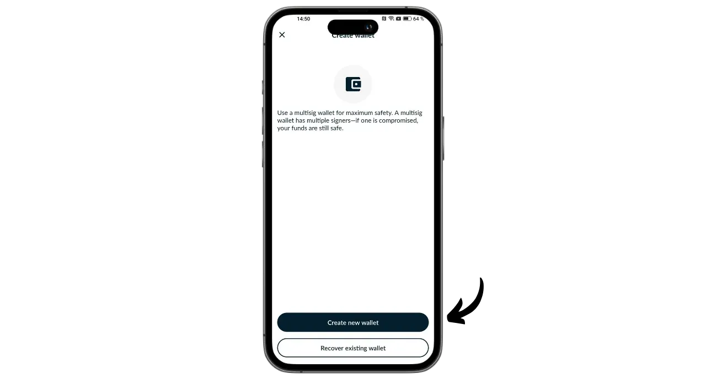

Portal is a Bitcoin hardware wallet designed by TwentyTwo Devices, a company specializing in the creation of open-source hardware wallets for bitcoiners. Founded by Alekos Filini, creator of the Magical Bitcoin project ([henceforth named BDK](https://github.com/bitcoindevkit)) and having worked for Blockstream and BHB Network, TwentyTwo Devices aims to focus on user autonomy, simplicity and security.

What sets Portal apart from other hardware wallets on the market is its native integration with smartphones. It works without cables or batteries. It uses NFC technology to power itself and communicate with any compatible mobile wallet. Its intriguing design is conceived for ergonomic use. The round part is placed on the back of the smartphone to reveal a screen where you can check the details of your transactions before signing them with the dedicated button.

Entirely open-source, the Portal is based on firmware written in Rust and uses BDK (Bitcoin Dev Kit) for key and transaction management. It sells for €89 [on the official website](https://store.twenty-two.xyz/products/portal-hardware-wallet).

At the time of writing, the Portal is compatible with the Nunchuk and Bitcoin Keeper applications. In this tutorial, we'll be configuring it with Nunchuk.

## Unboxing

When you receive your Portal, check that the box and the label sealing it are in good condition. Inside, you'll find your Portal in a sealed pouch.

Make sure the seal is intact to confirm that the pouch has not been opened. The unique number displayed in large letters on the pouch should correspond to the one written in black under the blue seal, to the one on the box label, and to the one that will appear on your screen when you first start up.

## Nunchuk installation

To manage the wallet hosted on the Portal, we're going to use the Nunchuk application. Download the application from the [Google Play Store](https://play.google.com/store/apps/details?id=io.nunchuk.android), the [App Store](https://apps.apple.com/us/app/nunchuk-bitcoin-wallet/id1563190073) or directly via its [file `.apk`](https://github.com/nunchuk-io/nunchuk-android/releases).

If you're using Nunchuk for the first time, the application will prompt you to create an account. For the purposes of this tutorial, it's not necessary to create one. Select "*Continue as guest*" to continue without an account.

## Portal configuration

On the Nunchuk home screen, click on the "*NFC*" logo at the top of the screen.

Position your Portal on the back of your smartphone to activate it.

Nunchuk will recognize your Portal. Then click on "*Continue*".

To create a new portfolio, select "*Generate seed on Portal*" then click on "*Continue*".

You can choose between a 12- or 24-word mnemonic phrase. The security offered by both options is similar, so you can opt for the one that's easiest to save, i.e. 12 words.

You will then be asked to choose a password. The password unlocks your Portal. It therefore provides protection against unauthorized physical access. This password is not involved in the derivation of your wallet's cryptographic keys. So, even without access to this password, possession of your 12- or 24-word mnemonic phrase will enable you to regain access to your bitcoins. It's advisable to choose a password that's as random as possible and long enough. Make sure you save this password in a separate place from where your Portal is stored (e.g. in a password manager).

Your Portal will display your 12-word mnemonic phrase. This mnemonic gives you full, unrestricted access to all your bitcoins. Anyone in possession of this phrase can steal your funds, even without physical access to your Portal.

The 12-word phrase restores access to your bitcoins in the event of loss, theft or breakage of your Portal. It is therefore very important to save it carefully and store it in a safe place.

You can inscribe it on a piece of paper, or for added security, I recommend engraving it on a stainless steel base to protect it from fire, flood or collapse.

For more information on the proper way to save and manage your mnemonic phrase, I highly recommend following this other tutorial, especially if you're a beginner:

https://planb.network/tutorials/wallet/backup/backup-mnemonic-22c0ddfa-fb9f-4e3a-96f9-46e2a7954270

of course, you must never share these words on the Internet, as I'm doing in this tutorial. This sample portfolio will be used only on Testnet and will be deleted at the end of the tutorial.**_

Press the button on your Portal firmly to move on to the next words. Make sure you place your entire finger on the button and hold the pressure for a few seconds, so that the interaction is properly detected.

Your Portal will then confirm the password you entered in Nunchuk.

You've now finished configuring your Portal and creating your mnemonic phrase!

## Bitcoin wallet configuration

On the Nunchuk, click on "*Continue*", still holding your Portal to the back of your phone.

In this tutorial, I'm going to set up a single-sig portfolio, so I'm selecting this option.

Use the default account, i.e. the first account in the wallet (number 0). Nunchuk will then ask you to confirm your Portal password to unlock it.

On the Portal, confirm the export of your xpub to Nunchuk. This allows you to manage the wallet from your smartphone without being able to spend bitcoins without the Portal. Press the button to confirm.

Note that the derivation path indicated in your case will be different from mine, as this tutorial is performed on Testnet.

Name your portfolio, for example "*Portal*", then click on "*Continue*".

Nunchuk then presents you with your Descriptor. It's a good idea to make a backup. Although the Descriptor doesn't allow you to spend bitcoins, it does allow you to trace the derivation paths of your keys from your mnemonic phrase in the event of wallet recovery. Keep it in a safe place, because while its leakage may not pose a security problem, it does represent a confidentiality issue.

Click on "*Done*".

You'll now need to generate the public keys for your Bitcoin wallet. To do this, click on the "*Create new wallet*" button.

Click again on "*Create new wallet*". Then choose the "*Create a new wallet using existing keys*" option.

Choose a name for your portfolio and click on "*Continue*".

Select your Portal as the signing device for this new set of keys, then click on "*Continue*".

If everything is to your satisfaction, validate the creation.

You can then save your wallet configuration file. This file contains only your public keys, which means that even if someone accesses it, they won't be able to steal your bitcoins. However, they will be able to track all your transactions. This file therefore only presents a risk to your privacy. In some cases, it may be indispensable for recovering your wallet.

And that's all there is to it!

## How can I receive bitcoins with Portal?

To receive bitcoins, select your wallet.

Before using the generated address, check it on the Portal screen. To do this, click on "*Receive*".

Click on the three dots, then select "*Verify address via PORTAL*". Then enter your password.

Position your Portal on the back of your phone, then confirm by pressing the button.

Make sure that the address displayed on the Portal matches the one on your Nunchuk, then confirm by pressing the button again. If the addresses are identical, you can give this address to the payer.

Once the payer's transaction has been broadcast, you'll see it appear on your wallet.

Click on "*View corners*".

Select your new UTXO.

Click on the "*+*" next to "*Tags*" to add a tag to your UTXO. This is a good practice, as it helps you remember where your coins come from and optimizes your privacy when spending in the future.

Select an existing tag or create a new one, then click on "*Save*". You can also create "*collections*" to organize your parts in a more structured way.

## How do I send bitcoins using Portal?

Now that you have bitcoins in your wallet, you can also send them. To do so, click on the wallet of your choice.

Click on the "*Send*" button.

Select the amount to send, then click on "*Continue*".

Add a "*note*" to your future transaction to remind you of its purpose.

Then enter the recipient's address in the field provided. You can also scan an address encoded as a QR code by clicking on the icon at the top right of the screen. Then click on the "*Create Transaction*" button.

Check your transaction details, then click on the "*Sign*" button next to your Portal, and enter your password.

Place your Portal on the back of your phone. Check that the recipient's address and the amount are correct. If so, press the button to continue.

Check that the transaction fee is correct, then press the button again to sign your transaction.

Your transaction has been signed. You can check its details one last time on Nunchuk, then click on the "*Broadcast transaction*" button to broadcast it on the Bitcoin network.

Your transaction is now awaiting confirmation.

Congratulations, you've now got the hang of using Portal! If you found this tutorial useful, I'd be grateful if you'd leave a green thumb below. Feel free to share this article on your social networks. Thank you very much!

To find out more, take a look at our complete training course on how HD portfolios work:

https://planb.network/courses/46b0ced2-9028-4a61-8fbc-3b005ee8d70f
