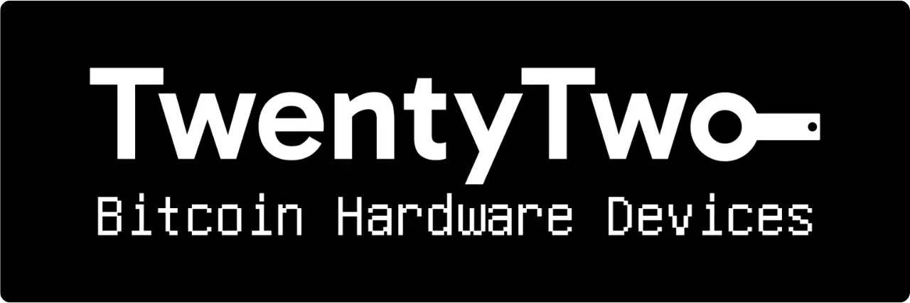

Portal es un monedero hardware de Bitcoin diseñado por TwentyTwo Devices, una empresa especializada en la creación de monederos hardware de código abierto para bitcoiners. Fundada por Alekos Filini, creador del proyecto Magical Bitcoin ([en adelante denominado BDK](https://github.com/bitcoindevkit)) y tras haber trabajado para Blockstream y BHB Network, TwentyTwo Devices pretende centrarse en la autonomía del usuario, la simplicidad y la seguridad.

Lo que diferencia a Portal de otros monederos físicos del mercado es su integración nativa con los smartphones. Funciona sin cables ni baterías. Utiliza la tecnología NFC para alimentarse y comunicarse con cualquier monedero móvil compatible. Su curioso diseño está pensado para un uso ergonómico. La parte redonda se coloca en la parte trasera del smartphone para revelar una pantalla en la que puedes comprobar los detalles de tus transacciones antes de firmarlas con el botón específico.

Totalmente de código abierto, el Portal se basa en un firmware escrito en Rust y utiliza BDK (Bitcoin Dev Kit) para la gestión de claves y transacciones. Se vende por 89 € [en el sitio web oficial](https://store.twenty-two.xyz/products/portal-hardware-wallet).

En el momento de escribir esto, el Portal es compatible con las aplicaciones Nunchuk y Bitcoin Keeper. En este tutorial, lo configuraremos con Nunchuk.

## Unboxing

Cuando reciba su Portal, compruebe que la caja y la etiqueta que la sella están en buen estado. Dentro, encontrará su Portal en una bolsa sellada.

Asegúrese de que el precinto está intacto para confirmar que la bolsa no ha sido abierta. El número único que aparece en letras grandes en la bolsa debe coincidir con el que está escrito en negro bajo el precinto azul, con el que figura en la etiqueta de la caja y con el que aparecerá en la pantalla al arrancar por primera vez.

## Instalación del Nunchuk

Para gestionar el monedero alojado en el Portal, vamos a utilizar la aplicación Nunchuk. Descarga la aplicación desde [Google Play Store](https://play.google.com/store/apps/details?id=io.nunchuk.android), la [App Store](https://apps.apple.com/us/app/nunchuk-bitcoin-wallet/id1563190073) o directamente a través de su [archivo `.apk`](https://github.com/nunchuk-io/nunchuk-android/releases).

Si es la primera vez que utilizas el Nunchuk, la aplicación te pedirá que crees una cuenta. Para los propósitos de este tutorial, no es necesario crear una. Selecciona "*Continuar como invitado*" para continuar sin una cuenta.

## Configuración del portal

En la pantalla de inicio del Nunchuk, haz clic en el logotipo "*NFC*" de la parte superior de la pantalla.

Coloque el Portal en la parte posterior del smartphone para activarlo.

El Nunchuk reconocerá tu Portal. A continuación, haz clic en "*Continuar*".

Para crear una nueva cartera, seleccione "*Generar semilla en el Portal*" y, a continuación, haga clic en "*Continuar*".

Puedes elegir entre una frase mnemotécnica de 12 o 24 palabras. La seguridad que ofrecen ambas opciones es similar, así que puedes optar por la más fácil de guardar, es decir, 12 palabras.

A continuación, se le pedirá que elija una contraseña. La contraseña desbloquea su Portal. Por lo tanto, proporciona protección contra el acceso físico no autorizado. Esta contraseña no interviene en la derivación de las claves criptográficas de su monedero. Por lo tanto, incluso sin acceso a esta contraseña, la posesión de su frase mnemotécnica de 12 o 24 palabras le permitirá recuperar el acceso a sus bitcoins. Es aconsejable elegir una contraseña lo más aleatoria posible y lo suficientemente larga. Asegúrate de guardar esta contraseña en un lugar distinto de donde esté almacenado tu Portal (por ejemplo, en un gestor de contraseñas).

Tu Portal mostrará tu frase mnemotécnica de 12 palabras. Esta frase mnemotécnica te da acceso total y sin restricciones a todos tus bitcoins. Cualquiera que posea esta frase puede robar tus fondos, incluso sin acceso físico a tu Portal.

La frase de 12 palabras restablece el acceso a tus bitcoins en caso de pérdida, robo o rotura de tu Portal. Por lo tanto, es muy importante guardarla con cuidado y almacenarla en un lugar seguro.

Puede inscribirlo en un papel o, para mayor seguridad, le recomiendo grabarlo en una base de acero inoxidable para protegerlo de incendios, inundaciones o derrumbes.

Para más información sobre la forma correcta de guardar y gestionar tu frase mnemotécnica, te recomiendo encarecidamente que sigas este otro tutorial, especialmente si eres principiante:

https://planb.network/tutorials/wallet/backup/backup-mnemonic-22c0ddfa-fb9f-4e3a-96f9-46e2a7954270
por supuesto, nunca debes compartir estas palabras en Internet, como hago yo en este tutorial. Esta cartera de muestra sólo se utilizará en Testnet y se eliminará al final del tutorial.**_

Pulse firmemente el botón de su Portal para pasar a las palabras siguientes. Asegúrate de colocar todo el dedo sobre el botón y mantener la presión durante unos segundos, para que la interacción se detecte correctamente.

Tu Portal confirmará entonces la contraseña que has introducido en Nunchuk.

Ya ha terminado de configurar su Portal y de crear su frase mnemotécnica

## Configuración del monedero Bitcoin

En el Nunchuk, haz clic en "*Continuar*", mientras mantienes el Portal pegado a la parte posterior del teléfono.

En este tutorial, voy a configurar una cartera single-sig, así que voy a seleccionar esta opción.

Utiliza la cuenta por defecto, es decir, la primera cuenta del monedero (número 0). A continuación, Nunchuk te pedirá que confirmes tu contraseña del Portal para desbloquearlo.

En el Portal, confirma la exportación de tu xpub a Nunchuk. Esto te permitirá gestionar el monedero desde tu smartphone sin poder gastar bitcoins sin el Portal. Pulsa el botón para confirmar.

Tenga en cuenta que la ruta de derivación indicada en su caso será diferente de la mía, ya que este tutorial se realiza en Testnet.

Ponga un nombre a su cartera, por ejemplo "*Portal*", y haga clic en "*Continuar*".

El Nunchuk entonces te presenta tu Descriptor. Es una buena idea hacer una copia de seguridad. Aunque el Descriptor no te permite gastar bitcoins, sí te permite rastrear las rutas de derivación de tus claves a partir de tu frase mnemotécnica en caso de recuperación del monedero. Guárdalo en un lugar seguro, porque aunque su fuga no suponga un problema de seguridad, sí representa un problema de confidencialidad.

Haga clic en "*Hecho*".

Ahora tendrá que generar las claves públicas de su monedero Bitcoin. Para ello, haz clic en el botón "*Crear nuevo monedero*".

Haga clic de nuevo en "*Crear un nuevo monedero*". A continuación, elige la opción "*Crear un nuevo monedero utilizando claves existentes*".

Elija un nombre para su cartera y haga clic en "*Continuar*".

Seleccione su Portal como dispositivo de firma para este nuevo juego de claves y, a continuación, haga clic en "*Continuar*".

Si todo está a su satisfacción, valide la creación.

A continuación, puedes guardar el archivo de configuración de tu monedero. Este archivo sólo contiene tus claves públicas, lo que significa que aunque alguien acceda a él, no podrá robar tus bitcoins. Sin embargo, podrá rastrear todas tus transacciones. Por lo tanto, este archivo sólo supone un riesgo para tu privacidad. En algunos casos, puede ser indispensable para recuperar tu monedero.

Y eso es todo

## ¿Cómo puedo recibir bitcoins con Portal?

Para recibir bitcoins, seleccione su monedero.

Antes de utilizar la dirección generada, compruébela en la pantalla del Portal. Para ello, haga clic en "*Recibir*".

Haga clic en los tres puntos y seleccione "*Verificar dirección a través de PORTAL*". A continuación, introduzca su contraseña.

Coloca el Portal en la parte posterior del teléfono y confírmalo pulsando el botón.

Asegúrate de que la dirección que aparece en el Portal coincide con la de tu Nunchuk y confírmalo pulsando de nuevo el botón. Si las direcciones son idénticas, puedes dar esta dirección al pagador.

Una vez emitida la transacción del ordenante, la verá aparecer en su monedero.

Haz clic en "*Ver esquinas*".

Selecciona tu nuevo UTXO.

Haz clic en "*+*" junto a "*Etiquetas*" para añadir una etiqueta a tu UTXO. Esta es una buena práctica, ya que te ayuda a recordar de dónde proceden tus monedas y optimiza tu privacidad a la hora de gastar en el futuro.

Selecciona una etiqueta existente o crea una nueva y haz clic en "*Guardar*". También puedes crear "*colecciones*" para organizar tus piezas de forma más estructurada.

## ¿Cómo envío bitcoins utilizando el Portal?

Ahora que tienes bitcoins en tu monedero, también puedes enviarlos. Para ello, haz clic en el monedero de tu elección.

Pulse el botón "*Enviar*".

Seleccione el importe que desea enviar y haga clic en "*Continuar*".

Añade una "*nota*" a tu futura transacción para recordar su finalidad.

A continuación, introduzca la dirección del destinatario en el campo correspondiente. También puede escanear una dirección codificada como código QR haciendo clic en el icono situado en la parte superior derecha de la pantalla. A continuación, haga clic en el botón "*Crear transacción*".

Compruebe los detalles de su transacción y, a continuación, haga clic en el botón "*Firmar*" situado junto a su Portal e introduzca su contraseña.

Coloque su Portal en la parte posterior del teléfono. Compruebe que la dirección del destinatario y el importe son correctos. Si es así, pulse el botón para continuar.

Compruebe que la tasa de transacción es correcta y, a continuación, pulse de nuevo el botón para firmar su transacción.

Su transacción ha sido firmada. Puedes comprobar los detalles por última vez en el Nunchuk y, a continuación, hacer clic en el botón "Transmitir transacción" para transmitirla a la red Bitcoin.

Su transacción está pendiente de confirmación.

Enhorabuena, ya sabes cómo utilizar Portal Si este tutorial te ha resultado útil, te agradecería que dejaras un pulgar verde a continuación. No dudes en compartir este artículo en tus redes sociales. Muchas gracias

Para saber más, eche un vistazo a nuestro completo curso de formación sobre el funcionamiento de las carteras HD:

https://planb.network/courses/46b0ced2-9028-4a61-8fbc-3b005ee8d70f