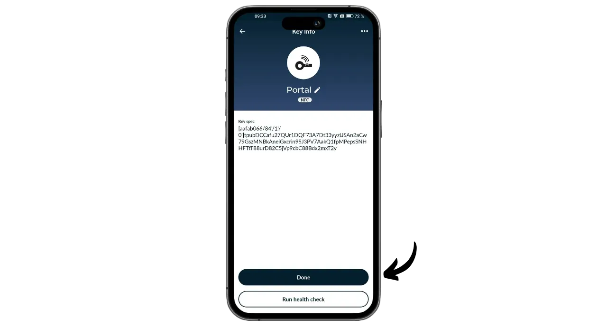
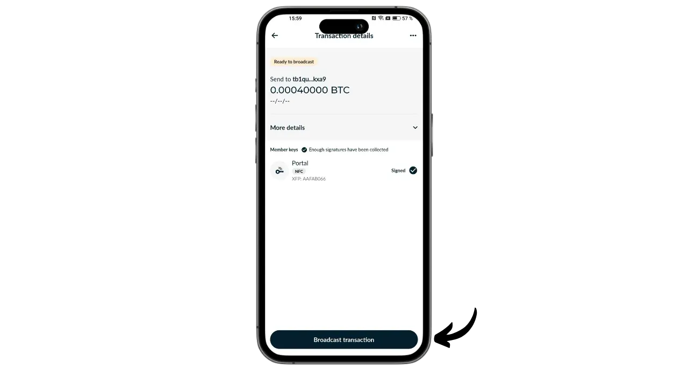

Portaal on Bitcoini riistvara rahakott, mille on kujundanud TwentyTwo Devices, ettevõte, mis on spetsialiseerunud avatud lähtekoodiga riistvara rahakottide loomisele bitcoin'ile. TwentyTwo Devices, mille asutas Alekos Filini, Magical Bitcoini projekti ([edaspidi BDK](https://github.com/bitcoindevkit)) looja ning mis on töötanud Blockstreamis ja BHB Networkis, on seadnud eesmärgiks keskenduda kasutaja autonoomiale, lihtsusele ja turvalisusele.

Mis eristab portaali teistest turul olevatest riistvaralistest rahakottidest, on selle loomulik integratsioon nutitelefonidega. See töötab ilma kaablite või patareideta. See kasutab NFC-tehnoloogiat, et end varustada ja suhelda mis tahes ühilduva mobiilse rahakotiga. Selle intrigeeriv disain on mõeldud ergonoomiliseks kasutamiseks. Ümmargune osa on paigutatud nutitelefoni tagaküljele, et avaneks ekraan, kus saab enne tehingute allkirjastamist spetsiaalse nupu abil kontrollida nende üksikasju.

Täielikult avatud lähtekoodiga portaal põhineb Rustis kirjutatud püsivara ja kasutab BDK-d (Bitcoin Dev Kit) võtme ja tehingu haldamiseks. Selle hind on 89 eurot [ametlikul veebisaidil](https://store.twenty-two.xyz/products/portal-hardware-wallet).

Kirjutamise ajal ühildub portaal Nunchuki ja Bitcoin Keeperi rakendustega. Selles õpetuses konfigureerime seda koos Nunchukiga.

## Unboxing

Kui saate oma portaali kätte, kontrollige, et karp ja seda sulgev etikett oleksid heas korras. Seest leiate oma portaali pitseeritud kotis.

Veenduge, et pitser on puutumata, et kinnitada, et kotti ei ole avatud. Karbil suurtes tähtedes kuvatud unikaalne number peab vastama sinise pitseri all mustalt kirjutatud numbrile, karbi sildil olevale numbrile ja numbrile, mis ilmub ekraanile, kui te esimest korda käivitate.

## Nunchuki paigaldamine

Portaalis asuva rahakoti haldamiseks kasutame Nunchuki rakendust. Laadige rakendus alla [Google Play Store](https://play.google.com/store/apps/details?id=io.nunchuk.android), [App Store](https://apps.apple.com/us/app/nunchuk-bitcoin-wallet/id1563190073) või otse [faili `.apk`](https://github.com/nunchuk-io/nunchuk-android/releases) kaudu.

Kui kasutate Nunchuki esimest korda, palub rakendus teil luua konto. Selle õpetuse jaoks ei ole konto loomine vajalik. Ilma kontota jätkamiseks valige "*Valige külalisena*".

## Portaali konfiguratsioon

Klõpsake Nunchuki avakuval ekraani ülaosas oleval logol "*NFC*".

Selle aktiveerimiseks asetage portaal nutitelefoni tagaküljele.

Nunchuk tunneb teie portaali ära. Seejärel klõpsake nuppu "*Jätka*".

Uue portfelli loomiseks valige "*Loo seeme portaalis*" ja seejärel klõpsake "*Jätka*".

Saate valida 12- või 24-sõnalise mälulause vahel. Mõlema valiku pakutav turvalisus on sarnane, seega võite valida selle, mida on kõige lihtsam salvestada, st 12 sõna.

Seejärel palutakse teil valida parool. Parool avab teie portaali. Seega pakub see kaitset volitamata füüsilise juurdepääsu eest. See parool ei ole seotud teie rahakoti krüptograafiliste võtmete tuletamisega. Seega, isegi ilma juurdepääsuta sellele paroolile, võimaldab teie 12- või 24-sõnalise mnemoonilise fraasi omamine taastada juurdepääsu oma bitcoinidele. Soovitav on valida võimalikult juhuslik ja piisavalt pikk parool. Veenduge, et salvestate selle salasõna eraldi kohta, kus teie portaali hoitakse (nt paroolihalduris).

Teie portaal kuvab teie 12-sõnalise mnemoonilise fraasi. See mnemonüüm annab teile täieliku ja piiramatu juurdepääsu kõigile teie bitcoinidele. Igaüks, kes seda fraasi valdab, võib teie raha varastada, isegi ilma füüsilise juurdepääsuta teie portaalile.

12-sõnaline fraas taastab juurdepääsu teie bitcoinidele, kui teie portaal läheb kaduma, varastatakse või puruneb. Seetõttu on väga oluline seda hoolikalt salvestada ja turvalises kohas hoida.

Võite graveerida selle paberile või täiendava turvalisuse tagamiseks soovitan graveerida selle roostevabast terasest alusele, et kaitsta seda tulekahju, üleujutuse või kokkuvarisemise eest.

Lisateavet selle kohta, kuidas oma mnemofraasi õigesti salvestada ja hallata, soovitan kindlasti jälgida seda teist õpetust, eriti kui olete algaja:

https://planb.network/tutorials/wallet/backup/backup-mnemonic-22c0ddfa-fb9f-4e3a-96f9-46e2a7954270

loomulikult ei tohi te neid sõnu kunagi internetis jagada, nagu ma seda käesolevas õpetuses teen. Seda näidisportfelli kasutatakse ainult Testnetis ja see kustutatakse õpetuse lõpus.**_

Järgmiste sõnade juurde liikumiseks vajutage kindlalt portaali nuppu. Veenduge, et asetate kogu sõrme nupule ja hoiate survet paar sekundit, et interaktsioon oleks korralikult tuvastatud.

Seejärel kinnitab teie portaal Nunchukis sisestatud parooli.

Nüüd olete oma portaali konfigureerimise ja mnemofraasi loomise lõpetanud!

## Bitcoin rahakoti konfiguratsioon

Klõpsake Nunchukil nuppu "*Jätka*", hoides portaali endiselt telefoni tagaküljel.

Selles õpetuses kavatsen ma luua ühe sildiga portfelli, seega valin selle võimaluse.

Kasutage vaikimisi kontot, st rahakoti esimest kontot (number 0). Seejärel palub Nunchuk teil selle avamiseks kinnitada oma portaali parool.

Kinnitage portaalis oma xpubi eksportimine Nunchukile. See võimaldab teil nutitelefonist rahakotti hallata, ilma et saaksite ilma portaalita bitcoine kulutada. Vajutage kinnitamiseks nuppu.

Pange tähele, et teie puhul näidatud tuletamise tee erineb minu omast, kuna see õpetus on tehtud Testnetis.

Anna oma portfooliole nimi, näiteks "*Portal*", ja klõpsa seejärel nupule "*Jätka*".

Seejärel esitab Nunchuk teile oma Deskriptori. Hea mõte on teha varukoopia. Kuigi Descriptor ei võimalda teil bitcoin'e kulutada, võimaldab see teil rahakoti taastamise korral jälgida oma võtmete tuletamise teed oma mnemoonilise fraasi põhjal. Hoidke seda turvalises kohas, sest kuigi selle lekkimine ei pruugi tekitada julgeolekuprobleemi, kujutab see endast siiski konfidentsiaalsusprobleemi.

Klõpsake nuppu "*Tehtud*".

Nüüd peate genereerima oma Bitcoini rahakoti avalikud võtmed. Selleks vajutage nupule "*Loo uus rahakott*".

Klõpsake uuesti nupule "*Loo uus rahakott*". Seejärel valige "*Loo uus rahakott, kasutades olemasolevaid võtmeid*".

Valige oma portfellile nimi ja klõpsake nuppu "*Jätka*".

Valige oma portaal selle uue võtmekomplekti allkirjastamisseadmeks, seejärel klõpsake nuppu "*Jätka*".

Kui kõik on teid rahuldanud, kinnitage loomine.

Seejärel saate salvestada oma rahakoti konfiguratsioonifaili. See fail sisaldab ainult teie avalikke võtmeid, mis tähendab, et isegi kui keegi sellele ligi pääseb, ei saa ta teie bitcoin'e varastada. Küll aga saavad nad jälgida kõiki teie tehinguid. See fail kujutab seega ainult ohtu teie privaatsusele. Mõnel juhul võib see olla teie rahakoti taastamiseks hädavajalik.

Ja see ongi kõik!

## Kuidas ma saan portaali kaudu bitcoin'e vastu võtta?

Bitcoinide saamiseks valige oma rahakott.

Enne loodud aadressi kasutamist kontrollige seda portaali ekraanil. Selleks klõpsake nuppu "*Vastuvõtmine*".

Klõpsake kolmele punktile, seejärel valige "*Verify address via PORTAL*". Seejärel sisestage oma parool.

Asetage oma portaal telefoni tagaküljele ja kinnitage see seejärel nupule vajutades.

Veenduge, et portaalis kuvatav aadress vastab teie Nunchukil olevale aadressile, seejärel kinnitage see, vajutades uuesti nuppu. Kui aadressid on identsed, saate selle aadressi maksjale anda.

Kui maksja tehing on edastatud, näete seda oma rahakotis.

Klõpsake nuppu "*Näita nurgad*".

Valige oma uus UTXO.

Klõpsake "*+*" kõrval "*Tagid*", et lisada oma UTXO-le silt. See on hea tava, sest see aitab teil meeles pidada, kust teie mündid pärinevad, ja optimeerib teie privaatsust tulevaste kulutuste tegemisel.

Valige olemasolev silt või looge uus silt, seejärel klõpsake "*Save*". Võite luua ka "*kollektsioone*", et korraldada oma osi struktureeritumalt.

## Kuidas saata bitcoine portaali abil?

Nüüd, kui teil on bitcoinid rahakotis, saate neid ka saata. Selleks klõpsake oma valitud rahakotis.

Vajutage nupule "*Send*".

Valige saadetav summa, seejärel klõpsake nuppu "*Jätka*".

Lisage oma tulevasele tehingule "*märkus*", mis tuletab teile meelde selle eesmärki.

Seejärel sisestage vastuvõtja aadress ettenähtud väljale. Saate ka QR-koodina kodeeritud aadressi skaneerida, klõpsates ekraani paremas ülaosas oleval ikoonil. Seejärel klõpsake nupule "*Loo tehing*".

Kontrollige oma tehingu üksikasju, seejärel klõpsake oma portaali kõrval nupule "*Sign*" ja sisestage oma parool.

Asetage oma portaal telefoni tagaküljele. Kontrollige, et saaja aadress ja summa oleksid õiged. Kui see on nii, vajutage jätkamiseks nuppu.

Kontrollige, et tehingutasu on õige, seejärel vajutage uuesti nuppu, et allkirjastada tehing.

Teie tehing on allkirjastatud. Saate selle üksikasju veelkord Nunchukis kontrollida, seejärel klõpsake nupule "*Tehingu edastamine*", et seda Bitcoini võrgus edastada.

Teie tehing ootab nüüd kinnitust.

Palju õnne, sa oled nüüd portaali kasutamisega hakkama saanud! Kui leidsid selle õpetuse kasulikuks, oleksin tänulik, kui jätaksid allpool rohelise pöidla. Jaga seda artiklit julgelt oma suhtlusvõrgustikes. Suur tänu!

Kui soovite rohkem teada saada, vaadake meie täielikku koolituskursust HD-portfellide toimimise kohta:

https://planb.network/courses/46b0ced2-9028-4a61-8fbc-3b005ee8d70f
