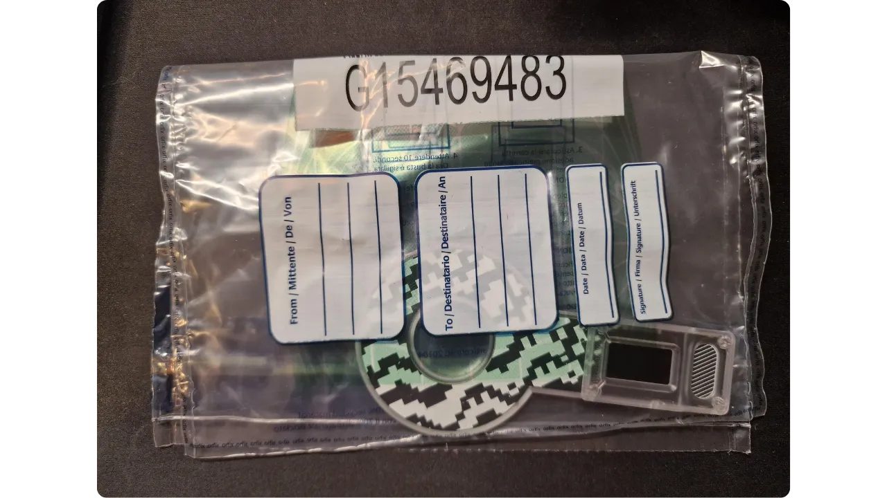
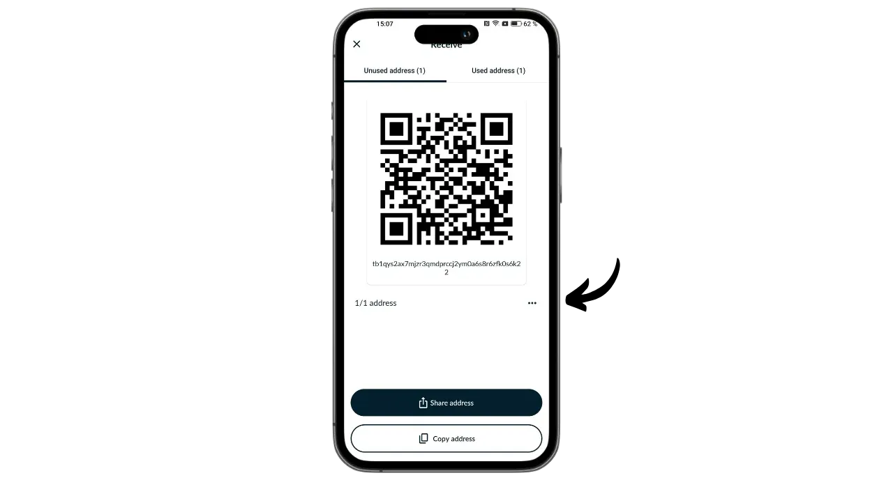
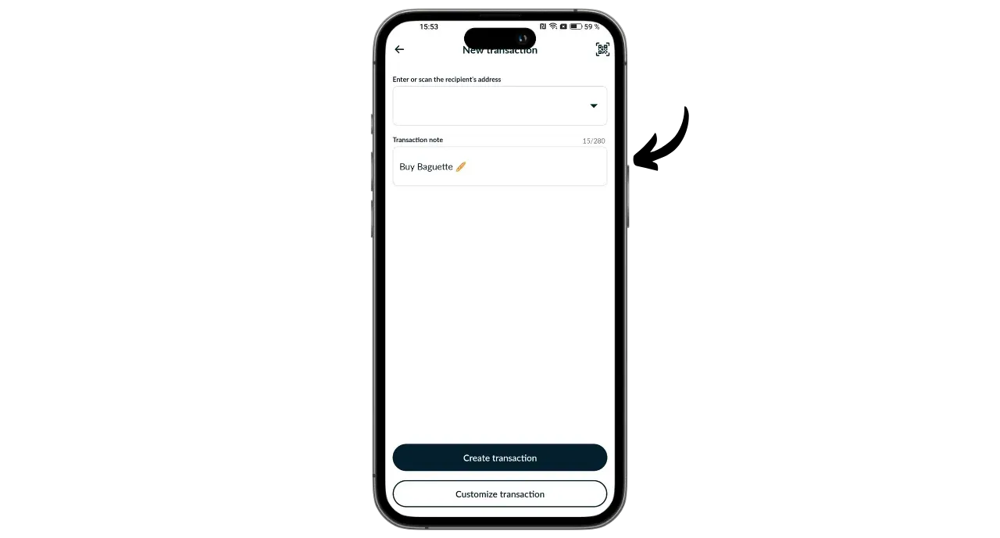

Portal on Bitcoin-laitteistolompakko, jonka on suunnitellut TwentyTwo Devices, yritys, joka on erikoistunut avoimen lähdekoodin laitteistolompakoiden luomiseen bitcoin-käyttäjille. Magical Bitcoin -projektin ([jatkossa nimeltään BDK](https://github.com/bitcoindevkit)) luoja Alekos Filini on perustanut yrityksen, joka on työskennellyt Blockstreamille ja BHB Networkille, ja TwentyTwo Devicesin tavoitteena on keskittyä käyttäjän itsenäisyyteen, yksinkertaisuuteen ja turvallisuuteen.

Se, mikä erottaa Portalin muista markkinoilla olevista laitteistolompakoista, on sen natiivi integrointi älypuhelimiin. Se toimii ilman kaapeleita tai akkuja. Se käyttää NFC-tekniikkaa virran syöttämiseen ja kommunikointiin minkä tahansa yhteensopivan mobiililompakon kanssa. Sen kiehtova muotoilu on suunniteltu ergonomiseen käyttöön. Pyöreä osa on sijoitettu älypuhelimen takaosaan, josta paljastuu näyttö, josta voit tarkistaa maksutapahtumien yksityiskohdat ennen niiden allekirjoittamista siihen tarkoitetulla painikkeella.

Täysin avoimen lähdekoodin portaali perustuu Rust-kielellä kirjoitettuun laiteohjelmistoon ja käyttää BDK:ta (Bitcoin Dev Kit) avainten ja tapahtumien hallintaan. Se maksaa 89 euroa [virallisilla verkkosivuilla](https://store.twenty-two.xyz/products/portal-hardware-wallet).

Tätä kirjoitettaessa portaali on yhteensopiva Nunchuk- ja Bitcoin Keeper -sovellusten kanssa. Tässä opetusohjelmassa konfiguroimme sen Nunchukin kanssa.

## Unboxing

Kun saat portaalin, tarkista, että laatikko ja sen sinetöivä etiketti ovat hyvässä kunnossa. Sisällä portaali on sinetöidyssä pussissa.

Varmista, että sinetti on ehjä, jotta voit varmistaa, että pussia ei ole avattu. Pussissa suurilla kirjaimilla näkyvän yksilöllisen numeron on vastattava sinisen sinetin alle mustalla kirjoitettua numeroa, laatikon etiketissä olevaa numeroa ja sitä numeroa, joka näkyy näytölläsi, kun käynnistät laitteen ensimmäisen kerran.

## Nunchukin asennus

Käytämme portaalissa sijaitsevan lompakon hallintaan Nunchuk-sovellusta. Lataa sovellus [Google Play Storesta](https://play.google.com/store/apps/details?id=io.nunchuk.android), [App Storesta](https://apps.apple.com/us/app/nunchuk-bitcoin-wallet/id1563190073) tai suoraan [tiedosto `.apk`](https://github.com/nunchuk-io/nunchuk-android/releases).

Jos käytät Nunchukia ensimmäistä kertaa, sovellus pyytää sinua luomaan tilin. Tässä ohjeessa käyttäjätunnuksen luominen ei ole tarpeen. Valitse "*Jatka vieraana*" jatkaaksesi ilman tiliä.

## Portaalin konfigurointi

Napsauta Nunchukin aloitusnäytössä näytön yläreunassa olevaa "*NFC*"-logoa.

Aseta portaali älypuhelimen takapuolelle sen aktivoimiseksi.

Nunchuk tunnistaa portaalisi. Napsauta sitten "*Jatka*".

Jos haluat luoda uuden salkun, valitse "*Generate seed on Portal*" ja napsauta sitten "*Continue*".

Voit valita 12- tai 24-sanaisen muistilausekkeen. Molempien vaihtoehtojen tarjoama turvallisuus on samanlainen, joten voit valita sen, joka on helpointa tallentaa, eli 12 sanaa.

Tämän jälkeen sinua pyydetään valitsemaan salasana. Salasana avaa portaalin lukituksen. Se suojaa siis luvattomalta fyysiseltä käytöltä. Salasana ei osallistu lompakkosi kryptografisten avainten johtamiseen. Joten vaikka salasanaa ei olisikaan saatavilla, 12- tai 24-sanaisen muistisanan avulla voit saada bitcoinisi takaisin haltuusi, vaikka sinulla ei olisikaan pääsyä salasanaan. On suositeltavaa valita mahdollisimman satunnainen ja riittävän pitkä salasana. Varmista, että tallennat tämän salasanan erilliseen paikkaan siitä, missä portaali on tallennettu (esim. salasanahallintaan).

Portaalisi näyttää 12-sanaisen muistisanan. Tämä muistisana antaa sinulle täyden, rajoittamattoman pääsyn kaikkiin bitcoineihisi. Kuka tahansa, jolla on hallussaan tämä lauseke, voi varastaa varasi, vaikka hänellä ei olisi fyysistä pääsyä portaaliin.

12-sanainen lause palauttaa pääsyn bitcoineihisi, jos portaali katoaa, varastetaan tai rikkoutuu. Siksi on erittäin tärkeää tallentaa se huolellisesti ja säilyttää se turvallisessa paikassa.

Voit kaivertaa sen paperille, tai jos haluat lisätä turvallisuutta, suosittelen kaiverrusta ruostumattomasta teräksestä valmistettuun alustaan, joka suojaa sitä tulipalolta, tulvalta tai romahdukselta.

Jos haluat lisätietoa siitä, miten muistisääntöjä tallennetaan ja hallitaan oikein, suosittelen seuraamaan tätä toista opetusohjelmaa, varsinkin jos olet aloittelija:

https://planb.network/tutorials/wallet/backup/backup-mnemonic-22c0ddfa-fb9f-4e3a-96f9-46e2a7954270

näitä sanoja ei tietenkään saa koskaan jakaa internetissä, kuten minä teen tässä ohjeessa. Tätä esimerkkisalkkua käytetään vain Testnetissä, ja se poistetaan opetusohjelman päätyttyä.**_

Paina portaalin painiketta lujasti siirtyäksesi seuraaviin sanoihin. Varmista, että asetat koko sormesi painikkeelle ja pidät painetta painettuna muutaman sekunnin ajan, jotta vuorovaikutus havaitaan kunnolla.

Portaali vahvistaa tämän jälkeen Nunchukiin syöttämäsi salasanan.

Olet nyt saanut valmiiksi portaalisi konfiguroinnin ja muistilauseen luomisen!

## Bitcoin-lompakon kokoonpano

Napsauta Nunchukilla "*Jatka*" ja pidä portaali edelleen puhelimen takaosaa vasten.

Tässä opetusohjelmassa aion perustaa yhden tunnuksen salkun, joten valitsen tämän vaihtoehdon.

Käytä oletustiliä eli lompakon ensimmäistä tiliä (numero 0). Nunchuk pyytää sinua sitten vahvistamaan Portal-salasanasi avataksesi lukituksen.

Vahvista portaalissa xpubin vienti Nunchukiin. Näin voit hallinnoida lompakkoa älypuhelimestasi ilman, että voit käyttää bitcoineja ilman portaalia. Vahvista painamalla painiketta.

Huomaa, että sinun tapauksessasi ilmoitettu johdannaispolku on erilainen kuin minun, koska tämä opetusohjelma suoritetaan Testnetissä.

Anna portfoliollesi nimi, esimerkiksi "*Portal*", ja napsauta sitten "*Jatka*".

Nunchuk näyttää sitten kuvaajasi. On hyvä idea tehdä varmuuskopio. Vaikka Descriptorin avulla et voi käyttää bitcoineja, sen avulla voit jäljittää avaimesi johdannaispolut muistilauseestasi, jos lompakko palautetaan. Säilytä se turvallisessa paikassa, sillä vaikka sen vuotaminen ei ehkä aiheuta turvallisuusongelmaa, se on kuitenkin luottamuksellisuusongelma.

Napsauta "*Tehdään*".

Sinun on nyt luotava julkiset avaimet Bitcoin-lompakkoasi varten. Tee tämä napsauttamalla "*Luo uusi lompakko*"-painiketta.

Napsauta uudelleen "*Luo uusi lompakko*". Valitse sitten vaihtoehto "*Luo uusi lompakko käyttäen olemassa olevia avaimia*".

Valitse salkullesi nimi ja napsauta "*Jatka*".

Valitse portaali tämän uuden avainsarjan allekirjoitusvälineeksi ja napsauta sitten "*Jatka*".

Jos olet tyytyväinen kaikkeen, validoi luomus.

Tämän jälkeen voit tallentaa lompakon asetustiedoston. Tämä tiedosto sisältää vain julkiset avaimesi, mikä tarkoittaa, että vaikka joku pääsisi siihen käsiksi, hän ei pysty varastamaan bitcoinejasi. Hän pystyy kuitenkin seuraamaan kaikki tapahtumasi. Tämä tiedosto on siis vain riski yksityisyydellesi. Joissakin tapauksissa se voi olla välttämätön lompakkosi palauttamiseksi.

Ja siinä kaikki!

## Miten voin vastaanottaa bitcoineja Portalilla?

Jos haluat vastaanottaa bitcoineja, valitse lompakko.

Ennen kuin käytät luotua osoitetta, tarkista se portaalin näytöltä. Tee tämä napsauttamalla "*Vastaanottaa*".

Napsauta kolmea pistettä ja valitse sitten "*Varmista osoite PORTALin kautta*". Syötä sitten salasanasi.

Aseta portaali puhelimen takaosaan ja vahvista painamalla painiketta.

Varmista, että portaalissa näkyvä osoite vastaa Nunchukissa olevaa osoitetta, ja vahvista sitten painamalla painiketta uudelleen. Jos osoitteet ovat samat, voit antaa tämän osoitteen maksajalle.

Kun maksajan maksutapahtuma on lähetetty, näet sen lompakossasi.

Napsauta "*Katsele kulmia*".

Valitse uusi UTXO.

Klikkaa "*+*" "*Tags*" -kohdan vieressä lisätäksesi UTXO:lle tunnisteen. Tämä on hyvä käytäntö, sillä se auttaa sinua muistamaan, mistä kolikkosi ovat peräisin, ja optimoi yksityisyytesi, kun käytät niitä tulevaisuudessa.

Valitse olemassa oleva tunniste tai luo uusi ja napsauta sitten "*Tallenna*". Voit myös luoda "*kokoelmia*" järjestelläksesi osia jäsennellymmin.

## Miten lähetän bitcoineja portaalin avulla?

Nyt kun lompakossasi on bitcoineja, voit myös lähettää niitä. Klikkaa valitsemaasi lompakkoa.

Napsauta "*lähettää*"-painiketta.

Valitse lähetettävä summa ja napsauta sitten "*Jatka*".

Lisää tulevaan tapahtumaan "*merkintä*", joka muistuttaa sinua sen tarkoituksesta.

Kirjoita sitten vastaanottajan osoite sille varattuun kenttään. Voit myös skannata QR-koodiksi koodatun osoitteen napsauttamalla näytön oikeassa yläkulmassa olevaa kuvaketta. Napsauta sitten "*Luo tapahtuma*"-painiketta.

Tarkista maksutapahtuman tiedot, napsauta sitten portaalin vieressä olevaa "*Sign*"-painiketta ja syötä salasanasi.

Aseta portaali puhelimen takaosaan. Tarkista, että vastaanottajan osoite ja summa ovat oikein. Jos näin on, jatka painamalla painiketta.

Tarkista, että tapahtumamaksu on oikea, ja allekirjoita tapahtuma painamalla painiketta uudelleen.

Tapahtumasi on allekirjoitettu. Voit tarkistaa sen yksityiskohdat vielä kerran Nunchukista ja lähettää sen sitten Bitcoin-verkkoon napsauttamalla "*Lähetä transaktio*" -painiketta.

Tapahtumasi odottaa nyt vahvistusta.

Onneksi olkoon, olet nyt oppinut käyttämään Portalia! Jos löysit tämän opetusohjelman hyödylliseksi, olisin kiitollinen, jos jättäisit alle vihreän peukalon. Voit vapaasti jakaa tätä artikkelia sosiaalisissa verkostoissa. Kiitos paljon!

Jos haluat lisätietoja, tutustu täydelliseen koulutuskurssiimme HD-portfolioiden toiminnasta:

https://planb.network/courses/46b0ced2-9028-4a61-8fbc-3b005ee8d70f
