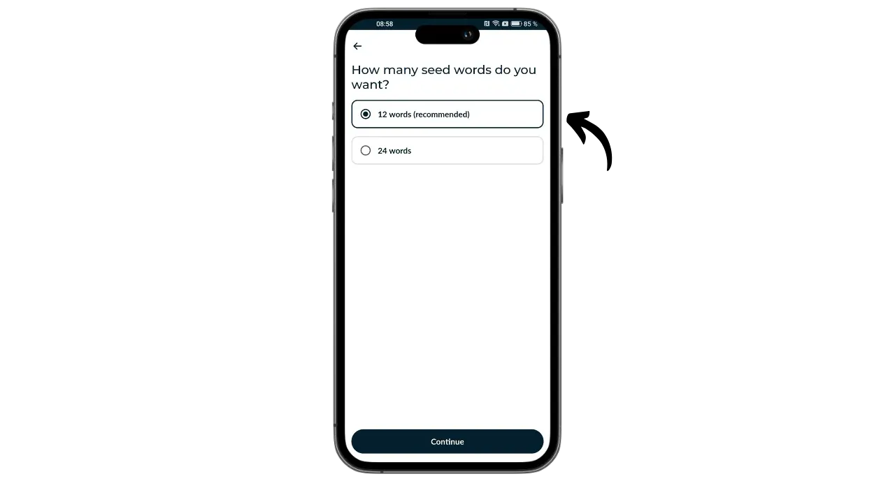
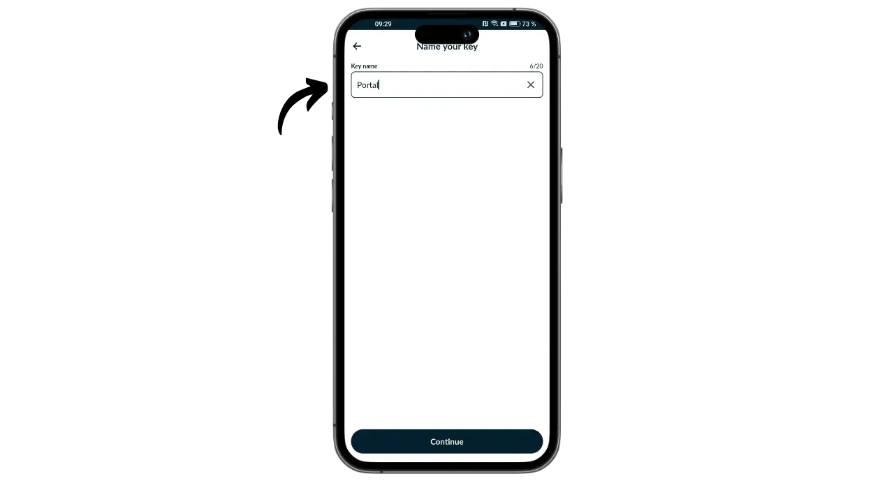
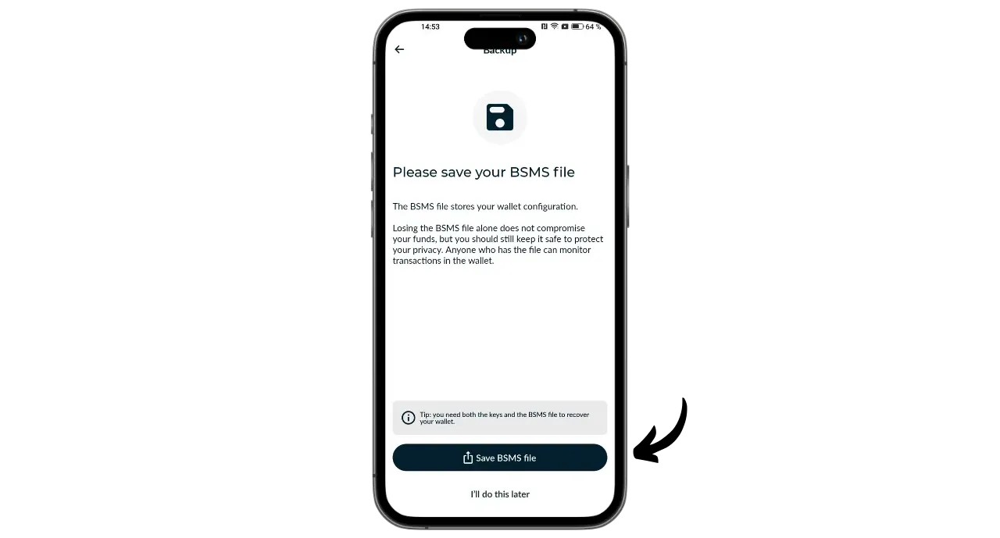

Le Portal est un hardware wallet Bitcoin conçu par TwentyTwo Devices, une entreprise spécialisée dans la création de hardware wallet open-source pour les bitcoiners. Fondée par Alekos Filini, créateur du projet Magical Bitcoin ([dorénavant nommé BDK](https://github.com/bitcoindevkit)) et ayant travaillé pour Blockstream et BHB Network, TwentyTwo Devices souhaite mettre l’accent sur l’autonomie, la simplicité et la sécurité des utilisateurs.

Portal se distingue des autres hardware wallets sur le marché par son intégration native aux smartphones. Il fonctionne sans câble, ni batterie. Il utilise la technologie NFC pour s’alimenter et communiquer avec n’importe le portefeuille mobile compatible. Son design intrigant est pensé pour une utilisation ergonomique. La partie ronde vient se placer à l'arrière du smartphone pour laisser dépasser un écran permettant de vérifier les détails de vos transactions avant de les signer avec le bouton dédié.

Entièrement open-source, le Portal repose sur un firmware écrit en Rust et utilise BDK (Bitcoin Dev Kit) pour la gestion des clés et des transactions. Il est vendu au prix de 89 € [sur le site officiel](https://store.twenty-two.xyz/products/portal-hardware-wallet).

Au moment de la rédaction de ce tutoriel, le Portal est compatible avec les applications Nunchuk et Bitcoin Keeper. Dans ce tutoriel, nous allons le configurer avec Nunchuk.

## Unboxing

À la réception de votre Portal, vérifiez que la boîte et l'étiquette qui la scelle sont en bon état. À l'intérieur, vous découvrirez votre Portal dans une pochette scellée.

Assurez-vous que le sceau est intact pour confirmer que la pochette n'a pas été ouverte. Le numéro unique affiché en gros sur la pochette devrait correspondre à celui inscrit en noir sous le sceau bleu, à celui sur l'étiquette de la boîte, ainsi qu'à celui qui apparaîtra sur votre écran lors du premier démarrage.

## Installation de Nunchuk

Pour gérer le portefeuille hébergé sur le Portal, nous allons utiliser l'application Nunchuk. Téléchargez l'application à partir du [Google Play Store](https://play.google.com/store/apps/details?id=io.nunchuk.android), de l'[App Store](https://apps.apple.com/us/app/nunchuk-bitcoin-wallet/id1563190073) ou directement via son [fichier `.apk`](https://github.com/nunchuk-io/nunchuk-android/releases).

Si vous utilisez Nunchuk pour la première fois, l'application vous proposera de créer un compte. Pour les besoins de ce tutoriel, il n'est pas nécessaire d'en créer un. Sélectionnez donc "*Continue as guest*" pour continuer sans compte.

## Configuration du Portal

Sur l'écran d'accueil de Nunchuk, cliquez sur le logo "*NFC*" situé en haut de l'écran.

Positionnez votre Portal à l'arrière de votre smartphone pour l'activer.

Nunchuk reconnaîtra votre Portal. Cliquez ensuite sur "*Continue*".

Pour créer un nouveau portefeuille, choisissez "*Generate seed on Portal*" puis cliquez sur "*Continue*".

Vous pouvez choisir entre une phrase mnémonique de 12 ou 24 mots. La sécurité offerte par les deux options est similaire, donc vous pouvez opter pour celle qui est la plus simple à sauvegarder, soit 12 mots.

Vous devrez ensuite choisir un mot de passe. Le mot de passe permet de déverrouiller votre Portal. C'est donc une protection contre les accès physiques non autorisés. Ce mot de passe n'intervient pas dans la dérivation des clés cryptographiques de votre portefeuille. Ainsi, même sans accès à ce mot de passe, la possession de votre phrase mnémonique de 12 ou 24 mots vous permettra de retrouver l'accès à vos bitcoins. Il est recommandé de choisir un mot de passe le plus aléatoire possible et suffisamment long. Assurez-vous également de sauvegarder ce mot de passe dans un lieu distinct de celui où est stocké votre Portal (par exemple, dans un gestionnaire de mot de passe).

Votre Portal va vous afficher votre phrase mnémonique de 12 mots. Cette phrase mnémonique donne un accès complet et non restreint à tous vos bitcoins. N'importe qui en possession de cette phrase peut subtiliser vos fonds, même sans accès physique à votre Portal.

La phrase de 12 mots permet de restaurer l'accès à vos bitcoins en cas de perte, vol ou casse de votre Portal. Il est donc très important de la sauvegarder soigneusement et de la stocker dans un endroit sécurisé.

Vous pouvez l'inscrire sur un morceau de papier, ou bien pour plus de sécurité, je vous recommande de la graver sur un support en acier inoxydable afin de la protéger contre les risques d'incendies, d'inondations ou d'écroulements.

Pour plus d'informations sur la manière adéquate de sauvegarder et de gérer votre phrase mnémonique, je vous recommande vivement de suivre cet autre tutoriel, particulièrement si vous êtes débutant :

https://planb.network/tutorials/wallet/backup/backup-mnemonic-22c0ddfa-fb9f-4e3a-96f9-46e2a7954270

_**Évidemment, vous ne devez jamais partager ces mots sur internet, contrairement à ce que je fais dans ce tutoriel. Ce portefeuille en exemple sera utilisé uniquement sur le Testnet et sera supprimé à l'issue du tutoriel.**_

Appuyez fermement sur le bouton de votre Portal pour passer aux mots suivants. Assurez-vous de placer votre doigt en entier sur le bouton et de maintenir la pression pendant quelques secondes pour que l'interaction soit bien détectée.

Votre Portal confirmera ensuite le mot de passe que vous avez renseigné dans Nunchuk.

La configuration de votre Portal et la création de votre phrase mnémonique sont maintenant terminées !

## Configuration du portefeuille Bitcoin

Sur Nunchuk, cliquez sur "*Continue*", toujours en maintenant votre Portal à l'arrière de votre téléphone.

Dans ce tutoriel, je vais configurer un portefeuille single-sig, donc je sélectionne cette option.

Utilisez le compte par défaut, c’est-à-dire le premier compte du portefeuille (numéro 0). Nunchuk vous demandera ensuite de confirmer le mot de passe de votre Portal pour le déverrouiller.

Sur le Portal, confirmez l'exportation de votre xpub vers Nunchuk. Cela permet de gérer le portefeuille depuis votre smartphone sans pouvoir dépenser les bitcoins sans le Portal. Appuyez sur le bouton pour confirmer.

Notez que le chemin de dérivation indiqué dans votre cas sera différent du mien, car ce tutoriel est réalisé sur le Testnet.

Nommez votre portefeuille, par exemple "*Portal*", puis cliquez sur "*Continue*".

Nunchuk vous présente ensuite votre Descriptor. Il est conseillé d'en faire une sauvegarde. Bien que le Descriptor ne permette pas de dépenser les bitcoins, il permet de retracer les chemins de dérivation de vos clés à partir de votre phrase mnémonique en cas de récupération du portefeuille. Gardez-le en lieu sûr, car bien que sa fuite ne pose pas un problème de sécurité, elle représente bien un problème de confidentialité.

Cliquez sur "*Done*".

Vous allez maintenant devoir générer les clés publiques de votre portefeuille Bitcoin. Pour ce faire, cliquez sur le bouton "*Create new wallet*".

Cliquez de nouveau sur "*Create new wallet*". Puis choisissez l'option "*Create a new wallet using existing keys*".

Choisissez un nom pour votre portefeuille puis cliquez sur "*Continue*".

Sélectionnez votre Portal comme périphérique de signature pour ce nouvel ensemble de clés, puis cliquez sur "*Continue*".

Si tout vous convient, validez la création.

Vous pouvez ensuite sauvegarder le fichier de configuration de votre portefeuille. Ce fichier contient exclusivement vos clés publiques, ce qui signifie que même si quelqu'un y accède, il ne pourra pas dérober vos bitcoins. Cependant, il pourra suivre toutes vos transactions. Ce fichier présente donc uniquement un risque pour votre vie privée. Dans certains cas, il peut être indispensable pour récupérer votre portefeuille.

Et voilà, votre portefeuille est bien créé !

## Comment recevoir des bitcoins avec le Portal ?

Pour recevoir des bitcoins, sélectionnez votre portefeuille.

Avant d'utiliser l'adresse générée, vérifiez-la sur l'écran du Portal. Pour cela, cliquez sur "*Receive*".

Cliquez sur les trois petits points, puis sélectionnez "*Verify address via PORTAL*". Ensuite, entrez votre mot de passe.

Positionnez votre Portal à l'arrière de votre téléphone, puis confirmez en appuyant sur le bouton.

Assurez-vous que l'adresse affichée sur le Portal correspond à celle indiquée sur Nunchuk, puis confirmez en appuyant de nouveau sur le bouton. Si les adresses sont identiques, vous pouvez donner cette adresse au payeur.

Une fois la transaction du payeur diffusée, vous la verrez apparaitre sur votre portefeuille.

Cliquez sur "*View coins*".

Sélectionnez votre nouvel UTXO.

Cliquez sur le "*+*" à côté de "*Tags*" pour ajouter une étiquette à votre UTXO. C'est une bonne pratique, car cela vous aide à vous rappeler la provenance de vos pièces et à optimiser votre confidentialité lors de futures dépenses.

Sélectionnez un tag existant ou créez-en un nouveau, puis cliquez sur "*Enregistrer*". Vous avez aussi la possibilité de créer des "*collections*" pour organiser vos pièces de manière plus structurée.

## Comment envoyer des bitcoins avec le Portal ?

Maintenant que vous avez des bitcoins sur votre portefeuille, vous pouvez également en envoyer. Pour ce faire, cliquez sur le portefeuille de votre choix.

Cliquez sur le bouton "*Send*".

Sélectionnez le montant à envoyer, puis cliquez sur "*Continue*".

Ajoutez une "*note*" à votre future transaction pour vous souvenir de son objectif.

Ensuite, saisissez l'adresse du destinataire dans le champ prévu à cet effet. Vous pouvez également scanner une adresse encodée en QR code en cliquant sur l'icône située en haut à droite de l'écran. Puis, cliquez sur le bouton "*Create Transaction*".

Vérifiez les détails de votre transaction, puis cliquez sur le bouton "*Sign*" à côté de votre Portal, et renseignez votre mot de passe.

Placez votre Portal à l'arrière de votre téléphone. Vérifiez sur son écran que l'adresse de réception du destinataire et le montant sont corrects. Si c'est le cas, appuyez sur le bouton pour continuer.

Vérifiez que le montant des frais de transaction est juste, puis appuyez de nouveau sur le bouton pour signer votre transaction.

Votre transaction a été signée. Vous pouvez vérifier une dernière fois ses détails sur Nunchuk, puis cliquez sur le bouton "*Broadcast transaction*" pour la diffuser sur le réseau Bitcoin.

Votre transaction est désormais en attente de confirmation.

Félicitations, vous êtes maintenant au point sur l'utilisation du Portal ! Si vous avez trouvé ce tutoriel utile, je vous serais reconnaissant de laisser un pouce vert ci-dessous. N'hésitez pas à partager cet article sur vos réseaux sociaux. Merci beaucoup !

Pour aller plus loin, vous pouvez également découvrir notre formation complète sur le fonctionnement des portefeuilles HD :

https://planb.network/courses/46b0ced2-9028-4a61-8fbc-3b005ee8d70f
