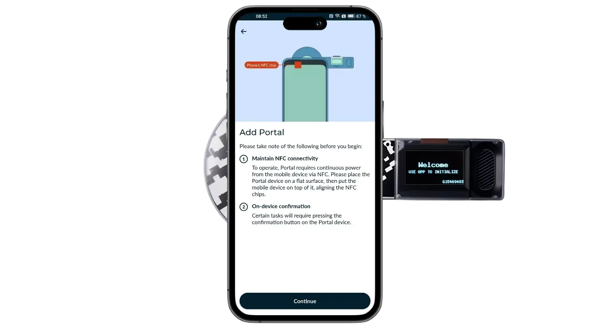
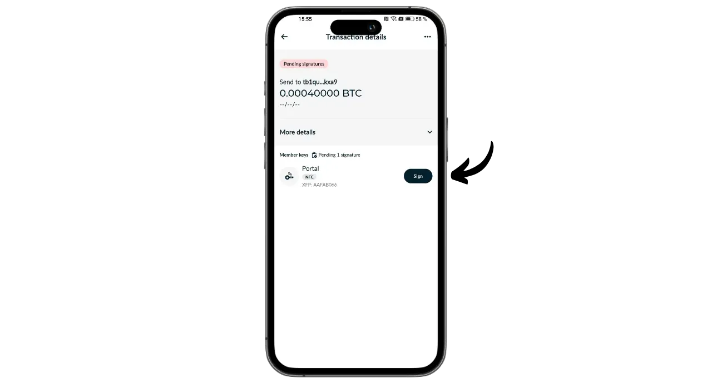

Portal adalah dompet perangkat keras Bitcoin yang didesain oleh TwentyTwo Devices, sebuah perusahaan yang mengkhususkan diri dalam pembuatan dompet perangkat keras sumber terbuka untuk para pengguna Bitcoin. Didirikan oleh Alekos Filini, pencipta proyek Magical Bitcoin ([selanjutnya dinamakan BDK] (https://github.com/bitcoindevkit)) dan pernah bekerja untuk Blockstream dan BHB Network, TwentyTwo Devices bertujuan untuk fokus pada otonomi pengguna, kesederhanaan dan keamanan.

Yang membedakan Portal dengan dompet perangkat keras lainnya di pasaran adalah integrasi aslinya dengan smartphone. Dompet ini bekerja tanpa kabel atau baterai. Ia menggunakan teknologi NFC untuk menyalakan dirinya sendiri dan berkomunikasi dengan dompet seluler apa pun yang kompatibel. Desainnya yang menarik dirancang untuk penggunaan yang ergonomis. Bagian bundar ditempatkan di bagian belakang smartphone untuk menampilkan layar di mana Anda dapat memeriksa detail transaksi Anda sebelum menandatanganinya dengan tombol khusus.

Sepenuhnya open-source, Portal didasarkan pada firmware yang ditulis dalam bahasa Rust dan menggunakan BDK (Bitcoin Dev Kit) untuk manajemen kunci dan transaksi. Portal ini dijual dengan harga €89 [di situs web resminya] (https://store.twenty-two.xyz/products/portal-hardware-wallet).

Pada saat artikel ini ditulis, Portal ini kompatibel dengan aplikasi Nunchuk dan Bitcoin Keeper. Dalam tutorial ini, kita akan mengonfigurasinya dengan Nunchuk.

## Membuka kemasan

Ketika Anda menerima Portal Anda, periksa apakah kotak dan label yang menyegelnya dalam kondisi baik. Di dalamnya, Anda akan menemukan Portal Anda di dalam kantong tertutup.

Pastikan segelnya masih utuh untuk memastikan bahwa kantong belum dibuka. Nomor unik yang ditampilkan dalam huruf besar pada kantong harus sesuai dengan nomor yang tertulis dalam warna hitam di bawah segel biru, nomor yang tertera pada label kotak, dan nomor yang akan muncul pada layar Anda saat pertama kali menyalakannya.

## Instalasi Nunchuk

Untuk mengelola dompet yang dihosting di Portal, kita akan menggunakan aplikasi Nunchuk. Unduh aplikasi ini dari [Google Play Store](https://play.google.com/store/apps/details?id=io.nunchuk.android), [App Store](https://apps.apple.com/us/app/nunchuk-bitcoin-wallet/id1563190073) atau secara langsung melalui [file `.apk`](https://github.com/nunchuk-io/nunchuk-android/releases).

Jika Anda menggunakan Nunchuk untuk pertama kalinya, aplikasi ini akan meminta Anda untuk membuat akun. Untuk keperluan tutorial ini, Anda tidak perlu membuat akun. Pilih "*Lanjutkan sebagai tamu*" untuk melanjutkan tanpa akun.

## Konfigurasi portal

Pada layar beranda Nunchuk, klik logo "*NFC*" di bagian atas layar.

Posisikan Portal Anda di bagian belakang ponsel cerdas Anda untuk mengaktifkannya.

Nunchuk akan mengenali Portal Anda. Kemudian klik "*Lanjutkan*".

Untuk membuat portofolio baru, pilih "*Generate seed on Portal*" lalu klik "*Lanjutkan*".

Anda dapat memilih antara frasa mnemonik 12 atau 24 kata. Keamanan yang ditawarkan oleh kedua opsi ini serupa, sehingga Anda dapat memilih salah satu yang paling mudah disimpan, yaitu 12 kata.

Anda kemudian akan diminta untuk memilih kata sandi. Kata sandi akan membuka kunci Portal Anda. Oleh karena itu, kata sandi memberikan perlindungan terhadap akses fisik yang tidak sah. Kata sandi ini tidak terlibat dalam proses penurunan kunci kriptografi dompet Anda. Jadi, bahkan tanpa akses ke kata sandi ini, kepemilikan frasa mnemonik 12 atau 24 kata akan memungkinkan Anda untuk mendapatkan kembali akses ke bitcoin Anda. Disarankan untuk memilih kata sandi yang seacak mungkin dan cukup panjang. Pastikan Anda menyimpan kata sandi ini di tempat yang terpisah dari tempat penyimpanan Portal Anda (mis. di pengelola kata sandi).

Portal Anda akan menampilkan frasa mnemonik 12 kata. Kata mnemonik ini memberikan Anda akses penuh dan tidak terbatas ke semua bitcoin Anda. Siapa pun yang memiliki frasa ini dapat mencuri dana Anda, bahkan tanpa akses fisik ke Portal Anda.

Frasa 12 kata ini memulihkan akses ke bitcoin Anda jika terjadi kehilangan, pencurian, atau kerusakan pada Portal Anda. Oleh karena itu, sangat penting untuk menyimpannya dengan hati-hati dan menyimpannya di tempat yang aman.

Anda bisa menuliskannya pada selembar kertas, atau untuk keamanan tambahan, saya sarankan untuk mengukirnya pada dasar baja tahan karat untuk melindunginya dari kebakaran, banjir atau keruntuhan.

Untuk informasi lebih lanjut mengenai cara yang tepat untuk menyimpan dan mengelola frasa mnemonik Anda, saya sangat merekomendasikan untuk mengikuti tutorial lainnya, khususnya jika Anda seorang pemula:

https://planb.network/tutorials/wallet/backup/backup-mnemonic-22c0ddfa-fb9f-4e3a-96f9-46e2a7954270

tentu saja, Anda tidak boleh membagikan kata-kata ini di Internet, seperti yang saya lakukan dalam tutorial ini. Portofolio contoh ini hanya akan digunakan di Testnet dan akan dihapus di akhir tutorial.**_

Tekan tombol pada Portal Anda dengan kuat untuk beralih ke kata berikutnya. Pastikan Anda meletakkan seluruh jari Anda pada tombol dan tahan tekanan selama beberapa detik, sehingga interaksi terdeteksi dengan benar.

Portal Anda kemudian akan mengonfirmasi kata sandi yang Anda masukkan di Nunchuk.

Anda sekarang telah selesai mengonfigurasi Portal Anda dan membuat frasa mnemonik Anda!

## Konfigurasi dompet Bitcoin

Pada Nunchuk, klik "*Lanjutkan*", sambil tetap memegang Portal Anda di bagian belakang ponsel Anda.

Dalam tutorial ini, saya akan menyiapkan portofolio single-sig, jadi saya memilih opsi ini.

Gunakan akun default, yaitu akun pertama di dompet (nomor 0). Nunchuk kemudian akan meminta Anda untuk mengonfirmasi kata sandi Portal untuk membukanya.

Di Portal, konfirmasikan ekspor xpub Anda ke Nunchuk. Hal ini memungkinkan Anda untuk mengelola wallet dari ponsel pintar Anda tanpa bisa membelanjakan bitcoin tanpa Portal. Tekan tombol untuk mengonfirmasi.

Perhatikan bahwa jalur derivasi yang ditunjukkan dalam kasus Anda akan berbeda dengan kasus saya, karena tutorial ini dilakukan di Testnet.

Beri nama portofolio Anda, misalnya "*Portal*", lalu klik "*Lanjutkan*".

Nunchuk kemudian menampilkan Descriptor Anda. Sebaiknya Anda membuat cadangan. Walaupun Descriptor tidak mengizinkan Anda untuk membelanjakan bitcoin, namun memungkinkan Anda untuk melacak jalur turunan dari kunci Anda dari frasa mnemonik Anda jika terjadi pemulihan dompet. Simpanlah di tempat yang aman, karena meskipun kebocorannya tidak menimbulkan masalah keamanan, namun hal ini merupakan masalah kerahasiaan.

Klik "*Selesai*".

Sekarang Anda perlu membuat kunci publik untuk dompet Bitcoin Anda. Untuk melakukannya, klik tombol "*Buat dompet baru*".

Klik sekali lagi pada "*Buat dompet baru*". Kemudian pilih opsi "*Buat dompet baru menggunakan kunci yang ada*".

Pilih nama untuk portofolio Anda dan klik "*Lanjutkan*".

Pilih Portal Anda sebagai perangkat penandatanganan untuk set kunci baru ini, lalu klik "*Lanjutkan*".

Jika semuanya sudah sesuai dengan keinginan Anda, validasi kreasi tersebut.

Anda kemudian dapat menyimpan file konfigurasi dompet Anda. File ini hanya berisi kunci publik Anda, yang berarti meskipun seseorang mengaksesnya, mereka tidak akan dapat mencuri bitcoin Anda. Akan tetapi, mereka akan dapat melacak semua transaksi Anda. Oleh karena itu, file ini hanya memberikan risiko terhadap privasi Anda. Dalam beberapa kasus, file ini mungkin sangat diperlukan untuk memulihkan dompet Anda.

Dan hanya itu saja yang bisa dilakukan!

## Bagaimana cara menerima bitcoin dengan Portal?

Untuk menerima bitcoin, pilih dompet Anda.

Sebelum menggunakan alamat yang dibuat, periksa pada layar Portal. Untuk melakukannya, klik "*Terima*".

Klik pada tiga titik, lalu pilih "*Verifikasi alamat melalui PORTAL*". Kemudian masukkan kata sandi Anda.

Posisikan Portal di bagian belakang ponsel Anda, lalu konfirmasikan dengan menekan tombol.

Pastikan alamat yang ditampilkan di Portal sesuai dengan alamat yang ada di Nunchuk Anda, lalu konfirmasikan dengan menekan tombol sekali lagi. Jika alamatnya sama, Anda dapat memberikan alamat ini kepada pembayar.

Setelah transaksi pembayar disiarkan, Anda akan melihatnya muncul di dompet Anda.

Klik pada "*Lihat sudut*".

Pilih UTXO baru Anda.

Klik tanda "*+*" di sebelah "*Tags*" untuk menambahkan tag ke UTXO Anda. Ini adalah praktik yang baik, karena membantu Anda mengingat dari mana asal koin Anda dan mengoptimalkan privasi Anda saat membelanjakan di masa mendatang.

Pilih tag yang sudah ada atau buat tag baru, lalu klik "*Save*". Anda juga bisa membuat "*collections*" untuk mengatur komponen Anda dengan cara yang lebih terstruktur.

## Bagaimana cara mengirim bitcoin menggunakan Portal?

Setelah Anda memiliki bitcoin di dalam wallet, Anda juga bisa mengirimkannya. Untuk melakukannya, klik dompet pilihan Anda.

Klik tombol "*Kirim*".

Pilih jumlah yang akan dikirim, lalu klik "*Lanjutkan*".

Tambahkan "*catatan*" pada transaksi Anda di masa mendatang untuk mengingatkan Anda tentang tujuannya.

Kemudian masukkan alamat penerima di bidang yang tersedia. Anda juga dapat memindai alamat yang dikodekan sebagai kode QR dengan mengeklik ikon di bagian kanan atas layar. Kemudian klik tombol "*Buat Transaksi*".

Periksa detail transaksi Anda, lalu klik tombol "*Tanda Tangan*" di samping Portal Anda, dan masukkan kata sandi Anda.

Letakkan Portal di bagian belakang ponsel Anda. Periksa apakah alamat penerima dan jumlahnya sudah benar. Jika sudah, tekan tombol untuk melanjutkan.

Periksa apakah biaya transaksi sudah benar, lalu tekan tombol lagi untuk menandatangani transaksi Anda.

Transaksi Anda telah ditandatangani. Anda bisa memeriksa detailnya untuk terakhir kali di Nunchuk, lalu klik tombol "*Siarkan transaksi*" untuk menyiarkannya di jaringan Bitcoin.

Transaksi Anda sekarang sedang menunggu konfirmasi.

Selamat, Anda sekarang sudah bisa menggunakan Portal! Jika Anda merasa tutorial ini bermanfaat, saya akan sangat berterima kasih jika Anda memberikan tanda jempol hijau di bawah ini. Jangan ragu untuk membagikan artikel ini di jejaring sosial Anda. Terima kasih banyak!

Untuk mengetahui lebih lanjut, lihatlah kursus pelatihan lengkap kami mengenai cara kerja portofolio HD:

https://planb.network/courses/46b0ced2-9028-4a61-8fbc-3b005ee8d70f
