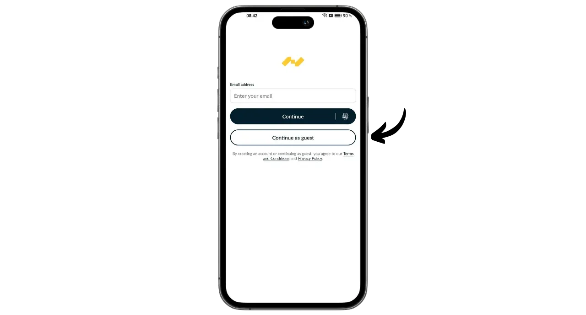
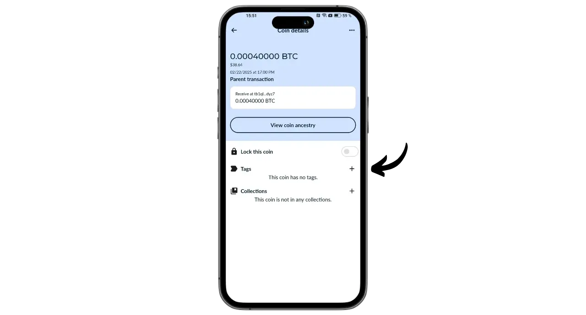

Portal è un portafoglio hardware Bitcoin progettato da TwentyTwo Devices, una società specializzata nella creazione di portafogli hardware open-source per i bitcoiners. Fondata da Alekos Filini, creatore del progetto Magical Bitcoin ([d'ora in poi chiamato BDK](https://github.com/bitcoindevkit)) e che ha lavorato per Blockstream e BHB Network, TwentyTwo Devices intende concentrarsi sull'autonomia dell'utente, sulla semplicità e sulla sicurezza.

Ciò che distingue Portal dagli altri portafogli hardware presenti sul mercato è la sua integrazione nativa con gli smartphone. Funziona senza cavi o batterie. Utilizza la tecnologia NFC per alimentarsi e comunicare con qualsiasi portafoglio mobile compatibile. Il suo design intrigante è concepito per un uso ergonomico. La parte rotonda è posizionata sul retro dello smartphone per rivelare uno schermo dove è possibile controllare i dettagli delle transazioni prima di firmarle con il pulsante dedicato.

Interamente open-source, il Portale si basa su un firmware scritto in Rust e utilizza BDK (Bitcoin Dev Kit) per la gestione delle chiavi e delle transazioni. Viene venduto a 89 euro [sul sito ufficiale](https://store.twenty-two.xyz/products/portal-hardware-wallet).

Al momento in cui scriviamo, il portale è compatibile con le applicazioni Nunchuk e Bitcoin Keeper. In questa guida lo configureremo con Nunchuk.

## Unboxing

Quando si riceve il Portale, verificare che la scatola e l'etichetta che la chiude siano in buone condizioni. All'interno troverete il vostro Portale in una busta sigillata.

Assicurarsi che il sigillo sia intatto per confermare che la busta non è stata aperta. Il numero univoco riportato a grandi lettere sulla busta deve corrispondere a quello scritto in nero sotto il sigillo blu, a quello riportato sull'etichetta della confezione e a quello che apparirà sullo schermo al primo avvio.

## Installazione del Nunchuk

Per gestire il portafoglio ospitato sul portale, utilizzeremo l'applicazione Nunchuk. Scaricare l'applicazione dal [Google Play Store](https://play.google.com/store/apps/details?id=io.nunchuk.android), dall'[App Store](https://apps.apple.com/us/app/nunchuk-bitcoin-wallet/id1563190073) o direttamente tramite il suo [file `.apk`](https://github.com/nunchuk-io/nunchuk-android/releases).

Se si utilizza il Nunchuk per la prima volta, l'applicazione chiederà di creare un account. Ai fini di questa esercitazione, non è necessario crearne uno. Selezionare "*Continua come ospite*" per continuare senza account.

## Configurazione del portale

Nella schermata iniziale del Nunchuk, fare clic sul logo "*NFC*" nella parte superiore dello schermo.

Posizionare il portale sul retro dello smartphone per attivarlo.

Il Nunchuk riconoscerà il vostro portale. Fare quindi clic su "*Continua*".

Per creare un nuovo portafoglio, selezionare "*Generare seme sul portale*", quindi fare clic su "*Continuare*".

È possibile scegliere tra una frase mnemonica di 12 o 24 parole. La sicurezza offerta da entrambe le opzioni è simile, quindi potete optare per quella più facile da salvare, cioè 12 parole.

Vi verrà quindi chiesto di scegliere una password. La password sblocca il portale. Essa fornisce quindi una protezione contro l'accesso fisico non autorizzato. Questa password non partecipa alla creazione delle chiavi crittografiche del portafoglio. Quindi, anche senza accesso a questa password, il possesso della frase mnemonica di 12 o 24 parole vi permetterà di riavere accesso ai vostri bitcoin. È consigliabile scegliere una password il più possibile casuale e sufficientemente lunga. Assicuratevi di salvare questa password in un luogo separato da quello in cui è memorizzato il vostro portale (ad esempio, in un gestore di password).

Il vostro portale visualizzerà la vostra frase mnemonica di 12 parole. Questa frase mnemonica vi dà accesso completo e illimitato a tutti i vostri bitcoin. Chiunque sia in possesso di questa frase può rubare i vostri fondi, anche senza accedere fisicamente al vostro portale.

La frase di 12 parole ripristina l'accesso ai bitcoin in caso di perdita, furto o rottura del Portale. È quindi molto importante salvarla con cura e conservarla in un luogo sicuro.

È possibile inciderlo su un foglio di carta o, per maggiore sicurezza, consiglio di inciderlo su una base di acciaio inossidabile per proteggerlo da incendi, alluvioni o crolli.

Per ulteriori informazioni sul modo corretto di salvare e gestire la frase mnemonica, vi consiglio di seguire quest'altro tutorial, soprattutto se siete principianti:

https://planb.network/tutorials/wallet/backup/backup-mnemonic-22c0ddfa-fb9f-4e3a-96f9-46e2a7954270

naturalmente, non dovete mai condividere queste parole su Internet, come sto facendo io in questa esercitazione. Questo portfolio di esempio sarà utilizzato solo su Testnet e sarà cancellato alla fine del tutorial.**_

Premere con decisione il pulsante sul portale per passare alle parole successive. Assicuratevi di posizionare l'intero dito sul pulsante e di mantenere la pressione per alcuni secondi, in modo che l'interazione venga rilevata correttamente.

Il portale confermerà la password inserita in Nunchuk.

Ora avete finito di configurare il vostro portale e di creare la vostra frase mnemonica!

## Configurazione del portafoglio Bitcoin

Sul Nunchuk, fare clic su "*Continua*", sempre tenendo il Portale sul retro del telefono.

In questa esercitazione, intendo configurare un portafoglio con un solo segnale, quindi selezionerò questa opzione.

Utilizzate l'account predefinito, cioè il primo account del portafoglio (numero 0). Nunchuk chiederà quindi di confermare la password del portale per sbloccarlo.

Sul Portale, confermare l'esportazione del proprio xpub su Nunchuk. Ciò consente di gestire il portafoglio dallo smartphone senza poter spendere bitcoin senza il Portale. Premere il pulsante per confermare.

Si noti che il percorso di derivazione indicato nel vostro caso sarà diverso dal mio, poiché questa esercitazione viene eseguita su Testnet.

Dare un nome al portafoglio, ad esempio "*Portale*", quindi fare clic su "*Continua*".

Il Nunchuk presenta quindi il descrittore. È una buona idea fare un backup. Sebbene il Descrittore non permetta di spendere bitcoin, consente di tracciare i percorsi di derivazione delle chiavi dalla frase mnemonica in caso di recupero del portafoglio. Conservatelo in un luogo sicuro, perché, sebbene la sua perdita non rappresenti un problema di sicurezza, rappresenta comunque un problema di riservatezza.

Fare clic su "*Fatto*".

Ora è necessario generare le chiavi pubbliche per il portafoglio Bitcoin. Per farlo, cliccate sul pulsante "*Crea nuovo portafoglio*".

Cliccate nuovamente su "*Crea un nuovo portafoglio*". Quindi scegliere l'opzione "*Crea un nuovo portafoglio utilizzando le chiavi esistenti*".

Scegliete un nome per il vostro portafoglio e cliccate su "*Continua*".

Selezionare il proprio portale come dispositivo di firma per questo nuovo set di chiavi, quindi fare clic su "*Continua*".

Se tutto è di vostro gradimento, convalidate la creazione.

È quindi possibile salvare il file di configurazione del portafoglio. Questo file contiene solo le vostre chiavi pubbliche, il che significa che anche se qualcuno vi accede, non sarà in grado di rubare i vostri bitcoin. Tuttavia, sarà in grado di tracciare tutte le vostre transazioni. Questo file rappresenta quindi solo un rischio per la vostra privacy. In alcuni casi, può essere indispensabile per recuperare il vostro portafoglio.

E questo è tutto!

## Come posso ricevere bitcoin con Portal?

Per ricevere bitcoin, selezionare il proprio portafoglio.

Prima di utilizzare l'indirizzo generato, verificatelo nella schermata del portale. A tal fine, cliccare su "*Ricevi*".

Fare clic sui tre punti, quindi selezionare "*Verifica indirizzo tramite PORTALE*". Inserire quindi la password.

Posizionare il portale sul retro del telefono, quindi confermare premendo il pulsante.

Verificare che l'indirizzo visualizzato sul portale corrisponda a quello del Nunchuk, quindi confermare premendo nuovamente il pulsante. Se gli indirizzi sono identici, è possibile fornire questo indirizzo al pagatore.

Una volta trasmessa la transazione del pagatore, la vedrete comparire nel vostro portafoglio.

Fare clic su "*Visualizza angoli*".

Selezionare il nuovo UTXO.

Fare clic su "*+*" accanto a "*Tags*" per aggiungere un tag al proprio UTXO. Questa è una buona pratica, in quanto aiuta a ricordare la provenienza delle monete e ottimizza la privacy quando si spendono in futuro.

Selezionare un'etichetta esistente o crearne una nuova, quindi fare clic su "*Salva*". È anche possibile creare "*collezioni*" per organizzare i pezzi in modo più strutturato.

## Come posso inviare bitcoin utilizzando Portal?

Ora che avete dei bitcoin nel vostro portafoglio, potete anche inviarli. Per farlo, cliccate sul portafoglio di vostra scelta.

Fare clic sul pulsante "*Invio*".

Selezionare l'importo da inviare, quindi fare clic su "*Continua*".

Aggiungete una "nota" alla vostra futura transazione per ricordarvi il suo scopo.

Inserire quindi l'indirizzo del destinatario nell'apposito campo. È anche possibile scansionare un indirizzo codificato come codice QR facendo clic sull'icona in alto a destra dello schermo. Cliccare quindi sul pulsante "*Crea transazione*".

Controllare i dettagli della transazione, quindi fare clic sul pulsante "*Firma*" accanto al portale e inserire la password.

Posizionare il Portale sul retro del telefono. Verificare che l'indirizzo del destinatario e l'importo siano corretti. In caso affermativo, premere il pulsante per continuare.

Verificare che la tariffa della transazione sia corretta, quindi premere nuovamente il pulsante per firmare la transazione.

La transazione è stata firmata. È possibile controllarne i dettagli un'ultima volta sul Nunchuk, quindi fare clic sul pulsante "*Transazione trasmessa*" per trasmetterla alla rete Bitcoin.

La transazione è in attesa di conferma.

Congratulazioni, ora avete imparato a usare Portal! Se avete trovato utile questa guida, vi sarei grato se lasciaste un pollice verde qui sotto. Sentitevi liberi di condividere questo articolo sui vostri social network. Grazie mille!

Per saperne di più, date un'occhiata al nostro corso di formazione completo sul funzionamento dei portafogli HD:

https://planb.network/courses/46b0ced2-9028-4a61-8fbc-3b005ee8d70f
