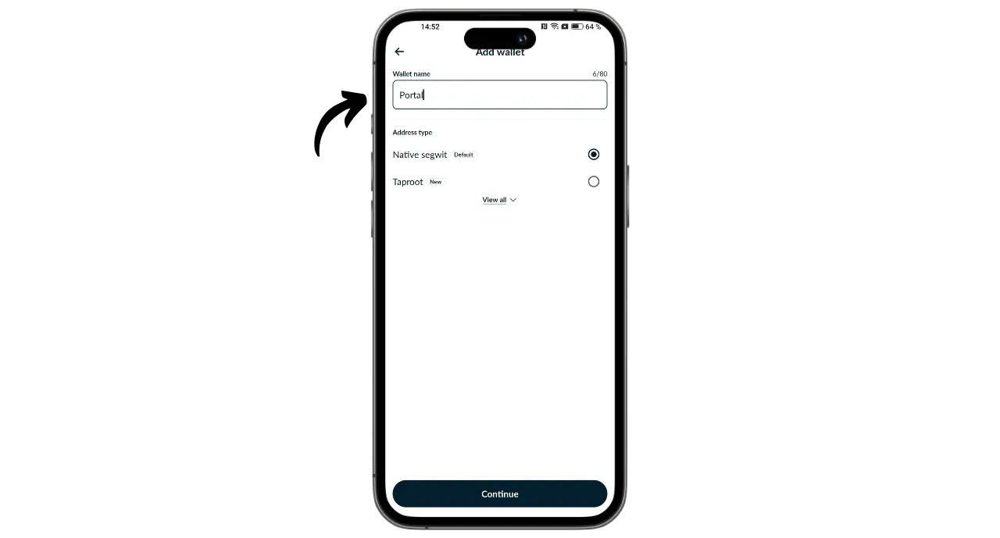
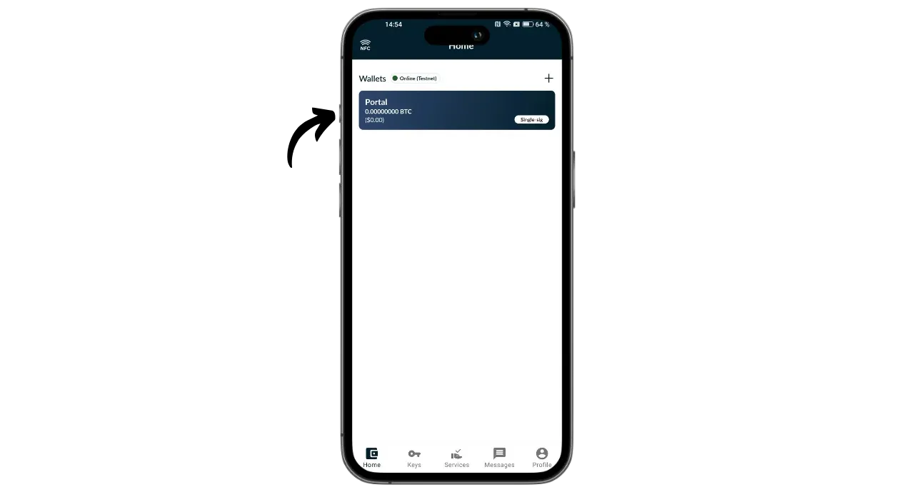
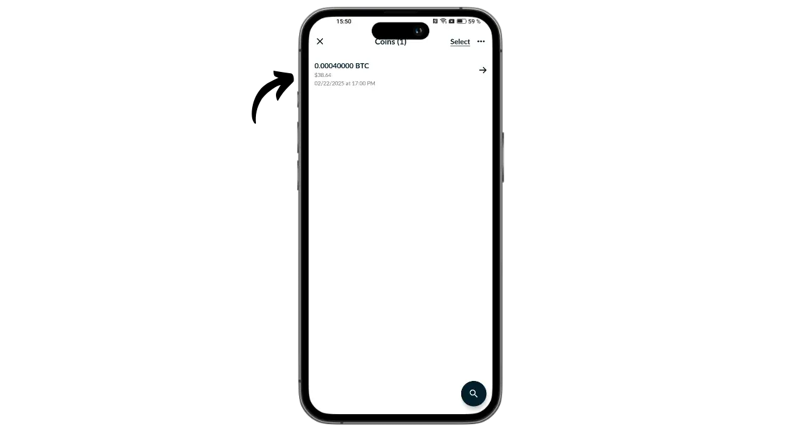

Portalは、ビットコイナー向けのオープンソースハードウェアウォレットの作成を専門とするTwentyTwo Devices社によって設計されたビットコインハードウェアウォレットである。Magical Bitcoinプロジェクト（[以後BDK](https://github.com/bitcoindevkit)と命名）の作成者であり、BlockstreamとBHB Networkで働いた経験を持つAlekos Filiniによって設立されたTwentyTwo Devicesは、ユーザーの自律性、シンプルさ、セキュリティに焦点を当てることを目指しています。

Portalが市場の他のハードウェア・ウォレットと異なるのは、スマートフォンとのネイティブな統合である。ポータルはケーブルや電池なしで動作する。NFC技術を使って電力を供給し、互換性のあるモバイルウォレットと通信する。その魅力的なデザインは、人間工学に基づいて設計されている。丸い部分はスマートフォンの背面に設置され、専用ボタンでサインする前に取引の詳細を確認できる画面が表示される。

完全にオープンソースのPortalは、Rustで書かれたファームウェアに基づいており、鍵とトランザクションの管理にBDK（Bitcoin Dev Kit）を使用している。価格は89ユーロ（公式サイト）（https://store.twenty-two.xyz/products/portal-hardware-wallet）。

この記事を書いている時点では、ポータルは Nunchuk と Bitcoin Keeper アプリケーションに対応しています。このチュートリアルでは、Nunchukで設定します。

## 開梱

ポータルが届いたら、箱とそれを封印しているラベルが良好な状態であることを確認してください。ポータルは密封された袋に入っています。

パウチが未開封であることを確認するため、シールが無傷であることを確認してください。パウチに大きな文字で表示されている固有番号は、青いシールの下に黒字で書かれている番号、箱のラベルに記載されている番号、および初回起動時に画面に表示される番号と一致している必要があります。

## ヌンチャクの取り付け

ポータルにホストされているウォレットを管理するために、Nunchukアプリケーションを使用します。アプリケーションは[Google Playストア](https://play.google.com/store/apps/details?id=io.nunchuk.android)、[App Store](https://apps.apple.com/us/app/nunchuk-bitcoin-wallet/id1563190073)、または直接[ファイル `.apk`](https://github.com/nunchuk-io/nunchuk-android/releases)からダウンロードしてください。

初めてNunchukを使用する場合、アプリケーションはアカウントの作成を促します。このチュートリアルではアカウントを作成する必要はありません。アカウントなしで続ける場合は "*Continue as guest*"を選択してください。

## ポータル設定

Nunchukのホーム画面で、画面上部の「*NFC*」ロゴをクリックします。

ポータルをスマートフォンの背面に置いて起動させます。

ヌンチャクがあなたのポータルを認識します。次に "*Continue*"をクリックしてください。

新しいポートフォリオを作成するには、"*Generate seed on Portal*"を選択し、"*Continue*"をクリックします。

12語または24語のニーモニック・フレーズを選択できます。どちらのオプションも安全性は同じなので、保存しやすい方、つまり12語を選べばよい。

その後、パスワードの選択を求められます。パスワードはポータルのロックを解除します。そのため、不正な物理的アクセスから保護されます。このパスワードは、あなたのウォレットの暗号キーの導出には関与しません。そのため、このパスワードにアクセスできなくても、12語または24語のニーモニックフレーズを持っていれば、ビットコインへのアクセスを取り戻すことができます。パスワードはできるだけランダムで十分な長さのものを選ぶことをお勧めします。このパスワードは、ポータルが保存されている場所とは別の場所（パスワードマネージャーなど）に保存してください。

あなたのポータルには、12語のニーモニックフレーズが表示されます。このニーモニックにより、あなたはすべてのビットコインに完全かつ無制限にアクセスできるようになります。このフレーズを持っている人は、ポータルへの物理的なアクセスがなくても、あなたの資金を盗むことができます。

この12単語のフレーズは、ポータルの紛失、盗難、破損の際にビットコインへのアクセスを回復します。そのため、慎重に保存し、安全な場所に保管することが非常に重要です。

紙に刻むこともできるし、さらに安全性を高めるなら、火災や洪水、倒壊から守るためにステンレス製の台座に刻むことをお勧めする。

ニモニックフレーズの保存と管理の適切な方法については、特に初心者の方には、この他のチュートリアルをご覧になることを強くお勧めします：

https://planb.network/tutorials/wallet/backup/backup-mnemonic-22c0ddfa-fb9f-4e3a-96f9-46e2a7954270

もちろん、このチュートリアルで私がしているように、これらの言葉をインターネット上で共有してはいけません。このサンプル・ポートフォリオはTestnet上でのみ使用され、チュートリアルが終了した時点で削除されます**_。

次の単語に進むには、ポータルのボタンをしっかり押してください。インタラクションが正しく検出されるように、指全体をボタンに置き、数秒間押し続けるようにしてください。

ポータルは、あなたがヌンチャクで入力したパスワードを確認します。

これでポータルの設定とニーモニック・フレーズの作成は完了です！

## ビットコイン・ウォレットの設定

ヌンチャクで "*Continue*"をクリックし、ポータルを携帯電話の背面に当てたままにします。

このチュートリアルでは、シングルシグナルのポートフォリオを設定するので、このオプションを選択する。

デフォルトアカウント、つまりウォレットの最初のアカウント（0番）を使用します。Nunchukはロックを解除するためにポータルパスワードを確認します。

ポータル上で、Nunchukへのxpubのエクスポートを確認します。これにより、ポータルがなくてもビットコインを使うことなく、スマートフォンからウォレットを管理できるようになります。ボタンを押して確定します。

このチュートリアルはTestnet上で行われるため、あなたのケースで示される導出パスは私のケースとは異なることに注意してください。

ポートフォリオに名前を付け、例えば "*Portal*"とし、"*Continue*"をクリックします。

次にヌンチャクがあなたのディスクリプタを提示します。バックアップを取っておくといいだろう。Descriptorはビットコインを使用することはできませんが、ウォレットを回復する際にあなたのニーモニックフレーズから鍵の派生パスをトレースすることができます。安全な場所に保管しておくこと。その漏洩はセキュリティ上の問題にはならないかもしれないが、機密性の問題にはなるからだ。

完了」をクリックする。

ビットコインウォレットの公開鍵を生成する必要があります。これを行うには、「*新しいウォレットを作成*」ボタンをクリックします。

もう一度 "*Create new wallet*"をクリックする。次に "*Create a new wallet using existing keys*"オプションを選択します。

ポートフォリオの名前を選択し、"*Continue*"をクリックしてください。

新しい鍵セットの署名デバイスとしてPortalを選択し、"*Continue*"をクリックする。

すべてが満足のいくものであれば、制作を検証する。

その後、ウォレットの設定ファイルを保存します。このファイルにはあなたの公開鍵だけが含まれているので、たとえ誰かがアクセスしたとしても、あなたのビットコインを盗むことはできません。しかし、あなたのすべての取引を追跡することは可能です。したがって、このファイルはあなたのプライバシーに対するリスクしかもたらさない。場合によっては、あなたのウォレットを回復するために不可欠かもしれません。

それがすべてだ！

## ポータルでビットコインを受け取るには？

ビットコインを受け取るには、ウォレットを選択します。

生成されたアドレスを使用する前に、ポータル画面で確認してください。これを行うには、「*受信*」をクリックする。

3つの点をクリックし、「*Verify address via PORTAL*」を選択します。次にパスワードを入力してください。

ポータルを携帯電話の背面に置き、ボタンを押して確認します。

ポータルに表示された住所とヌンチャクに表示された住所が一致していることを確認し、もう一度ボタンを押して確認します。住所が一致していれば、この住所を支払人に伝えることができます。

支払人のトランザクションがブロードキャストされると、あなたのウォレットに表示されます。

コーナーを見る "をクリックする。

新しいUTXOを選択します。

UTXOにタグを追加するには、「*タグ*」の隣にある「*+*」をクリックしてください。これは良い習慣です。自分のコインがどこから来たかを覚えておくことができ、将来使うときにプライバシーを最適化することができます。

既存のタグを選択するか、新しいタグを作成し、「*保存*」をクリックします。また、"*コレクション*"を作成して、より構造的にパーツを整理することもできます。

## ポータルを使ってビットコインを送るには？

ウォレットにビットコインがあるので、それを送ることもできます。送信するには、お好きなウォレットをクリックしてください。

送信*」ボタンをクリックする。

送信する金額を選択し、"*Continue*"をクリックします。

今後の取引には、その目的を思い出させるために「*注*」を付けましょう。

次に、指定されたフィールドに受信者の住所を入力します。画面右上のアイコンをクリックして、QRコードとしてエンコードされた住所をスキャンすることもできます。その後、「*Create Transaction*」ボタンをクリックしてください。

お取引の詳細を確認し、ポータルの横にある「*Sign*」ボタンをクリックし、パスワードを入力してください。

携帯電話の背面にポータルを置く。受取人の住所と金額が正しいことを確認します。間違いがなければ、ボタンを押して進みます。

取引手数料が正しいことを確認し、もう一度ボタンを押して取引に署名します。

あなたの取引は署名されました。Nunchukで最後にもう一度詳細を確認し、"*Broadcast transaction*"ボタンをクリックしてビットコインネットワークにブロードキャストすることができます。

お取引は確認待ちです。

おめでとう、これでポータルの使い方のコツをつかんだね！このチュートリアルが役に立ったなら、下に緑の親指を残してくれるとありがたい。この記事をあなたのソーシャルネットワークでシェアしてください。ありがとうございました！

詳しくは、HDポートフォリオの仕組みに関するトレーニングコースをご覧ください：

https://planb.network/courses/46b0ced2-9028-4a61-8fbc-3b005ee8d70f
