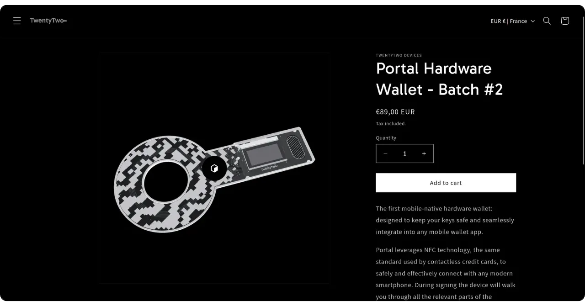
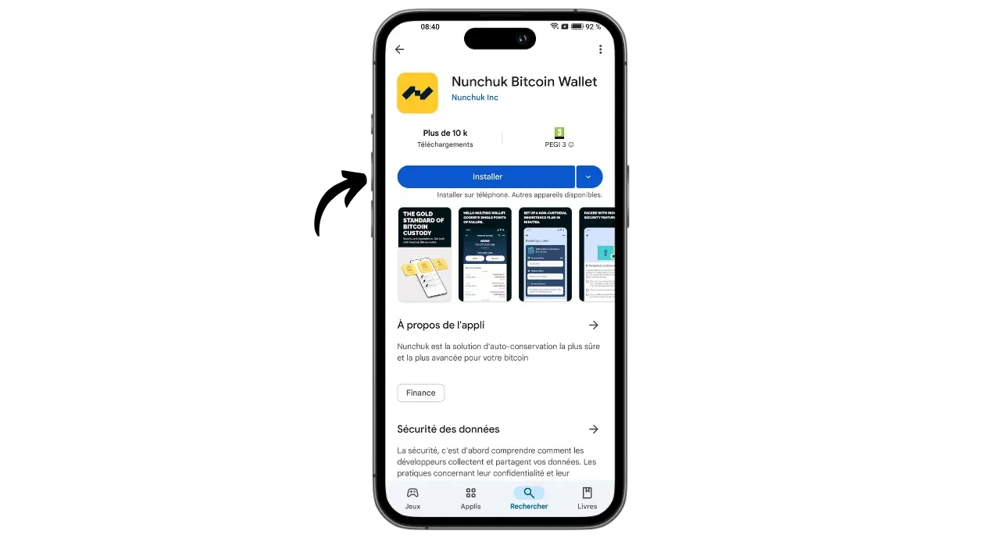
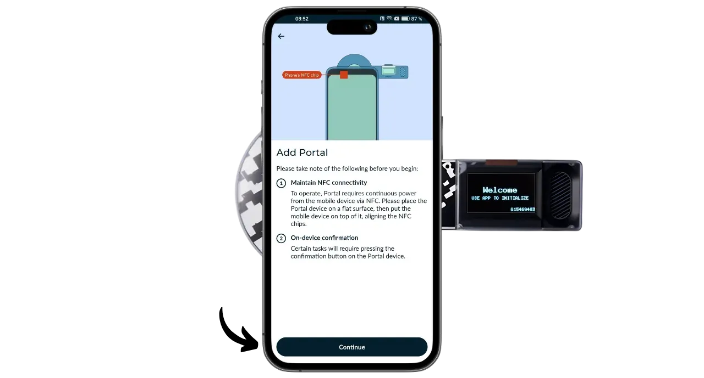
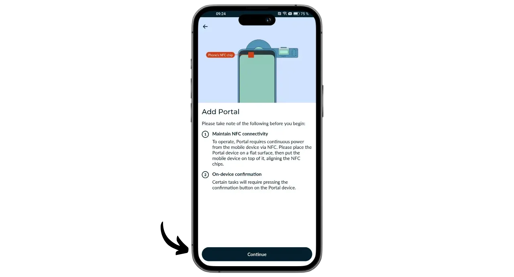
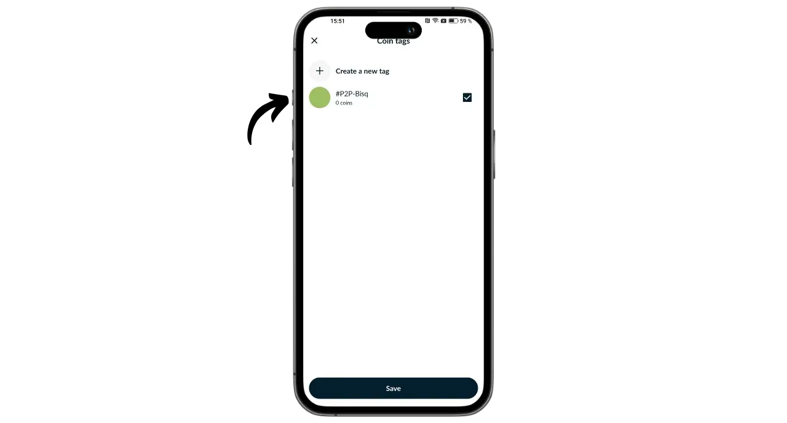

Portal er en Bitcoin-maskinvarelommebok designet av TwentyTwo Devices, et selskap som spesialiserer seg på å lage open-source maskinvarelommebøker for bitcoinere. TwentyTwo Devices ble grunnlagt av Alekos Filini, skaperen av Magical Bitcoin-prosjektet ([heretter kalt BDK] (https://github.com/bitcoindevkit)) og har jobbet for Blockstream og BHB Network, og har som mål å fokusere på brukerautonomi, enkelhet og sikkerhet.

Det som skiller Portal fra andre maskinvarelommebøker på markedet, er at den er integrert med smarttelefoner. Den fungerer uten kabler eller batterier. Den bruker NFC-teknologi for å drive seg selv og kommunisere med alle kompatible mobile lommebøker. Den spennende designen er utviklet for ergonomisk bruk. Den runde delen er plassert på baksiden av smarttelefonen og viser en skjerm der du kan sjekke detaljene i transaksjonene dine før du signerer dem med den dedikerte knappen.

Portalen er basert på åpen kildekode, fastvare skrevet i Rust og bruker BDK (Bitcoin Dev Kit) for nøkkel- og transaksjonshåndtering. Den selges for € 89 [på den offisielle nettsiden] (https://store.twenty-two.xyz/products/portal-hardware-wallet).

I skrivende stund er portalen kompatibel med applikasjonene Nunchuk og Bitcoin Keeper. I denne veiledningen skal vi konfigurere den med Nunchuk.

## Unboxing

Når du mottar portalen, må du kontrollere at esken og etiketten som forsegler den, er i god stand. Inne i esken finner du portalen i en forseglet pose.

Kontroller at forseglingen er intakt for å bekrefte at posen ikke har blitt åpnet. Det unike nummeret som vises med store bokstaver på posen, skal stemme overens med det som står skrevet i svart under den blå forseglingen, med det som står på etiketten på esken, og med det som vises på skjermen når du starter opp for første gang.

## Installasjon av nunchuk

For å administrere lommeboken som ligger på portalen, skal vi bruke Nunchuk-applikasjonen. Last ned applikasjonen fra [Google Play Store] (https://play.google.com/store/apps/details?id=io.nunchuk.android), [App Store] (https://apps.apple.com/us/app/nunchuk-bitcoin-wallet/id1563190073) eller direkte via [fil `.apk`] (https://github.com/nunchuk-io/nunchuk-android/releases).

Hvis du bruker Nunchuk for første gang, vil programmet be deg om å opprette en konto. I denne veiledningen er det ikke nødvendig å opprette en konto. Velg "*Fortsett som gjest*" for å fortsette uten konto.

## Konfigurasjon av portalen

Klikk på "*NFC*"-logoen øverst på skjermen på startskjermen til Nunchuk.

Plasser Portal på baksiden av smarttelefonen for å aktivere den.

Nunchuk vil gjenkjenne portalen din. Klikk deretter på "*Fortsett*".

For å opprette en ny portefølje velger du "*Generate seed on Portal*" og klikker deretter på "*Continue*".

Du kan velge mellom en huskefrase på 12 eller 24 ord. Sikkerheten ved begge alternativene er lik, så du kan velge det som er enklest å lagre, dvs. 12 ord.

Du blir deretter bedt om å velge et passord. Passordet låser opp portalen din. Det gir derfor beskyttelse mot uautorisert fysisk tilgang. Dette passordet er ikke involvert i utledningen av lommebokens kryptografiske nøkler. Så selv uten tilgang til dette passordet vil du kunne få tilgang til bitcoinsene dine hvis du er i besittelse av den mnemoniske frasen på 12 eller 24 ord. Det anbefales å velge et passord som er så tilfeldig som mulig og langt nok. Sørg for at du lagrer dette passordet på et annet sted enn der portalen din er lagret (f.eks. i en passordadministrator).

Portalen din vil vise den 12-ord lange minnefrasen din. Denne huskeregelen gir deg full, ubegrenset tilgang til alle bitcoinsene dine. Alle som er i besittelse av denne frasen kan stjele pengene dine, selv uten fysisk tilgang til portalen din.

Frasen på 12 ord gjenoppretter tilgangen til bitcoinsene dine i tilfelle tap, tyveri eller ødeleggelse av portalen din. Det er derfor svært viktig å lagre den nøye og oppbevare den på et trygt sted.

Du kan gravere det på et stykke papir, eller for ekstra sikkerhet anbefaler jeg at du graverer det på en sokkel av rustfritt stål for å beskytte det mot brann, oversvømmelse eller kollaps.

Hvis du vil ha mer informasjon om hvordan du lagrer og administrerer minnefrasen din, anbefaler jeg at du følger denne andre veiledningen, spesielt hvis du er nybegynner:

https://planb.network/tutorials/wallet/backup/backup-mnemonic-22c0ddfa-fb9f-4e3a-96f9-46e2a7954270

du må selvfølgelig aldri dele disse ordene på Internett, slik jeg gjør i denne opplæringen. Denne eksempelmappen vil kun bli brukt på Testnet, og vil bli slettet ved slutten av opplæringen

Trykk hardt på knappen på portalen for å gå videre til neste ord. Sørg for at du plasserer hele fingeren på knappen og holder trykket i noen sekunder, slik at interaksjonen registreres på riktig måte.

Portalen din vil deretter bekrefte passordet du skrev inn i Nunchuk.

Du er nå ferdig med å konfigurere portalen og opprette minnefrasen din!

## Konfigurasjon av Bitcoin-lommebok

Klikk på "*Continue*" på Nunchuk mens du fortsatt holder Portal mot baksiden av telefonen.

I denne veiledningen skal jeg sette opp en portefølje med én signering, så jeg velger dette alternativet.

Bruk standardkontoen, dvs. den første kontoen i lommeboken (nummer 0). Nunchuk vil deretter be deg om å bekrefte Portal-passordet ditt for å låse den opp.

På portalen bekrefter du eksporten av xpub til Nunchuk. Dette gjør at du kan administrere lommeboken fra smarttelefonen din uten å kunne bruke bitcoins uten portalen. Trykk på knappen for å bekrefte.

Merk at avledningsstien som er angitt i ditt tilfelle vil være forskjellig fra min, ettersom denne veiledningen er utført på Testnet.

Gi porteføljen din et navn, for eksempel "*Portal*", og klikk deretter på "*Fortsett*".

Nunchuk viser deg deretter Deskriptoren din. Det er lurt å ta en sikkerhetskopi. Selv om Descriptor ikke lar deg bruke bitcoins, lar den deg spore avledningsveiene til nøklene dine fra den mnemoniske frasen din i tilfelle lommeboken gjenopprettes. Oppbevar den på et trygt sted, for selv om lekkasje kanskje ikke utgjør et sikkerhetsproblem, representerer den et konfidensialitetsproblem.

Klikk på "*Done*".

Du må nå generere de offentlige nøklene for Bitcoin-lommeboken din. For å gjøre dette, klikk på knappen "*Opprett ny lommebok*".

Klikk igjen på "*Opprett ny lommebok*". Velg deretter alternativet "*Opprett en ny lommebok ved hjelp av eksisterende nøkler*".

Velg et navn på porteføljen din, og klikk på "*Fortsett*".

Velg Portalen din som signeringsenhet for dette nye settet med nøkler, og klikk deretter på "*Fortsett*".

Hvis du er fornøyd med alt, kan du godkjenne opprettelsen.

Deretter kan du lagre konfigurasjonsfilen for lommeboken din. Denne filen inneholder kun dine offentlige nøkler, noe som betyr at selv om noen får tilgang til den, vil de ikke kunne stjele bitcoinsene dine. De vil imidlertid kunne spore alle transaksjonene dine. Denne filen utgjør derfor kun en risiko for personvernet ditt. I noen tilfeller kan den være uunnværlig for å gjenopprette lommeboken din.

Og det er alt!

## Hvordan kan jeg motta bitcoins med Portal?

For å motta bitcoins velger du lommeboken din.

Før du bruker den genererte adressen, må du kontrollere den på Portal-skjermen. Dette gjør du ved å klikke på "*Mottak*".

Klikk på de tre prikkene, og velg deretter "*Verifiser adresse via PORTAL*". Skriv deretter inn passordet ditt.

Plasser Portal på baksiden av telefonen, og bekreft ved å trykke på knappen.

Kontroller at adressen som vises på portalen stemmer overens med adressen på Nunchuk, og bekreft deretter ved å trykke på knappen igjen. Hvis adressene er identiske, kan du oppgi denne adressen til betaleren.

Når betalerens transaksjon er sendt, vil du se den i lommeboken din.

Klikk på "*Vis hjørner*".

Velg din nye UTXO.

Klikk på "*+*" ved siden av "*Tags*" for å legge til en tagg til UTXO-en din. Dette er en god praksis, ettersom det hjelper deg å huske hvor myntene dine kommer fra og optimaliserer personvernet ditt når du bruker dem i fremtiden.

Velg en eksisterende tagg eller opprett en ny, og klikk deretter på "*Lagre*". Du kan også opprette "*samlinger*" for å organisere delene dine på en mer strukturert måte.

## Hvordan sender jeg bitcoins ved hjelp av Portal?

Nå som du har bitcoins i lommeboken din, kan du også sende dem. For å gjøre det, klikk på lommeboken du ønsker.

Klikk på "*Send*"-knappen.

Velg beløpet du vil sende, og klikk deretter på "*Fortsett*".

Legg til en "*note*" i den fremtidige transaksjonen for å minne deg på formålet med den.

Skriv deretter inn mottakerens adresse i feltet. Du kan også skanne en adresse som er kodet som en QR-kode ved å klikke på ikonet øverst til høyre på skjermen. Klikk deretter på knappen "*Opprett transaksjon*".

Sjekk transaksjonsdetaljene dine, klikk deretter på "*Signer*"-knappen ved siden av portalen din, og skriv inn passordet ditt.

Plasser portalen på baksiden av telefonen. Kontroller at mottakerens adresse og beløpet er riktig. Hvis det stemmer, trykker du på knappen for å fortsette.

Kontroller at transaksjonsgebyret er korrekt, og trykk deretter på knappen igjen for å signere transaksjonen.

Transaksjonen din har blitt signert. Du kan sjekke detaljene en siste gang på Nunchuk, og deretter klikke på "*Broadcast transaction*"-knappen for å kringkaste den på Bitcoin-nettverket.

Transaksjonen din venter nå på bekreftelse.

Gratulerer, du har nå fått teken på hvordan du bruker Portal! Hvis du synes denne veiledningen var nyttig, vil jeg være takknemlig hvis du legger igjen en grønn tommel nedenfor. Del gjerne denne artikkelen på dine sosiale nettverk. Tusen takk skal du ha!

Hvis du vil vite mer, kan du ta en titt på vårt komplette opplæringskurs om hvordan HD-portfolier fungerer:

https://planb.network/courses/46b0ced2-9028-4a61-8fbc-3b005ee8d70f
