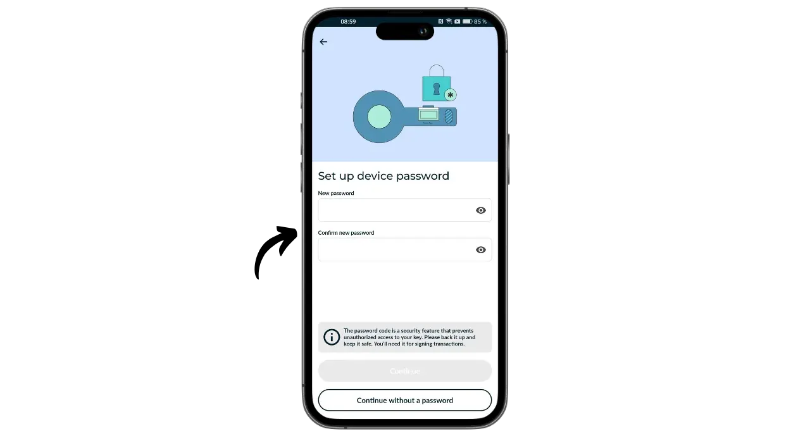
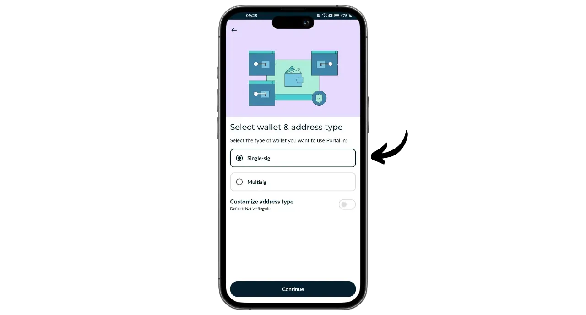
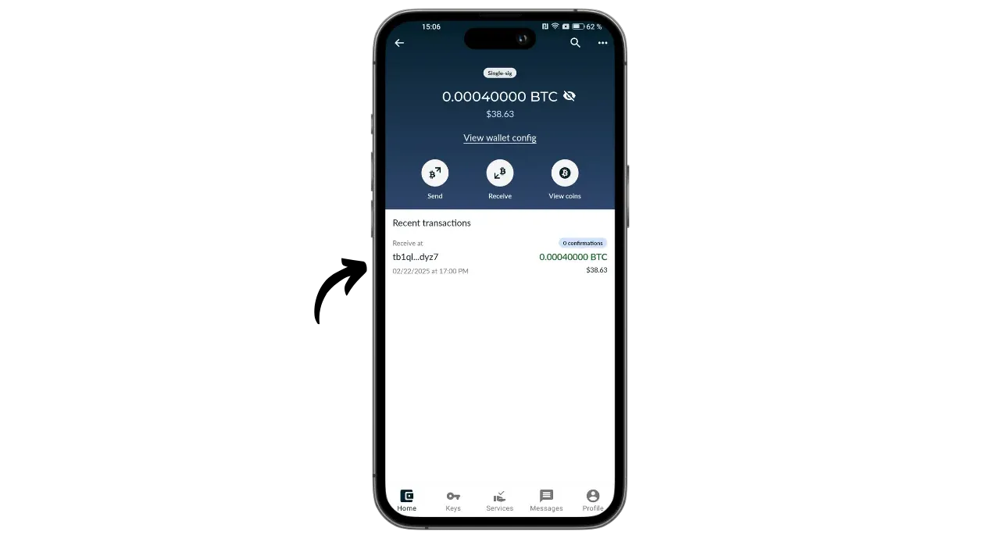

Portal é uma carteira de hardware Bitcoin concebida pela TwentyTwo Devices, uma empresa especializada na criação de carteiras de hardware de código aberto para bitcoiners. Fundada por Alekos Filini, criador do projeto Magical Bitcoin ([doravante designado BDK](https://github.com/bitcoindevkit)) e tendo trabalhado para a Blockstream e para a BHB Network, a TwentyTwo Devices pretende centrar-se na autonomia, simplicidade e segurança do utilizador.

O que distingue o Portal de outras carteiras de hardware no mercado é a sua integração nativa com smartphones. Funciona sem cabos ou baterias. Utiliza a tecnologia NFC para se alimentar e comunicar com qualquer carteira móvel compatível. O seu design intrigante foi concebido para uma utilização ergonómica. A parte redonda é colocada na parte de trás do smartphone para revelar um ecrã onde pode verificar os detalhes das suas transacções antes de as assinar com o botão dedicado.

Totalmente de código aberto, o Portal baseia-se num firmware escrito em Rust e utiliza o BDK (Bitcoin Dev Kit) para a gestão de chaves e transacções. É vendido por 89 euros [no sítio Web oficial] (https://store.twenty-two.xyz/products/portal-hardware-wallet).

No momento em que escrevo, o Portal é compatível com as aplicações Nunchuk e Bitcoin Keeper. Neste tutorial, vamos configurá-lo com o Nunchuk.

## Desembalagem

Quando receber o seu Portal, verifique se a caixa e a etiqueta que a selou estão em boas condições. No interior, encontrará o seu Portal numa bolsa selada.

Certifique-se de que o selo está intacto para confirmar que a bolsa não foi aberta. O número único apresentado em letras grandes na bolsa deve corresponder ao número escrito a preto por baixo do selo azul, ao número indicado na etiqueta da caixa e ao número que aparecerá no ecrã quando iniciar o sistema pela primeira vez.

## Instalação do matraquilho

Para gerir a carteira alojada no Portal, vamos utilizar a aplicação Nunchuk. Descarregue a aplicação a partir da [Google Play Store](https://play.google.com/store/apps/details?id=io.nunchuk.android), da [App Store](https://apps.apple.com/us/app/nunchuk-bitcoin-wallet/id1563190073) ou diretamente através do seu [ficheiro `.apk`](https://github.com/nunchuk-io/nunchuk-android/releases).

Se estiveres a usar o Nunchuk pela primeira vez, a aplicação pedir-te-á para criares uma conta. Para os objectivos deste tutorial, não é necessário criar uma. Selecione "*Continuar como convidado*" para continuar sem uma conta.

## Configuração do portal

No ecrã inicial do Nunchuk, clica no logótipo "*NFC*" na parte superior do ecrã.

Posicione o seu Portal na parte de trás do seu smartphone para o ativar.

O Nunchuk reconhecerá o teu Portal. Depois, clica em "*Continuar*".

Para criar uma nova carteira, selecione "*Gerar semente no Portal*" e, em seguida, clique em "*Continuar*".

Pode escolher entre uma frase mnemónica de 12 ou 24 palavras. A segurança oferecida por ambas as opções é semelhante, pelo que pode optar pela que for mais fácil de guardar, ou seja, 12 palavras.

Ser-lhe-á então pedido que escolha uma palavra-passe. A palavra-passe desbloqueia o seu Portal. Por conseguinte, fornece proteção contra o acesso físico não autorizado. Esta palavra-passe não está envolvida na derivação das chaves criptográficas da sua carteira. Assim, mesmo sem acesso a esta palavra-passe, a posse da sua frase mnemónica de 12 ou 24 palavras permitir-lhe-á recuperar o acesso aos seus bitcoins. É aconselhável escolher uma palavra-passe que seja o mais aleatória possível e suficientemente longa. Certifique-se de que guarda esta palavra-passe num local separado do local onde o seu Portal está guardado (por exemplo, num gestor de palavras-passe).

O seu Portal apresentará a sua frase mnemónica de 12 palavras. Esta mnemónica dá-lhe acesso total e sem restrições a todos os seus bitcoins. Qualquer pessoa que possua esta frase pode roubar os seus fundos, mesmo sem acesso físico ao seu Portal.

A frase de 12 palavras restaura o acesso aos seus bitcoins em caso de perda, roubo ou quebra do seu Portal. Por isso, é muito importante guardá-la cuidadosamente e guardá-la num local seguro.

Pode gravá-la num pedaço de papel ou, para maior segurança, recomendo que a grave numa base de aço inoxidável para a proteger de incêndios, inundações ou desmoronamentos.

Para mais informações sobre a forma correta de guardar e gerir a sua frase mnemónica, recomendo vivamente que siga este outro tutorial, especialmente se for um principiante:

https://planb.network/tutorials/wallet/backup/backup-mnemonic-22c0ddfa-fb9f-4e3a-96f9-46e2a7954270
é claro que nunca deve partilhar estas palavras na Internet, como eu estou a fazer neste tutorial. Este exemplo de portefólio será utilizado apenas na Testnet e será eliminado no final do tutorial

Prima firmemente o botão do seu Portal para passar às palavras seguintes. Certifique-se de que coloca todo o seu dedo no botão e mantém a pressão durante alguns segundos, para que a interação seja corretamente detectada.

O seu Portal confirmará então a palavra-passe que introduziu no Nunchuk.

Terminou de configurar o seu Portal e de criar a sua frase mnemónica!

## Configuração da carteira Bitcoin

No Nunchuk, clica em "*Continuar*", continuando a segurar o teu Portal na parte de trás do telefone.

Neste tutorial, vou configurar um portfólio de autenticação única, por isso estou a selecionar esta opção.

Utilize a conta por defeito, ou seja, a primeira conta da carteira (número 0). O Nunchuk pedir-lhe-á então que confirme a sua palavra-passe do Portal para o desbloquear.

No Portal, confirma a exportação do teu xpub para o Nunchuk. Isto permite-lhe gerir a carteira a partir do seu smartphone sem poder gastar bitcoins sem o Portal. Pressiona o botão para confirmar.

Note-se que o caminho de derivação indicado no seu caso será diferente do meu, uma vez que este tutorial é realizado na Testnet.

Dê um nome à sua carteira, por exemplo "*Portal*", e clique em "*Continuar*".

O Nunchuk apresenta-te então o teu Descritor. É uma boa ideia fazer uma cópia de segurança. Embora o Descritor não lhe permita gastar bitcoins, permite-lhe rastrear os caminhos de derivação das suas chaves a partir da sua frase mnemónica no caso de recuperação da carteira. Mantenha-o num local seguro, porque embora a sua fuga possa não representar um problema de segurança, representa um problema de confidencialidade.

Clique em "*Concluído*".

Agora precisa de gerar as chaves públicas para a sua carteira Bitcoin. Para o fazer, clique no botão "*Criar nova carteira*".

Clique novamente em "*Criar nova carteira*". De seguida, escolha a opção "*Criar uma nova carteira utilizando chaves existentes*".

Escolha um nome para a sua carteira e clique em "*Continuar*".

Selecione o seu Portal como dispositivo de assinatura para este novo conjunto de chaves e, em seguida, clique em "*Continuar*".

Se tudo estiver a seu gosto, valide a criação.

Pode então guardar o ficheiro de configuração da sua carteira. Este ficheiro contém apenas as suas chaves públicas, o que significa que, mesmo que alguém lhe aceda, não conseguirá roubar os seus bitcoins. No entanto, será capaz de rastrear todas as suas transacções. Assim, este ficheiro representa apenas um risco para a sua privacidade. Em alguns casos, pode ser indispensável para recuperar a sua carteira.

E é tudo o que há para fazer!

## Como posso receber bitcoins com o Portal?

Para receber bitcoins, selecione a sua carteira.

Antes de utilizar o endereço gerado, verifique-o no ecrã do Portal. Para o fazer, clique em "*Receber*".

Clique nos três pontos e selecione "*Verificar endereço via PORTAL*". Em seguida, introduza a sua palavra-passe.

Posicione o seu Portal na parte de trás do telefone e confirme premindo o botão.

Certifica-te de que o endereço apresentado no Portal corresponde ao do teu Nunchuk e confirma-o premindo novamente o botão. Se os endereços forem idênticos, pode dar este endereço ao pagador.

Assim que a transação do pagador tiver sido transmitida, esta aparecerá na sua carteira.

Clique em "*Ver cantos*".

Selecione o seu novo UTXO.

Clique no "*+*" ao lado de "*Tags*" para adicionar uma etiqueta ao seu UTXO. Esta é uma boa prática, pois ajuda-o a lembrar-se da origem das suas moedas e optimiza a sua privacidade quando gastar no futuro.

Selecione uma etiqueta existente ou crie uma nova e, em seguida, clique em "*Guardar*". Também pode criar "*colecções*" para organizar as suas peças de uma forma mais estruturada.

## Como posso enviar bitcoins utilizando o Portal?

Agora que tem bitcoins na sua carteira, também pode enviá-los. Para o fazer, clique na carteira da sua escolha.

Clique no botão "*Enviar*".

Selecione o montante a enviar e, em seguida, clique em "*Continuar*".

Acrescente uma "*nota*" à sua futura transação para se lembrar da sua finalidade.

Em seguida, introduza o endereço do destinatário no campo fornecido. Também pode digitalizar um endereço codificado como um código QR clicando no ícone no canto superior direito do ecrã. Em seguida, clique no botão "*Criar transação*".

Verifique os detalhes da sua transação, clique no botão "*Assinar*" junto ao seu Portal e introduza a sua palavra-passe.

Coloque o seu Portal na parte de trás do seu telemóvel. Verifique se o endereço do destinatário e o montante estão corretos. Em caso afirmativo, prima o botão para continuar.

Verifique se a taxa de transação está correta e, em seguida, prima novamente o botão para assinar a transação.

A tua transação foi assinada. Podes verificar os seus detalhes uma última vez no Nunchuk e depois clicar no botão "*Broadcast transaction*" para a transmitir na rede Bitcoin.

A sua transação está agora a aguardar confirmação.

Parabéns, já apanhaste o jeito de usar o Portal! Se achou este tutorial útil, agradecia que deixasse um polegar verde abaixo. Não hesite em partilhar este artigo nas suas redes sociais. Muito obrigado!

Para saber mais, consulte o nosso curso de formação completo sobre como funcionam as carteiras HD:

https://planb.network/courses/46b0ced2-9028-4a61-8fbc-3b005ee8d70f