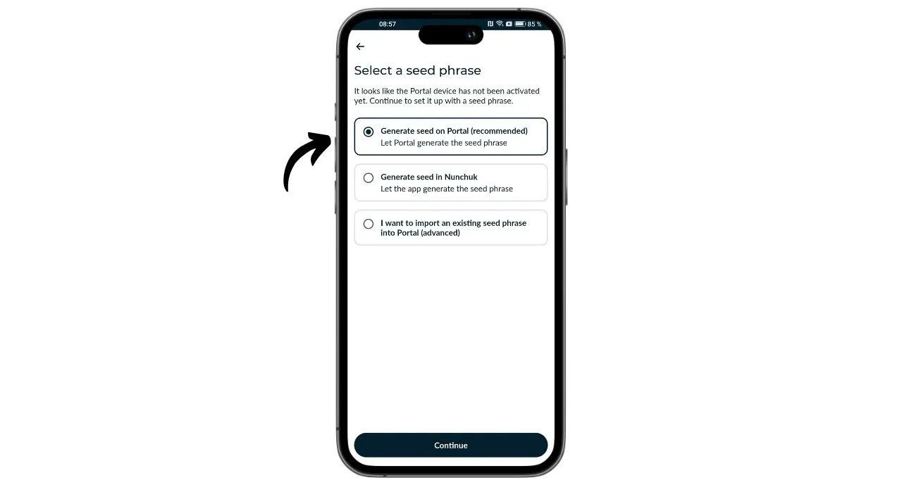
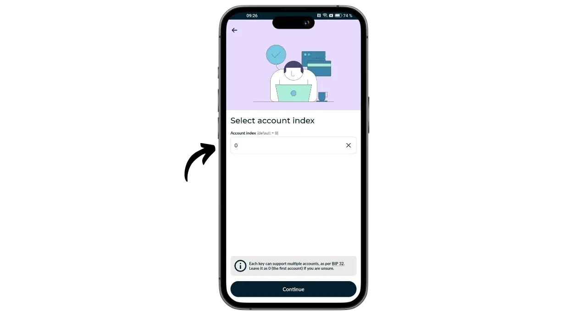
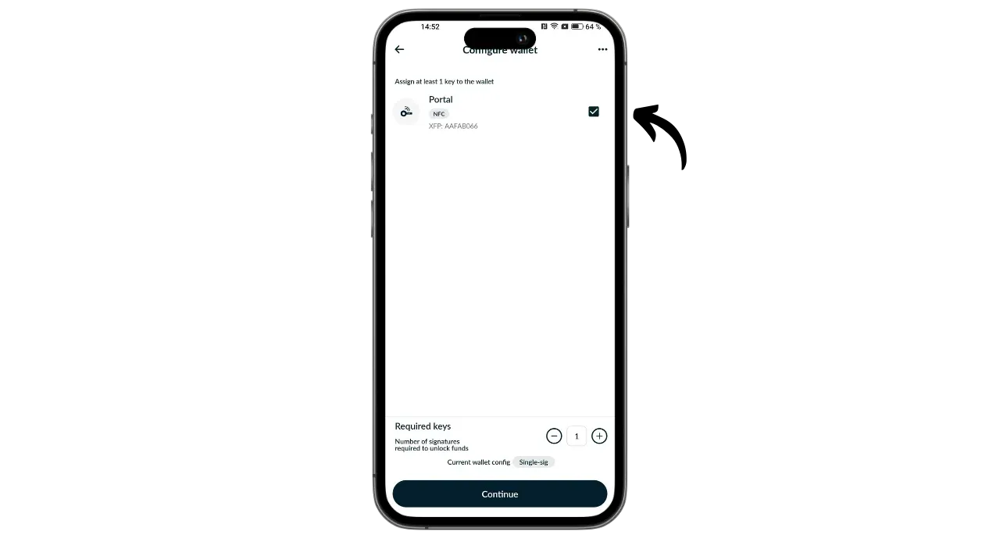
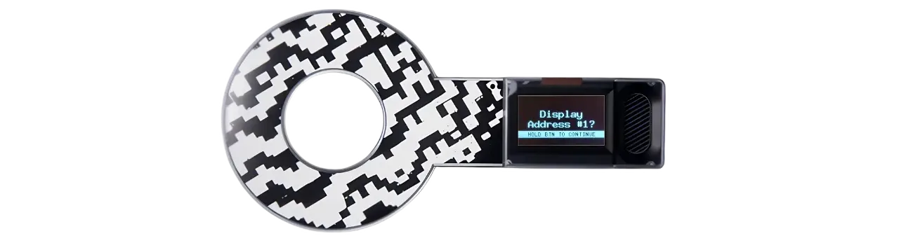

Portal - это аппаратный кошелек для биткоина, разработанный компанией TwentyTwo Devices, специализирующейся на создании аппаратных кошельков с открытым исходным кодом для биткоинщиков. Основанная Алекосом Филини, создателем проекта Magical Bitcoin ([далее BDK](https://github.com/bitcoindevkit)) и работавшая в Blockstream и BHB Network, компания TwentyTwo Devices стремится сосредоточиться на автономности, простоте и безопасности пользователей.

От других аппаратных кошельков, представленных на рынке, Portal отличает встроенная интеграция со смартфонами. Он работает без кабелей и батарей. Он использует технологию NFC для питания и связи с любым совместимым мобильным кошельком. Его интригующий дизайн задуман для эргономичного использования. Круглая часть располагается на задней панели смартфона, открывая экран, на котором можно проверить детали транзакций, прежде чем подписать их с помощью специальной кнопки.

Портал полностью с открытым исходным кодом, основан на прошивке, написанной на языке Rust, и использует BDK (Bitcoin Dev Kit) для управления ключами и транзакциями. Он продается за 89 евро [на официальном сайте] (https://store.twenty-two.xyz/products/portal-hardware-wallet).

На момент написания статьи портал совместим с приложениями Nunchuk и Bitcoin Keeper. В этом руководстве мы будем настраивать его с помощью Nunchuk.

## Распаковка

Когда вы получите свой Портал, проверьте, в хорошем ли состоянии коробка и наклейка, закрывающая ее. Внутри вы найдете Портал в запечатанном пакете.

Убедитесь в целостности пломбы, чтобы подтвердить, что пакет не вскрывался. Уникальный номер, указанный крупными буквами на упаковке, должен соответствовать номеру, написанному черными буквами под синей пломбой, номеру на этикетке коробки и номеру, который появится на экране при первом запуске.

## Установка нунчака

Для управления кошельком, размещенным на портале, мы будем использовать приложение Nunchuk. Загрузите приложение из [Google Play Store](https://play.google.com/store/apps/details?id=io.nunchuk.android), [App Store](https://apps.apple.com/us/app/nunchuk-bitcoin-wallet/id1563190073) или напрямую через его [файл `.apk`](https://github.com/nunchuk-io/nunchuk-android/releases).

Если вы используете Nunchuk впервые, приложение предложит вам создать учетную запись. Для целей данного руководства создавать ее не обязательно. Выберите "*Продолжить как гость*", чтобы продолжить работу без учетной записи.

## Конфигурация портала

На главном экране Nunchuk нажмите на логотип "*NFC*" в верхней части экрана.

Поместите портал на заднюю панель смартфона, чтобы активировать его.

Нунчак распознает ваш портал. Затем нажмите на кнопку "*Продолжить*".

Чтобы создать новый портфель, выберите "*Сгенерировать семена на портале*", а затем нажмите "*Продолжить*".

Вы можете выбрать мнемоническую фразу из 12 или 24 слов. Безопасность обоих вариантов одинакова, поэтому вы можете выбрать тот, который легче всего сохранить, то есть 12 слов.

Затем вам будет предложено выбрать пароль. Пароль разблокирует ваш Портал. Таким образом, он обеспечивает защиту от несанкционированного физического доступа. Этот пароль не участвует в создании криптографических ключей вашего кошелька. Поэтому, даже не имея доступа к этому паролю, владение мнемонической фразой из 12 или 24 слов позволит вам восстановить доступ к своим биткоинам. Рекомендуется выбирать пароль как можно более случайным и достаточно длинным. Обязательно сохраните этот пароль в отдельном месте от того, где хранится ваш портал (например, в менеджере паролей).

На вашем портале будет отображаться мнемоническая фраза из 12 слов. Эта мнемоника дает вам полный, неограниченный доступ ко всем вашим биткоинам. Любой человек, владеющий этой фразой, может украсть ваши средства, даже не имея физического доступа к вашему порталу.

Фраза из 12 слов восстанавливает доступ к вашим биткоинам в случае потери, кражи или поломки вашего Портала. Поэтому очень важно тщательно сохранить ее и хранить в безопасном месте.

Вы можете нанести надпись на лист бумаги, а для большей надежности я рекомендую выгравировать ее на подставке из нержавеющей стали, чтобы защитить ее от пожара, наводнения или обрушения.

Для получения более подробной информации о том, как правильно сохранять и управлять мнемоническими фразами, я настоятельно рекомендую ознакомиться с другими уроками, особенно если вы новичок:

https://planb.network/tutorials/wallet/backup/backup-mnemonic-22c0ddfa-fb9f-4e3a-96f9-46e2a7954270
конечно, вы никогда не должны делиться этими словами в Интернете, как это делаю я в этом учебнике. Этот образец портфолио будет использоваться только на Testnet и будет удален по окончании урока.**_

Чтобы перейти к следующим словам, крепко нажмите на кнопку на вашем Портале. Убедитесь, что вы поместили весь палец на кнопку и удерживаете давление в течение нескольких секунд, чтобы взаимодействие было правильно распознано.

После этого ваш портал подтвердит пароль, введенный в Nunchuk.

Теперь вы закончили настройку портала и создание мнемонической фразы!

## Настройка биткойн-кошелька

На нунчаке нажмите "*Продолжить*", по-прежнему держа портал на задней панели телефона.

В этом уроке я собираюсь создать портфель с одной подписью, поэтому я выбираю этот вариант.

Используйте учетную запись по умолчанию, то есть первую учетную запись в кошельке (номер 0). После этого Nunchuk попросит вас подтвердить пароль Portal, чтобы разблокировать его.

На портале подтвердите экспорт вашего xpub в Nunchuk. Это позволит вам управлять кошельком со смартфона, не имея возможности тратить биткоины без Портала. Нажмите кнопку для подтверждения.

Обратите внимание, что путь деривации, указанный в вашем случае, будет отличаться от моего, поскольку этот учебник выполнен на Testnet.

Назовите свой портфель, например, "*Портал*", затем нажмите "*Продолжить*".

Затем нунчак покажет вам ваш дескриптор. Нелишним будет сделать резервную копию. Хотя Дескриптор не позволяет вам тратить биткоины, он дает возможность проследить пути деривации ваших ключей по вашей мнемонической фразе в случае восстановления кошелька. Храните его в надежном месте, потому что, хотя его утечка и не представляет проблемы с безопасностью, она представляет собой проблему конфиденциальности.

Нажмите на кнопку "*Готово*".

Теперь вам нужно сгенерировать открытые ключи для вашего кошелька Bitcoin. Для этого нажмите на кнопку "*Создать новый кошелек*".

Снова нажмите на "*Создать новый кошелек*". Затем выберите опцию "*Создать новый кошелек, используя существующие ключи*".

Выберите название для портфолио и нажмите "*Продолжить*".

Выберите ваш портал в качестве устройства подписи для нового набора ключей, а затем нажмите "*Продолжить*".

Если вас все устраивает, подтвердите создание.

Затем вы можете сохранить файл конфигурации кошелька. Этот файл содержит только ваши открытые ключи, а значит, даже если кто-то получит к нему доступ, он не сможет украсть ваши биткоины. Однако они смогут отслеживать все ваши транзакции. Таким образом, этот файл представляет риск только для вашей конфиденциальности. В некоторых случаях он может оказаться незаменимым для восстановления вашего кошелька.

И это все!

## Как я могу получать биткоины с помощью Portal?

Чтобы получить биткоины, выберите свой кошелек.

Прежде чем использовать сгенерированный адрес, проверьте его на экране портала. Для этого нажмите на кнопку "*Получить*".

Нажмите на три точки, затем выберите "*Проверка адреса через ПОРТАЛ*". Затем введите свой пароль.

Расположите портал на задней панели телефона, а затем подтвердите нажатием кнопки.

Убедитесь, что адрес, отображаемый на Портале, совпадает с адресом на вашем Nunchuk, а затем подтвердите его, нажав кнопку еще раз. Если адреса совпадают, вы можете сообщить этот адрес плательщику.

Как только транзакция плательщика будет передана, вы увидите, что она появилась в вашем кошельке.

Нажмите на кнопку "*Просмотреть углы*".

Выберите новый UTXO.

Нажмите на "*+*" рядом с "*Теги*", чтобы добавить метку к вашему UTXO. Это хорошая практика, так как она поможет вам запомнить, откуда взялись ваши монеты, и оптимизирует вашу конфиденциальность при тратах в будущем.

Выберите существующий тег или создайте новый, затем нажмите "*Сохранить*". Вы также можете создавать "*коллекции*", чтобы организовать свои детали более структурированным образом.

## Как отправить биткоины с помощью Portal?

Теперь, когда у вас есть биткоины в кошельке, вы можете их отправить. Для этого нажмите на выбранный вами кошелек.

Нажмите на кнопку "*Отправить*".

Выберите сумму для отправки, затем нажмите "*Продолжить*".

Добавьте "*заметку*" к будущей транзакции, чтобы напомнить о ее цели.

Затем введите адрес получателя в соответствующее поле. Вы также можете отсканировать адрес, закодированный в виде QR-кода, нажав на значок в правом верхнем углу экрана. Затем нажмите на кнопку "*Создать транзакцию*".

Проверьте детали транзакции, затем нажмите на кнопку "*Подписать*" рядом с вашим порталом и введите пароль.

Поместите Портал на заднюю панель телефона. Проверьте, правильно ли указан адрес получателя и сумма. Если да, нажмите кнопку, чтобы продолжить.

Проверьте правильность суммы комиссии за транзакцию, затем снова нажмите кнопку, чтобы подписать транзакцию.

Ваша транзакция подписана. Вы можете в последний раз проверить ее детали на Nunchuk, а затем нажать кнопку "*Broadcast transaction*", чтобы транслировать ее в сеть Bitcoin.

Ваша транзакция ожидает подтверждения.

Поздравляю, теперь вы поняли, как пользоваться Portal! Если вы нашли это руководство полезным, я буду благодарен, если вы оставите ниже свой "зеленый палец". Не стесняйтесь поделиться этой статьей в своих социальных сетях. Большое спасибо!

Чтобы узнать больше, ознакомьтесь с нашим полным учебным курсом о том, как работают HD-портфолио:

https://planb.network/courses/46b0ced2-9028-4a61-8fbc-3b005ee8d70f