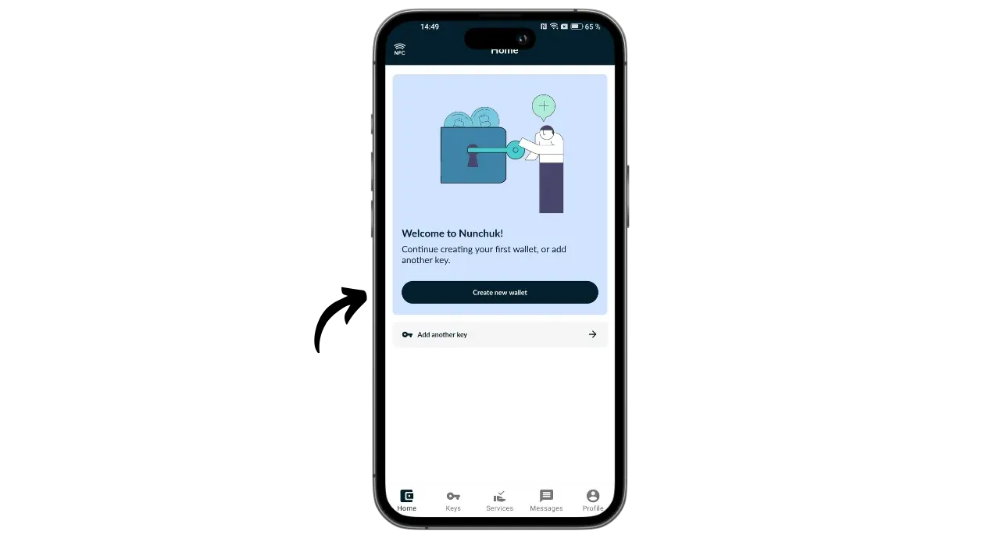
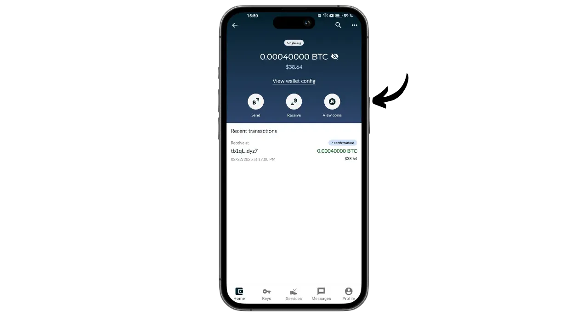
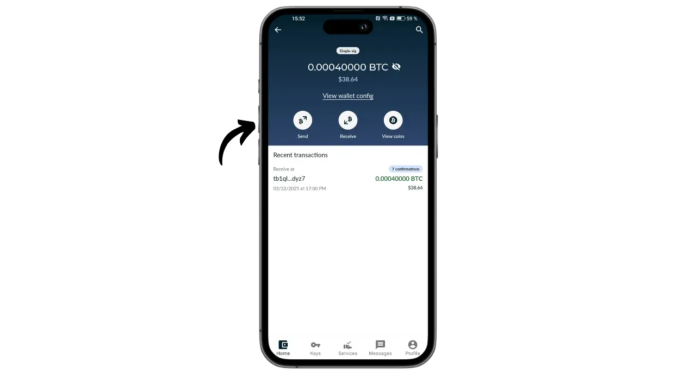

Portal là ví phần cứng Bitcoin được thiết kế bởi TwentyTwo Devices, một công ty chuyên tạo ra ví phần cứng nguồn mở cho những người dùng bitcoin. Được thành lập bởi Alekos Filini, người sáng lập dự án Magical Bitcoin ([sau đây gọi là BDK](https://github.com/bitcoindevkit)) và đã từng làm việc cho Blockstream và BHB Network, TwentyTwo Devices hướng đến mục tiêu tập trung vào quyền tự chủ, sự đơn giản và bảo mật của người dùng.

Điểm khiến Portal khác biệt so với các ví phần cứng khác trên thị trường là khả năng tích hợp gốc với điện thoại thông minh. Nó hoạt động mà không cần cáp hoặc pin. Nó sử dụng công nghệ NFC để tự cấp nguồn và giao tiếp với bất kỳ ví di động tương thích nào. Thiết kế hấp dẫn của nó được hình thành để sử dụng tiện dụng. Phần tròn được đặt ở mặt sau của điện thoại thông minh để lộ màn hình nơi bạn có thể kiểm tra thông tin chi tiết về giao dịch của mình trước khi ký bằng nút chuyên dụng.

Hoàn toàn là mã nguồn mở, Portal dựa trên chương trình cơ sở được viết bằng Rust và sử dụng BDK (Bitcoin Dev Kit) để quản lý khóa và giao dịch. Nó được bán với giá €89 [trên trang web chính thức](https://store.twenty-two.xyz/products/portal-hardware-wallet).

Tại thời điểm viết bài, Portal tương thích với các ứng dụng Nunchuk và Bitcoin Keeper. Trong hướng dẫn này, chúng tôi sẽ cấu hình nó bằng Nunchuk.

## Mở hộp

Khi bạn nhận được Portal, hãy kiểm tra xem hộp và nhãn niêm phong có còn tốt không. Bên trong, bạn sẽ thấy Portal trong một túi kín.

Đảm bảo niêm phong còn nguyên vẹn để xác nhận rằng túi chưa bị mở. Số duy nhất hiển thị bằng chữ lớn trên túi phải tương ứng với số được viết bằng chữ đen bên dưới niêm phong màu xanh, với số trên nhãn hộp và với số sẽ xuất hiện trên màn hình khi bạn khởi động lần đầu.

## Cài đặt Nunchuk

Để quản lý ví được lưu trữ trên Cổng thông tin, chúng ta sẽ sử dụng ứng dụng Nunchuk. Tải xuống ứng dụng từ [Google Play Store](https://play.google.com/store/apps/details?id=io.nunchuk.android), [App Store](https://apps.apple.com/us/app/nunchuk-bitcoin-wallet/id1563190073) hoặc trực tiếp qua [tệp `.apk`](https://github.com/nunchuk-io/nunchuk-android/releases).

Nếu bạn sử dụng Nunchuk lần đầu tiên, ứng dụng sẽ nhắc bạn tạo tài khoản. Đối với mục đích của hướng dẫn này, bạn không cần tạo tài khoản. Chọn "*Tiếp tục với tư cách khách*" để tiếp tục mà không cần tài khoản.

## Cấu hình cổng thông tin

Trên màn hình chính của Nunchuk, hãy nhấp vào logo "*NFC*" ở đầu màn hình.

Đặt Cổng thông tin ở mặt sau của điện thoại thông minh để kích hoạt.

Nunchuk sẽ nhận ra Cổng thông tin của bạn. Sau đó nhấp vào "*Tiếp tục*".

Để tạo danh mục đầu tư mới, hãy chọn "*Tạo hạt giống trên Cổng thông tin*" rồi nhấp vào "*Tiếp tục*".

Bạn có thể chọn giữa cụm từ ghi nhớ 12 hoặc 24 từ. Mức độ bảo mật mà cả hai tùy chọn đều tương tự nhau, vì vậy bạn có thể chọn tùy chọn dễ lưu nhất, tức là 12 từ.

Sau đó, bạn sẽ được yêu cầu chọn một mật khẩu. Mật khẩu sẽ mở khóa Cổng thông tin của bạn. Do đó, nó cung cấp khả năng bảo vệ chống lại truy cập vật lý trái phép. Mật khẩu này không liên quan đến việc tạo ra khóa mật mã của ví của bạn. Vì vậy, ngay cả khi không truy cập được vào mật khẩu này, việc sở hữu cụm từ ghi nhớ gồm 12 hoặc 24 từ của bạn sẽ cho phép bạn lấy lại quyền truy cập vào bitcoin của mình. Nên chọn một mật khẩu càng ngẫu nhiên càng tốt và đủ dài. Đảm bảo rằng bạn lưu mật khẩu này ở một nơi riêng biệt với nơi lưu trữ Cổng thông tin của bạn (ví dụ: trong trình quản lý mật khẩu).

Cổng thông tin của bạn sẽ hiển thị cụm từ ghi nhớ gồm 12 từ. Cụm từ ghi nhớ này cung cấp cho bạn quyền truy cập đầy đủ, không giới hạn vào tất cả bitcoin của bạn. Bất kỳ ai sở hữu cụm từ này đều có thể đánh cắp tiền của bạn, ngay cả khi không có quyền truy cập vật lý vào Cổng thông tin của bạn.

Cụm từ 12 từ này khôi phục quyền truy cập vào bitcoin của bạn trong trường hợp Cổng thông tin của bạn bị mất, bị trộm hoặc bị hỏng. Do đó, điều rất quan trọng là phải lưu trữ cẩn thận và cất giữ ở nơi an toàn.

Bạn có thể khắc nó lên một tờ giấy hoặc để an toàn hơn, tôi khuyên bạn nên khắc nó lên đế thép không gỉ để bảo vệ nó khỏi hỏa hoạn, lũ lụt hoặc sụp đổ.

Để biết thêm thông tin về cách lưu và quản lý cụm từ ghi nhớ đúng cách, tôi thực sự khuyên bạn nên làm theo hướng dẫn khác này, đặc biệt nếu bạn là người mới bắt đầu:

https://planb.network/tutorials/wallet/backup/backup-mnemonic-22c0ddfa-fb9f-4e3a-96f9-46e2a7954270

tất nhiên, bạn không bao giờ được chia sẻ những từ này trên Internet, như tôi đang làm trong hướng dẫn này. Danh mục mẫu này sẽ chỉ được sử dụng trên Testnet và sẽ bị xóa vào cuối hướng dẫn.**_

Nhấn nút trên Cổng thông tin của bạn thật mạnh để chuyển sang các từ tiếp theo. Đảm bảo bạn đặt toàn bộ ngón tay vào nút và giữ nguyên trong vài giây để tương tác được phát hiện chính xác.

Sau đó, Cổng thông tin của bạn sẽ xác nhận mật khẩu bạn đã nhập vào Nunchuk.

Bây giờ bạn đã hoàn tất việc cấu hình Cổng thông tin và tạo cụm từ ghi nhớ!

## Cấu hình ví Bitcoin

Trên Nunchuk, nhấp vào "*Tiếp tục*", vẫn giữ Cổng thông tin ở mặt sau điện thoại.

Trong hướng dẫn này, tôi sẽ thiết lập danh mục đầu tư có chữ ký đơn, vì vậy tôi sẽ chọn tùy chọn này.

Sử dụng tài khoản mặc định, tức là tài khoản đầu tiên trong ví (số 0). Sau đó, Nunchuk sẽ yêu cầu bạn xác nhận mật khẩu Portal để mở khóa.

Trên Cổng thông tin, hãy xác nhận việc xuất xpub của bạn sang Nunchuk. Điều này cho phép bạn quản lý ví từ điện thoại thông minh của mình mà không thể chi tiêu bitcoin mà không có Cổng thông tin. Nhấn nút để xác nhận.

Lưu ý rằng đường dẫn được chỉ ra trong trường hợp của bạn sẽ khác với của tôi vì hướng dẫn này được thực hiện trên Testnet.

Đặt tên cho danh mục đầu tư của bạn, ví dụ "*Cổng thông tin*", sau đó nhấp vào "*Tiếp tục*".

Sau đó, Nunchuk sẽ giới thiệu cho bạn Descriptor của bạn. Tốt nhất là bạn nên sao lưu. Mặc dù Descriptor không cho phép bạn chi tiêu bitcoin, nhưng nó cho phép bạn theo dõi đường dẫn xuất phát của khóa từ cụm từ ghi nhớ của bạn trong trường hợp khôi phục ví. Hãy giữ nó ở nơi an toàn, vì mặc dù việc rò rỉ có thể không gây ra vấn đề bảo mật, nhưng nó lại là vấn đề về tính bảo mật.

Nhấp vào "*Xong*".

Bây giờ bạn sẽ cần tạo khóa công khai cho ví Bitcoin của mình. Để thực hiện việc này, hãy nhấp vào nút "*Tạo ví mới*".

Nhấp lại vào "*Tạo ví mới*". Sau đó chọn tùy chọn "*Tạo ví mới bằng khóa hiện có*".

Chọn tên cho danh mục đầu tư của bạn và nhấp vào "*Tiếp tục*".

Chọn Cổng thông tin của bạn làm thiết bị ký cho bộ khóa mới này, sau đó nhấp vào "*Tiếp tục*".

Nếu mọi thứ đều làm bạn hài lòng, hãy xác nhận sáng tạo.

Sau đó, bạn có thể lưu tệp cấu hình ví của mình. Tệp này chỉ chứa khóa công khai của bạn, nghĩa là ngay cả khi ai đó truy cập vào tệp, họ cũng không thể đánh cắp bitcoin của bạn. Tuy nhiên, họ sẽ có thể theo dõi tất cả các giao dịch của bạn. Do đó, tệp này chỉ gây rủi ro cho quyền riêng tư của bạn. Trong một số trường hợp, tệp này có thể không thể thiếu để khôi phục ví của bạn.

Và thế là hết!

## Tôi có thể nhận bitcoin bằng Portal như thế nào?

Để nhận bitcoin, hãy chọn ví của bạn.

Trước khi sử dụng địa chỉ đã tạo, hãy kiểm tra địa chỉ đó trên màn hình Cổng thông tin. Để thực hiện việc này, hãy nhấp vào "*Nhận*".

Nhấp vào ba dấu chấm, sau đó chọn "*Xác minh địa chỉ qua PORTAL*". Sau đó nhập mật khẩu của bạn.

Đặt Portal ở mặt sau của điện thoại, sau đó xác nhận bằng cách nhấn nút.

Đảm bảo rằng địa chỉ hiển thị trên Cổng thông tin khớp với địa chỉ trên Nunchuk của bạn, sau đó xác nhận bằng cách nhấn nút một lần nữa. Nếu địa chỉ giống hệt nhau, bạn có thể cung cấp địa chỉ này cho người trả tiền.

Sau khi giao dịch của người trả tiền được phát đi, bạn sẽ thấy giao dịch đó xuất hiện trên ví của mình.

Nhấp vào "*Xem góc*".

Chọn UTXO mới của bạn.

Nhấp vào "*+*" bên cạnh "*Thẻ*" để thêm thẻ vào UTXO của bạn. Đây là một cách làm tốt vì nó giúp bạn nhớ tiền của mình đến từ đâu và tối ưu hóa quyền riêng tư khi chi tiêu trong tương lai.

Chọn một thẻ hiện có hoặc tạo một thẻ mới, sau đó nhấp vào "*Lưu*". Bạn cũng có thể tạo "*bộ sưu tập*" để sắp xếp các phần của mình theo cách có cấu trúc hơn.

## Làm thế nào để gửi bitcoin bằng Portal?

Bây giờ bạn đã có bitcoin trong ví, bạn cũng có thể gửi chúng. Để thực hiện, hãy nhấp vào ví bạn chọn.

Nhấp vào nút "*Gửi*".

Chọn số tiền muốn gửi, sau đó nhấp vào "*Tiếp tục*".

Thêm "*ghi chú*" vào giao dịch trong tương lai của bạn để nhắc nhở bạn về mục đích của giao dịch đó.

Sau đó nhập địa chỉ người nhận vào trường được cung cấp. Bạn cũng có thể quét địa chỉ được mã hóa dưới dạng mã QR bằng cách nhấp vào biểu tượng ở góc trên bên phải màn hình. Sau đó nhấp vào nút "*Tạo giao dịch*".

Kiểm tra thông tin giao dịch của bạn, sau đó nhấp vào nút "*Ký*" bên cạnh Cổng thông tin của bạn và nhập mật khẩu.

Đặt Portal của bạn vào mặt sau của điện thoại. Kiểm tra xem địa chỉ người nhận và số tiền có đúng không. Nếu đúng, hãy nhấn nút để tiếp tục.

Kiểm tra xem phí giao dịch đã chính xác chưa, sau đó nhấn nút một lần nữa để ký giao dịch.

Giao dịch của bạn đã được ký. Bạn có thể kiểm tra lại thông tin chi tiết lần cuối trên Nunchuk, sau đó nhấp vào nút "*Phát giao dịch*" để phát trên mạng Bitcoin.

Giao dịch của bạn hiện đang chờ xác nhận.

Xin chúc mừng, giờ bạn đã biết cách sử dụng Portal! Nếu bạn thấy hướng dẫn này hữu ích, tôi sẽ rất biết ơn nếu bạn để lại một ngón tay cái màu xanh lá cây bên dưới. Hãy thoải mái chia sẻ bài viết này trên mạng xã hội của bạn. Cảm ơn bạn rất nhiều!

Để tìm hiểu thêm, hãy xem khóa đào tạo đầy đủ của chúng tôi về cách thức hoạt động của danh mục đầu tư HD:

https://planb.network/courses/46b0ced2-9028-4a61-8fbc-3b005ee8d70f
