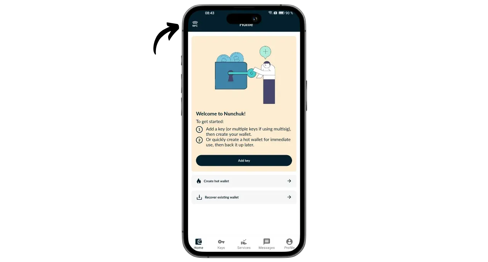
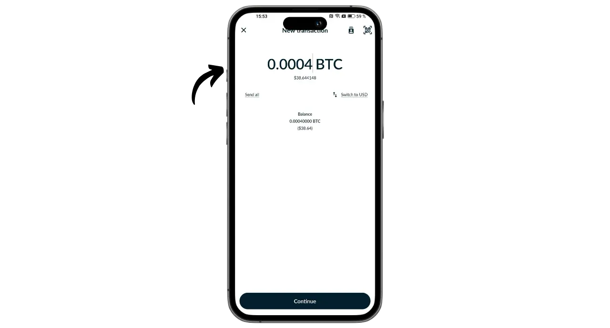

Portal是由TwentyTwo Devices公司设计的一款比特币硬件钱包，该公司专门为比特币用户创建开源硬件钱包。TwentyTwo Devices 公司由神奇比特币项目（[下文命名为 BDK](https://github.com/bitcoindevkit)）的创建者 Alekos Filini 创立，他曾在 Blockstream 和 BHB Network 工作过，公司的目标是关注用户自主性、简易性和安全性。

Portal 与市场上其他硬件钱包的不同之处在于它与智能手机的原生集成。它无需电缆或电池即可工作。它使用 NFC 技术为自己供电，并与任何兼容的手机钱包通信。其引人入胜的设计符合人体工程学。圆形部分位于智能手机的背面，显示出一个屏幕，您可以在使用专用按钮签名之前，在屏幕上查看交易的详细信息。

Portal 完全开源，基于 Rust 编写的固件，使用 BDK（比特币开发工具包）进行密钥和交易管理。它的售价为 89 欧元[在官方网站上](https://store.twenty-two.xyz/products/portal-hardware-wallet)。

在撰写本文时，门户网站与 Nunchuk 和 Bitcoin Keeper 应用程序兼容。在本教程中，我们将配置 Nunchuk。

## 开箱

收到您的门户网站时，请检查包装盒和封口标签是否完好。您会在密封袋中看到您的门户网站。

确保封条完好无损，以确认包装袋未被打开。包装袋上用大号字母显示的唯一编号应与蓝色封条下用黑色字体书写的编号、包装盒标签上的编号以及首次启动时屏幕上显示的编号一致。

## 安装双节棍

为了管理门户网站上的钱包，我们将使用 Nunchuk 应用程序。从[Google Play Store](https://play.google.com/store/apps/details?id=io.nunchuk.android)、[App Store](https://apps.apple.com/us/app/nunchuk-bitcoin-wallet/id1563190073)或直接通过[文件`.apk`](https://github.com/nunchuk-io/nunchuk-android/releases)下载该应用程序。

如果你是第一次使用 Nunchuk，应用程序会提示你创建一个账户。就本教程而言，没有必要创建账户。选择 "*以访客身份继续*"即可在没有账户的情况下继续使用。

## 门户配置

在 Nunchuk 主屏幕上，点击屏幕上方的 "*NFC*"标志。

将您的传送门置于智能手机的背面以激活它。

双节棍将识别您的门户。然后点击 "*继续*"。

要创建新的投资组合，请选择 "*在门户网站上生成种子*"，然后点击 "*继续*"。

您可以选择 12 个字或 24 个字的记忆短语。这两个选项提供的安全性相似，因此您可以选择最容易保存的选项，即 12 个单词。

然后会要求您选择一个密码。密码用于解锁您的门户。因此，它可以防止未经授权的物理访问。该密码不参与钱包加密密钥的生成。因此，即使无法获得该密码，只要拥有 12 或 24 个字的记忆短语，就可以重新获得比特币。建议您选择一个尽可能随机且足够长的密码。确保将密码保存在与门户网站不同的地方（如密码管理器）。

您的门户网站将显示您的 12 字记忆短语。该记忆短语可让您完全无限制地访问您的所有比特币。任何拥有这个短语的人都可以盗取您的资金，即使没有实际进入您的门户。

如果您的 Portal 丢失、被盗或损坏，这 12 个字的短语可以恢复您对比特币的访问。因此，仔细保存并将其存放在安全的地方非常重要。

您可以将其刻在一张纸上，或者为了提高安全性，我建议将其刻在不锈钢底座上，以防火灾、水灾或倒塌。

有关保存和管理记忆短语的正确方法的更多信息，我强烈推荐大家阅读另一篇教程，尤其是初学者：

https://planb.network/tutorials/wallet/backup/backup-mnemonic-22c0ddfa-fb9f-4e3a-96f9-46e2a7954270

当然，你绝对不能在互联网上分享这些文字，就像我在本教程中所做的那样。本示例作品集将仅在 Testnet 上使用，并将在教程结束时删除。

用力按 Portal 上的按钮，进入下一个单词。确保将整个手指放在按钮上并按住几秒钟，这样才能正确检测到互动。

然后，您的门户网站将确认您在 Nunchuk 中输入的密码。

现在您已经完成了门户网站的配置和记忆短语的创建！

## 比特币钱包配置

在双节棍上点击 "*继续*"，同时仍将您的传送门对准手机背面。

在本教程中，我将设置一个单一签名的投资组合，因此选择了该选项。

使用默认账户，即钱包中的第一个账户（数字 0）。然后，Nunchuk 会要求您确认门户密码以解锁。

在门户网站上，确认将 xpub 导出到 Nunchuk。这样，您就可以通过智能手机管理钱包，而无需登录门户就能消费比特币。按键确认。

请注意，由于本教程是在 Testnet 上执行的，因此您的情况下指示的推导路径与我的不同。

为您的投资组合命名，例如 "*Portal*"，然后点击 "*继续*"。

然后，双节棍会向您显示描述符。做个备份是个好主意。虽然描述符不允许你花费比特币，但它可以让你在找回钱包时通过记忆短语追踪密钥的衍生路径。把它放在安全的地方，因为虽然它的泄漏可能不会造成安全问题，但它确实是一个保密问题。

点击 "*完成*"。

现在，您需要为您的比特币钱包生成公钥。为此，请点击 "*创建新钱包*"按钮。

再次点击 "*创建新钱包*"。然后选择 "*使用现有密钥创建新钱包*"选项。

为您的投资组合选择一个名称，然后点击 "*继续*"。

选择您的门户网站作为这套新密钥的签名设备，然后点击 "*继续*"。

如果一切都令您满意，则验证创作。

然后，您就可以保存钱包配置文件了。该文件只包含您的公钥，这意味着即使有人访问该文件，也无法盗取您的比特币。不过，他们可以追踪你的所有交易。因此，这个文件只会给你的隐私带来风险。在某些情况下，它对于找回钱包可能是不可或缺的。

仅此而已！

## 如何通过 Portal 接收比特币？

要接收比特币，请选择您的钱包。

使用生成的地址前，请在门户屏幕上进行核对。为此，请单击 "*接收*"。

点击三个点，然后选择 "*通过 PORTAL* 验证地址"。然后输入您的密码。

将传送门置于手机背面，然后按下按钮确认。

确保门户网站上显示的地址与双节棍上的地址一致，然后再次按下按钮确认。如果地址相同，您就可以将此地址交给付款人。

一旦付款人的交易被广播，您就会看到它出现在您的钱包上。

点击 "*查看角落*"。

选择新的UTXO。

点击 "*标签*"旁的 "*+*"，为您的UTXO添加标签。这是一个很好的做法，因为它可以帮助您记住您的金币来自哪里，并在将来消费时优化您的隐私。

选择一个现有标签或创建一个新标签，然后点击 "*保存*"。您还可以创建 "*收藏*"，以更有条理的方式组织零件。

## 如何使用门户网站发送比特币？

现在您的钱包里有比特币了，您也可以发送比特币。为此，请点击您选择的钱包。

点击 "*发送*"按钮。

选择要发送的金额，然后点击 "*继续*"。

在未来的交易中添加 "*备注*"，以提醒您交易的目的。

然后在提供的字段中输入收件人地址。您也可以点击屏幕右上方的图标，扫描编码为二维码的地址。然后点击 "*创建交易*"按钮。

查看交易详情，然后点击门户网站旁边的 "*Sign*（*签署）"按钮并输入密码。

将您的门户网站放在手机背面。检查收件人地址和金额是否正确。如果正确，请按下按钮继续。

检查交易费是否正确，然后再次按下按钮签署交易。

您的交易已经签署。您可以在 Nunchuk 上最后一次检查交易细节，然后点击 "*广播交易*"按钮在比特币网络上广播。

您的交易正在等待确认。

恭喜你，现在你已经掌握了 Portal 的使用方法！如果您觉得本教程有用，请在下方留下您的绿色拇指，我将不胜感激。欢迎在您的社交网络上分享本文。非常感谢！

要了解更多信息，请参阅我们关于高清作品集如何运作的完整培训课程：

https://planb.network/courses/46b0ced2-9028-4a61-8fbc-3b005ee8d70f
