Proton adalah perusahaan Swiss yang berspesialisasi dalam privasi digital, didirikan pada tahun 2014 oleh para ilmuwan CERN. Dikenal dengan solusi open source-nya, Proton menawarkan serangkaian layanan termasuk Proton Mail, Proton VPN, dan Proton Drive.

Proton baru-baru ini memperkenalkan Proton Wallet, sebuah dompet Bitcoin open-source, self-custody yang tersedia sebagai aplikasi seluler atau klien web, yang ditautkan ke akun Proton Anda. Fungsi dompet ini relatif klasik untuk saat ini, dengan alat penting yang diharapkan dari dompet Bitcoin yang baik, seperti RBF (*Replace-By-Fee*), penandaan, atau kemampuan untuk menambahkan frasa sandi BIP39.

Fitur khusus dari dompet ini adalah kemampuan untuk mengirim bitcoin menggunakan alamat email penerima, di mana Proton secara otomatis menghasilkan alamat Bitcoin kosong yang terhubung ke dompet pengguna. Proton berencana untuk menambahkan fitur-fitur baru di masa depan, termasuk Lightning dan coinjoin (mungkin menggunakan Whirlpool, seperti yang disarankan oleh aktivitas di repositori GitHub mereka).

## Buat akun Proton

Untuk menggunakan Dompet Proton, Anda memerlukan akun Proton. Anda dapat membuatnya secara gratis dengan mengikuti langkah pertama tutorial ini yang didedikasikan untuk membuat kotak surat Proton (hanya bagian "*Membuat akun Proton*"). Setelah akun Anda dibuat, Anda dapat melanjutkan dengan bagian selanjutnya dari tutorial ini.

https://planb.network/tutorials/others/general/proton-mail-c3b010ce-254d-4546-b382-19ab9261c6a2
## Hubungkan ke Dompet Proton

Kunjungi [situs web Proton Wallet] (https://proton.me/wallet) dan klik tombol "*Dapatkan Proton Wallet*".

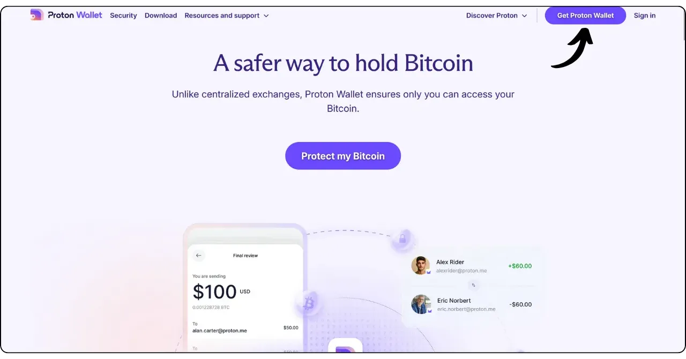

Pilih opsi berlangganan "*Gratis*", lalu klik "*Masuk*".

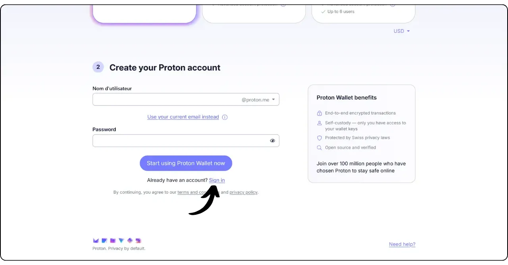

Masukkan email dan kata sandi yang terkait dengan akun Proton Anda untuk masuk.

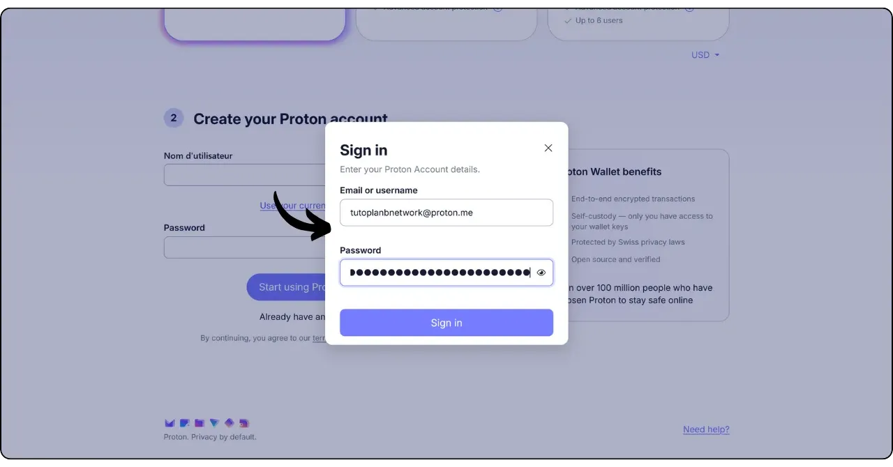

Akun Anda sekarang akan ditampilkan. Klik "*Mulai menggunakan Proton Wallet sekarang*".

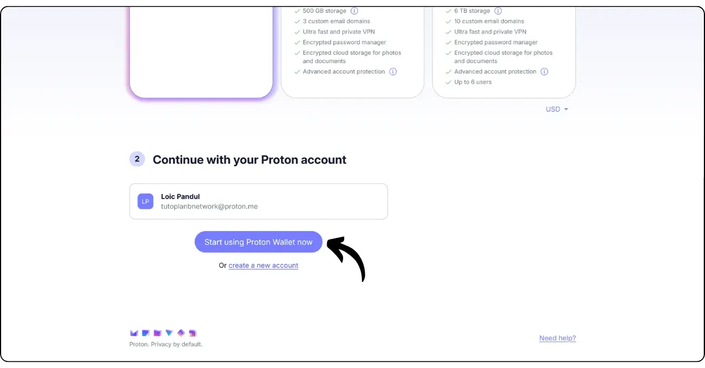

## Membuat dompet Bitcoin

Pilih mata uang fiat default untuk akun Anda, lalu klik "*Buat dompet baru*".

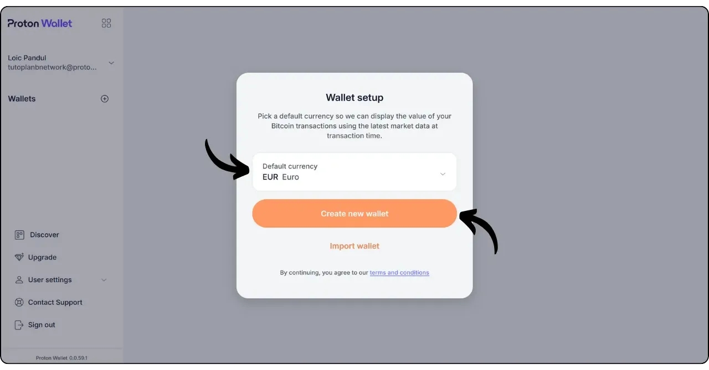

Dompet Bitcoin Anda sekarang telah dibuat. Secara teori, Anda bisa langsung menggunakannya, tetapi sangat penting untuk menyimpan mnemonic Anda terlebih dahulu. Untuk melakukannya, klik "*Secure your wallet*" di sudut kanan atas antarmuka.

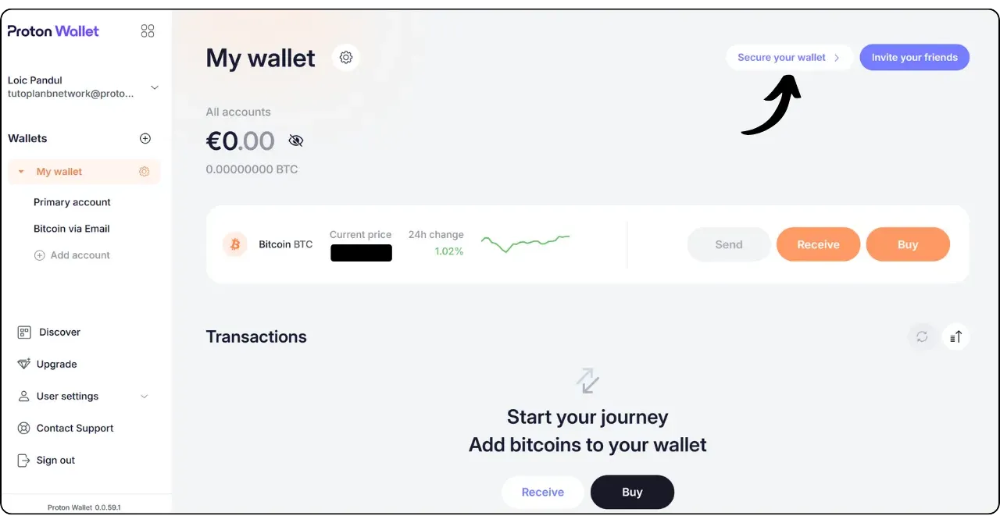

Jika Anda belum melakukannya di Proton, Anda akan diminta untuk membuat cadangan untuk akun Anda dan mengamankannya menggunakan metode 2FA. Langkah-langkah keamanan ini, meskipun berlaku untuk seluruh akun Proton Anda, akan lebih relevan ketika dompet Bitcoin Anda terintegrasi ke dalamnya. Saya sangat menyarankan Anda untuk menerapkannya.

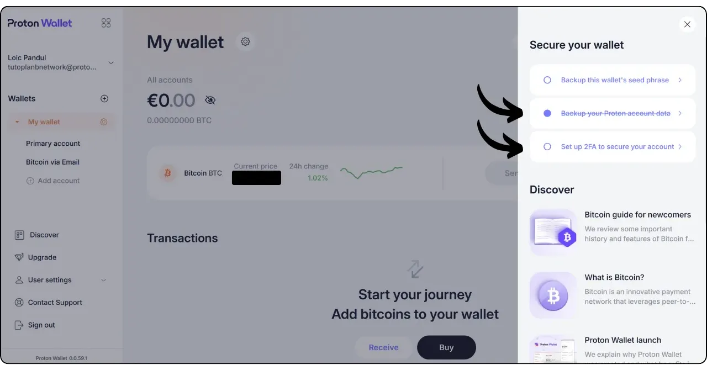

Untuk menyimpan frasa mnemonik Anda, klik "*Cadangkan frasa unggulan dompet ini*".

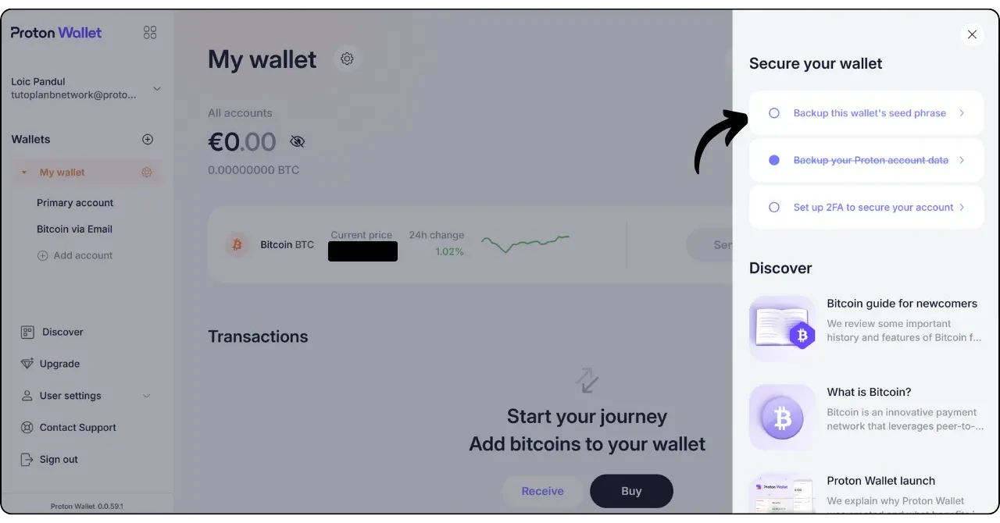

Masukkan kata sandi Proton Anda.

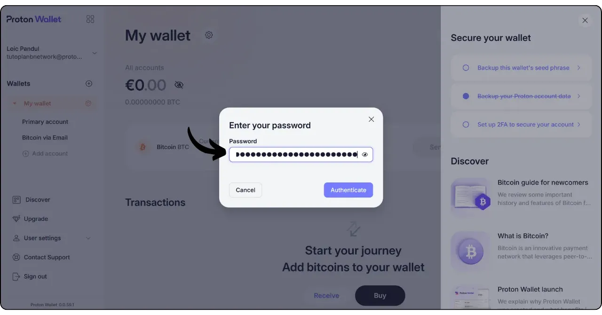

Kemudian klik "*Lihat frasa seed wallet*" untuk menampilkan frasa mnemonik wallet Anda.

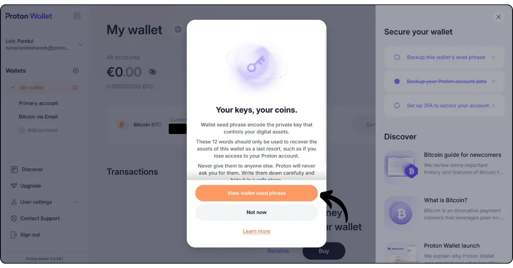

Dompet Proton menampilkan frasa mnemonik 12 kata Anda. **Mnemonik ini memberi Anda akses penuh dan tidak terbatas ke semua bitcoin Anda**. Siapa pun yang memiliki frasa ini dapat mencuri dana Anda, bahkan tanpa akses ke akun Proton Anda. Frasa 12 kata ini dapat digunakan untuk memulihkan akses ke bitcoin Anda jika Anda kehilangan akses ke akun Anda. Oleh karena itu, sangat penting untuk menyimpannya dengan hati-hati dan menyimpannya di lokasi yang aman.

Anda bisa menuliskannya pada selembar kertas, atau untuk keamanan tambahan, saya sarankan untuk mengukirnya pada dasar baja tahan karat untuk melindunginya dari kebakaran, banjir atau keruntuhan.

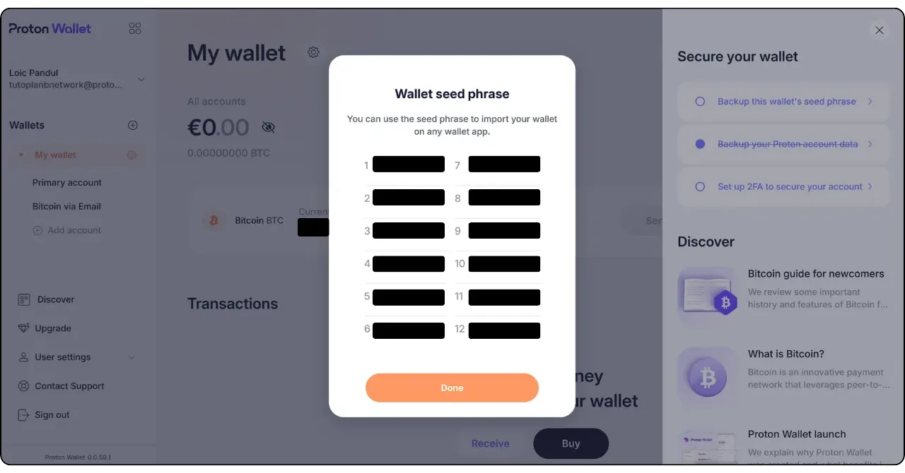

Untuk informasi lebih lanjut mengenai cara yang tepat untuk menyimpan dan mengelola frasa mnemonik Anda, saya sangat merekomendasikan untuk mengikuti tutorial lainnya, khususnya jika Anda seorang pemula:

https://planb.network/tutorials/wallet/backup/backup-mnemonic-22c0ddfa-fb9f-4e3a-96f9-46e2a7954270
_**Tentu saja, Anda tidak boleh memotret kata-kata ini, tidak seperti yang saya lakukan dalam tutorial ini.**_

Klik tombol "*Selesai*" setelah Anda menyimpan frasa Anda.

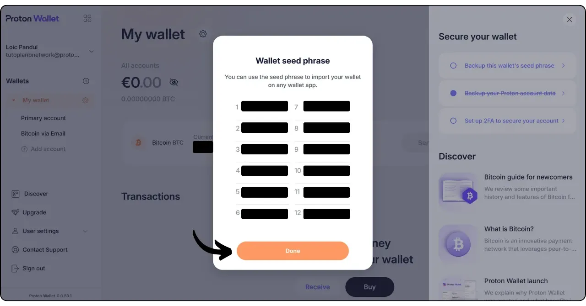

## Temukan antarmuka

Antarmuka Proton Wallet sangat intuitif. Di sebelah kiri, Anda akan menemukan berbagai dompet dan akun terkait. Akun "*Primary*" adalah akun utama Anda. Untuk alasan kerahasiaan, bitcoin yang diterima melalui alamat email Proton ditempatkan di akun terpisah, bernama "*Bitcoin via Email*".

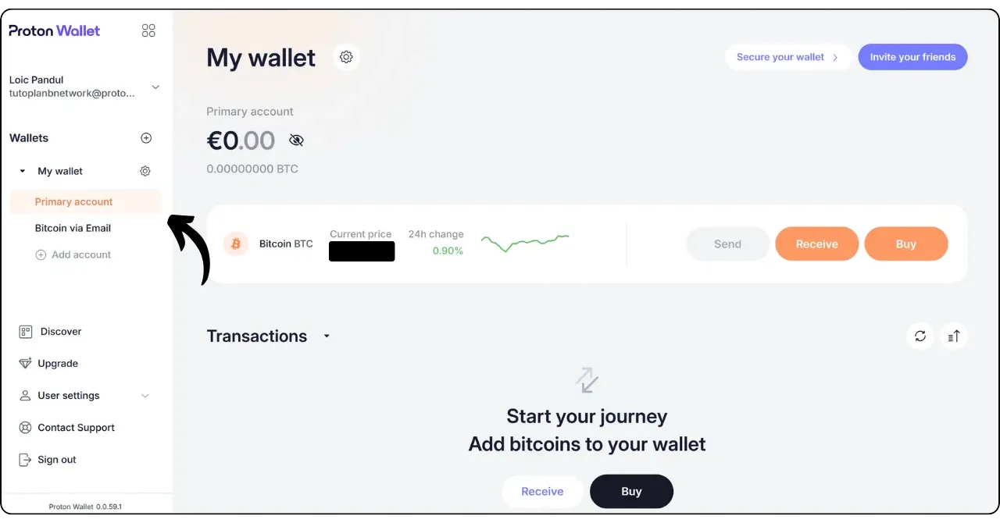

Untuk menambahkan akun baru, klik "*Tambah akun*".

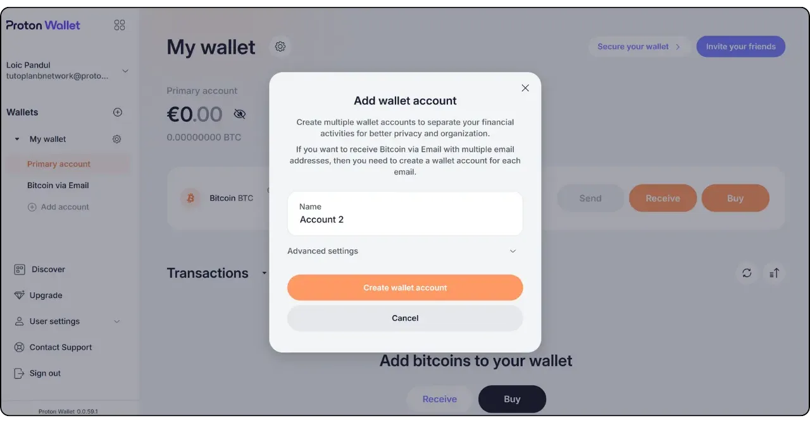

Untuk membuat portofolio baru, klik simbol "*+*" di sebelah "*Dompet*".

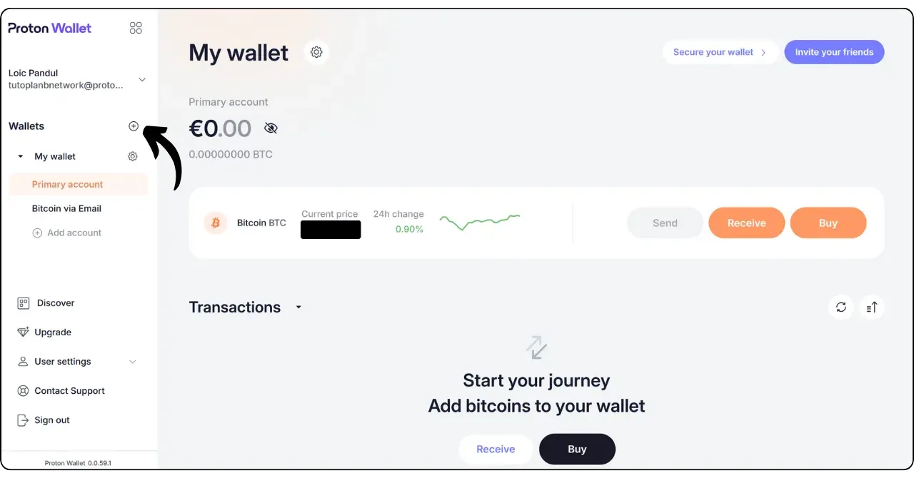

Di sinilah Anda dapat menambahkan kata sandi BIP39 ke dompet baru.

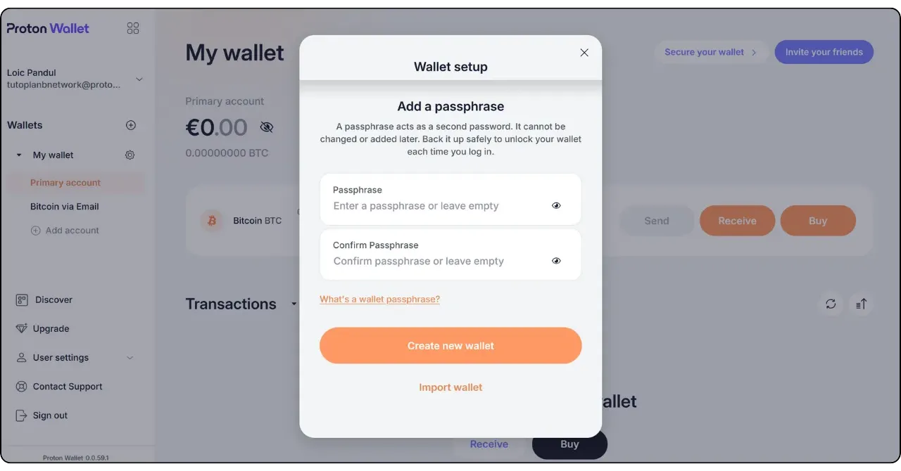

Untuk memperdalam pengetahuan Anda mengenai frasa sandi, saya merekomendasikan tutorial ini:

https://planb.network/tutorials/wallet/backup/passphrase-a26a0220-806c-44b4-af14-bafdeb1adce7
## Menerima bitcoin

Untuk menerima bitcoin di dompet Anda, pilih akun yang diinginkan di sebelah kiri antarmuka, lalu klik tombol "*Terima*".

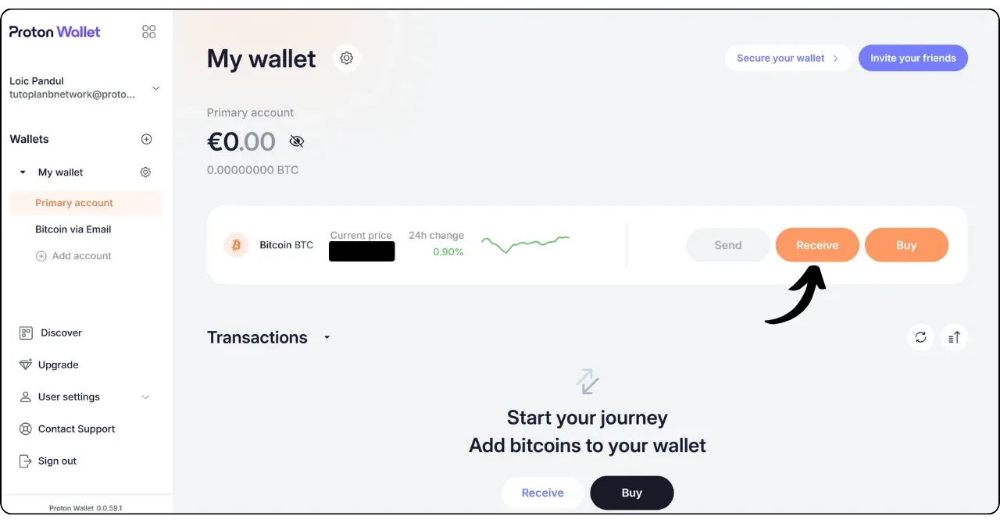

Proton Wallet kemudian secara otomatis menghasilkan alamat baru yang kosong.

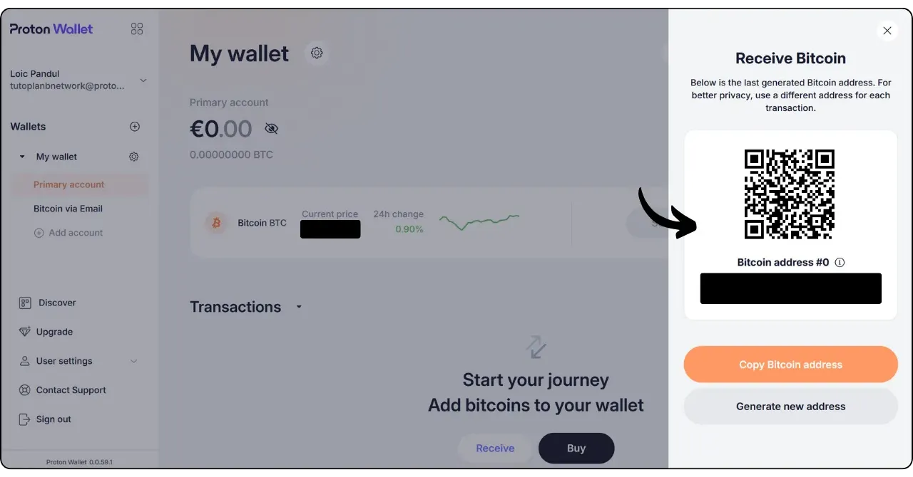

Setelah transaksi selesai, Anda akan menemukannya di bagian "*Transaksi*". Klik "*+Tambah*" untuk memberikan label pada transaksi.

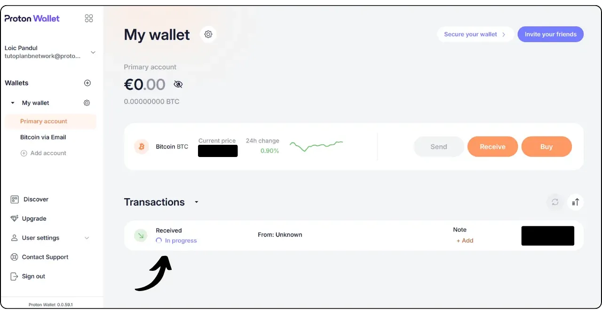

## Kirim bitcoin

Setelah Anda memiliki bitcoin di dalam dompet, Anda bisa mengirimkannya. Pilih akun pilihan Anda di sisi kiri antarmuka, lalu klik "*Kirim*".

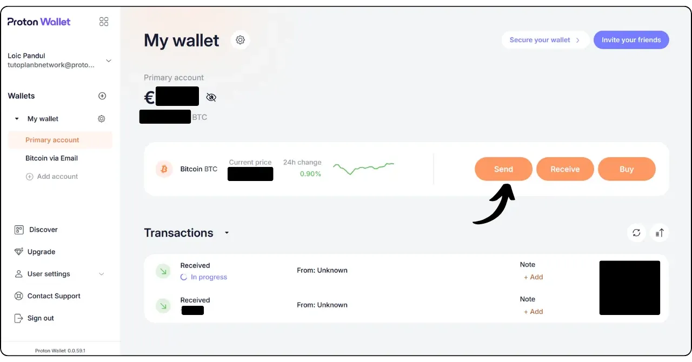

Masukkan alamat Bitcoin penerima. Anda bisa memindai kode QR dengan mengeklik logo kecil. Untuk mengirim ke alamat email, masukkan langsung di kolom ini. Setelah Anda memasukkan alamat Bitcoin, klik tanda panah kecil lalu klik "*Konfirmasi*".

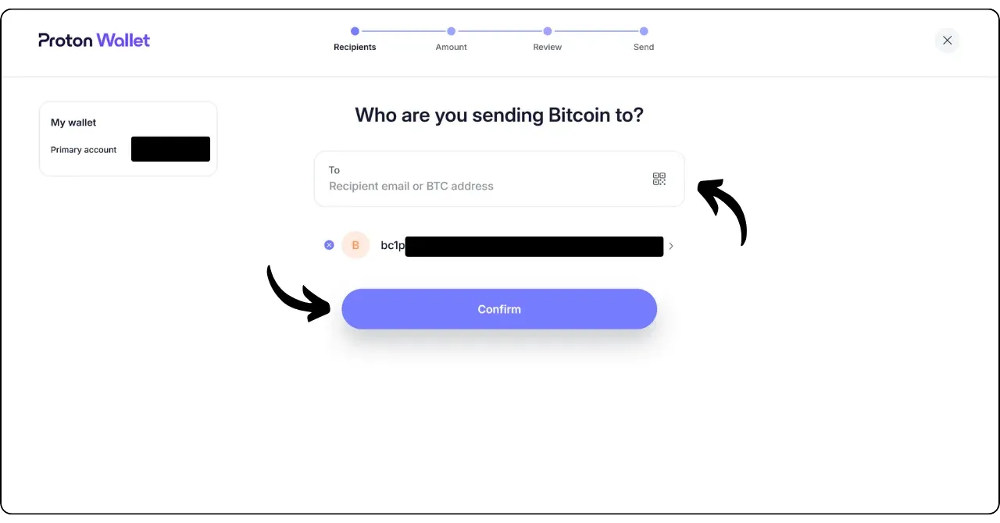

Masukkan jumlah yang akan dikirim, baik dalam mata uang fiat atau bitcoin, lalu klik "*Tinjau*".

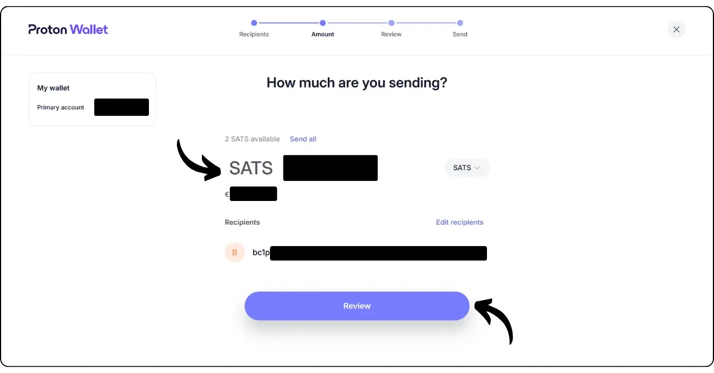

Pilih biaya transaksi berdasarkan situasi pasar saat ini.

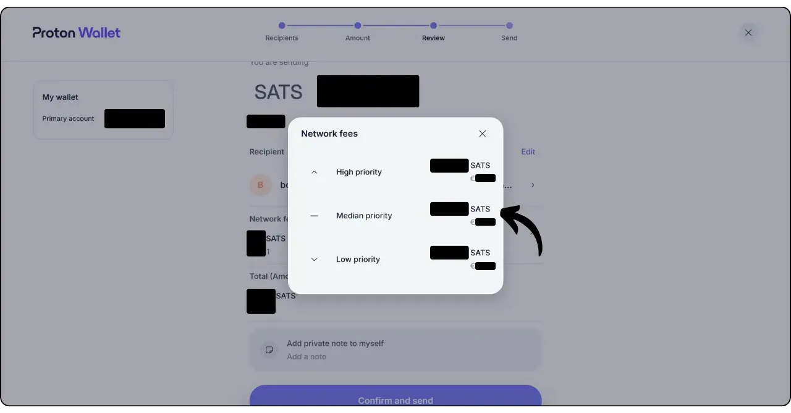

Tambahkan label pada transaksi Anda, lalu periksa kembali semua detailnya. Jika semuanya sudah benar, klik "*Konfirmasi dan kirim*" untuk menandatangani dan mengirim transaksi.

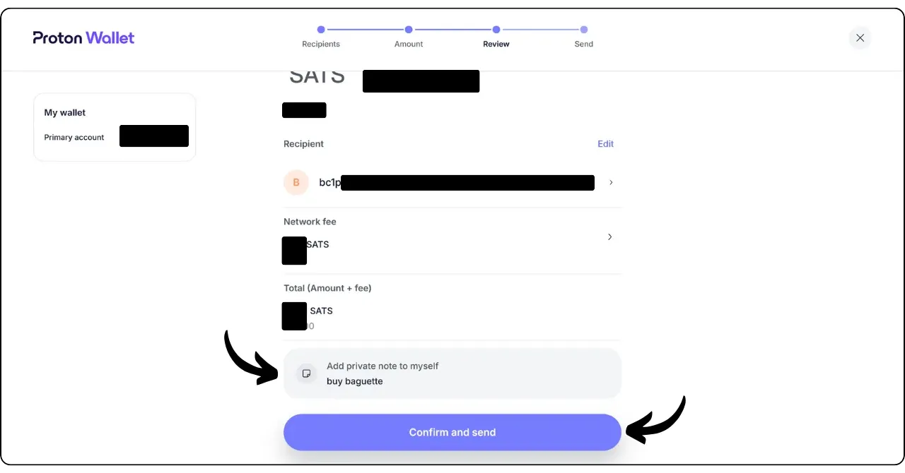

Transaksi Anda sekarang akan muncul menunggu konfirmasi di bagian "*Transaksi*" di akun Anda.

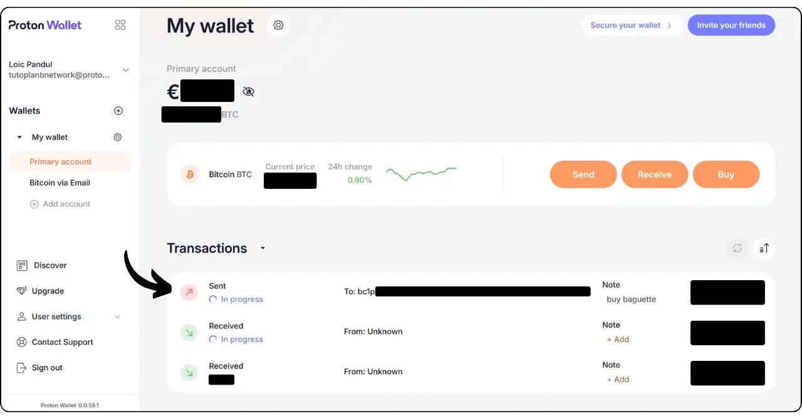

## Masuk ke aplikasi

Selain klien web, Proton Wallet juga dapat diakses melalui aplikasi seluler. Dengan menautkan dompet ke akun Proton Anda, Anda dapat menyinkronkan dompet Anda antara klien web dan aplikasi seluler.

Unduh Proton Wallet dari toko aplikasi Anda:

- [Di App Store](https://apps.apple.com/us/app/proton-wallet-secure-btc/id6479609548);
- [Di Google Play Store](https://play.google.com/store/apps/details?id=me.proton.wallet.android).

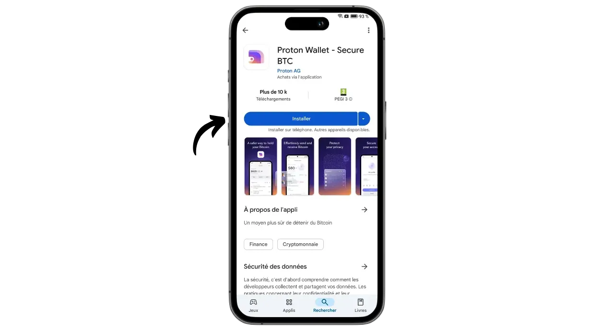

Setelah instalasi, klik "*Log in*" dan masukkan alamat email dan kata sandi Proton Anda.

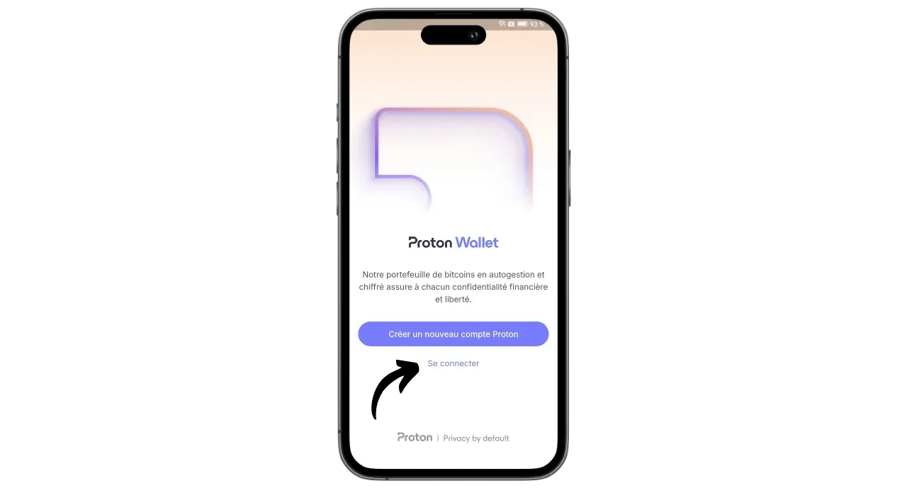

Anda kemudian akan memiliki akses ke dompet Bitcoin Anda, dengan fitur yang sama seperti pada klien web.

Selamat, Anda sekarang tahu cara mengatur dan menggunakan Proton Wallet. Jika Anda merasa tutorial ini bermanfaat, saya akan berterima kasih jika Anda memberikan jempol hijau di bawah ini. Jangan ragu untuk membagikan artikel ini di jejaring sosial Anda. Terima kasih telah berbagi!

Untuk melangkah lebih jauh, saya merekomendasikan tutorial tentang Jade Plus, dompet perangkat keras terbaru dari Blockstream:

https://planb.network/tutorials/wallet/hardware/jade-plus-sparrow-938abf16-e10a-4618-860d-cd771373a262