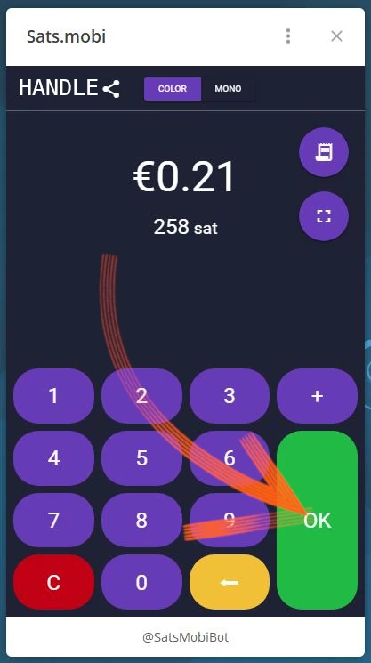

_Tento návod napsal_ [Bitcoin Campus](https://linktr.ee/bitcoincampus_)

# Sats.Mobi

SatsMobi je Wallet běžící na Telegramu, který má všechny funkce Wallet Lightning Network (custodial) a navíc nabízí řadu velmi zábavných funkcí. Vychází z Fork od LightningTipBot, který je již ukončen, zdědil všechny jeho funkce a zároveň přidal další aktuální, takže je modernější. Z LNTipBotu Sats.Mobi sleduje také filozofii open source. Wallet lze ve skutečnosti konfigurovat a spravovat samostatně jeho klonováním z tohoto [repozitáře](https://github.com/massmux/SatsMobiBot).

Pokud naopak dáváte přednost jednoduchému způsobu použití, jednoduše spusťte chat na Telegramu a zjistíte, že se jedná o bota.

# Nastavení

Na vyhledávacím panelu Telegramu vyhledejte "satsmobi" a zobrazí se odkaz na [bot](@SatsMobiBot).

**Upozornění**: Pokud si nejste jisti vyhledáváním přes Telegram, přistupujte k botovi bezpečně pomocí následujícího [odkazu](https://t.me/SatsMobiBot)

Ke spuštění stačí stisknout tlačítko _START_

Chcete-li prozkoumat aplikaci Wallet, můžete v levém dolním rohu vybrat možnost _Menu_.

Mezi hlavními příkazy nyní zvolte _/help_.

Sats.Mobi nás přivítá zobrazením zprávy s výčtem všech hlavních funkcí. Při spuštění bot také vytvořil LN Address, spojený s handle zvoleným na Telegramu (který je ve výchozím nastavení jedinečný). Zobrazí se příkazy pro odesílání a přijímání Sats s tímto Wallet, stejně jako další funkce, které uvidíme později. Zajímavé je také hned nahlédnout do nabídky _/rozšířené_

Vyskočí na povrch, že Sats.Mobi vytvořil také anonymní LN Address, který lze použít k získání soukromí. Bot pracuje s příkazy: stačí kliknout na příslušné slovo nebo napsat do panelu zpráv lomítko "/" a za ním příkaz, který chcete nechat provést. I když byl Wallet právě vytvořen, zvolte například _/transakce_

Tento příkaz zobrazí seznam posledních transakcí, v tomto konkrétním případě nulový.

# Příjem Sats

Příkaz pro vytvoření Invoice a přijetí Sats je _/invoice_. Sats.Mobi důvody výhradně v Satoshi, nejmenší jednotce v Bitconu; proto je pro vytvoření Invoice nutné napsat částku v Sats do lišty zpráv a později ji odeslat v chatu s botem.

V následujícím příkladu byla vybrána částka 210 Sats, která má být přijata.

Po několika okamžicích čekání na přípravu Invoice je tento kód k dispozici v textové podobě a ve formě QR kódu. Po zaplacení kódu Invoice se v kódu Wallet zobrazí zůstatek. Pokud je celková částka z nějakého důvodu neaktuální, napište _/balance_ a stiskněte klávesu `send`.

# Odeslat Sats

Ačkoli jsou saty neocenitelným aktivem, od kterého by se člověk neměl povrchně odloučit, Sats.Mobi tuto část zatraktivňuje, provedení několika krátkých testů (tj. pár testovacích transakcí) nebude problém.

## Platba společnosti Invoice

Nejjednodušší způsob, jak zaplatit účet Invoice, je zkopírovat řetězec zprávy `lnbc1xxxxx` a vložit jej do řádku zpráv po zadání příkazu _/pay_. **Správná syntaxe** zahrnuje ponechání mezery za příkazem.

Wallet odešle zprávu s žádostí o potvrzení. Kliknutím na _Pay_ je Invoice zaplacen.

Sats.Mobi se může spolehnout na efektivní a dobře propojený uzel Lightning, který jen zřídkakdy selže, protože vždy dokáže najít správné směrování.

## Plaťte pohodlně z mobilu

Pokud jde o Telegram, Sats.Mobi je k dispozici také v mobilní síti. Nejpohodlnější funkcí pro mobilní platby je orámování QR kódu, ale to Wallet postrádá z podstaty věci, protože se nejedná o samostatnou aplikaci, ale je obsažena v sociální. Sats.Mobi je proto naprogramována tak, aby co nejvíce usnadnila mobilní použití: dokáže totiž dekódovat obrázek, například fotografii pořízenou QR kódem Invoice, za který chcete zaplatit.

Předpokládejme například, že chceme zaplatit Invoice ve výši 50 Sats.

Když se nám zobrazí, můžeme příslušný kód QR vyfotografovat.

Poté otevřeme Telegram na mobilním telefonu a v chatu s Sats.Mobi připojíme právě pořízenou fotografii ke kódu QR

Po výběru ji odešleme botovi:

Sats.Mobi dekóduje fotografii a **prodleně zobrazí žádost o platbu** se správným popisem. Chat si vyžádá potvrzení, pro pokračování je třeba stisknout _/platit_

Chvíli počkáme, než se platba zpracuje.

Invoice o 50 Sats, což je výsledek dosažený bez použití fotoaparátu a jeho vestavěné funkce skenování.

## Sats.Mobi v Telegram Groups

Z funkcí, které proslavily LNTipBot a které Sats.Mobi vrací do Telegramu, je tu ta, která činí zážitek členů skupiny zábavným a interaktivním.

Majitelé mohou bota pozvat, aby se připojil ke skupinovému chatu, a poté jmenovat Sats.Mobi správcem. Od té chvíle začíná zábava, protože členové mohou začít odměňovat ostatní uživatele za jejich příspěvky ve skupině.

- _/tip_ přidá tip v odpovědi na zprávu;
- _/send_ odešle finanční prostředky tak, že jako příjemce uvede handle LN Address nebo Telegram;
- _/faucet_ (v nabídce _/advanced_) umožňuje vytvořit sadu tipů, které mohou nejrychlejší členové skupiny sbírat kliknutím na tlačítko _/collect_;
- _/tipjar_ (v nabídce _/rozšířené_) vytvoří další typ rozesílání, který lze odeslat uživatelům ve skupině.

Každý z těchto příkazů má vlastní syntaxi, která je vysvětlena v hlavní nabídce příkazů.

Co když nejsme vlastníkem skupiny? Žádný problém: stačí požádat zakladatele o pozvání Sats.Mobi, přidat ho jako správce téže skupiny a je hotovo!

# Prodejní místa (POS)

Při prvním spuštění služby Sats.Mobi vytvoří bot pro uživatele také další funkci: **POS**. Toto "zařízení" aktivuje uživatel příkazem _/pos_ nebo kliknutím na příslušné tlačítko z konzoly v pravém dolním rohu. POS je ve skutečnosti webová aplikace, která se otevře jako vyskakovací okno na chatu Telegramu

Na displeji Interface je v levém horním rohu umístěna osobní rukojeť Telegramu a používá se jednoduše, jako se používají všechny pokladny: zadáním částky na klávesnici. Nyní předpokládejme, že chceme vybrat 21 centů za službu. S vědomím, že Sats.Mobi nativně zpracovává pouze Satss, není snadné provést přepočet v hlavě. Místo toho pokladna zobrazí euro jako zúčtovací jednotku a zároveň zobrazí ekvivalent v Satoshi.

Kliknutím na _/OK_ se zobrazí Invoice, který lze zákazníkovi zobrazit prostřednictvím kódu QR nebo jej lze odeslat jako řetězec prostřednictvím rychlých zpráv, aby bylo možné jej zaplatit

Pokladna je samozřejmě dostupná i na mobilním telefonu, a to stejným způsobem, jak je uvedeno výše.

Je také dobře viditelný z displeje mobilního telefonu:

# Další funkce

Nabídku Wallet Sats.Mobi doplňují další funkce, které, jak jsme viděli, rozšiřují koncept Wallet nad rámec operací přijímání a odesílání plateb:

- _/nostr_: pro připojení Wallet k jeho uživateli Nostr pro příjem zaps;
- _/cashback_: zobrazuje kód, který můžete ukázat obchodníkovi, abyste získali zpět peníze za výdaje;
- _/buy_: spustí v rámci bota průvodce, který vám umožní zakoupit Sats za eura:
- _/activatecard_: žádost o aktivaci debetní karty NFC, kterou lze dobíjet prostřednictvím zařízení Wallet Sats.Mobi a pro kterou lze aktivovat oznámení;
- _/link_: vytvoří odkaz pro váš vlastní Wallet Zeus nebo Blue Wallet, které můžete použít jako dálkové ovládání tohoto Wallet.

# Závěr

Sats.Mobi je Wallet, který je příjemný a zábavný na používání, a vrací do používání zkušenosti získané s LNTipBotem s využitím pokročilejších funkcí LNBits. Je však třeba mít na paměti, že **je to služba správcovská**. Má tedy sloužit k úschově velmi malého počtu sátů; není to příkazce Wallet pro své vlastní fondy Lightning Network. Existuje také vlastní kapacitní limit 500 000 Satss, který se nedoporučuje překračovat.

Pokud hledáte Wallet Lightning Network bez vazby, měli byste se rozhodně poohlédnout po jiných produktech.

---
### Dokumentace

- [Github](https://github.com/massmux/SatsMobiBot)
- Seznam přehrávaných ukázek [video](https://www.youtube.com/results?search_query=Sats.mobi)