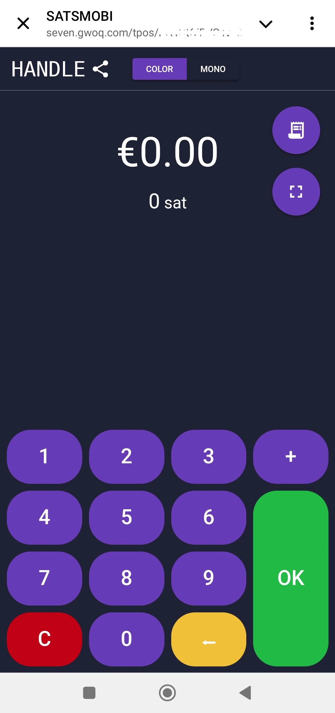

dieses Tutorium wurde geschrieben von_ [Bitcoin Campus] (https://linktr.ee/bitcoincampus_)

# Sats.Mobi

SatsMobi ist ein Wallet, der auf Telegram läuft und alle Funktionen eines Wallet Lightning Network (custodial) hat und zusätzlich eine Reihe von sehr lustigen Features bietet. Er stammt von einem Fork von LightningTipBot ab, der inzwischen eingestellt wurde, und erbt alle seine Funktionen, fügt aber auch aktuellere hinzu, was ihn moderner macht. Von LNTipBot, Sats.Mobi auch Spuren der Open-Source-Philosophie. Wallet kann in der Tat selbst konfiguriert und verwaltet werden, indem es von diesem [Repository] (https://github.com/massmux/SatsMobiBot) geklont wird.

Wenn Sie hingegen eine einfache Nutzung bevorzugen, starten Sie einfach einen Chat auf Telegram und Sie werden feststellen, dass es sich um einen Bot handelt.

# Einstellungen

Suchen Sie in der Telegram-Suchleiste nach "satsmobi" und der Link zum [bot](@SatsMobiBot) wird angezeigt.

**Vorsicht**: Wenn Sie sich bei der Suche über Telegram nicht sicher sind, greifen Sie über den folgenden [Link](https://t.me/SatsMobiBot) sicher auf den Bot zu

Um es zu starten, müssen Sie nur _START_ drücken

Um Wallet zu erkunden, wählen Sie _Menüu_ in der unteren linken Ecke.

Wählen Sie nun _/help_ unter den Hauptbefehlen.

Sats.Mobi begrüßt uns mit einer Nachricht, in der alle wichtigen Funktionen aufgeführt sind. Beim Start hat der Bot auch einen LN Address erstellt, der mit dem auf Telegram gewählten Handle verknüpft ist (der standardmäßig eindeutig ist). Befehle zum Senden und Empfangen von Sats mit diesem Wallet sind sichtbar, ebenso wie andere Funktionen, die wir später sehen werden. Es ist auch interessant, gleich einen Blick auf das Menü _/erweitert_ zu werfen

Es fällt auf, dass Sats.Mobi auch einen anonymen LN Address erstellt hat, der zum Schutz der Privatsphäre verwendet werden kann. Der Bot arbeitet mit Befehlen: Klicken Sie einfach auf das entsprechende Wort, oder geben Sie den Schrägstrich "/" in die Nachrichtenleiste ein, gefolgt von dem Befehl, den Sie ausführen lassen möchten. Auch wenn Wallet gerade erst erstellt wurde, wählen Sie z. B. _/transactions_

Dieser Befehl zeigt die Liste der letzten Transaktionen an, in diesem Fall Null.

# Empfangen von Sats

Der Befehl zur Erstellung eines Invoice und zum Empfang von Sats lautet _/invoice_. Sats.Mobi begründet ausschließlich in Satoshi, der kleinsten Einheit in Bitcon; daher ist es zur Erstellung des Invoice notwendig, den Betrag in Sats in die Nachrichtenleiste zu schreiben und später im Chat mit dem Bot zu senden.

Im folgenden Beispiel wurde ein Betrag von 210 Sats gewählt, der eingehen soll.

Nach einigen Augenblicken des Wartens, bis Invoice vorbereitet ist, ist dieser als Text und als QR-Code verfügbar. Wenn Sie Invoice bezahlen, zeigt Wallet den Saldo an. Wenn der Gesamtbetrag aus irgendeinem Grund nicht mehr aktuell ist, schreiben Sie _/balance_ und drücken Sie die Taste `send`.

# Sats senden

Obwohl Satss ein unschätzbares Gut sind, von dem man sich nicht oberflächlich trennen sollte, macht Sats.Mobi diesen Teil attraktiv, einige kurze Tests (d.h. ein paar Testtransaktionen) durchzuführen wird kein Problem sein.

## Bezahlen eines Invoice

Der einfachste Weg, einen Invoice zu bezahlen, besteht darin, die Nachrichtenzeichenfolge `lnbc1xxxxx` zu kopieren und sie in die Nachrichtenleiste einzufügen, nachdem Sie den Befehl _/pay_ eingegeben haben. **Zur korrekten Syntax gehört es, nach dem Befehl ein Leerzeichen zu lassen.

Wallet sendet eine Nachricht mit der Bitte um Bestätigung. Durch Klicken auf _Bezahlen_ wird der Invoice bezahlt.

Sats.Mobi kann sich auf einen effizienten und gut vernetzten Lightning-Knoten verlassen, der nur selten Zahlungen ausfallen lässt, weil er immer die richtige Weiterleitung findet.

## Bequem vom Handy aus bezahlen

Was Telegram betrifft, so ist Sats.Mobi auch auf dem Handy verfügbar. Die bequemste Funktion für mobiles Bezahlen ist das Einrahmen eines QR-Codes, aber das Wallet hat diese Funktion nicht, da es keine eigenständige App ist, sondern in einer sozialen App enthalten ist. Sats.Mobi ist daher so programmiert, dass es das mobile Erlebnis so einfach wie möglich macht: Es kann nämlich ein Bild dekodieren, z. B. ein Foto des QR-Codes des Invoice, das Sie bezahlen möchten.

Nehmen wir zum Beispiel an, wir wollen einen Invoice von 50 Sats bezahlen.

Wenn uns dieser gezeigt wird, können wir ein Foto des entsprechenden QR-Codes machen.

Dann öffnen wir Telegram auf dem Handy und hängen im Chat mit Sats.Mobi das soeben aufgenommene Foto an den QR-Code

Nach der Auswahl senden wir sie an den Bot:

Sats.Mobi entschlüsselt das Foto und **präsentiert sofort die Zahlungsaufforderung** mit der richtigen Beschreibung. Der Chat bittet um eine Bestätigung, um fortzufahren, müssen Sie _/Bezahlen_ drücken

Wir warten ein paar Augenblicke, bis die Zahlung bearbeitet wurde.

Invoice durch 50 Sats bezahlt wurde, ein Ergebnis, das ohne den Einsatz einer Kamera und ihrer eingebauten Scanfunktion erzielt wurde.

## Sats.Mobi in Telegrammgruppen

Von den Funktionen, die LNTipBot berühmt gemacht haben und die Sats.Mobi zu Telegram zurückbringt, gibt es eine, die die Erfahrung der Mitglieder in einer Gruppe lustig und interaktiv macht.

Die Besitzer können den Bot einladen, am Gruppenchat teilzunehmen, und Sats.Mobi dann zum Administrator ernennen. Von da an beginnt der Spaß, denn die Mitglieder können beginnen, andere Nutzer für ihre Beiträge in der Gruppe zu belohnen.

- _/tip_ fügt einen Tipp hinzu, indem er auf eine Nachricht antwortet;
- _/send_ sendet Geldbeträge, indem ein LN Address oder Telegram-Handle als Empfänger angegeben wird;
- mit _/faucet_ (im Menü _/erweitert_) können Sie eine Reihe von Tipps erstellen, die die schnellsten Gruppenmitglieder sammeln können, indem sie auf _/collect_ klicken;
- mit _/tipjar_ (im Menü _/erweitert_) wird eine weitere Art von Verteilung erstellt, die an die Benutzer der Gruppe gesendet werden kann.

Jeder dieser Befehle hat seine eigene Syntax, die im Hauptbefehlsmenü erläutert wird.

Was ist, wenn wir nicht Eigentümer einer Gruppe sind? Kein Problem: Bitten Sie einfach den Gründer, Sats.Mobi einzuladen, fügen Sie ihn/sie als Administrator der Gruppe hinzu, und fertig!

# Verkaufsstelle (POS)

Wenn Sats.Mobi zum ersten Mal gestartet wird, erstellt der Bot ein weiteres Feature für den Benutzer: **den POS**. Das "Gerät" wird vom Benutzer mit dem Befehl _/pos_ oder durch Klicken auf die entsprechende Schaltfläche in der Konsole in der unteren rechten Ecke aktiviert. Tatsächlich ist der POS eine Web-App, die sich als Pop-up im Telegram-Chat öffnet

Das Interface trägt den persönlichen Griff von Telegram in der oberen linken Ecke und wird einfach so benutzt, wie man alle Kassen benutzt: indem man den Betrag auf der Tastatur eintippt. Nehmen wir nun an, wir wollen 21 Cent für eine Dienstleistung kassieren. Da Sats.Mobi von Haus aus nur Satss verarbeitet, ist es nicht einfach, die Umrechnung im Kopf vorzunehmen. Stattdessen zeigt die Kasse den Euro als Rechnungseinheit an, während sie den Gegenwert in Satoshi.

Wenn Sie auf _/OK_ klicken, erscheint der Invoice, der dem Kunden über einen QR-Code angezeigt oder als String über Instant Messaging versendet werden kann, um ihn zu bezahlen

Natürlich ist die Kasse auch auf einem Mobiltelefon verfügbar, indem man sie auf die gleiche Weise wie oben gezeigt aufruft.

Sie präsentiert sich auch gut sichtbar auf dem Handy-Display:

# Zusätzliche Merkmale

Es gibt noch weitere Funktionen, die das Wallet Sats.Mobi-Angebot ergänzen, das, wie wir gesehen haben, das Wallet-Konzept über das Empfangen und Senden von Zahlungen hinaus erweitert:

- _/nostr_: um Wallet mit seinem Benutzer Nostr zu verbinden, um Zaps zu empfangen;
- /cashback_: Zeigt einen Code an, den Sie einem Händler zeigen können, um Cashback für eine Ausgabe zu erhalten;
- _/buy_: startet einen Assistenten innerhalb des Bots, mit dem Sie Sats für Euro kaufen können:
- _/activatecard_: um die Aktivierung einer NFC-Debitkarte zu beantragen, die über das Wallet Sats.Mobi aufgeladen werden kann und für die Benachrichtigungen aktiviert werden können;
- _/link_: erstellt einen Link für Ihren eigenen Wallet Zeus oder Blue Wallet, die Sie als Fernbedienungen für diesen Wallet verwenden können.

# Schlussfolgerung

Sats.Mobi ist ein Wallet, der angenehm und unterhaltsam zu benutzen ist und die mit LNTipBot gemachten Erfahrungen mit den fortgeschrittenen Funktionen von LNBits wieder aufleben lässt. Es ist jedoch wichtig, sich daran zu erinnern, dass es sich um einen **Verwahrungsdienst** handelt. Er ist daher dazu gedacht, sehr wenige Satss zu verwahren; er ist kein Wallet Auftraggeber für seine eigenen Lightning Network Fonds. Es gibt auch eine inhärente Kapazitätsgrenze von 500.000 Satss, eine Grenze, die nicht überschritten werden sollte.

Wenn Sie auf der Suche nach Wallet Lightning Network ohne Freiheitsentzug sind, sollten Sie sich unbedingt nach anderen Produkten umsehen.

---
### Dokumentation

- [Github](https://github.com/massmux/SatsMobiBot)
- Wiedergabeliste von [video](https://www.youtube.com/results?search_query=Sats.mobi) Demos