_Este tutorial ha sido escrito por_ [Bitcoin Campus](https://linktr.ee/bitcoincampus_)

# Sats.Mobi

SatsMobi es un Wallet que corre sobre Telegram, que tiene todas las funciones de un Wallet Lightning Network (de custodia) y ofrece, además, una serie de características muy divertidas. Procede de un Fork de LightningTipBot, ya descatalogado, hereda todas sus características a la vez que añade otras más actuales, lo que lo hace más moderno. De LNTipBot, Sats.Mobi también calca la filosofía del código abierto. Wallet puede, de hecho, configurarse y gestionarse por sí mismo clonándolo desde este [repositorio](https://github.com/massmux/SatsMobiBot).

Si, por el contrario, prefieres utilizarlo de forma sencilla, simplemente inicia un chat en Telegram y verás que se trata de un bot.

# Ajustes

Desde la barra de búsqueda de Telegram, busca "satsmobi" y aparecerá el enlace al [bot](@SatsMobiBot).

**Precaución**: Si no estás seguro de la búsqueda a través de Telegram, accede al bot de forma segura utilizando el siguiente [enlace](https://t.me/SatsMobiBot)

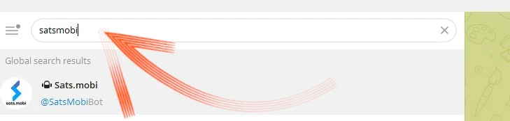

Para ponerlo en marcha, basta con pulsar _START_

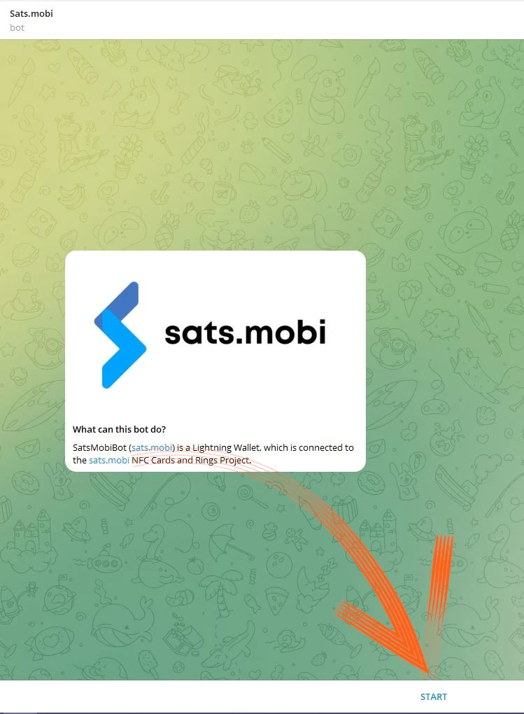

Para explorar Wallet puedes seleccionar _Menu_ en la esquina inferior izquierda.

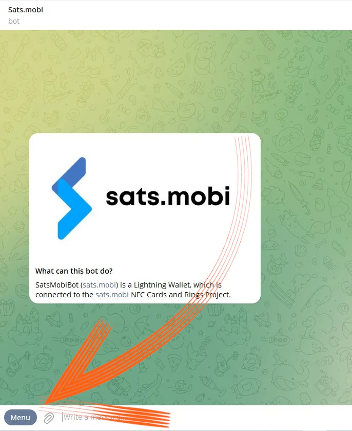

Opta ahora por _/help_ entre los comandos principales.

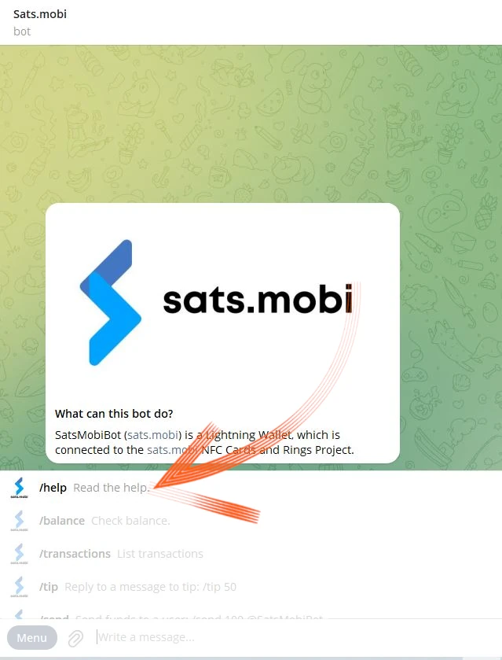

Sats.Mobi nos da la bienvenida mostrando un mensaje, enumerando todas las características principales. Al iniciarse, el bot también ha creado un LN Address, vinculado al handle elegido en Telegram (que es único por defecto). Los comandos para enviar y recibir Sats con este Wallet son visibles, así como otras funciones que veremos más adelante. También es interesante echar un vistazo al menú _/advanced_ de inmediato

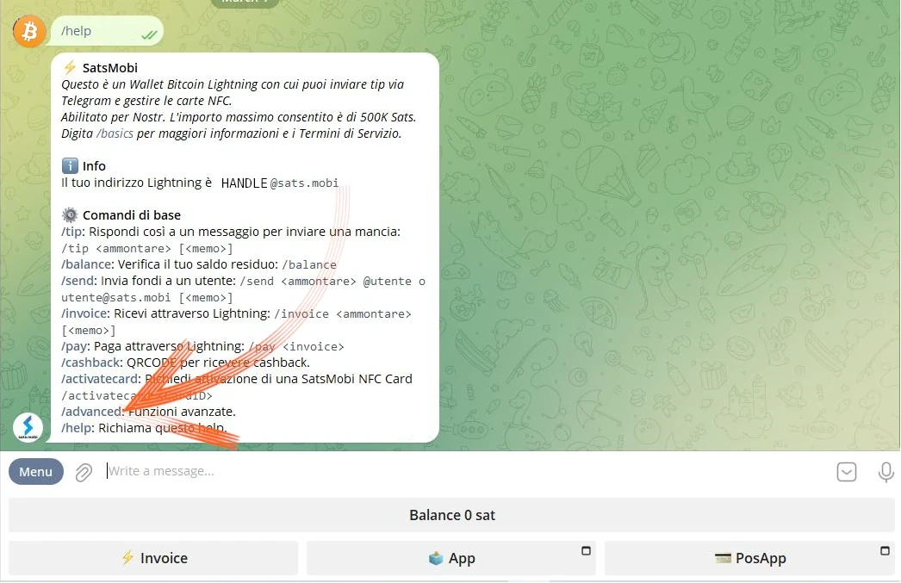

Salta a la vista que Sats.Mobi también ha creado un LN Address anónimo, que puede utilizarse para ganar privacidad. El bot funciona con comandos: basta con hacer clic en la palabra correspondiente, o escribir la barra "/" en la barra de mensajes, seguida del comando que se desea hacer ejecutar. Aunque se acabe de crear Wallet, elige, por ejemplo, _/transactions_

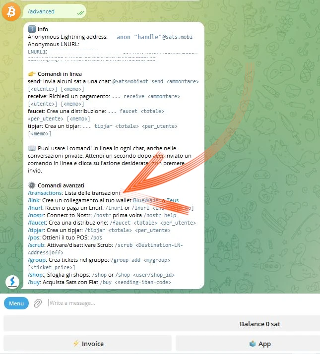

Este comando muestra la lista de las últimas transacciones, en este caso cero.

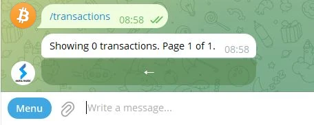

# Recepción de Sats

El comando para crear una Invoice y recibir Sats es _/factura_. Sats.Mobi razona exclusivamente en Satoshi, la unidad más pequeña en Bitcon; por lo tanto, para crear la Invoice, es necesario escribir la cantidad en Sats en la barra de mensajes y posteriormente enviarla en el chat con el bot.

En el siguiente ejemplo, se ha elegido recibir una cantidad de 210 Sats.

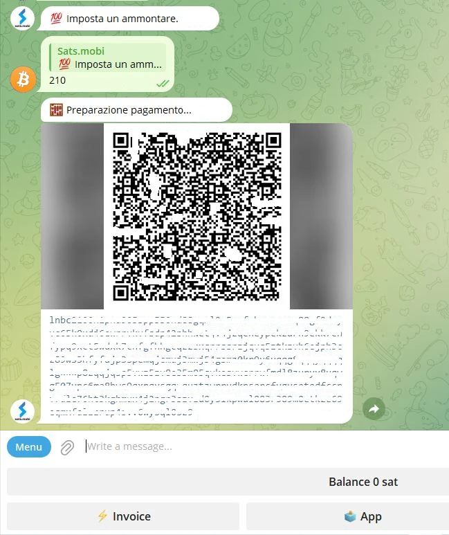

Después de esperar unos instantes a que se prepare Invoice, esta última está disponible como texto y como código QR. Al pagar Invoice, Wallet muestra el saldo. Si por alguna razón el total está desfasado, escribe _/saldo_ y pulsa la tecla `enviar`.

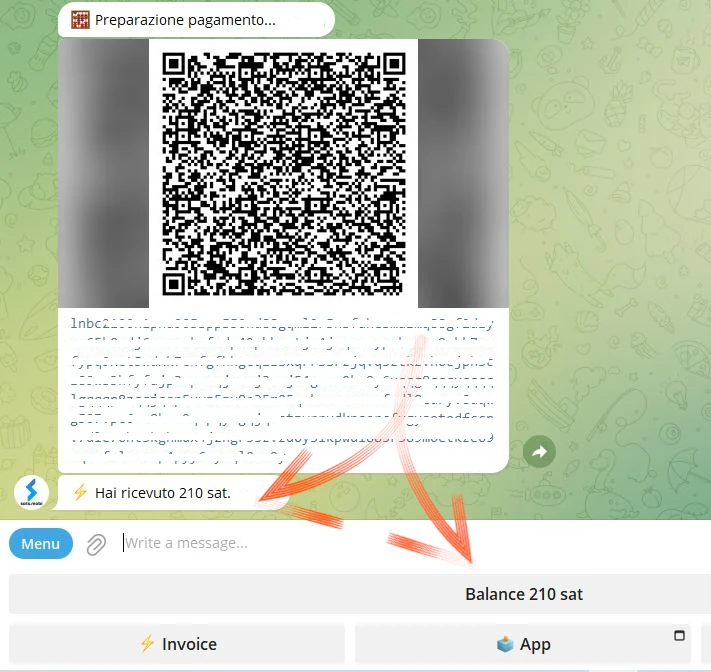

# Enviar Sats

Aunque los Satss son un activo inestimable del que no hay que desprenderse superficialmente, Sats.Mobi hace que esta parte sea atractiva, realizar algunas pruebas cortas (es decir, un par de transacciones de prueba) no será un problema.

## Pagar un Invoice

La forma más sencilla de pagar a un Invoice es copiar la cadena de mensajes `lnbc1xxxxx` y pegarla en la barra de mensajes después de teclear el comando _/pay_. **La sintaxis correcta** implica dejar un espacio después del comando.

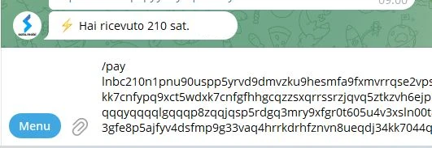

La Wallet envía un mensaje pidiendo confirmación. Al hacer clic en _Pay_ se paga la Invoice.

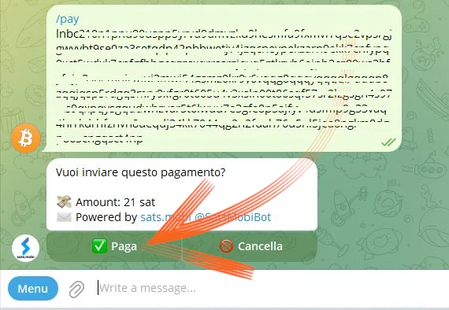

Sats.Mobi puede confiar en un nodo Rayo eficiente y bien conectado, raramente fallan los pagos porque siempre puede encontrar la ruta correcta.

## Pague cómodamente desde el móvil

Volviendo a Telegram, Sats.Mobi también está disponible en el móvil. La función más cómoda para pagar con el móvil es enmarcar un código QR, pero esta Wallet carece de ella por diseño, ya que no es una app independiente, sino que está contenida en una social. Por ello, Sats.Mobi está programada para facilitar al máximo la experiencia móvil: de hecho, puede descodificar una imagen, como una fotografía tomada al código QR de la Invoice que se desea pagar.

Supongamos, por ejemplo, que queremos pagar un Invoice de 50 Sats.

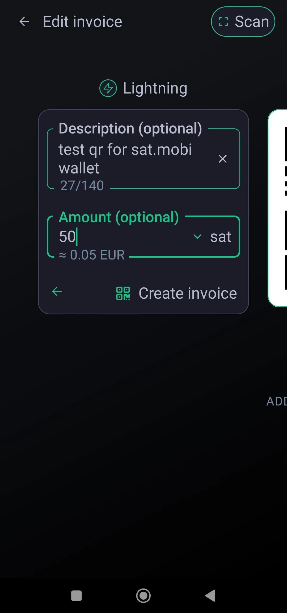

Cuando nos lo muestren, podemos hacer una foto del código QR correspondiente.

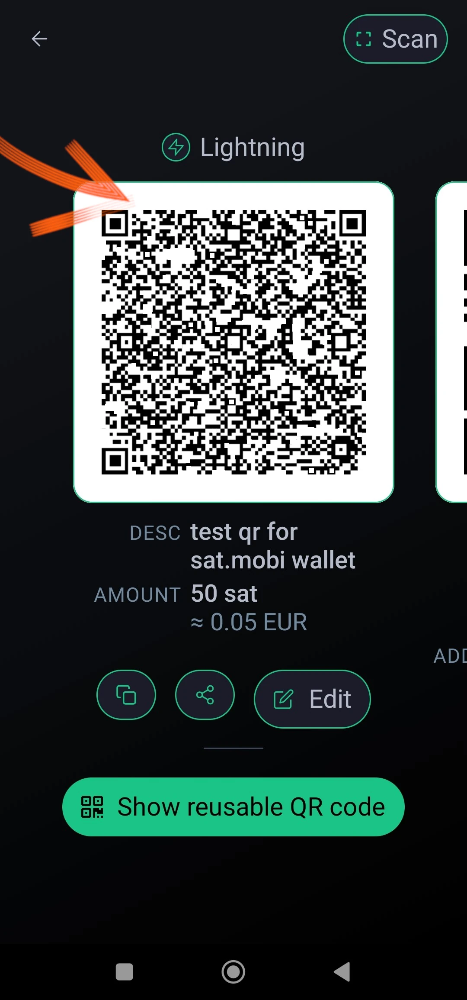

A continuación, abrimos Telegram en el móvil y, en el chat con Sats.Mobi, adjuntamos la foto que acabamos de hacer al código QR

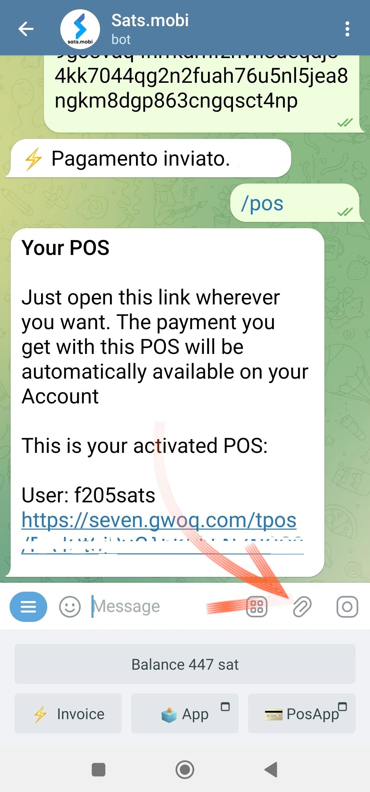

Una vez seleccionada, la enviamos al bot:

Sats.Mobi descodifica la foto y **presenta la solicitud de pago** inmediatamente, con la descripción correcta. El chat pide una confirmación, para proceder hay que pulsar _/pay_

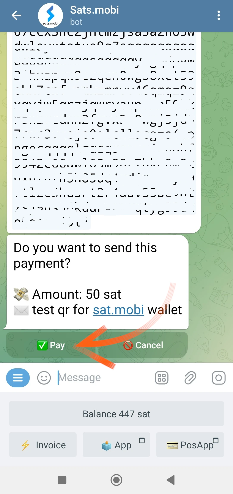

Esperamos unos instantes para que se procese el pago.

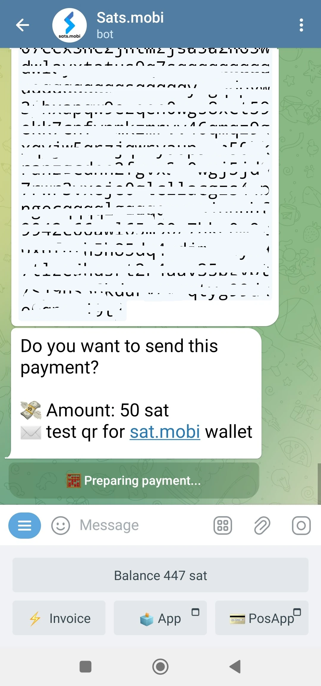

Invoice por 50 Sats se pagó, un resultado logrado sin utilizar una cámara y su función de escaneado incorporada.

## Sats.Mobi en Grupos de Telegramas

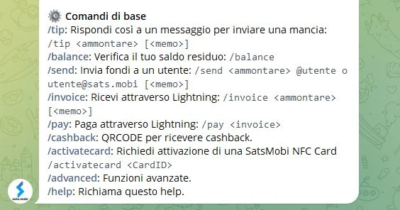

De las características que hicieron famoso a LNTipBot y que Sats.Mobi trae de vuelta a Telegram, está la que hace que la experiencia de los miembros en un grupo sea divertida e interactiva.

Los propietarios pueden invitar al bot a participar en el chat del grupo y, a continuación, nombrar a Sats.Mobi administrador. A partir de ese momento, empieza la diversión, porque los miembros pueden empezar a recompensar a otros usuarios por sus contribuciones en el grupo.

- _/tip_ añade una propina respondiendo a un mensaje;
- _/send_ envía fondos especificando un LN Address o Telegram handle como destinatario;
- _/faucet_ (en el menú _/advanced_) le permite crear un conjunto de propinas que los miembros más rápidos del grupo pueden recoger haciendo clic en _/collect_;
- _/tipjar_ (en el menú _/avanzado_) crea otro tipo de distribución que se puede enviar a los usuarios del grupo.

Cada uno de estos comandos tiene su propia sintaxis, que se explica en el menú principal de comandos.

¿Y si no somos propietarios de un grupo? No hay problema: basta con pedir al fundador que invite a Sats.Mobi, añadirlo como administrador del mismo, ¡y listo!

# Punto de venta (TPV)

Al iniciar Sats.Mobi por primera vez, el bot también crea otra función para el usuario: **el TPV**. El usuario activa el "dispositivo" con el comando _/pos_ o haciendo clic en el botón correspondiente de la consola en la esquina inferior derecha. De hecho, el TPV es una aplicación web que se abre como una ventana emergente en el chat de Telegram

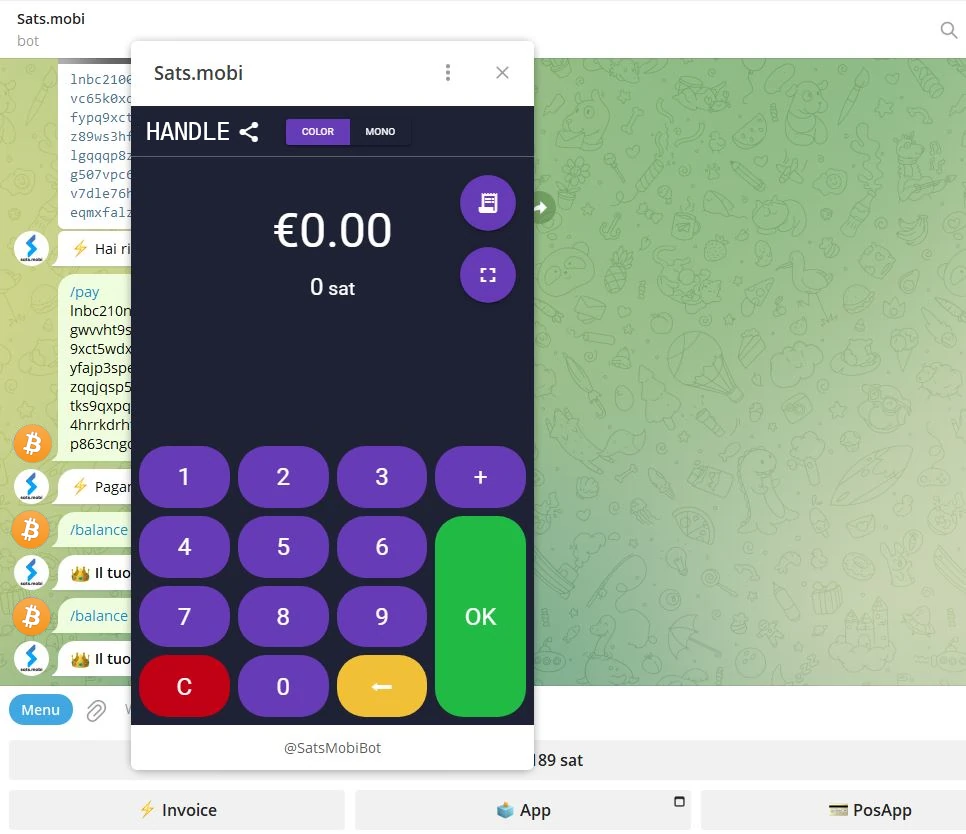

El Interface lleva la manilla personal de Telegram en la esquina superior izquierda y se utiliza simplemente como se utilizan todos los TPV: tecleando la cantidad en el teclado. Supongamos ahora que queremos cobrar 21 céntimos por un servicio. Sabiendo que Sats.Mobi maneja nativamente sólo Satss, no es fácil hacer la conversión mentalmente. En su lugar, el TPV muestra el euro como unidad de cuenta mientras que muestra el equivalente en Satoshi.

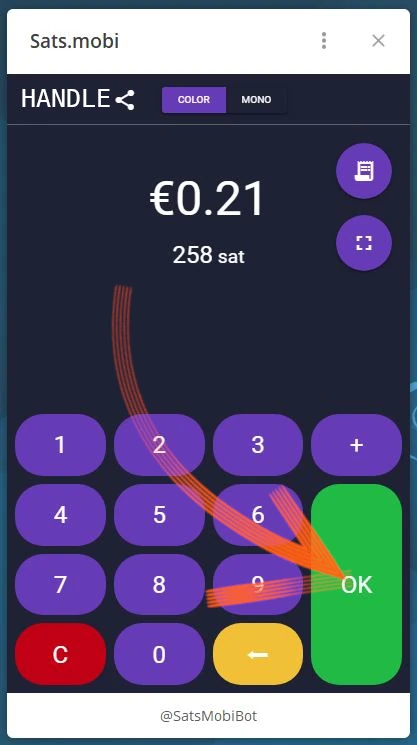

Al hacer clic en _/OK_ aparece el Invoice que se puede mostrar al cliente mediante un código QR, o que se puede enviar como una cadena a través de mensajería instantánea, para que pueda pagarlo

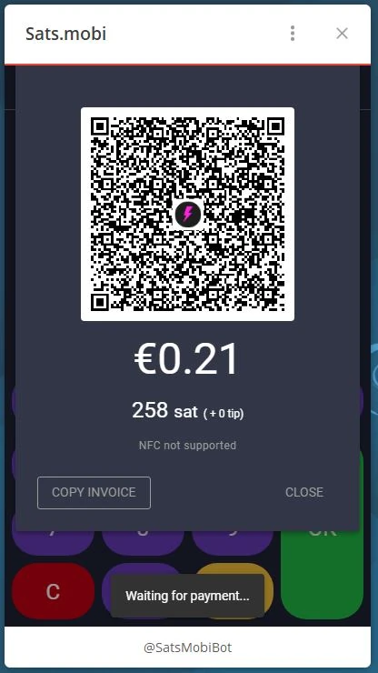

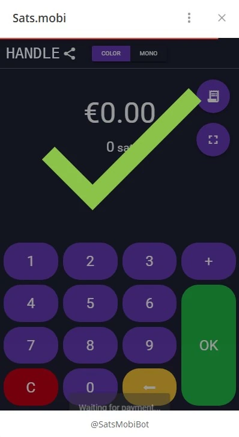

Por supuesto, el TPV también está disponible en un teléfono móvil llamándolo de la misma forma que se muestra arriba.

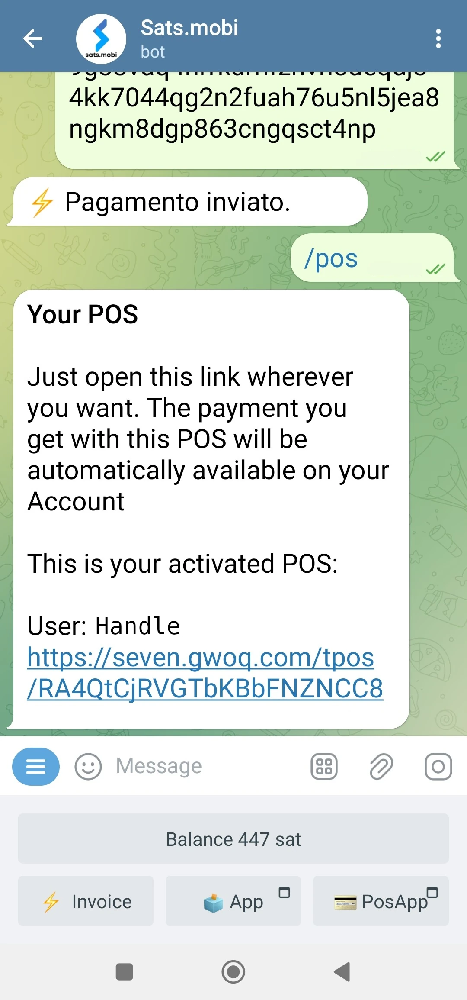

También se presenta bien visible desde la pantalla del móvil:

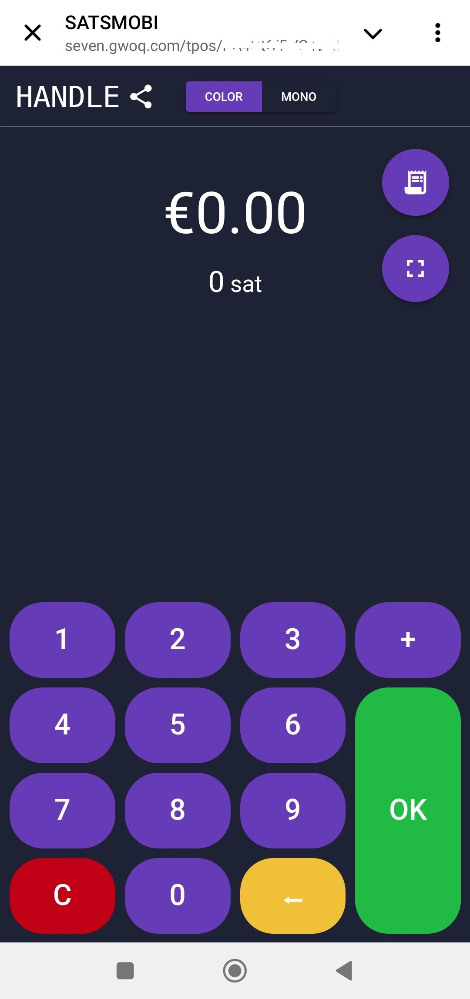

# Características adicionales

Hay otras funciones que complementan la oferta de Wallet Sats.Mobi, que, como hemos visto, amplía el concepto de Wallet más allá de las operaciones de recepción y envío de pagos:

- _/nostr_: para conectar Wallet a su usuario Nostr para recibir zaps;
- _/cashback_: muestra un código que puede mostrar a un comerciante para obtener cashback en un gasto;
- _/buy_: inicia un asistente dentro del bot, que permite comprar Sats por euros:
- _/activatecard_: para solicitar la activación de una tarjeta de débito NFC, que puede recargarse a través de la Wallet Sats.Mobi y para la que pueden activarse notificaciones;
- _/link_: crea un enlace para tu propio Wallet Zeus o Wallet Azul, que puedes utilizar como mandos a distancia de este Wallet.

# Conclusión

Sats.Mobi es un Wallet agradable y divertido de usar, que recupera las experiencias vividas con LNTipBot utilizando las funciones más avanzadas de LNBits. Sin embargo, es importante recordar que **es un servicio de custodia**. Por lo tanto, debe utilizarse para custodiar muy pocos Satss; no es un principal Wallet para sus propios fondos Lightning Network. También existe un límite de capacidad inherente de 500.000 Satss, límite que no se recomienda sobrepasar.

Si busca Wallet Lightning Network no custodiada, sin duda debe buscar otros productos.

---
### Documentación

- [Github](https://github.com/massmux/SatsMobiBot)
- Lista de reproducción de demostraciones [vídeo](https://www.youtube.com/results?search_query=Sats.mobi)