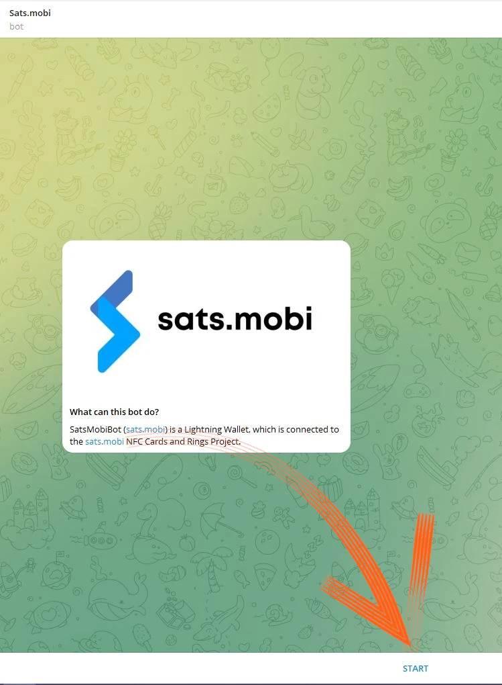
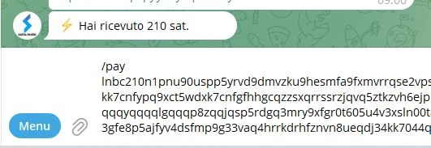

_Selle õpetuse on kirjutanud_ [Bitcoin Campus](https://linktr.ee/bitcoincampus_)

# Sats.Mobi

SatsMobi on Telegramil töötav Wallet, millel on kõik Wallet Lightning Network (custodial) funktsioonid ja mis pakub lisaks sellele mitmeid väga lõbusaid funktsioone. See pärineb Fork LightningTipBotist, mis on nüüdseks lõpetatud, pärib kõik selle funktsioonid, lisades samal ajal uuemaid funktsioone, muutes selle kaasaegsemaks. LNTipBotist Sats.Mobi jälgib samuti avatud lähtekoodiga filosoofiat. Wallet saab tegelikult ise konfigureerida ja hallata, kloonides seda sellest [repositooriumist](https://github.com/massmux/SatsMobiBot).

Kui te aga eelistate seda lihtsal viisil kasutada, alustage lihtsalt Telegramis vestlust ja te leiate, et tegemist on botiga.

# Seaded

Otsige Telegrami otsinguribalt "satsmobi" ja ilmub link [bot](@SatsMobiBot).

**Ohutus**: Kui te ei ole kindel, et otsing toimub Telegrami kaudu, pääsete botile turvaliselt ligi, kasutades järgmist [linki](https://t.me/SatsMobiBot)

Selle käivitamiseks on vaja vaid vajutada _START_

Wallet uurimiseks võite valida vasakus alumises nurgas _Menu_.

Valige nüüd peamiste käskude hulgast _/help_.

Sats.Mobi tervitab meid sõnumiga, milles on loetletud kõik peamised funktsioonid. Käivitamisel on bott loonud ka LN Address, mis on seotud Telegramis valitud käepidemega (mis on vaikimisi unikaalne). Selle Wallet-ga Sats saatmise ja vastuvõtmise käsud on nähtavad, samuti muud funktsioonid, mida näeme hiljem. Huvitav on kohe vaadata ka _/täiendatud_ menüüd

See hüppab välja, et Sats.Mobi on loonud ka anonüümse LN Address, mida saab kasutada privaatsuse saavutamiseks. Bot töötab käskudega: klõpsake lihtsalt vastaval sõnal või kirjutage sõnumiribale kaldkriips "/", millele järgneb käsk, mida soovite lasta täita. Isegi kui Wallet on äsja loodud, valige näiteks _/transactions_

See käsk näitab viimaste tehingute nimekirja, antud juhul null.

# Sats vastuvõtmine

Invoice loomise ja Sats vastuvõtmise käsk on _/invoice_. Sats.Mobi põhjendab ainult Satoshi, mis on Bitconi väikseim ühik; seega tuleb Invoice loomiseks kirjutada sõnumiribale summa Sats-s ja hiljem saata see botiga vestluses.

Järgmise näite puhul valiti saadud summaks 210 Sats.

Pärast mõne hetke ootamist, kuni Invoice on valmis, on viimane saadaval tekstina ja QR-koodina. Tasudes Invoice, näitab Wallet saldot. Kui summa on mingil põhjusel aegunud, kirjutage _/saldo_ ja vajutage klahvi `send`.

# Saada Sats

Kuigi Satss on hindamatu väärtus, millest ei tohiks pealiskaudselt osa saada, teeb Sats.Mobi selle osa ahvatlevaks, mõne lühikese testi tegemine (st paar katsetehingut) ei ole probleemiks.

## Invoice maksmine

Kõige lihtsam viis Invoice-i maksmiseks on kopeerida sõnumitähis `lnbc1xxxxx` ja kleepida see pärast käsu _/pay_ sisestamist sõnumiribale. **Korrektne süntaks** hõlmab tühiku jätmist käsu järele.

Wallet saadab sõnumi, milles palub kinnitust. Vajutades nupule _Pay_ on Invoice tasutud.

Sats.Mobi võib tugineda tõhusale ja hästi ühendatud Lightning-sõlmele, harva maksed ebaõnnestuvad, sest ta leiab alati õige marsruutimise.

## Maksa mugavalt mobiiltelefoni kaudu

Telegrami poole pöördudes on Sats.Mobi saadaval ka mobiilis. Kõige mugavam funktsioon mobiilimaksete tegemiseks on QR-koodi raamimine, kuid sellel Wallet-l puudub see juba oma olemuselt, kuna see ei ole eraldiseisev rakendus, vaid sisaldub sotsiaalses. Sats.Mobi on seetõttu programmeeritud nii, et teha mobiilimaksmine võimalikult lihtsaks: see suudab tegelikult dekodeerida pilti, näiteks fotot, mis on tehtud selle Invoice QR-koodist, mille eest soovite maksta.

Oletame näiteks, et me tahame maksta Invoice 50 Sats.

Kui seda meile näidatakse, saame teha pildi vastavast QR-koodist.

Seejärel avame mobiiltelefonis Telegrami ja kinnitame Sats.Mobiga peetud vestluses äsja tehtud foto QR-koodile

Kui see on valitud, saadame selle botile:

Sats.Mobi dekodeerib foto ja **esitab maksetaotluse** kohe koos õige kirjeldusega. Vestluskeskkonnas küsitakse kinnitust, jätkamiseks tuleb vajutada _/maksa_

Ootame mõne hetke, et makse oleks võimalik töödelda.

Invoice poolt 50 Sats maksti, tulemus, mis saavutati ilma kaamera ja selle sisseehitatud skaneerimisfunktsiooni kasutamiseta.

## Sats.Mobi telegrammi gruppides

LNTipBoti kuulsaks teinud funktsioonidest, mille Sats.Mobi toob Telegrami tagasi, on see, mis muudab grupi liikmete kogemuse lõbusaks ja interaktiivseks.

Omanikud saavad boti kutsuda grupivestlusega liituma ja seejärel määrata Sats.Mobi administraatoriks. Sealt edasi algab lõbu, sest liikmed saavad hakata teisi kasutajaid nende panuse eest grupis premeerima.

- _/tip_ lisab vihje, vastates sõnumile;
- _/send_ saadab raha, määrates saajaks LN Address või Telegrami käepideme;
- _/faucet_ (menüüs _/täiendatud_) võimaldab teil luua vihjeid, mida kiiremad grupi liikmed saavad koguda, klõpsates _/collect_;
- _/tipjar_ (menüüs _/täiendatud_) loob teise tüüpi jaotuse, mida saab saata grupi kasutajatele.

Igal neist käskudest on oma süntaks, mida on selgitatud käskude peamenüüs.

Mis siis, kui me ei ole grupi omanik? Pole probleemi: palu lihtsalt asutajal kutsuda Sats.Mobi, lisa ta sama grupi administraatoriks ja oledki valmis!

# Müügipunkt (POS)

Sats.Mobi esmakordsel käivitamisel loob bot kasutajale ka teise funktsiooni: **POS**. "Seadme" aktiveerib kasutaja käsuga _/pos_ või klõpsates paremas alumises nurgas asuva konsooli vastavat nuppu. Tegelikult on POS veebirakendus, mis avaneb Telegrami vestluses hüpikakna

Interface kannab Telegrami isiklikku käepidet vasakus ülanurgas ja seda kasutatakse lihtsalt nii, nagu kasutatakse kõiki POS-kassasid: sisestades summa klahvistikul. Oletame nüüd, et tahame koguda 21 senti teenuse eest. Teades, et Sats.Mobi käsitleb algselt ainult Satss, ei ole lihtne ümberarvestust peas teha. Selle asemel kuvab kassas arvestusühikuna eurot, näidates samal ajal Satoshi vasteühikut.

Vajutades nupule _/OK_ ilmub Invoice, mida saab näidata kliendile QR-koodi kaudu või mida saab saata stringina kiirsõnumite kaudu, et selle eest saaks tasuda

Loomulikult on kassasüsteem kättesaadav ka mobiiltelefonil, kui helistada sellele samamoodi, nagu eespool näidatud.

Samuti on see hästi vaadatav mobiiltelefoni ekraanilt:

# Lisafunktsioonid

Wallet Sats.Mobi pakkumist täiendavad ka muud funktsioonid, mis, nagu me nägime, laiendavad Wallet kontseptsiooni kaugemale maksete vastuvõtmise ja saatmise toimingutest:

- _/nostr_: Wallet ühendamine kasutaja Nostriga, et saada zap'e;
- _/cashback_: näitab koodi, mida saate näidata kaupmehele, et saada raha tagasi;
- _/buy_: käivitab boti sees võluri, mis võimaldab teil osta Sats eurode eest:
- _/activatecard_: NFC deebetkaardi aktiveerimise taotlemiseks, mida saab laadida Wallet Sats.Mobi kaudu ja mille jaoks saab aktiveerida teateid;
- _/link_: loob lingi oma Wallet Zeus või Blue Wallet jaoks, mida saate kasutada selle Wallet kaugjuhtimispuldina.

# Kokkuvõte

Sats.Mobi on Wallet, mida on meeldiv ja lõbus kasutada, tuues tagasi LNTipBotiga saadud kogemused, kasutades LNBits'i täiustatud funktsioone. Siiski on oluline meeles pidada, et **see on hooldusteenus**. Seetõttu on see mõeldud väga väheste Satsside hoidmiseks; see ei ole Wallet printsipaal oma Lightning Network vahendite jaoks. Samuti on olemas 500 000 Satssi piirang, mida ei soovitata ületada.

Kui otsite Wallet Lightning Network mittekohustuslikku, peaksite kindlasti vaatama teisi tooteid.

---
### Dokumentatsioon

- [Github](https://github.com/massmux/SatsMobiBot)
- [video](https://www.youtube.com/results?search_query=Sats.mobi) demode esitusloetelu