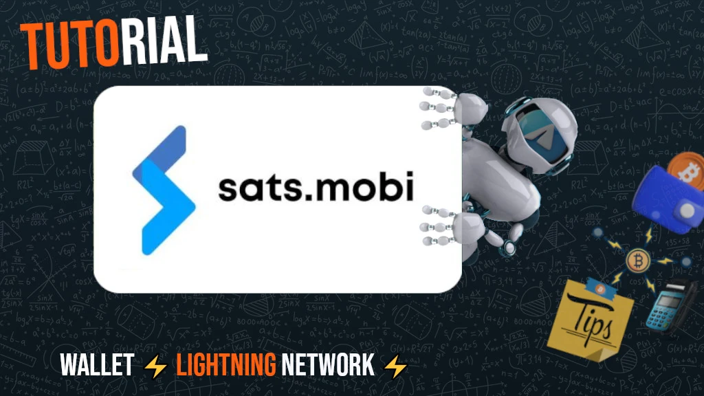
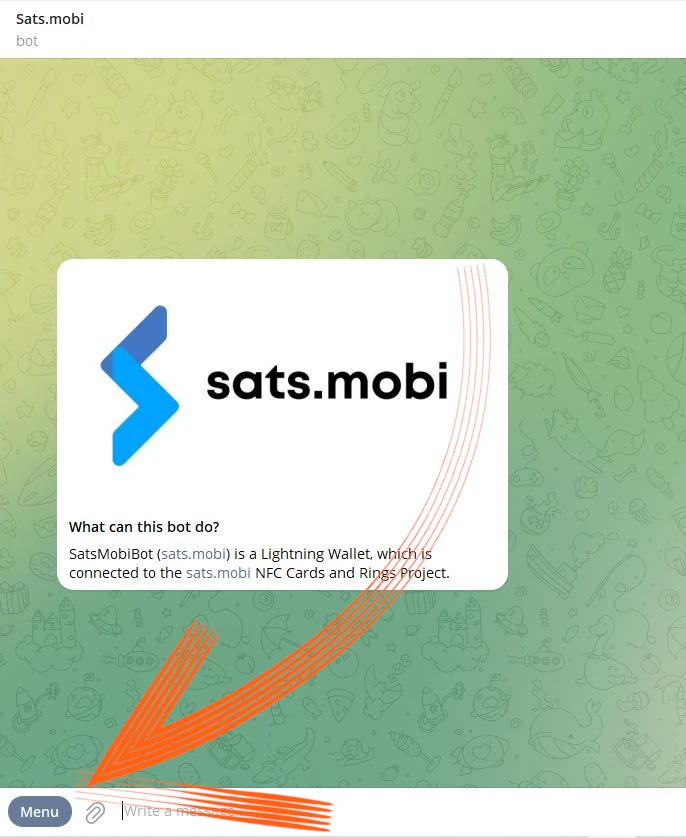

ce tutoriel a été rédigé par_ [Bitcoin Campus] (https://linktr.ee/bitcoincampus_)

# Sats.Mobi

SatsMobi est un Wallet fonctionnant sur Telegram, qui a toutes les fonctions d'un Wallet Lightning Network (custodial) et offre, en plus, un certain nombre de fonctionnalités très amusantes. Il est issu d'un Fork de LightningTipBot, aujourd'hui abandonné, dont il hérite de toutes les fonctionnalités tout en y ajoutant des fonctionnalités plus actuelles, ce qui le rend plus moderne. De LNTipBot, Sats.Mobi reprend également la philosophie open source. Le Wallet peut, en fait, être configuré et géré seul en le clonant à partir de ce [dépôt] (https://github.com/massmux/SatsMobiBot).

Si, en revanche, vous préférez l'utiliser de manière simple, il vous suffit de lancer une discussion sur Telegram et vous verrez qu'il s'agit d'un bot.

# Paramètres

Dans la barre de recherche de Telegram, cherchez "satsmobi" et le lien vers le [bot] (@SatsMobiBot) apparaîtra.

**Attention** : Si vous n'êtes pas sûr de pouvoir effectuer une recherche via Telegram, accédez au bot de manière sécurisée en utilisant le [lien] suivant (https://t.me/SatsMobiBot)

Il suffit d'appuyer sur _START_ pour le démarrer

Pour explorer Wallet, vous pouvez sélectionner _Menu_ dans le coin inférieur gauche.

Choisissez maintenant _/help_ parmi les commandes principales.

Sats.Mobi nous accueille en affichant un message, énumérant toutes les principales caractéristiques. Au démarrage, le bot a également créé un LN Address, lié à l'identifiant choisi sur Telegram (qui est unique par défaut). Les commandes pour envoyer et recevoir des Sats avec ce Wallet sont visibles, ainsi que d'autres fonctions que nous verrons plus tard. Il est également intéressant de jeter un coup d'œil au menu _/avancé_ tout de suite

Il s'avère que Sats.Mobi a également créé un LN Address anonyme, qui peut être utilisé pour gagner en confidentialité. Le bot fonctionne avec des commandes : il suffit de cliquer sur le mot correspondant ou de taper la barre oblique "/" dans la barre de message, suivie de la commande que vous voulez faire exécuter. Même si Wallet vient d'être créé, choisissez, par exemple, _/transactions_

Cette commande affiche la liste des dernières transactions, en l'occurrence zéro.

# Réception Sats

La commande pour créer une Invoice et recevoir une Sats est _/invoice_. Sats.Mobi raisonne exclusivement en Satoshi, la plus petite unité de Bitcon ; par conséquent, pour créer la Invoice, il est nécessaire d'écrire le montant en Sats dans la barre de message et de l'envoyer ensuite dans le chat avec le bot.

Dans l'exemple suivant, un montant de 210 Sats a été choisi pour être reçu.

Après quelques instants d'attente pour la préparation de la Invoice, cette dernière est disponible sous forme de texte et de code QR. En payant la Invoice, la Wallet affiche le solde. Si, pour une raison quelconque, le total n'est pas à jour, écrivez _/balance_ et appuyez sur la touche `send`.

# Envoyer Sats

Bien que les Sats soient un atout inestimable dont on ne devrait pas se séparer superficiellement, Sats.Mobi rend cette partie attrayante, la réalisation de quelques tests courts (c'est-à-dire quelques transactions de test) ne posera pas de problème.

## Payer une Invoice

La façon la plus simple de payer un Invoice est de copier la chaîne de messages `lnbc1xxxxx` et de la coller dans la barre de messages après avoir tapé la commande _/pay_. **La syntaxe correcte** consiste à laisser un espace après la commande.

Wallet envoie un message demandant une confirmation. En cliquant sur _Pay_, la Invoice est payée.

Sats.Mobi peut s'appuyer sur un nœud Lightning efficace et bien connecté, les paiements échouent rarement car il peut toujours trouver le bon itinéraire.

## Payer facilement à partir d'un téléphone portable

En ce qui concerne Telegram, Sats.Mobi est également disponible sur mobile. La fonction la plus pratique pour le paiement mobile est de cadrer un code QR, mais ce Wallet en est dépourvu de par sa conception, puisqu'il ne s'agit pas d'une application autonome mais qu'elle est contenue dans une application sociale. Sats.Mobi est donc programmé pour rendre l'expérience mobile aussi simple que possible : il peut en fait décoder une image, par exemple une photo prise du code QR du Invoice que vous voulez payer.

Supposons, par exemple, que nous voulions payer une Invoice de 50 Sats.

Lorsque cela nous est montré, nous pouvons prendre une photo du code QR correspondant.

Nous ouvrons ensuite Telegram sur le téléphone portable et, dans le chat avec Sats.Mobi, nous joignons la photo que nous venons de prendre au code QR

Une fois sélectionné, nous l'envoyons au robot :

Sats.Mobi décode la photo et **présente la demande de paiement** immédiatement, avec la description correcte. Le chat demande une confirmation, pour continuer il faut appuyer sur _/pay_

Nous attendons quelques instants pour permettre le traitement du paiement.

Invoice par 50 Sats a été payé, un résultat obtenu sans l'utilisation d'un appareil photo et de sa fonction de balayage intégrée.

## Sats.Mobi dans Groupes Telegram

Parmi les fonctionnalités qui ont rendu LNTipBot célèbre et que Sats.Mobi ramène à Telegram, il y a celle qui rend l'expérience des membres d'un groupe amusante et interactive.

Les propriétaires peuvent inviter le robot à se joindre au groupe de discussion, puis nommer Sats.Mobi comme administrateur. À partir de là, le plaisir commence, car les membres peuvent commencer à récompenser d'autres utilisateurs pour leurs contributions dans le groupe.

- _/tip_ ajoute un pourboire en répondant à un message ;
- envoyer_ envoie des fonds en spécifiant comme destinataire une poignée LN Address ou Telegram ;
- _/faucet_ (dans le menu _/avancé_) vous permet de créer un ensemble de pourboires que les membres du groupe les plus rapides peuvent collecter en cliquant sur _/collect_ ;
- l'option _/tipjar_ (dans le menu _/avancé_) permet de créer un autre type de distribution qui peut être envoyé aux utilisateurs du groupe.

Chacune de ces commandes a sa propre syntaxe, qui est expliquée dans le menu principal des commandes.

Et si nous ne sommes pas propriétaire d'un groupe ? Pas de problème : il suffit de demander au fondateur d'inviter Sats.Mobi, de l'ajouter en tant qu'administrateur du groupe, et le tour est joué !

# Point de vente (POS)

Lorsque Sats.Mobi est lancé pour la première fois, le robot crée également une autre fonction pour l'utilisateur : **le POS**. Le "dispositif" est activé par l'utilisateur avec la commande _/pos_ ou en cliquant sur le bouton approprié de la console dans le coin inférieur droit. En fait, le POS est une application web qui s'ouvre sous forme de pop-up sur le chat Telegram

La Interface porte la poignée personnelle de Telegram dans le coin supérieur gauche et s'utilise simplement comme tous les TPV : en tapant le montant sur le clavier. Supposons maintenant que nous voulions collecter 21 cents pour un service. Sachant que Sats.Mobi ne gère nativement que les Sats, il n'est pas facile de faire la conversion dans sa tête. Au lieu de cela, le point de vente affiche l'euro comme unité de compte tout en montrant l'équivalent en Satoshi.

En cliquant sur _/OK_, on fait apparaître le Invoice qui peut être montré au client via un code QR, ou qui peut être envoyé sous forme de chaîne via la messagerie instantanée, afin qu'il puisse être payé

Bien entendu, le TPV est également disponible sur un téléphone portable en l'appelant de la même manière qu'indiqué ci-dessus.

Il est également bien visible sur l'écran d'un téléphone portable :

# Caractéristiques supplémentaires

D'autres caractéristiques complètent l'offre Wallet Sats.Mobi qui, comme nous l'avons vu, étend le concept Wallet au-delà des opérations de réception et d'envoi de paiements :

- _/nostr_ : pour connecter Wallet à son utilisateur Nostr afin de recevoir des zaps ;
- _/cashback_ : indique un code que vous pouvez présenter à un commerçant pour obtenir une remise en argent sur une dépense ;
- buy_ : lance un assistant dans le bot, qui vous permet d'acheter des Sats pour des euros :
- activatecard_ : pour demander l'activation d'une carte de débit NFC, qui peut être rechargée via le Wallet Sats.Mobi et pour laquelle des notifications peuvent être activées ;
- _/link_ : crée un lien vers votre propre Wallet Zeus ou Blue Wallet, que vous pouvez utiliser comme télécommande de cette Wallet.

# Conclusion

Sats.Mobi est un Wallet agréable et amusant à utiliser, qui permet de retrouver les expériences faites avec LNTipBot en utilisant les fonctionnalités plus avancées de LNBits. Cependant, il est important de se rappeler qu'il s'agit d'un **service de garde**. Il ne s'agit pas d'un Wallet principal pour ses propres fonds Lightning Network. Il existe également une limite de capacité inhérente de 500 000 Sats, limite qu'il n'est pas recommandé de dépasser.

Si vous recherchez Wallet Lightning Network non custodial, vous devriez certainement vous tourner vers d'autres produits.

---
### Documentation

- [Github] (https://github.com/massmux/SatsMobiBot)
- Liste de démos [video](https://www.youtube.com/results?search_query=Sats.mobi)