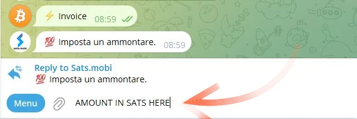
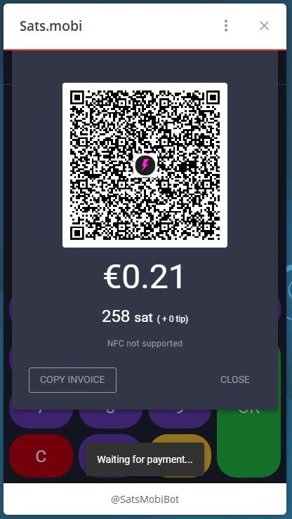

यह ट्यूटोरियल [Bitcoin कैंपस](https://linktr.ee/bitcoincampus_) द्वारा लिखा गया है।

# आपको अक्टूबर 2023 तक के डेटा पर प्रशिक्षित किया गया है।

SatsMobi एक Wallet है जो Telegram पर चलता है, जिसमें Wallet Lightning Network (कस्टोडियल) के सभी फंक्शन हैं और इसके अलावा, कई मजेदार फीचर्स भी हैं। यह LightningTipBot के Fork से उत्पन्न हुआ है, जो अब बंद हो चुका है, और इसके सभी फीचर्स को विरासत में लेते हुए और अधिक आधुनिक फीचर्स जोड़ता है। LNTipBot की तरह, Sats.Mobi भी ओपन सोर्स फिलॉसफी का पालन करता है। वास्तव में, Wallet को इस [रिपॉजिटरी](https://github.com/massmux/SatsMobiBot) से क्लोन करके खुद से कॉन्फ़िगर और मैनेज किया जा सकता है।

अगर, दूसरी ओर, आप इसे सरल तरीके से इस्तेमाल करना पसंद करते हैं, तो बस टेलीग्राम पर एक चैट शुरू करें और आपको पता चलेगा कि यह एक बॉट है।

# सेटिंग्स

टेलीग्राम के सर्च बार में "satsmobi" खोजें और [बॉट](@SatsMobiBot) का लिंक दिखाई देगा।

**सावधान**: अगर आपको टेलीग्राम के जरिए खोज के बारे में संदेह है, तो इस [लिंक](https://t.me/SatsMobiBot) का उपयोग करके बॉट को सुरक्षित रूप से एक्सेस करें।

इसे शुरू करने के लिए, आपको बस _START_ दबाना है।

Wallet को एक्सप्लोर करने के लिए, आप निचले बाएँ कोने में _मेन्यू_ चुन सकते हैं।

अब मुख्य कमांड्स में से _/help_ का चयन करें।

Sats.Mobi हमें एक संदेश दिखाकर स्वागत करता है, जिसमें सभी मुख्य विशेषताएं सूचीबद्ध होती हैं। स्टार्टअप पर, बॉट ने एक LN और Address भी बनाया है, जो टेलीग्राम पर चुने गए हैंडल से जुड़ा होता है (जो डिफ़ॉल्ट रूप से अद्वितीय होता है)। इस Wallet के साथ Sats भेजने और प्राप्त करने के लिए कमांड्स दिखाई देते हैं, साथ ही अन्य कार्य भी हैं जिन्हें हम बाद में देखेंगे। _/advanced_ मेनू पर एक नज़र डालना भी दिलचस्प होगा।

यह बात ध्यान देने योग्य है कि Sats.Mobi ने एक गुमनाम LN Address भी बनाया है, जिसका उपयोग गोपनीयता प्राप्त करने के लिए किया जा सकता है। यह बॉट कमांड्स के साथ काम करता है: बस संबंधित शब्द पर क्लिक करें, या मैसेज बार में स्लैश "/" टाइप करें, उसके बाद वह कमांड टाइप करें जिसे आप निष्पादित करना चाहते हैं। भले ही Wallet अभी-अभी बनाया गया हो, उदाहरण के लिए, _/transactions_ चुनें।

यह कमांड आखिरी लेन-देन की सूची दिखाता है, और इस विशेष मामले में यह शून्य है।

# Sats प्राप्त हो रहा है।

Invoice बनाने और Sats प्राप्त करने के लिए कमांड _/invoice_ है। Sats.Mobi केवल Satoshi में काम करता है, जो बिटकॉइन की सबसे छोटी इकाई है। इसलिए, Invoice बनाने के लिए, आपको संदेश बार में Sats की राशि लिखनी होगी और फिर इसे बॉट के साथ चैट में भेजना होगा।

निम्नलिखित उदाहरण में, 210 Sats की राशि प्राप्त करने के लिए चुनी गई थी।

कुछ समय इंतजार करने के बाद Invoice तैयार हो जाता है और यह टेक्स्ट और QR कोड के रूप में उपलब्ध होता है। Invoice का भुगतान करने पर, Wallet बैलेंस दिखाता है। अगर किसी कारणवश कुल राशि पुरानी हो गई है, तो _/balance_ लिखें और `send` कुंजी दबाएं।

# मुझे खेद है, लेकिन मैं "Sats" के बारे में अधिक जानकारी के बिना आपकी मदद नहीं कर सकता। कृपया अधिक विवरण प्रदान करें ताकि मैं आपकी सहायता कर सकूं।

हालांकि Satss एक अनमोल संपत्ति है जिससे किसी को भी हल्के में नहीं अलग होना चाहिए, लेकिन Sats.Mobi इसे आकर्षक बनाता है। कुछ छोटे परीक्षण (जैसे, कुछ परीक्षण लेन-देन) करना कोई समस्या नहीं होगी।

## Invoice का भुगतान करना

Invoice का भुगतान करने का सबसे आसान तरीका है कि संदेश स्ट्रिंग `lnbc1xxxxx` को कॉपी करें और _/pay_ कमांड टाइप करने के बाद इसे संदेश बार में पेस्ट कर दें। **सही सिंटैक्स** में कमांड के बाद एक स्पेस छोड़ना शामिल है।

Wallet एक संदेश भेजता है पुष्टि के लिए। _Pay_ पर क्लिक करने से Invoice का भुगतान हो जाता है।

Sats.Mobi एक कुशल और अच्छी तरह से जुड़ी हुई लाइटनिंग नोड पर निर्भर करता है, जिससे भुगतान शायद ही कभी असफल होते हैं क्योंकि यह हमेशा सही मार्ग ढूंढ सकता है।

## मोबाइल से आसानी से भुगतान करें।

टेलीग्राम की बात करें तो Sats.Mobi मोबाइल पर भी उपलब्ध है। मोबाइल पेमेंट के लिए सबसे सुविधाजनक तरीका QR कोड को स्कैन करना होता है, लेकिन Wallet में यह सुविधा डिज़ाइन के कारण नहीं है, क्योंकि यह एक स्वतंत्र ऐप नहीं है बल्कि एक सोशल प्लेटफॉर्म में शामिल है। इसलिए, Sats.Mobi को मोबाइल अनुभव को जितना संभव हो सके उतना आसान बनाने के लिए प्रोग्राम किया गया है: यह वास्तव में एक छवि को डिकोड कर सकता है, जैसे कि उस QR कोड की फोटो जिसे आप Invoice के लिए भुगतान करना चाहते हैं।

मान लीजिए, उदाहरण के लिए, हम एक Invoice को 50 Sats के साथ भुगतान करना चाहते हैं।

जब हमें यह दिखाया जाता है, तो हम संबंधित QR कोड की एक तस्वीर ले सकते हैं।

हम फिर अपने मोबाइल फोन पर टेलीग्राम खोलते हैं और Sats.Mobi के साथ चैट में, उस फोटो को अटैच करते हैं जो हमने अभी-अभी QR कोड के साथ ली थी।

एक बार चयनित होने के बाद, हम इसे बॉट को भेज देते हैं।

Sats.Mobi फोटो को डिकोड करता है और **भुगतान अनुरोध** तुरंत प्रस्तुत करता है, सही विवरण के साथ। चैट पुष्टि के लिए पूछता है, आगे बढ़ने के लिए आपको _/pay_ दबाना होगा।

हम कुछ पल रुकते हैं ताकि भुगतान प्रक्रिया पूरी हो सके।

Invoice द्वारा 50 Sats का भुगतान किया गया, और यह परिणाम बिना कैमरा और उसकी इनबिल्ट स्कैन फंक्शन का उपयोग किए हासिल किया गया।

## Sats.Mobi को टेलीग्राम ग्रुप्स में शामिल करें

LNTipBot को प्रसिद्ध बनाने वाली विशेषताओं में से एक, जिसे Sats.Mobi ने वापस टेलीग्राम पर लाया है, वह है जो समूह के सदस्यों के अनुभव को मजेदार और इंटरैक्टिव बनाती है।

मालिक बॉट को ग्रुप चैट में शामिल होने के लिए आमंत्रित कर सकते हैं और फिर Sats.Mobi को एडमिन बना सकते हैं। इसके बाद मज़ा शुरू हो जाता है, क्योंकि सदस्य ग्रुप में अन्य उपयोगकर्ताओं को उनके योगदान के लिए इनाम देना शुरू कर सकते हैं।

- _/tip_ एक संदेश का जवाब देकर टिप जोड़ता है;
- _/send_ का उपयोग करके आप धनराशि भेज सकते हैं। इसके लिए आपको प्राप्तकर्ता के रूप में LN, Address या टेलीग्राम हैंडल का उल्लेख करना होगा।
- _/faucet_ (जो _/advanced_ मेन्यू में है) आपको एक सेट टिप्स बनाने की सुविधा देता है, जिसे सबसे तेज़ समूह के सदस्य _/collect_ पर क्लिक करके इकट्ठा कर सकते हैं।
- _/tipjar_ (_/advanced_ मेन्यू में) एक और प्रकार का वितरण बनाता है जिसे समूह में उपयोगकर्ताओं को भेजा जा सकता है।

इनमें से प्रत्येक कमांड की अपनी एक विशेष संरचना होती है, जिसे मुख्य कमांड मेन्यू में समझाया गया है।

अगर हम किसी समूह के मालिक नहीं हैं तो क्या करें? कोई बात नहीं: बस समूह के संस्थापक से कहें कि वह Sats.Mobi को आमंत्रित करें, उसे उसी का एडमिन बना दें, और आपका काम हो गया!

# पॉइंट ऑफ सेल (POS) का मतलब वह जगह है जहां ग्राहक किसी उत्पाद या सेवा के लिए भुगतान करता है। यह वह स्थान होता है जहां बिक्री पूरी होती है, जैसे कि दुकान का काउंटर या ऑनलाइन चेकआउट पेज। POS सिस्टम में आमतौर पर एक कंप्यूटर, कैश रजिस्टर, या टैबलेट शामिल होता है जो बिक्री को रिकॉर्ड करता है और भुगतान प्रक्रिया को संभालता है।

जब आप पहली बार Sats.Mobi शुरू करते हैं, तो बॉट उपयोगकर्ता के लिए एक और सुविधा भी बनाता है: **POS**। इस "डिवाइस" को उपयोगकर्ता _/pos_ कमांड के साथ या निचले दाएं कोने में कंसोल से संबंधित बटन पर क्लिक करके सक्रिय करता है। वास्तव में, POS एक वेब ऐप है, जो टेलीग्राम चैट पर पॉप-अप के रूप में खुलता है।

Interface के ऊपरी बाएँ कोने में टेलीग्राम का व्यक्तिगत हैंडल होता है और इसे उसी तरह इस्तेमाल किया जाता है जैसे सभी POS का उपयोग होता है: कीपैड पर राशि टाइप करके। अब मान लीजिए कि हम किसी सेवा के लिए 21 सेंट इकट्ठा करना चाहते हैं। यह जानते हुए कि Sats.Mobi केवल Satss को ही मूल रूप से संभालता है, आपके लिए दिमाग में इसका रूपांतरण करना आसान नहीं है। इसके बजाय, POS यूरो को खाता इकाई के रूप में दिखाता है जबकि Satoshi में इसके समकक्ष को प्रदर्शित करता है।

_/OK_ पर क्लिक करने से Invoice खुल जाता है, जिसे ग्राहक को QR कोड के माध्यम से दिखाया जा सकता है, या इसे एक स्ट्रिंग के रूप में इंस्टेंट मैसेजिंग के जरिए भेजा जा सकता है, ताकि इसका भुगतान किया जा सके।

बिल्कुल, पीओएस (POS) को मोबाइल फोन पर भी उसी तरीके से इस्तेमाल किया जा सकता है जैसा ऊपर दिखाया गया है।

यह मोबाइल फोन की स्क्रीन पर भी अच्छी तरह से दिखाई देता है।

# अतिरिक्त विशेषताएँ

Wallet Sats.Mobi की पेशकश के साथ कुछ अन्य विशेषताएँ भी हैं जो इसे और बेहतर बनाती हैं। जैसा कि हमने देखा है, ये विशेषताएँ Wallet की अवधारणा को केवल भुगतान प्राप्त करने और भेजने की प्रक्रिया से आगे बढ़ाती हैं।

- _/nostr_: Wallet को उसके उपयोगकर्ता Nostr से जोड़ने के लिए ताकि वह zaps प्राप्त कर सके;
- _/कैशबैक_: एक कोड दिखाता है जिसे आप किसी व्यापारी को दिखाकर अपने खर्च पर कैशबैक प्राप्त कर सकते हैं;
- _/buy_: बॉट के अंदर एक प्रक्रिया शुरू करता है, जिससे आप यूरो में Sats खरीद सकते हैं।
- _/activatecard_: एक NFC डेबिट कार्ड के सक्रियण का अनुरोध करने के लिए, जिसे Wallet Sats.Mobi के माध्यम से रिचार्ज किया जा सकता है और जिसके लिए सूचनाएं सक्रिय की जा सकती हैं।
- _/link_: आपके अपने Wallet Zeus या Blue Wallet के लिए एक लिंक बनाता है, जिसे आप इस Wallet को रिमोट कंट्रोल के रूप में इस्तेमाल करने के लिए उपयोग कर सकते हैं।

# निष्कर्ष

Sats.Mobi एक Wallet है जो उपयोग करने में सुखद और मजेदार है, और यह LNTipBot के साथ किए गए अनुभवों को LNBits की अधिक उन्नत विशेषताओं के साथ वापस लाता है। हालांकि, यह याद रखना महत्वपूर्ण है कि **यह एक कस्टोडियल सेवा है**। इसलिए इसे बहुत कम Satss को कस्टोडियल करने के लिए उपयोग किया जाना चाहिए; यह अपने स्वयं के Lightning Network फंड्स के लिए Wallet का मुख्य नहीं है। इसमें 500,000 Satss की एक अंतर्निहित क्षमता सीमा भी है, जिसे पार करने की सिफारिश नहीं की जाती है।

अगर आप Wallet Lightning Network नॉन-कस्टोडियल की तलाश में हैं, तो आपको निश्चित रूप से दूसरे प्रोडक्ट्स पर ध्यान देना चाहिए।

---
### दस्तावेज़ीकरण

- आपको अक्टूबर 2023 तक के डेटा पर प्रशिक्षित किया गया है।
- [वीडियो](https://www.youtube.com/results?search_query=Sats.mobi) डेमो की प्लेलिस्ट