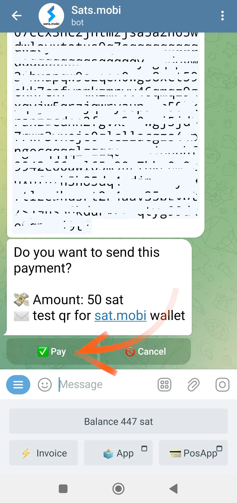

_Questo tutorial è stato scritto da_ [Bitcoin Campus](https://linktr.ee/bitcoincampus_)

# Sats.Mobi
SatsMobi è un wallet che gira su Telegram, che ha tutte le funzioni di un wallet Lightning Network (custodial) e che offre, in più, una serie di funzionalità molto divertenti. Nasce da un fork di LightningTipBot, ormai discontinuo, ne eredita tutte le caratteristiche aggiungendone altre più attuali, risultando così più moderno. Di LNTipBot, Sats.Mobi ricalca anche la filosofia open source. Il wallet può essere, infatti, configurato e gestito in proprio clonandolo da questo [repository](https://github.com/massmux/SatsMobiBot).

Se invece si preferisce utilizzarlo in maniera semplice, è sufficiente avviare una chat su Telegram, per scoprire che è un bot.

# Impostazioni
Dalla barra di ricerca di Telegram, cercare "satsmobi" e comparirà il link al [bot](@SatsMobiBot).

**Attenzione**: se non sei sicuro della ricerca via Telegram, accedi al bot in modo sicuro utilizzando il seguente [link](https://t.me/SatsMobiBot)

Tutto quello che serve per avviarlo, è premere _START_

Per esplorare il wallet è possibile selezionare _Menu_ in basso a sinistra.

Optare ora per _/help_ tra i comandi principali.

Sats.Mobi ci da il benvenuto mostrando un messaggio, in cui sono elencate tutte le principali funzionalità. All'avvio il bot ha anche creato un LN Address, collegato all'handle scelto su Telegram (che è unico per default). Sono visibili i comandi per inviare e ricevere sats con questo wallet, così come altre funzioni che vedremo in seguito. È interessante dare subito un'occhiata anche al menu _/advanced_

Salta all'occhio che Sats.Mobi ha creato anche un LN Address anonimo, da utilizzare per guadagnare privacy. Il bot lavora coi comandi: basta cliccare sulla parola corrispondente, oppure digitare lo slash "/" nella barra del messaggio, seguito dal comando che si desidera fare eseguire. Anche se il wallet è stato appena creato, scegliere ad esempio _/transactions_

Questo comando mostra la lista delle ultime transazioni, in questo particolare caso pari a zero.

# Ricevere sats

Il comando per creare una invoice e ricevere sats è _/invoice_. Sats.Mobi ragiona esclusivamente in satoshi, l'unità più piccola di Bitcon; per poter creare l'invoice è pertanto necessario scrivere l'importo in sats nella barra dei messaggi e, in seguito, inviarlo nella chat col bot.

Nell'esempio che segue, si è scelto di ricevere un importo pari a 210 sats.

Dopo qualche istante di attesa per la preparazione dell'invoice, quest'ultima è disponibile come testo e come QR code. Pagando l'invoice il wallet mostra il saldo. Se per qualche motivo il totale non è aggiornato, scrivere _/balance_ e premere il tasto `invio`.

# Inviare sats

Sebbene i sats siano un bene preziosissimo, da cui non ci si deve separare con superficialità, Sats.Mobi rende questa parte accattivante, eseguire alcuni brevi test (cioè un paio di transazioni di prova) non sarà un problema.

## Pagare un'invoice

Il modo più semplice per pagare una invoice è quella di copiare la stringa di messaggio `lnbc1xxxxx` e incollarla nella barra del messaggio dopo aver digitato il comando _/pay_. **La sintassi corretta** prevede di lasciare uno spazio dopo il comando.

Il wallet manda un messaggio in cui chiede la conferma. Cliccando su _Pay_ l'invoice viene pagata.

Sats.Mobi può contare su un nodo Lightning efficiente e ben connesso, raramente i pagamenti falliscono perché riesce sempre a trovare il routing corretto.

## Pagare comodamente da mobile

Girando su Telegram, Sats.Mobi è disponibile anche su cellulare. La funzione più comoda per pagare con il mobile è inquadrare un QR code, ma questo wallet ne è sprovvisto per design, visto che non è un'app a sé stante ma è contenuto in un social. Sats.Mobi è quindi programmato per facilitare al massimo l'esperienza in mobilità: riesce infatti a decodificare un'immagine, come una fotografia scattata al QR code dell'invoice che si vuole pagare.

Supponiamo, ad esempio, di voler pagare una invoice di 50 sats.

Quando questa ci viene mostrata, possiamo fare la foto al relativo QR code.

Apriamo quindi Telegram sul cellulare e, nella chat con Sats.Mobi, alleghiamo la foto appena scattata al QR code

Una volta selezionata, la inviamo al bot:

Sats.Mobi decodifica la foto e **presenta immediatamente la richiesta di pagamento**, con la descrizione corretta. La chat chiede una conferma, per procedere si deve premere _/pay_

Attendiamo qualche istante per permette il processamento del pagamento.

L'invoice da 50 sats è stata pagata, un risultato ottenuto senza l'utilizzo di una fotocamera e della relativa funzione di scan integrata.

## Sats.Mobi nei gruppi Telegram

Delle funzionalità che hanno reso celebre LNTipBot e che Sats.Mobi riporta su Telegram, c'è quella che rende divertente e interattiva l'esperienza dei membri in un gruppo.
Gli owner possono invitare il bot ad unirsi nella chat di gruppo e poi nominare Sats.Mobi come admin. Da quel momento in poi comincia il bello, perché i membri possono inizare a premiare gli altri utenti per il loro contributo nel gruppo.
- _/tip_ aggiunge una mancia rispondendo ad un messaggio;
- _/send_ invia fondi specificando come destinatario un LN Address o un handle Telegram;
- _/faucet_ (nel menu _/advanced_) permette di creare una serie di mance che i membri più veloci del gruppo possono raccogliere cliccando su _/collect_;
- _/tipjar_ (nel menu _/advanced_) crea un'altro tipo di distribuzione che può essere inviata agli utenti del gruppo.

Ognuno di questi comandi ha la sua sintassi, che è spiegata nel menu dei comandi principali.

E se non siamo owner di un gruppo? Nessun problema: basta chiedere al fondatore di invitare Sats.Mobi, aggiungerlo come admin dello stesso e il gioco è fatto!

# Point of Sale (POS)

Quando si avvia per la prima volta Sats.Mobi, il bot crea per l'utente anche un'altra funzionalità: **il POS**. Il "dispositivo" è attivato dall'utente con il comando _/pos_ oppure cliccando sul relativo pulsante dalla console in basso a destra. Di fatto il POS è una web app, che si apre come pop-up sulla chat di Telegram

L'interfaccia riporta l'handle personale di Telegram in alto a sinistra e si usa semplicemente come si usano tutti i POS: digitando l'importo sul tastierino. Supponiamo ora di voler incassare 21 centesimi di euro per un servizio. Sapendo che Sats.Mobi gestisce nativamente soltanto i sats, non è semplice fare la conversione a mente. Al contrario, il POS visualizza l'euro come unità di conto, mostrando al contempo l'equivalente in satoshi.

Cliccando su _/OK_ compare l'invoice che può essere mostrata al cliente tramite un QR code, oppure che può essere inviata come stringa attraverso messaggistica istantanea, pcosì da essere pagata

Naturalmente il POS è disponibile anche su telefono cellulare, richiamandolo con le stesse modalità mostrate in precedenza.

Esso si presenta ben visualizzabile anche dal display del cellulare:

# Ulteriori funzionalità
Esistono altre funzionalità che completano l'offerta del wallet Sats.Mobi che, come abbiamo visto, espande il concetto di wallet oltre le operazioni di ricezione ed invio pagamenti:
- _/nostr_: per connettere il wallet al proprio user Nostr per ricevere zaps;
- _/cashback_: mostra un codice che si può esibire a un commerciante per ottenere il cashback di una spesa;
- _/buy_: inizia una procedura guidata all'interno del bot, che permette di acquistare sats per euro:
- _/activatecard_: per richiedere l'attivazione di una carta di debito NFC, ricaricabile attraverso il wallet Sats.Mobi e per la quale è possibile attivare le notifiche;
- _/link_: crea un collegamento per il proprio wallet Zeus o Blue Wallet, che si possono usare come telecomandi di questo wallet.

# Conclusione
Sats.Mobi è un wallet piacevole e divertente da usare, che riporta in uso le esperienze fatte con LNTipBot utilizzando le funzioni più avanzate di LNBits. È però importante ricordare che **si tratta di un servizio custodial**. Va pertanto utilizzato per custodire pochissimi sats, non è un wallet principale per i propri fondi Lightning Network. Esiste inoltre un limite intrinseco di capienza, pari a 500.000 sats, limite che è sconsigliato superare.

Se si è alla ricerca di wallet Lightning Network non-custodial, è decisamente opportuno orientarsi su altri prodotti.

---
### Documentazione
- [Github](https://github.com/massmux/SatsMobiBot)
- Playlist di [video](https://www.youtube.com/results?search_query=sats.mobi) demo
