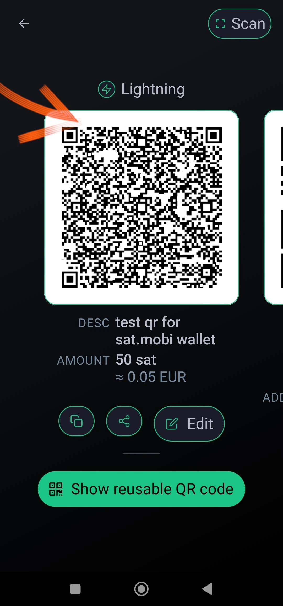
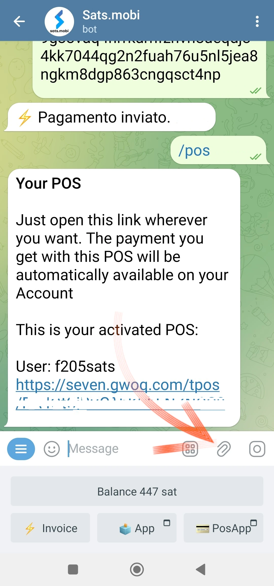

このチュートリアルを書いたのは_ [Bitcoinキャンパス](https://linktr.ee/bitcoincampus_)

# Sats.Mobi

SatsMobiはTelegram上で動作するWalletで、WalletのLightning Network（カストディアン）のすべての機能を持ち、さらに、非常に楽しい機能を数多く提供しています。このWalletは、LightningTipBotのForkに由来しており、現在では製造中止となっていますが、Forkのすべての機能を継承しつつ、最新の機能を追加し、より現代的なものとなっています。LNTipBotのうち、Sats.Mobiもオープンソースの理念を受け継いでいます。Walletは、この[リポジトリ](https://github.com/massmux/SatsMobiBot)からクローンすることで、独自に設定・管理することができます。

一方、シンプルに使いたい場合は、テレグラムでチャットを始めるだけで、ボットであることがわかる。

# 設定

テレグラムの検索バーから「satsmobi」と検索すると、[bot](@SatsMobiBot)へのリンクが表示されます。

**注意**：テレグラムでの検索が不安な場合は、以下の[リンク](https://t.me/SatsMobiBot)を使って安全にボットにアクセスしてください。

スタートボタンを押すだけです。

Walletを探索するには、左下にある_Menu_を選択します。

主要コマンドの中から_/help_を選ぶ。

Sats.Mobiは、すべての主な機能を列挙したメッセージを表示して私たちを歓迎します。起動すると、ボットはLNのAddressを作成し、Telegramで選択したハンドルネーム（デフォルトでは一意である）にリンクしている。このWalletでSatsを送受信するコマンドが表示され、後で見る他の機能もある。すぐに_/advanced_メニューを見てみるのも面白い。

Sats.Mobiは匿名LN Addressも作成しており、プライバシーを得るために利用できる。ボットはコマンドで動作します。対応する単語をクリックするか、メッセージバーにスラッシュ「/」を入力し、その後に実行させたいコマンドを入力するだけです。Walletが作成されたばかりでも、例えば、_/transactions_を選択してください。

このコマンドは最後のトランザクションのリストを表示する。

# Satsを迎える

Invoiceを作成し、Satsを受け取るコマンドは_/invoice_です。Sats.Mobiの理由は、ビットコンの最小単位であるSatoshiのみであるため、Invoiceを作成するには、メッセージバーにSatsで金額を書き、後でボットとチャットで送信する必要があります。

以下の例では、210Satsを受け取ることにした。

Invoiceが準備されるまでしばらく待つと、後者はテキストとQRコードとして利用できる。Invoiceを支払うと、Walletに残高が表示される。何らかの理由で合計が古い場合は、_/balance_と書いて`send`キーを押す。

# Satsを送る

Sats.Mobiでは、この部分をアピールしているので、短いテスト（つまり2、3回のテスト取引）なら問題ないだろう。

## Invoiceの支払い

Invoiceを支払う最も簡単な方法は、_/pay_コマンドを入力した後、`lnbc1xxxxxx`というメッセージ文字列をコピーし、メッセージバーに貼り付けることです。 **正しい構文**では、コマンドの後にスペースを空けます。

Wallet は確認を求めるメッセージを送る．Pay_をクリックすると、Invoiceに支払いが行われる。

Sats.Mobiは、効率的で接続の良いライトニング・ノードに頼ることができ、常に正しいルーティングを見つけることができるため、支払いが失敗することはほとんどありません。

## モバイルからの便利な支払い

テレグラムに目を向けると、Sats.Mobiもモバイルで利用できる。モバイル決済の最も便利な機能はQRコードをフレーム化することだが、このWalletは独立したアプリではなく、ソーシャルに含まれているため、設計上これが欠けている。そのため、Sats.Mobiはモバイル体験をできるだけ簡単にするようにプログラムされている。実際、決済したいInvoiceのQRコードを撮影した写真などの画像をデコードすることができる。

例えば、Invoiceに50Satsを支払うとする。

これを見せられると、該当するQRコードを撮影することができる。

携帯電話でTelegramを開き、Sats.Mobiとのチャットで、撮影した写真をQRコードに添付する。

選択されると、ボットに送信される：

Sats.Mobiは写真を解読し、**支払い要求**を正しい説明とともに即座に提示します。チャットが確認を求めますので、_/pay_を押してください。

お支払いが処理されるまで、しばらくお待ちください。

Invoice×50Satsが支払われたが、これはカメラと内蔵のスキャン機能を使わずに達成された結果である。

## テレグラム・グループのSats.Mobi

LNTipBotを有名にし、Sats.MobiがTelegramに持ち帰った機能のうち、グループ内のメンバーの体験を楽しくインタラクティブにするものがある。

オーナーはボットをグループチャットに招待し、Sats.Mobiを管理者に任命します。それからは、メンバーがグループ内で貢献した他のユーザーに報酬を与えることができるようになり、楽しいことが始まります。

- _/tip_は、メッセージに返信することでチップを追加する；
- /send_は、LN AddressまたはTelegramハンドルを受取人に指定して資金を送る；
- /faucet_（_/advanced_メニューの）_/collect_をクリックすると、最速グループのメンバーが収集できるチップのセットを作成できます；
- (_/advanced_メニューの_/tipjar_)は、グループ内のユーザーに送信できる別のタイプのディストリビューションを作成します。

これらのコマンドにはそれぞれ構文があり、メインコマンドメニューで説明されている。

もし私たちがグループのオーナーでなかったら？問題ありません。創設者にSats.Mobiの招待を依頼し、その人を管理者として追加すれば完了です！

# 販売時点情報管理（POS）

Sats.Mobiを初めて起動すると、ボットはユーザーのために別の機能も作成します： **POS**です。この "デバイス "は、ユーザーが_/pos_コマンドを使うか、右下のコンソールから関連するボタンをクリックすることで起動します。実際、POSはウェブアプリで、Telegramのチャット上でポップアップとして開きます。

Interfaceの左上にはテレグラムのパーソナル・ハンドルが表示され、すべてのPOSの使い方と同じように、キーパッドに金額を入力するだけで使用できる。ここで、あるサービスに対して21セントを徴収したいとしよう。Sats.Mobiがネイティブに扱うのはSatssだけなので、頭の中で変換するのは簡単ではない。Satoshi.Mobiでは、POSはユーロで表示され、Satoshi.Mobiはユーロで表示される。

OK_をクリックするとInvoiceが表示され、QRコードで顧客に見せるか、インスタント・メッセージで文字列として送信し、代金を支払うことができる。

もちろん、POSは携帯電話でも上記のように呼び出せば利用できる。

携帯電話のディスプレイからもよく見える：

# その他の特徴

Wallet Sats.Mobiを補完する機能はほかにもあり、これまで見てきたように、Walletのコンセプトは、支払いを受け、送るという業務以外にも広がっている：

- _/nostr_：WalletをユーザーNostrに接続し、ザップを受け取る；
- _/cashback_：キャッシュバックを得るためのコードを表示します；
- ボット内でウィザードが起動し、Satsをユーロで購入することができます：
- _/activatecard_：NFCデビットカードのアクティベーションを要求する。このカードはWallet Sats.Mobiを通じてリロードすることができ、通知を有効にすることができる；
- _/link_：自分のWallet ZeusやBlue Walletのリンクを作成し、このWalletのリモコンとして使用できる。

# 結論

Sats.Mobiは、LNBitsのより高度な機能を使って、LNTipBotで作られた経験を再び使用するために、快適で楽しいWalletです。しかし、忘れてはならないのは、**これは預かりサービス**であるということです。Lightning Networkの資金のためのWalletプリンシパルではありません。また、50万サッツという固有の容量制限があり、この制限を超えることは推奨されません。

Wallet Lightning Networkの非保護をお探しなら、間違いなく他の製品に目を向けるべきだ。

---
### ドキュメンテーション

- [Github](https://github.com/massmux/SatsMobiBot)
- ビデオ](https://www.youtube.com/results?search_query=Sats.mobi)デモのプレイリスト