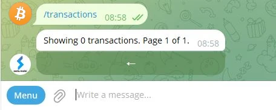
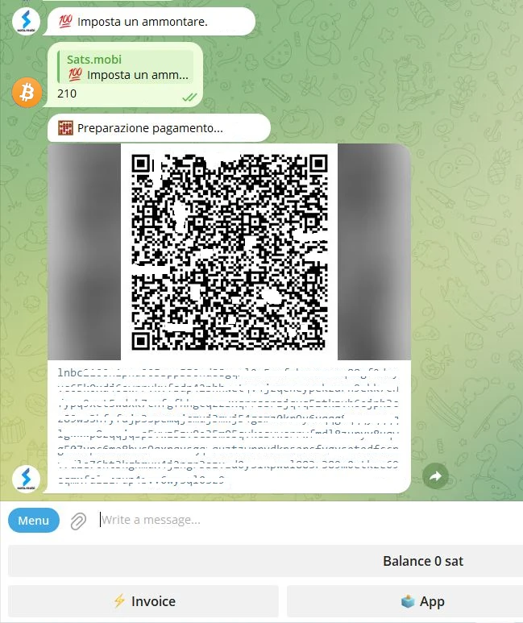

_Denne opplæringen ble skrevet av_ [Bitcoin Campus] (https://linktr.ee/bitcoincampus_)

# Sats.Mobi

SatsMobi er en Wallet som kjører på Telegram, som har alle funksjonene til en Wallet Lightning Network (custodial) og tilbyr i tillegg en rekke veldig morsomme funksjoner. Den stammer fra en Fork fra LightningTipBot, nå avviklet, arver alle funksjonene mens den legger til mer aktuelle, noe som gjør den mer moderne. Av LNTipBot sporer Sats.Mobi også åpen kildekode-filosofien. Wallet kan faktisk konfigureres og administreres på egen hånd ved å klone den fra dette [repository] (https://github.com/massmux/SatsMobiBot).

Hvis du derimot foretrekker å bruke den på en enkel måte, er det bare å starte en chat på Telegram, så vil du oppdage at det er en bot.

# Innstillinger

Søk etter "satsmobi" i søkefeltet i Telegram, og lenken til [bot] (@SatsMobiBot) vises.

**Forsiktighetsregler**: Hvis du ikke er sikker på søket via Telegram, kan du få sikker tilgang til boten ved hjelp av følgende [link] (https://t.me/SatsMobiBot)

Alt du trenger å gjøre for å starte den, er å trykke på _START_

For å utforske Wallet kan du velge _Menu_ i nedre venstre hjørne.

Velg nå _/help_ blant hovedkommandoene.

Sats.Mobi ønsker oss velkommen ved å vise en melding som viser alle hovedfunksjonene. Ved oppstart har boten også opprettet en LN Address, knyttet til håndtaket som er valgt på Telegram (som er unikt som standard). Kommandoer for å sende og motta Sats med denne Wallet er synlige, så vel som andre funksjoner som vi vil se senere. Det er også interessant å ta en titt på _/avansert_-menyen med en gang

Det hopper ut at Sats.Mobi også har opprettet en anonym LN Address, som kan brukes til å få personvern. Boten fungerer med kommandoer: bare klikk på det tilsvarende ordet, eller skriv skråstreken "/" i meldingsfeltet, etterfulgt av kommandoen du vil ha utført. Selv om Wallet nettopp er opprettet, velger du for eksempel _/transaksjoner_

Denne kommandoen viser listen over de siste transaksjonene, i dette tilfellet null.

# Mottak av Sats

Kommandoen for å opprette en Invoice og motta Sats er _/invoice_. Sats.Mobi grunner utelukkende i Satoshi, den minste enheten i Bitcon; Derfor, for å opprette Invoice, er det nødvendig å skrive beløpet i Sats i meldingslinjen og senere sende det i chatten med boten.

I det følgende eksempelet ble det valgt å motta et beløp på 210 Sats.

Etter å ha ventet noen øyeblikk på at Invoice skal klargjøres, er sistnevnte tilgjengelig som tekst og som en QR-kode. Ved å betale Invoice viser Wallet saldoen. Hvis totalsummen av en eller annen grunn er utdatert, skriver du _/saldo_ og trykker på `send`-tasten.

# Send Sats

Selv om Satss er en uvurderlig ressurs som man ikke bør skille seg overfladisk fra, gjør Sats.Mobi denne delen tiltalende, og det vil ikke være noe problem å utføre noen korte tester (dvs. et par testtransaksjoner).

## Betale en Invoice

Den enkleste måten å betale en Invoice på er å kopiere meldingsstrengen `lnbc1xxxxx` og lime den inn i meldingsfeltet etter at du har skrevet inn kommandoen _/pay_. **Korrekt syntaks** innebærer at du må la det være et mellomrom etter kommandoen.

Wallet sender en melding og ber om bekreftelse. Ved å klikke på _Pay_ blir Invoice betalt.

Sats.Mobi kan stole på en effektiv og godt tilkoblet Lightning-node, og det er sjelden at betalinger mislykkes fordi den alltid kan finne riktig ruting.

## Betal enkelt fra mobilen

Når det gjelder Telegram, er Sats.Mobi også tilgjengelig på mobil. Den mest praktiske funksjonen for mobilbetaling er å ramme inn en QR-kode, men denne Wallet mangler dette av design, siden den ikke er en frittstående app, men er inneholdt i en sosial. Sats.Mobi er derfor programmert for å gjøre mobilopplevelsen så enkel som mulig: Den kan faktisk dekode et bilde, for eksempel et fotografi som er tatt av QR-koden til Invoice du vil betale for.

Anta for eksempel at vi ønsker å betale en Invoice på 50 Sats.

Når dette vises til oss, kan vi ta et bilde av den aktuelle QR-koden.

Deretter åpner vi Telegram på mobiltelefonen, og i chatten med Sats.Mobi legger vi ved bildet vi nettopp har tatt til QR-koden

Når den er valgt, sender vi den til boten:

Sats.Mobi avkoder bildet og **presenterer betalingsforespørselen** umiddelbart, med riktig beskrivelse. Chatten ber om en bekreftelse, for å fortsette må du trykke _/betale_

Vi venter noen øyeblikk slik at betalingen kan behandles.

Invoice med 50 Sats ble betalt, et resultat som ble oppnådd uten bruk av et kamera og dets innebygde skannefunksjon.

## Sats.Mobi i Telegramgrupper

Av funksjonene som gjorde LNTipBot berømt og som Sats.Mobi bringer tilbake til Telegram, er det den som gjør opplevelsen til medlemmene i en gruppe morsom og interaktiv.

Eiere kan invitere boten til å delta i gruppechatten og deretter utnevne Sats.Mobi som administrator. Fra da av begynner moroa, fordi medlemmene kan begynne å belønne andre brukere for deres bidrag i gruppen.

- _/tip_ legger til et tips ved å svare på en melding;
- _/send_ sender penger ved å spesifisere en LN Address eller et Telegram-handle som mottaker;
- _/faucet_ (i _/avansert_-menyen) lar deg opprette et sett med tips som de raskeste gruppemedlemmene kan samle inn ved å klikke på _/collect_;
- _/tipjar_ (i _/avansert_-menyen) oppretter en annen type distribusjon som kan sendes til brukerne i gruppen.

Hver av disse kommandoene har sin egen syntaks, som er forklart i hovedkommandomenyen.

Hva om vi ikke er eier av en gruppe? Ikke noe problem: bare be grunnleggeren om å invitere Sats.Mobi, legg ham/henne til som administrator for samme gruppe, og du er ferdig!

# Salgssted (POS)

Når Sats.Mobi startes for første gang, oppretter boten også en annen funksjon for brukeren: **POS**. "Enheten" aktiveres av brukeren med kommandoen _/pos_ eller ved å klikke på den relevante knappen fra konsollen i nedre høyre hjørne. Faktisk er POS en webapp som åpnes som et popup-vindu i Telegram-chatten

Interface bærer Telegrams personlige håndtak i øvre venstre hjørne og brukes enkelt slik man bruker alle POS: ved å skrive beløpet på tastaturet. Anta nå at vi ønsker å kreve inn 21 cent for en tjeneste. Siden Sats.Mobi kun håndterer sedler, er det ikke så lett å gjøre omregningen i hodet. I stedet viser POS-en euro som regningsenhet, mens den viser tilsvarende beløp i Satoshi.

Ved å klikke på _/OK_ får du opp Invoice som kan vises til kunden via en QR-kode, eller som kan sendes som en streng via direktemeldinger, slik at den kan betales for

Selvfølgelig er POS også tilgjengelig på en mobiltelefon ved å ringe den opp på samme måte som vist ovenfor.

Den presenterer seg også godt synlig fra mobiltelefonens skjerm:

# Ytterligere funksjoner

Det finnes andre funksjoner som utfyller Wallet Sats.Mobi-tilbudet, som, som vi har sett, utvider Wallet-konseptet utover det å motta og sende betalinger:

- _/nostr_: for å koble Wallet til brukeren Nostr for å motta zaps;
- _/cashback_: viser en kode som du kan vise til en forhandler for å få cashback på en utgift;
- _/buy_: starter en veiviser i boten, som lar deg kjøpe Sats for euro:
- _/activatecard_: for å be om aktivering av et NFC-debetkort, som kan lades på nytt via Wallet Sats.Mobi og som varsler kan aktiveres for;
- _/link_: oppretter en kobling til din egen Wallet Zeus eller Blue Wallet, som du kan bruke som fjernkontroller til denne Wallet.

# Konklusjon

Sats.Mobi er en Wallet som er hyggelig og morsom å bruke, og som tar i bruk erfaringene fra LNTipBot ved hjelp av de mer avanserte funksjonene i LNBits. Det er imidlertid viktig å huske at **det er en varetektstjeneste**. Den skal derfor brukes til å forvalte svært få Satss; den er ikke en Wallet-prinsipal for sine egne Lightning Network-midler. Det er også en iboende kapasitetsgrense på 500 000 Satss, en grense som det ikke anbefales å overskride.

Hvis du er ute etter Wallet Lightning Network ikke-frihetsberøvende, bør du definitivt se til andre produkter.

---
### Dokumentasjon

- [Github] (https://github.com/massmux/SatsMobiBot)
- Spilleliste med [video](https://www.youtube.com/results?search_query=Sats.mobi) demoer