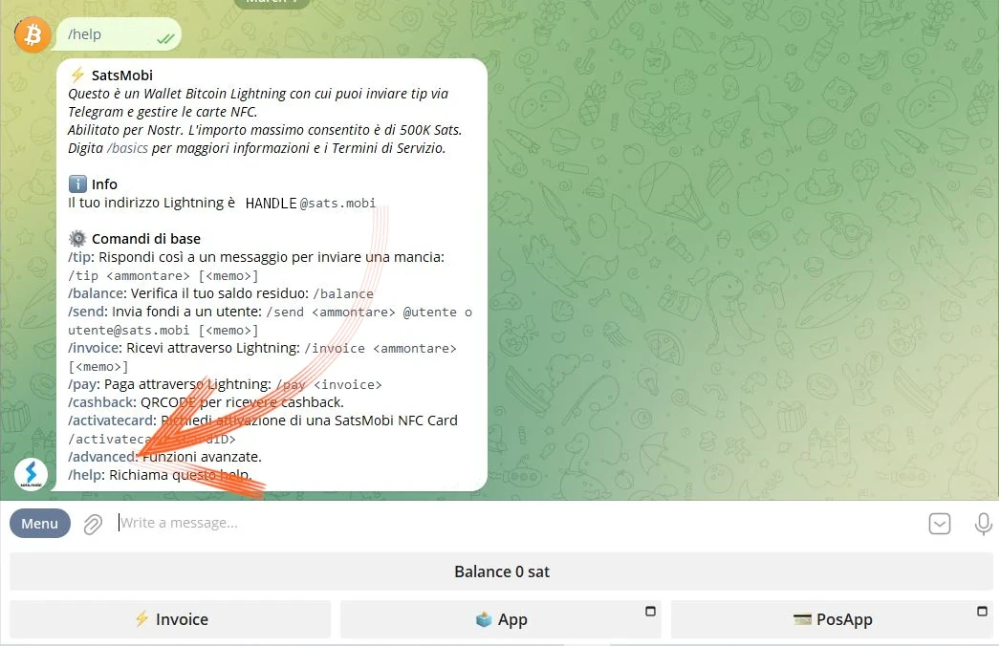
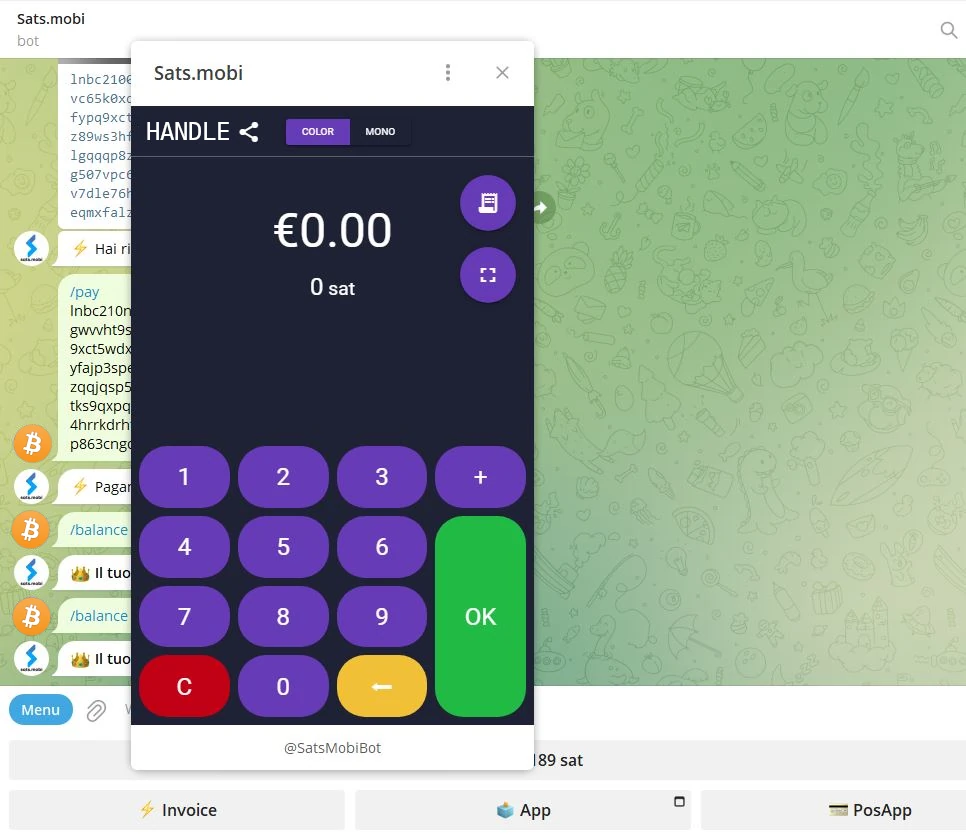
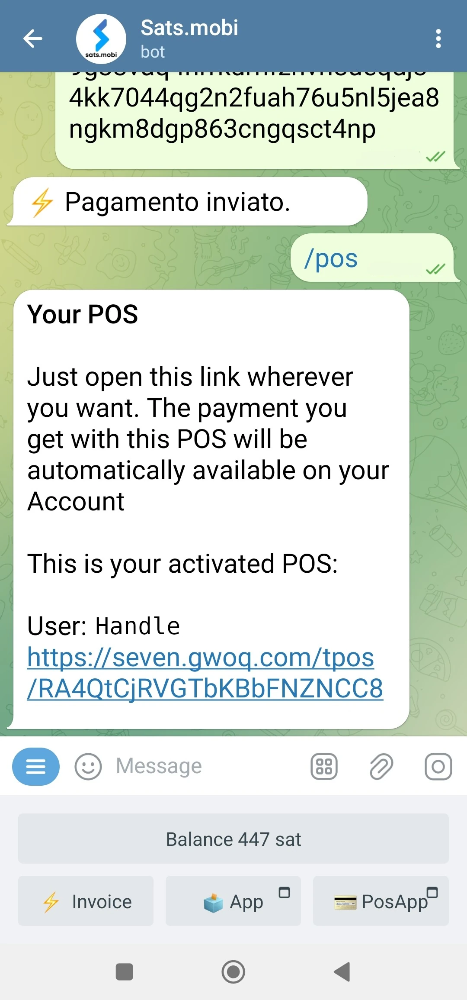

_Este tutorial foi escrito por_ [Bitcoin Campus](https://linktr.ee/bitcoincampus_)

# Sats.Mobi

SatsMobi é um Wallet rodando no Telegram, que tem todas as funções de um Wallet Lightning Network (custodial) e oferece, além disso, uma série de recursos muito divertidos. Deriva de um Fork do LightningTipBot, agora descontinuado, herda todas as suas funcionalidades ao mesmo tempo que lhe acrescenta outras mais actuais, tornando-o mais moderno. Do LNTipBot, o Sats.Mobi também segue a filosofia open source. O Wallet pode, de facto, ser configurado e gerido por si próprio, clonando-o a partir deste [repositório] (https://github.com/massmux/SatsMobiBot).

Se, por outro lado, preferir utilizá-lo de uma forma simples, basta iniciar uma conversa no Telegram e verá que se trata de um bot.

# Definições

Na barra de pesquisa do Telegram, procura por "satsmobi" e aparecerá a ligação para o [bot] (@SatsMobiBot).

**Cuidado**: Se não tiveres a certeza sobre a pesquisa através do Telegram, acede ao bot de forma segura utilizando o seguinte [link](https://t.me/SatsMobiBot)

Para o iniciar, basta premir _START_

Para explorar o Wallet, pode selecionar _Menu_ no canto inferior esquerdo.

Opte agora por _/help_ entre os comandos principais.

O Sats.Mobi dá-nos as boas-vindas mostrando uma mensagem com todas as suas principais caraterísticas. No arranque, o bot criou também um LN Address, ligado ao identificador escolhido no Telegram (que é único por defeito). Os comandos para enviar e receber Sats com este Wallet são visíveis, assim como outras funções que veremos mais adiante. Também é interessante dar uma vista de olhos no menu _/avançado_ desde já

Salta à vista que o Sats.Mobi também criou um LN Address anónimo, que pode ser utilizado para ganhar privacidade. O bot funciona com comandos: basta clicar na palavra correspondente, ou escrever a barra "/" na barra de mensagens, seguida do comando que se quer mandar executar. Mesmo que o Wallet tenha acabado de ser criado, escolha, por exemplo, _/transactions_

Este comando mostra a lista das últimas transacções, neste caso particular, zero.

# Receber Sats

O comando para criar um Invoice e receber Sats é _/invoice_. Os motivos do Sats.Mobi são exclusivamente em Satoshi, a unidade mais pequena do Bitcon; por isso, para criar o Invoice, é necessário escrever o montante em Sats na barra de mensagens e depois enviá-lo no chat com o bot.

No exemplo seguinte, foi selecionado um montante de 210 Sats para ser recebido.

Após alguns momentos de espera pela preparação do Invoice, este último está disponível sob a forma de texto e de código QR. Ao pagar o Invoice, o Wallet mostra o saldo. Se, por qualquer razão, o total estiver desatualizado, escreva _/saldo_ e prima a tecla "enviar".

# Enviar Sats

Embora os Satss sejam um bem inestimável do qual não se deve separar superficialmente, o Sats.Mobi torna esta parte apelativa, a realização de alguns testes curtos (ou seja, um par de transacções de teste) não será um problema.

## Pagamento de um Invoice

A maneira mais fácil de pagar a um Invoice é copiar a cadeia de mensagens `lnbc1xxxxx` e colá-la na barra de mensagens depois de digitar o comando _/pay_. **A sintaxe correta** implica deixar um espaço após o comando.

O Wallet envia uma mensagem a pedir confirmação. Ao clicar em _Pay_, o Invoice é pago.

O Sats.Mobi pode contar com um nó Lightning eficiente e bem conectado, raramente os pagamentos falham porque pode sempre encontrar o encaminhamento correto.

## Pagar comodamente a partir do telemóvel

Passando para o Telegram, o Sats.Mobi também está disponível no telemóvel. A função mais cómoda para o pagamento móvel é enquadrar um código QR, mas este Wallet não o tem por conceção, uma vez que não é uma aplicação autónoma, mas está contida numa social. Por conseguinte, o Sats.Mobi está programado para facilitar ao máximo a experiência móvel: pode, de facto, descodificar uma imagem, como uma fotografia tirada do código QR do Invoice que se pretende pagar.

Suponhamos, por exemplo, que queremos pagar um Invoice de 50 Sats.

Quando isso nos é mostrado, podemos tirar uma fotografia do código QR relevante.

Em seguida, abrimos o Telegram no telemóvel e, na conversa com o Sats.Mobi, anexamos a fotografia que acabámos de tirar ao código QR

Uma vez selecionado, enviamo-lo para o bot:

O Sats.Mobi descodifica a foto e **apresenta imediatamente o pedido de pagamento**, com a descrição correta. O chat pede uma confirmação, para prosseguir é necessário premir _/pay_

Aguardamos alguns instantes para que o pagamento seja processado.

Invoice por 50 Sats foi pago, um resultado obtido sem a utilização de uma câmara e da sua função de digitalização integrada.

## Sats.Mobi em Grupos de telegramas

Entre as funcionalidades que tornaram o LNTipBot famoso e que o Sats.Mobi traz de volta ao Telegram, há uma que torna a experiência dos membros de um grupo divertida e interactiva.

Os proprietários podem convidar o bot para participar na conversa de grupo e, em seguida, nomear o Sats.Mobi como administrador. A partir daí, a diversão começa, porque os membros podem começar a recompensar outros utilizadores pelas suas contribuições no grupo.

- _/tip_ adiciona uma dica ao responder a uma mensagem;
- _/send_ envia fundos especificando um LN Address ou um identificador de Telegrama como destinatário;
- _/faucet_ (no menu _/avançado_) permite-lhe criar um conjunto de sugestões que os membros do grupo mais rápido podem recolher clicando em _/colher_;
- _/tipjar_ (no menu _/avançado_) cria outro tipo de distribuição que pode ser enviado aos utilizadores do grupo.

Cada um destes comandos tem a sua própria sintaxe, que é explicada no menu principal de comandos.

E se não formos proprietários de um grupo? Não há problema: basta pedir ao fundador para convidar o Sats.Mobi, adicioná-lo(a) como administrador(a) do mesmo e já está!

# Ponto de venda (POS)

Ao iniciar o Sats.Mobi pela primeira vez, o bot também cria outra funcionalidade para o utilizador: **o POS**. O "dispositivo" é ativado pelo utilizador com o comando _/pos_ ou clicando no botão relevante da consola no canto inferior direito. De facto, o POS é uma aplicação web, que se abre como um pop-up no chat do Telegram

O Interface tem o identificador pessoal do Telegram no canto superior esquerdo e é utilizado simplesmente como se utilizam todos os POS: escrevendo o montante no teclado. Agora suponhamos que queremos cobrar 21 cêntimos por um serviço. Sabendo que o Sats.Mobi só lida nativamente com Satss, não é fácil fazer a conversão na sua cabeça. Em vez disso, o POS apresenta o euro como a unidade de conta, enquanto mostra o equivalente em Satoshi.

Clicando em _/OK_, aparece o Invoice que pode ser mostrado ao cliente através de um código QR, ou que pode ser enviado como uma cadeia de caracteres através de mensagens instantâneas, para que possa ser pago

É claro que o POS também está disponível num telemóvel, bastando chamá-lo da mesma forma que a mostrada acima.

Também se apresenta bem visível a partir do ecrã do telemóvel:

# Caraterísticas adicionais

Existem outras caraterísticas que complementam a oferta do Wallet Sats.Mobi, que, como vimos, expande o conceito do Wallet para além das operações de receção e envio de pagamentos:

- _/nostr_: para ligar o Wallet ao seu utilizador Nostr para receber zaps;
- _/cashback_: apresenta um código que pode mostrar a um comerciante para obter um reembolso de uma despesa;
- _/buy_: inicia um assistente no bot, que permite comprar Sats por euros:
- _/activatecard_: para solicitar a ativação de um cartão de débito NFC, que pode ser recarregado através do Wallet Sats.Mobi e para o qual podem ser activadas notificações;
- _/link_: cria uma ligação para o seu próprio Wallet Zeus ou Blue Wallet, que pode utilizar como controlos remotos deste Wallet.

# Conclusão

O Sats.Mobi é um Wallet agradável e divertido de usar, trazendo de volta as experiências feitas com o LNTipBot usando os recursos mais avançados do LNBits. No entanto, é importante lembrar que **é um serviço de custódia**. Portanto, deve ser usado para custodiar muito poucos Satss; não é um principal Wallet para seus próprios fundos Lightning Network. Existe também um limite de capacidade inerente de 500.000 Satss, um limite que não se recomenda que seja ultrapassado.

Se está à procura de Wallet Lightning Network sem custódia, deve definitivamente procurar outros produtos.

---
### Documentação

- [Github](https://github.com/massmux/SatsMobiBot)
- Lista de reprodução de demonstrações [vídeo](https://www.youtube.com/results?search_query=Sats.mobi)